# Hoofdstuk 1: Wat is Medewerkerparticipatie?

## De essentie van medewerkerparticipatie ontrafeld

"Ik dacht altijd dat participatie betekende dat we af en toe om onze mening werd gevraagd, maar nu begrijp ik dat het gaat om echte invloed en gedeelde verantwoordelijkheid." Deze reflectie van een teamleider bij een middelgrote productiefaciliteit illustreert de transformatie in denken die vaak plaatsvindt wanneer organisaties de stap zetten van oppervlakkige raadpleging naar authentieke medewerkerparticipatie.

In dit hoofdstuk maken we het concept medewerkerparticipatie concreet en praktisch toepasbaar. We kijken naar wat het precies inhoudt, hoe het verschilt van traditioneel overleg, en hoe het zich heeft ontwikkeld tot een krachtig organisatieprincipe dat steeds meer organisaties omarmen als antwoord op de complexiteit en snelheid van de moderne werkomgeving.

## Een genuanceerde definitie

Medewerkerparticipatie is het structureel en betekenisvol betrekken van medewerkers bij besluitvorming, probleemoplossing en bedrijfsoperaties. Het concept kent verschillende interpretaties en implementatievormen, variërend van consultatie tot volledige co-creatie. In de meest effectieve vorm gaat medewerkerparticipatie veel verder dan incidenteel overleg of het ophalen van vrijblijvende meningen. Bij echte participatie hebben medewerkers daadwerkelijk invloed op beslissingen en dragen ze medeverantwoordelijkheid voor de uitkomsten.

Onderzoek wijst uit dat medewerkerparticipatie kan worden gedefinieerd als "de mogelijkheden die werknemers hebben om invloed uit te oefenen op beslissingen die op verschillende niveaus in de organisatie worden genomen." Deze definitie benadrukt dat participatie kan plaatsvinden op verschillende niveaus: van directe invloed op het eigen werk tot strategische betrokkenheid bij organisatiebrede beslissingen.

De drie kernkenmerken van effectieve medewerkerparticipatie zijn structurele inbedding, gedeelde verantwoordelijkheid en transparante terugkoppeling. Structurele inbedding betekent dat participatie geen eenmalige actie of incidenteel initiatief is, maar een vast onderdeel van werkprocessen en besluitvormingscycli, verankerd in de organisatiestructuur en -cultuur. Gedeelde verantwoordelijkheid houdt in dat medewerkers niet alleen bijdragen aan ideeën maar ook aan de implementatie en resultaten, wat eigenaarschap creëert en de kwaliteit van beslissingen verhoogt. Transparante terugkoppeling zorgt voor duidelijke communicatie over wat er met input gebeurt en waarom bepaalde keuzes worden gemaakt, zelfs wanneer suggesties niet worden geïmplementeerd.

Effectieve participatie bevat altijd een element van machtsdeling. Zonder enige herverdeling van beslissingsbevoegdheid blijft participatie een lege huls. Dit onderscheidt echte participatie van symbolische betrokkenheid die soms wordt ingezet om de schijn van inspraak te wekken zonder werkelijke invloed toe te staan.

### Het participatiecontinuüm

Medewerkerparticipatie bestaat niet in een binaire vorm (wel/niet), maar manifesteert zich als een continuüm van betrokkenheidsniveaus. Dit continuüm illustreert de progressie van eenvoudige informatieverstrekking naar volwaardige meebeslissing.

```mermaid
graph LR
    A[Informeren] -->|Eenrichtingsverkeer| B[Raadplegen]
    B -->|Meningen vragen| C[Adviseren]
    C -->|Invloed uitoefenen| D[Coproduceren]
    D -->|Samen beslissen| E[Meebeslissen]
    
    style A fill:#f9f9f9,stroke:#333,stroke-width:1px
    style B fill:#e6f2ff,stroke:#333,stroke-width:1px
    style C fill:#cce5ff,stroke:#333,stroke-width:1px
    style D fill:#99ccff,stroke:#333,stroke-width:1px
    style E fill:#66b3ff,stroke:#333,stroke-width:1px
```

*Figuur 1: Het participatiecontinuüm - van informeren naar meebeslissen*

Elk niveau op dit continuüm vertegenwoordigt een andere mate van invloed en betrokkenheid. Bij informeren worden medewerkers op de hoogte gebracht van beslissingen nadat deze zijn genomen. Er is geen sprake van participatie, maar van eenzijdige communicatie. Bij raadplegen worden meningen en ideeën verzameld, maar zonder garantie dat deze de besluitvorming beïnvloeden. Management behoudt volledige beslissingsbevoegdheid. Adviseren betekent dat medewerkers gestructureerd advies geven dat serieus wordt overwogen in de besluitvorming. Er is invloed, maar de uiteindelijke beslissing ligt elders. Bij coproduceren werken medewerkers samen met management aan het ontwikkelen van oplossingen en besluiten. Er is sprake van partnerschap en gedeelde verantwoordelijkheid. Meebeslissen houdt in dat beslissingsbevoegdheid is gedelegeerd aan medewerkers binnen afgesproken kaders. Zij hebben het mandaat om zelfstandig besluiten te nemen.

Het is belangrijk te beseffen dat verschillende niveaus van participatie geschikt kunnen zijn in verschillende contexten. De mate van participatie moet passen bij de aard van de beslissing, de capaciteiten van de betrokkenen, en de organisatiecultuur. Dit nuanceert het idee dat meer participatie altijd beter is en benadrukt het belang van contextgevoeligheid bij het ontwerpen van participatieprocessen.

## Participatie in de praktijk: verhalen uit de werkelijkheid

Hoe ziet medewerkerparticipatie er concreet uit in organisaties? Twee verhalen uit de praktijk maken dit duidelijk.

### Innovation Circles: het ontsluiten van collectieve wijsheid

Een middelgroot softwarebedrijf met ongeveer 500 medewerkers worstelde met innovatiesnelheid en interne silo's tussen afdelingen. Ondanks een hoog opgeleide workforce en een formele R&D-afdeling, kwam innovatie moeizaam van de grond en werden veel kansen gemist. Het management realiseerde zich dat waardevolle inzichten en ideeën verspreid waren door de hele organisatie, maar niet effectief werden benut. "We hadden briljante mensen die dagelijks met klanten werkten en precies wisten wat er nodig was, maar hun inzichten bereikten nooit de besluitvormers," vertelde de CTO.

Het bedrijf besloot "Innovation Circles" te implementeren - maandelijkse cross-functionele innovatiesessies waarin medewerkers uit verschillende afdelingen (ontwikkeling, klantsupport, sales, marketing) samenwerkten aan concrete verbeteringen. Teams kregen beslissingsbevoegdheid over verbeteringen binnen hun werkgebied, met een budget tot €10.000 zonder verdere goedkeuring. Er was een directe koppeling aan de bonusstructuur, waardoor participatie werd beloond (10% van de jaarlijkse bonus was gekoppeld aan Innovation Circle bijdragen). Een digitaal platform documenteerde alle ideeën en hun voortgang, waardoor transparantie en erkenning werden geborgd. Senior leiders namen deel als facilitators, niet als beslissers, wat een cultuur van gelijkwaardigheid bevorderde.

Na de eerste drie maanden bleek dat sommige teams moeite hadden om ideeën daadwerkelijk te implementeren naast hun reguliere werk. Het programma werd aangepast met toegewezen "implementatietijd" (10% van de werktijd), een "buddy-systeem" waarbij teams met implementatie-ervaring werden gekoppeld aan teams die daar moeite mee hadden, en kwartaalbijeenkomsten waar successen werden gevierd en lessen werden gedeeld.

Na een jaar waren de resultaten indrukwekkend: 40% productiviteitsstijging in de pilot-afdelingen, 22 geïmplementeerde innovaties, waarvan 3 leidden tot nieuwe productfuncties, en een stijging van 27 punten in medewerkerstevredenheid op het gebied van "invloed op besluitvorming". Klanttevredenheid verbeterde met 18% door snellere oplossing van pijnpunten.

De succesfactoren waren duidelijk: echte beslissingsbevoegdheid binnen duidelijke kaders, transparantie over alle ideeën en hun status, erkenning en beloning van participatie, en leiderschap dat dienend was in plaats van directief. Zoals een software-engineer reflecteerde: "Voor het eerst voelde ik dat mijn ideeën er echt toe deden. Niet alleen werd ik gehoord, ik kreeg ook de middelen en het mandaat om verandering door te voeren."

### Employee Decision Hub: frontline besluitvorming in actie

Een middelgrote luchtvaartmaatschappij met 3.000 medewerkers worstelde met operationele inefficiënties en een hoog personeelsverloop, vooral onder cabinepersoneel en grondpersoneel. Besluitvorming was sterk gecentraliseerd op het hoofdkantoor, ver verwijderd van de dagelijkse operatie. De operationele realiteit veranderde constant door weersomstandigheden, technische problemen en logistieke uitdagingen. Centraal genomen beslissingen waren vaak niet optimaal voor de specifieke situatie ter plaatse. "Tegen de tijd dat een probleem het hoofdkantoor bereikte, was de situatie al weer veranderd, en de oplossing die terugkwam paste niet meer," legde een ervaren purser uit.

De luchtvaartmaatschappij ontwikkelde een digitaal "Employee Decision Hub" - een platform waar frontline medewerkers direct konden bijdragen aan operationele beslissingen. Medewerkers konden real-time knelpunten signaleren via een mobiele app, collega's konden oplossingen voorstellen en stemmen op de beste ideeën, vooraf gedefinieerde beslissingsprotocollen bepaalden welke oplossingen direct konden worden geïmplementeerd en welke verdere goedkeuring nodig hadden, en een transparant dashboard toonde alle gemelde problemen, voorgestelde oplossingen, en implementatiestatus.

De grootste uitdaging bleek de culturele weerstand bij middenmanagement, die zich bedreigd voelden door deze nieuwe vorm van gedeelde besluitvorming. Om dit te adresseren werden workshops georganiseerd over "faciliterend leiderschap", een mentorprogramma opgezet waarbij managers die het systeem succesvol hadden geadopteerd collega's begeleidden, en het beoordelingssysteem aangepast om managers te belonen voor het faciliteren van participatie.

Na implementatie zag de luchtvaartmaatschappij een 72% hogere implementatiesnelheid van operationele verbeteringen, 34% reductie in vertragingen door snellere probleemoplossing, 28% daling in personeelsverloop onder frontline medewerkers, en een jaarlijkse kostenbesparing van €2,3 miljoen door efficiëntere operaties.

De succesfactoren waren technologie die participatie laagdrempelig en real-time maakte, duidelijke beslissingsprotocollen die autonomie boden binnen kaders, cultuurverandering die begon bij het middenmanagement, en zichtbare impact die medewerkers motiveerde om te blijven participeren. Een grondstewardess reflecteerde: "Vroeger voelde ik me machteloos als ik problemen zag. Nu kan ik niet alleen problemen melden, maar ook direct bijdragen aan de oplossing. Het geeft een gevoel van eigenaarschap dat ik nooit eerder in mijn carrière heb ervaren."

## Participatie versus traditioneel overleg: een fundamenteel verschil

Veel organisaties denken dat ze aan medewerkerparticipatie doen, terwijl ze in werkelijkheid blijven steken in traditioneel overleg. Dit misverstand leidt vaak tot teleurstelling en cynisme wanneer medewerkers ervaren dat hun input weinig impact heeft. Het verschil tussen beide benaderingen is fundamenteel en manifesteert zich in verschillende aspecten van de organisatiepraktijk.

Traditioneel overleg is vaak incidenteel, meestal bij problemen of specifieke projecten, terwijl echte participatie structureel is ingebed in dagelijkse werkprocessen en besluitvormingscycli. Bij traditioneel overleg is de impact adviserend, waarbij management de beslissingsbevoegdheid behoudt, terwijl bij echte participatie medewerkers binnen afgesproken kaders daadwerkelijke beslissingsbevoegdheid hebben. De verantwoordelijkheid blijft bij traditioneel overleg primair bij management, terwijl medewerkers vrijblijvend kunnen adviseren. Bij echte participatie is er gedeeld eigenaarschap voor zowel beslissingen als resultaten.

Bij traditioneel overleg is er vaak onduidelijkheid over wat er met input gebeurt en beperkte terugkoppeling, terwijl echte participatie gekenmerkt wordt door transparante communicatie over besluitvorming en implementatie, met duidelijke eigenaren voor actiepunten. De scope van traditioneel overleg is meestal beperkt tot operationele kwesties binnen het eigen werkgebied, terwijl echte participatie zich kan uitstrekken tot strategische vraagstukken en organisatiebrede thema's. De cultuur bij traditioneel overleg is hiërarchisch, met duidelijk onderscheid tussen beslissers en adviseurs, terwijl echte participatie een egalitaire cultuur kent, met rolverdeling gebaseerd op expertise en betrokkenheid, niet op positie.

Een concreet voorbeeld: een jaarlijks medewerkerstevredenheidsonderzoek zonder duidelijk actieplan is traditioneel overleg, terwijl wekelijkse verbeterideeën met implementatiebevoegdheid en toegewezen middelen echte participatie vertegenwoordigen.

Het verschil tussen consultatie en participatie ligt niet in de vorm, maar in de mate waarin macht wordt gedeeld. Dit onderscheid is cruciaal voor organisaties die streven naar authentieke participatie. Het gaat niet alleen om het creëren van overlegstructuren, maar om het fundamenteel herzien van hoe beslissingen worden genomen en wie daarbij betrokken is.

Een HR-directeur van een grote retailorganisatie verwoordde dit inzicht treffend: "We hadden jarenlang uitgebreide overlegstructuren en dachten dat we goed bezig waren met participatie. Maar toen we eerlijk naar onszelf keken, realiseerden we ons dat we medewerkers vooral om input vroegen om draagvlak te creëren voor beslissingen die eigenlijk al genomen waren. Echte participatie begon pas toen we bereid waren om daadwerkelijk beslissingsbevoegdheid te delen."

## Van hiërarchie naar participatie: een historische ontwikkeling

Medewerkerparticipatie is niet nieuw, maar heeft een duidelijke evolutie doorgemaakt die parallel loopt aan bredere maatschappelijke en organisatorische veranderingen. Deze historische context helpt om hedendaagse participatiepraktijken beter te begrijpen en te plaatsen in een breder perspectief.

In de jaren '70 en '80 domineerden hiërarchische organisatiestructuren, met duidelijke scheidslijnen tussen management en uitvoering. Besluitvorming was sterk gecentraliseerd bij het management. Medewerkers voerden uit wat van bovenaf werd bepaald. Communicatie was vooral top-down, met beperkte formele kanalen voor bottom-up input, meestal in de vorm van ondernemingsraden en vakbondsvertegenwoordiging. Participatie was in deze periode vooral "institutioneel en representatief, niet direct en individueel."

In de jaren '90 ontstonden onder invloed van Japanse managementfilosofieën zoals Kaizen en Total Quality Management de eerste vormen van gestructureerde participatie met kwaliteitskringen en ISO-implementaties. Medewerkers kregen een stem in kwaliteitsverbetering, maar beperkt tot hun directe werkgebied. Deze beweging werd gedreven door de erkenning dat frontline medewerkers waardevolle inzichten hadden in procesverbetering. Een productiemanager uit die tijd reflecteerde: "We realiseerden ons dat de mensen aan de lijn vaak beter wisten hoe processen konden worden verbeterd dan de ingenieurs die ze hadden ontworpen."

In de periode 2000-2010 experimenteerden organisaties met zelfsturende teams en lean management. Medewerkers kregen meer autonomie, maar vaak binnen strikte kaders. Deze periode zag de opkomst van "empowerment" als managementfilosofie, hoewel critici opmerkten dat veel empowerment-initiatieven "meer retoriek dan realiteit" waren. Niettemin vertegenwoordigde deze periode een belangrijke verschuiving in denken over de rol van medewerkers in organisaties.

Van 2010 tot 2020 werden agile werkwijzen zoals Scrum mainstream, met een sterke nadruk op zelfsturing, korte feedbackcycli en klantbetrokkenheid. De technologiesector was koploper in deze beweging, maar de principes verspreidden zich naar andere sectoren. Laloux's invloedrijke werk "Reinventing Organizations" introduceerde het concept van "teal organizations" met radicale decentralisatie van besluitvorming. Participatie werd steeds meer gezien als bron van innovatie en concurrentievoordeel, niet alleen als middel voor medewerkerstevredenheid.

Vanaf 2020 versnelde de COVID-19 pandemie de adoptie van digitale tools die nieuwe vormen van participatie mogelijk maken, ook op afstand. Digitale platforms faciliteren nu real-time feedback, ideeëngeneratie en besluitvorming, onafhankelijk van fysieke locatie. De opkomst van hybride werkmodellen creëert nieuwe uitdagingen en kansen voor participatie. "Hybride werk vereist nieuwe participatiemechanismen die zowel synchrone als asynchrone betrokkenheid faciliteren, en die fysieke en virtuele aanwezigheid gelijkwaardig behandelen."

Deze evolutie laat zien dat participatie steeds meer verweven raakt met de dagelijkse werkprocessen en steeds breder wordt toegepast in organisaties. De trend beweegt duidelijk in de richting van meer directe, inclusieve en technologie-ondersteunde vormen van participatie.

## Actuele trends in medewerkerparticipatie

De nieuwste ontwikkelingen in medewerkerparticipatie worden gekenmerkt door vijf belangrijke trends die de toekomst van het veld vormgeven.

### Co-creatie met externe stakeholders

Participatie beperkt zich niet langer tot interne medewerkers. Organisaties erkennen steeds meer de waarde van het betrekken van klanten, leveranciers, partners en andere externe stakeholders bij innovatie- en verbeterprocessen. Deze "open innovatie" benadering vervaagt de grenzen tussen de organisatie en haar ecosysteem.

Een zorginstelling illustreert deze trend door patiënten structureel te betrekken bij het herontwerpen van zorgprocessen. Patiënten participeren in werkgroepen samen met zorgprofessionals, wat leidt tot zorgpaden die beter aansluiten bij patiëntbehoeften. "De combinatie van professionele expertise en patiëntervaring leidt tot oplossingen die geen van beide groepen alleen had kunnen bedenken," merkte een betrokken arts op.

### Data-gedreven participatie

Besluitvorming wordt steeds meer ondersteund door data en analytics. Dit maakt participatie objectiever en meetbaarder, en helpt om de impact van participatie-initiatieven aan te tonen. Moderne participatieplatforms verzamelen automatisch data over betrokkenheid, implementatie en resultaten.

Een retailorganisatie implementeerde een data-dashboard dat real-time inzicht geeft in de status en impact van medewerkerssuggesties. Het systeem toont niet alleen hoeveel ideeën worden ingediend en geïmplementeerd, maar ook de meetbare impact op KPI's zoals verkoop, klanttevredenheid en operationele efficiëntie. Dit creëert een feedbackloop die participatie versterkt door de waarde ervan zichtbaar te maken.

### Real-time feedbacksystemen

Continue feedback vervangt periodieke evaluaties. Medewerkers kunnen op elk moment input geven, wat leidt tot snellere aanpassingen en verbeteringen. Deze trend sluit aan bij de bredere beweging naar "continuous performance management" in plaats van jaarlijkse beoordelingscycli.

Een softwarebedrijf implementeerde een mobiele app waarmee medewerkers direct feedback kunnen geven op processen, beslissingen en werkomstandigheden. De app gebruikt AI om patronen te identificeren in de feedback en prioriteiten te suggereren voor actie. Dit systeem heeft de gemiddelde tijd tussen het identificeren van een probleem en het implementeren van een oplossing teruggebracht van 47 naar 12 dagen.

### Inclusieve participatie-ontwerpen

Organisaties erkennen steeds meer dat traditionele participatiemethoden vaak onbedoeld bepaalde groepen bevoordelen. Nieuwe benaderingen richten zich expliciet op het creëren van inclusieve participatieprocessen die toegankelijk zijn voor diverse medewerkers, ongeacht hun positie, persoonlijkheid, of communicatiestijl.

Een productiebedrijf experimenteert met "silent brainstorming" technieken die introvertere medewerkers evenveel ruimte geven als hun extravertere collega's. Ze combineren dit met anonieme ideeëngeneratie en gestructureerde discussiemethoden die ervoor zorgen dat alle stemmen gehoord worden. "We zagen dat onze traditionele brainstormsessies werden gedomineerd door een handvol luide stemmen. Met onze nieuwe aanpak zien we ideeën opkomen van mensen die we voorheen nooit hoorden, en de kwaliteit van onze beslissingen is aantoonbaar verbeterd," vertelde een diversiteitsmanager bij dit bedrijf.

### Microleerprocessen voor participatievaardigheden

Effectieve participatie vereist specifieke vaardigheden, zowel van medewerkers als van leidinggevenden. Moderne organisaties integreren microleerprocessen in de dagelijkse werkstroom om deze vaardigheden te ontwikkelen zonder grote tijdsinvesteringen te vereisen.

Een financiële dienstverlener implementeerde een digitaal leerplatform dat korte, gerichte leermodules (3-5 minuten) aanbiedt over onderwerpen zoals constructieve feedback geven, actief luisteren, en besluitvorming in groepen. Deze modules worden strategisch aangeboden op momenten dat medewerkers ze direct kunnen toepassen, bijvoorbeeld vlak voor een participatiesessie. "Door leren te integreren in de werkstroom en direct toe te passen, zien we een veel hogere retentie en toepassing van deze cruciale vaardigheden," legde hun L&D-manager uit.

## Aan de slag: bepaal je startpunt

Nu je een beter begrip hebt van wat medewerkerparticipatie inhoudt, is het tijd om na te denken over je eigen organisatie. Hoe zou jij het huidige niveau van participatie in jouw organisatie beschrijven op een schaal van 1 (puur hiërarchisch) tot 5 (volledig participatief)? Welke concrete voorbeelden ondersteunen deze score, en welke specifieke aspecten van participatie zijn het sterkst en zwakst ontwikkeld in jouw context?

Om deze vraag goed te kunnen beantwoorden, is het nuttig om eerst een nulmeting te doen. Het zelfscan-werkblad helpt je om systematisch in kaart te brengen waar je organisatie nu staat op het gebied van medewerkerparticipatie, met aandacht voor verschillende dimensies zoals besluitvorming, communicatie, en implementatie.

Begin met het in kaart brengen van één afdeling of team als je de zelfscan voor het eerst gebruikt. Dit geeft je een concreet startpunt en maakt het makkelijker om later vergelijkingen te maken tussen verschillende delen van de organisatie. Betrek bij voorkeur medewerkers van verschillende niveaus bij deze nulmeting om een volledig beeld te krijgen. "De perceptie van participatie verschilt vaak sterk tussen leidinggevenden en medewerkers. Door beide perspectieven te verzamelen, kregen we een veel realistischer beeld van waar we echt stonden," deelde een verandermanager bij een grote zorginstelling.

[Download zelfscan-werkblad](/hoofdstukken/zelfscan-werkblad.md){ .md-button .md-button--primary }

## Bronnen

Arnstein, S.R. (1969). A Ladder of Citizen Participation. Journal of the American Institute of Planners, 35(4), 216-224.

Laloux, F. (2014). Reinventing Organizations: A Guide to Creating Organizations Inspired by the Next Stage of Human Consciousness. Nelson Parker.

Strauss, G. (2006). Worker Participation—Some Under-Considered Issues. Industrial Relations: A Journal of Economy and Society, 45(4), 778-803.

Wilkinson, A., & Dundon, T. (2021). Contemporary Employee Voice: Trends and Developments. Routledge.
