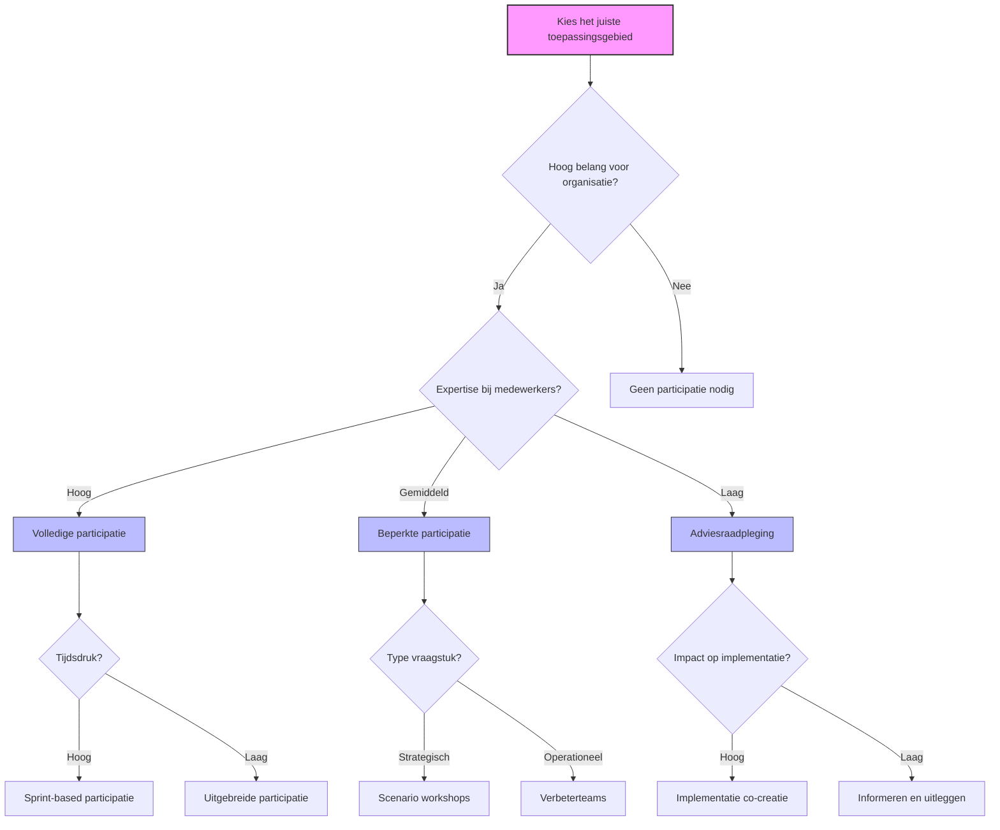

# Hoofdstuk 3: Waar Pas Je Medewerkerparticipatie Toe?

## De strategische keuze van toepassingsgebieden

"We dachten dat we medewerkerparticipatie overal moesten toepassen, maar dat leidde tot participatiemoeheid en oppervlakkige betrokkenheid," vertelt een HR-directeur van een middelgrote retailorganisatie. "Pas toen we strategischer werden in onze keuze van toepassingsgebieden, zagen we echte impact. We focusten op gebieden waar medewerkers unieke expertise hadden en waar de beslissingen grote invloed hadden op hun dagelijks werk. Het verschil was enorm - van geforceerde workshops naar energieke co-creatie."

In dit hoofdstuk ontdek je de meest effectieve toepassingsgebieden voor medewerkerparticipatie en leer je hoe je de juiste participatievorm kiest voor jouw specifieke situatie. We kijken naar gedetailleerde voorbeelden uit verschillende sectoren en bieden praktische handvatten voor HR-professionals en leidinggevenden die participatie strategisch willen inzetten.

## De juiste match tussen vraagstuk en participatievorm

De sleutel tot succesvolle medewerkerparticipatie ligt niet in het overal toepassen ervan, maar in het strategisch kiezen van de juiste toepassingsgebieden. Onderzoek toont aan dat de effectiviteit van participatie sterk afhangt van de context waarin het wordt toegepast. Gerichte participatie op strategisch gekozen gebieden heeft significant meer impact dan brede maar oppervlakkige participatie-initiatieven.

Organisaties die participatie gericht inzetten op zorgvuldig geselecteerde domeinen, genereren gemiddeld 3,2 keer meer waarde dan organisaties die participatie willekeurig implementeren. Het is niet de kwantiteit maar de kwaliteit en strategische focus van participatie die het verschil maakt.

Om de juiste match te maken tussen vraagstuk en participatievorm, hebben we een beslismodel ontwikkeld dat is gebaseerd op vier sleutelvariabelen: organisatiebelang, medewerkerexpertise, tijdsdruk, en implementatie-impact.

Organisatiebelang betreft hoe belangrijk het vraagstuk is voor de organisatie. Medewerkerexpertise gaat over de mate waarin medewerkers relevante kennis of ervaring hebben. Tijdsdruk verwijst naar hoe snel er een beslissing moet worden genomen. Implementatie-impact betreft hoe groot de rol van medewerkers is bij de implementatie.

*Figuur 1: Beslisboom voor het kiezen van de juiste participatievorm*

Dit model is niet bedoeld als rigide voorschrift, maar als hulpmiddel bij het maken van bewuste keuzes. Participatie is geen one-size-fits-all oplossing, maar moet worden afgestemd op de specifieke context, cultuur en doelstellingen van de organisatie.

## Vier strategische toepassingsgebieden: verhalen uit de praktijk

### 1. Beleidsvorming en strategie

Hoewel beleidsvorming traditioneel het domein is van senior management, kunnen participatieve benaderingen de kwaliteit, acceptatie en implementatie van beleid significant verbeteren. Onderzoek toont aan dat beleid met substantiële medewerkersinput 2,7 keer sneller wordt geïmplementeerd en 41% minder weerstand ontmoet dan top-down geformuleerd beleid.

Mensen ondersteunen wat ze helpen creëren. Deze eenvoudige maar krachtige observatie verklaart waarom participatieve beleidsvorming zo effectief kan zijn - het creëert niet alleen beter beleid, maar ook intrinsieke motivatie om het te laten slagen.

#### Het verhaal van een duurzaamheidsstrategie

Een middelgrote industriële onderneming met ongeveer 2.500 medewerkers stond voor de uitdaging om een ambitieuze duurzaamheidsstrategie te ontwikkelen. Eerdere top-down initiatieven hadden geleid tot beperkte adoptie en minimale impact. De directie realiseerde zich dat een effectieve duurzaamheidsstrategie diep verankerd moest zijn in de dagelijkse operatie en breed gedragen moest worden door medewerkers op alle niveaus. "We hadden eerder prachtige plannen gemaakt die in de praktijk nauwelijks werden uitgevoerd. We beseften dat we het fundamenteel anders moesten aanpakken," vertelde de duurzaamheidsmanager.

Het bedrijf ontwikkelde een participatief proces in drie fasen. In de verkenningsfase van twee maanden werd een cross-functioneel kernteam opgericht met vertegenwoordigers uit alle locaties en afdelingen, een digitaal ideeënplatform gelanceerd waar alle medewerkers uitdagingen en kansen konden identificeren, en lokale workshops georganiseerd op elke locatie om specifieke contexten en behoeften in kaart te brengen.

In de ontwikkelingsfase van drie maanden werkten thematische werkgroepen waarin medewerkers, experts en managers samen concrete doelstellingen en initiatieven ontwikkelden. Er waren regelmatige feedbackrondes met bredere groepen medewerkers en co-creatie van implementatieplannen met duidelijke eigenaren en mijlpalen.

De validatie- en commitmentfase van één maand bestond uit presentatie van de conceptstrategie aan alle medewerkers via interactieve sessies, mogelijkheid voor laatste aanpassingen en verfijningen, en formele goedkeuring door directie en ondernemingsraad.

Tijdens het proces bleek dat productiemedewerkers moeite hadden om deel te nemen aan de digitale componenten. Het team paste de aanpak aan door fysieke ideeënborden op de werkvloer te plaatsen, "duurzaamheidsambassadeurs" aan te stellen die input verzamelden tijdens ploegwisselingen, en korte, gefaciliteerde sessies te organiseren tijdens reguliere werkoverleggen.

De participatieve aanpak leidde tot indrukwekkende resultaten: 37% snellere implementatie dan bij eerdere top-down strategieën, 84% van de medewerkers rapporteerde een sterk gevoel van eigenaarschap, 22% hogere CO2-reductie in het eerste jaar dan oorspronkelijk gepland, en als onverwacht voordeel 14 nieuwe innovatieve productideeën die voortkwamen uit de duurzaamheidsdiscussies.

De succesfactoren waren duidelijke kaders en doelstellingen die richting gaven zonder creativiteit te beperken, een inclusieve benadering die verschillende perspectieven en expertisegebieden samenbracht, transparante communicatie over voortgang en besluitvorming, en zichtbare steun en betrokkenheid van senior leiderschap.

Een productiemedewerker reflecteerde: "Voor het eerst voelde ik dat mijn praktijkervaring echt werd gewaardeerd. Ik kon concrete voorstellen doen die direct relevant waren voor mijn werk, en zag deze terug in de uiteindelijke strategie."

#### Een kantooromgeving die werkt voor iedereen

Een financiële dienstverlener met 1.200 medewerkers stond voor de uitdaging om hun hoofdkantoor te herontwerpen in het licht van veranderende werkpatronen na de COVID-19 pandemie. De directie realiseerde zich dat traditionele top-down kantoorontwerpen niet meer voldeden in een tijd van hybride werken. "We hadden geen duidelijk beeld van hoe het hybride werken er in de praktijk uit zou zien. De enigen die ons dat konden vertellen, waren de medewerkers zelf," legde de facilitair manager uit.

Het bedrijf implementeerde een participatief ontwerpproces dat begon met een uitgebreide behoeftenanalyse. Alle medewerkers vulden een enquête in over werkpatronen en -voorkeuren, focusgroepen met verschillende afdelingen identificeerden specifieke behoeften, en een werkstijlanalyse waarbij medewerkers hun activiteiten bijhielden gedurende twee weken gaf inzicht in werkelijke gebruikspatronen.

Vervolgens vond co-creatie van concepten plaats. In ontwerpworkshops werkten medewerkers samen met architecten en facilitair experts aan concepten, virtuele 3D-tours van voorgestelde ontwerpen werden gedeeld waarop medewerkers feedback konden geven, en verschillende werkplekconcepten werden als prototype gebouwd zodat medewerkers ze konden testen.

In de fase van iteratieve verfijning werden testopstellingen van verschillende werkplekconcepten gemaakt, een real-time feedbacksysteem ingericht waarmee medewerkers ervaringen konden delen, en aanpassingen doorgevoerd op basis van gebruikservaringen.

Tijdens het proces bleek dat er grote verschillen waren in behoeften tussen teams. In plaats van één uniform ontwerp te forceren, werd gekozen voor een modulaire benadering waarbij verschillende zones werden ingericht voor verschillende werkstijlen, met de mogelijkheid om deze aan te passen naarmate behoeften evolueerden.

Het participatieve ontwerpproces leidde tot 28% hogere tevredenheid met de werkomgeving vergeleken met de pre-COVID situatie, 23% meer cross-functionele samenwerking door strategisch ontworpen ontmoetingsruimtes, 34% efficiënter ruimtegebruik door beter begrip van werkpatronen, en als onverwacht voordeel 17% lager ziekteverzuim, mogelijk door verbeterd werkplezier en ergonomie.

De succesfactoren waren de combinatie van kwantitatieve data en kwalitatieve inzichten, tastbare prototypes die abstracte concepten concreet maakten, flexibiliteit om het ontwerp aan te passen aan verschillende behoeften, en transparante communicatie over budgettaire en technische beperkingen.

Een teamleider reflecteerde: "Het proces was net zo waardevol als het resultaat. Door samen na te denken over onze ideale werkomgeving, werden we ons bewuster van hoe we willen samenwerken en wat we daarvoor nodig hebben."

### 2. Operationele optimalisatie

Bij het verbeteren van dagelijkse werkprocessen is medewerkerparticipatie bijzonder effectief. Frontline medewerkers zien inefficiënties, knelpunten en verbetermogelijkheden die voor managers vaak onzichtbaar blijven. De mensen die dagelijks het werk doen, bezitten waardevolle impliciete kennis die moeilijk te formaliseren is maar cruciaal voor operationele excellentie.

#### Procesverbetering van onderaf

Een middelgrote producent van elektronische componenten met 450 medewerkers worstelde met kwaliteitsproblemen, inefficiënties en hoge kosten. Eerdere top-down verbeterinitiatieven hadden slechts tijdelijke resultaten opgeleverd. Het management realiseerde zich dat duurzame verbetering alleen mogelijk was als de kennis en ervaring van productiemedewerkers systematisch werd benut. "Onze operators wisten precies waar de problemen zaten, maar we hadden nooit een effectieve manier gevonden om hun inzichten te benutten," vertelde een productiemanager.

Geïnspireerd door het Kaizen-systeem van Toyota, implementeerde het bedrijf een participatief verbeterprogramma met drie niveaus. Op het niveau van dagelijkse verbeteringen hielden teams korte dagelijkse stand-ups waarin ze problemen identificeerden en kleine verbeteringen voorstelden, gebruikten ze een visueel managementbord waarop problemen en verbeterideeën werden bijgehouden, en hadden ze directe implementatiebevoegdheid voor kleine verbeteringen zonder managementgoedkeuring.

Op het niveau van wekelijkse verbeterprojecten werkten cross-functionele teams één dag per week aan specifieke verbeterprojecten, gebruikten ze een gestructureerde probleemoplossingsmethodologie (A3-methode), en gaven ze wekelijkse presentaties aan management en collega's.

Op het niveau van maandelijkse innovatiesessies werden thematische workshops georganiseerd gericht op grotere uitdagingen, was er betrokkenheid van medewerkers uit verschillende afdelingen, en was er een experimenteerbudget voor het testen van innovatieve ideeën.

Aanvankelijk was er weerstand bij middenmanagement, die zich bedreigd voelden door de directe participatie van medewerkers. Het programma werd aangepast door supervisors te trainen als facilitators van verbeterteams, de rol van managers te herdefiniëren van "probleem-oplossers" naar "verbeter-coaches", en een erkenningssysteem te ontwikkelen dat zowel teams als hun leidinggevenden beloonde.

Na 18 maanden waren de resultaten indrukwekkend: gemiddeld 14 geïmplementeerde verbeteringen per medewerker per jaar, 37% productiviteitsstijging, 42% reductie in kwaliteitsdefecten, 28% lager energieverbruik, en cruciaal: 94% van alle voorstellen werd daadwerkelijk geïmplementeerd.

De succesfactoren waren een systematische aanpak met duidelijke processen en verantwoordelijkheden, snelle implementatie van ideeën, wat motivatie en momentum creëerde, zichtbare steun van senior management, en erkenning en viering van successen.

Een productiemedewerker reflecteerde: "Vroeger dacht ik: waarom zou ik iets zeggen, er gebeurt toch niets mee. Nu zie ik mijn ideeën binnen dagen of weken geïmplementeerd. Het geeft een enorm gevoel van eigenaarschap en trots."

#### Innovatie in dienstverlening

Een bank met 1.500 medewerkers zocht naar manieren om klantervaringen te verbeteren en innovatiever te worden in een competitieve markt. Traditionele innovatieprocessen waren traag en leverden zelden baanbrekende ideeën op. De bank realiseerde zich dat klantenservicemedewerkers dagelijks directe feedback van klanten ontvingen en unieke inzichten hadden in pijnpunten en behoeften. "Onze frontline medewerkers hoorden elke dag wat klanten echt wilden, maar deze inzichten bereikten zelden de innovatieafdeling," vertelde het hoofd Innovatie.

De bank ontwikkelde een digitaal platform voor service-innovatie met drie componenten. Voor ideeëngeneratie was er een laagdrempelig digitaal platform waar medewerkers ideeën konden indienen, mogelijkheid om ideeën te taggen met thema's en klantbehoeften, en gamification-elementen zoals punten en badges voor actieve bijdragers.

Voor collaboratieve ontwikkeling was er een peer-review systeem waarbij collega's ideeën konden verrijken en stemmen, virtuele teams die veelbelovende ideeën verder ontwikkelden, en mentorschap van innovatie-experts voor ideeën met hoog potentieel.

Voor snelle prototyping waren er tweewekelijkse "innovation sprints" waarin ideeën werden omgezet in prototypes, testpanels van medewerkers en klanten die feedback gaven, en een "minimal viable product" benadering voor snelle implementatie.

Na de eerste fase bleek dat veel ideeën strandden in de ontwikkelingsfase. Het programma werd aangepast door "innovation champions" aan te stellen die ideeën hielpen navigeren door het proces, 20% tijd toe te wijzen aan medewerkers met veelbelovende ideeën, en een "fast-track" proces te creëren voor hoogwaardige ideeën met duidelijke business case.

Het programma leidde tot 27 geïmplementeerde service-innovaties in één jaar, waaronder een vereenvoudigd hypotheekvernieuwingsproces dat klanttevredenheid met 31% verhoogde en verwerkingstijd met 47% verminderde, en 22% hogere medewerkerstevredenheid onder deelnemers aan het programma.

De succesfactoren waren laagdrempelige toegang die participatie democratiseerde, snelle feedback en implementatie die motivatie in stand hield, erkenning van bijdragen op alle niveaus, en integratie met bestaande werkprocessen en systemen.

Een klantenservicemedewerker vertelde: "Ik hoorde jarenlang dezelfde klachten van klanten. Nu kan ik eindelijk iets doen met die inzichten. Mijn idee voor een vereenvoudigd aanvraagproces is nu geïmplementeerd en klanten zijn er echt blij mee."

### 3. Persoonlijke ontwikkeling

Medewerkers hebben vaak het beste inzicht in hun eigen ontwikkelbehoeften, leerstijlen en carrièreaspiraties. Participatieve benaderingen in dit domein leiden tot meer eigenaarschap over de eigen ontwikkeling en betere afstemming tussen persoonlijke en organisatiedoelen. Wanneer medewerkers actief betrokken zijn bij het vormgeven van hun ontwikkeltraject, neemt hun motivatie om te leren significant toe.

#### Ontwikkelplannen die werken

Een grote bank met 3.000 medewerkers worstelde met lage voltooiingspercentages van ontwikkelactiviteiten en beperkte impact van trainingen op werkprestaties. Traditionele ontwikkelgesprekken waren vaak eenrichtingsverkeer, waarbij managers ontwikkeldoelen voorschreven. De HR-afdeling realiseerde zich dat effectieve ontwikkeling alleen mogelijk was als medewerkers intrinsiek gemotiveerd waren om te leren en te groeien. "We investeerden miljoenen in ontwikkelprogramma's, maar zagen beperkte impact omdat medewerkers geen eigenaarschap voelden," legde het hoofd Learning & Development uit.

De bank implementeerde een co-creatief proces voor persoonlijke ontwikkeling. In de fase van zelfreflectie en assessment voerden medewerkers self-assessments uit om sterktes, ontwikkelpunten en ambities in kaart te brengen, verzamelden ze 360-graden feedback van collega's, leidinggevenden en klanten, en reflecteerden ze op persoonlijke waarden en drijfveren.

In de fase van co-creatieve ontwikkelgesprekken vond een gestructureerde dialoog plaats tussen medewerker en leidinggevende, kwamen medewerkers met voorstellen voor ontwikkeldoelen en -activiteiten, en fungeerden managers als coaches die vragen stelden en perspectieven boden.

In de fase van flexibele ontwikkelactiviteiten was er een breed spectrum aan leervormen, van formele training tot on-the-job learning, peer learning communities waarin medewerkers kennis en ervaringen deelden, en experimenteerruimte voor het toepassen van nieuwe vaardigheden.

Tijdens de implementatie bleek dat veel managers moeite hadden met hun nieuwe rol als coach. Het programma werd aangepast door intensieve coaching-training voor managers, peer coaching-sessies waarin managers ervaringen konden uitwisselen, en gestructureerde gesprekshandleidingen die de nieuwe benadering ondersteunden.

Na 18 maanden waren de resultaten indrukwekkend: 47% hogere voltooiingsratio's van ontwikkelactiviteiten, 36% sterkere correlatie tussen individuele ontwikkeling en business impact, 29% hogere medewerkerstevredenheid met ontwikkelmogelijkheden, en 23% hogere retentie van toptalent.

De succesfactoren waren de verschuiving van prescriptieve naar co-creatieve benadering, verbinding tussen persoonlijke drijfveren en organisatiedoelen, flexibiliteit in ontwikkelvormen die aansloot bij verschillende leerstijlen, en consistente ondersteuning van managers in hun nieuwe rol.

Een medewerker reflecteerde: "Voor het eerst voelde ik dat mijn ontwikkelplan echt van mij was, niet iets dat van bovenaf werd opgelegd. Ik kon mijn eigen doelen stellen die aansloten bij wat ik echt wilde leren, waardoor ik veel gemotiveerder was om er tijd in te investeren."

### 4. Reorganisaties en structuurveranderingen

Reorganisaties hebben verstrekkende impact op medewerkers en organisatieprestaties. Participatie kan de kwaliteit van besluitvorming verbeteren en draagvlak voor verandering vergroten. Participatieve veranderingsprocessen hebben significant hogere slagingskansen dan top-down benaderingen, vooral wanneer het gaat om complexe transformaties die gedragsverandering vereisen.

#### Een reorganisatie die werkt

Een overheidsinstelling met 1.200 medewerkers stond voor de uitdaging om haar organisatiestructuur te moderniseren in reactie op veranderende maatschappelijke behoeften en budgettaire druk. Eerdere reorganisaties waren gekenmerkt door weerstand, productiviteitsverlies en verslechterde dienstverlening tijdens de transitie. De directie realiseerde zich dat een traditionele top-down reorganisatie waarschijnlijk zou leiden tot weerstand en suboptimale resultaten. "We hadden eerder reorganisaties doorgevoerd die op papier perfect leken, maar in de praktijk niet werkten omdat ze niet aansloten bij de operationele realiteit," vertelde de directeur.

De instelling ontwikkelde een participatief reorganisatieproces met vijf kerncomponenten. Voor gezamenlijke probleemanalyse werden cross-functionele werkgroepen opgericht die knelpunten en uitdagingen in kaart brachten, data-gedreven analyse van werkprocessen en klantervaringen uitgevoerd, en collectieve prioritering van verbeterpunten gedaan.

Voor co-creatie van structuuralternatieven werden ontwerpworkshops georganiseerd waarin medewerkers verschillende organisatiemodellen verkenden, scenario-analyses van voor- en nadelen van verschillende structuren gemaakt, en iteratieve verfijning op basis van feedback gedaan.

Voor implementatieplanning door medewerkers werden transitieteams bestaande uit medewerkers opgericht die implementatieplannen ontwikkelden, risicoanalyses en mitigatiestrategieën opgesteld, en gedetailleerde planning van overgangsfasen gemaakt.

Voor participatieve besluitvorming was er een transparant besluitvormingsproces met duidelijke criteria, een formele adviesronde waarbij alle afdelingen input konden geven, en gezamenlijke besluitvorming over finale structuur door management en medewerkersvertegenwoordiging.

Voor collaboratieve implementatie waren er implementatieteams met vertegenwoordigers uit verschillende niveaus en afdelingen, regelmatige feedbackmomenten en aanpassingsmogelijkheden, en gezamenlijke monitoring van voortgang en resultaten.

Tijdens het proces bleek dat sommige medewerkers moeite hadden om buiten bestaande kaders te denken. Het programma werd aangepast door externe benchmarks en best practices te introduceren als inspiratie, simulaties en rollenspellen te gebruiken om nieuwe werkwijzen te verkennen, en "vrijhavens" te creëren waar teams konden experimenteren met nieuwe structuren voordat deze breder werden uitgerold.

De participatieve reorganisatie leidde tot 47% minder implementatieproblemen vergeleken met eerdere reorganisaties, 38% hogere slagingskans van de reorganisatie volgens onafhankelijke evaluatie, 42% minder productiviteitsverlies tijdens de transitie, en 29% hogere medewerkerstevredenheid na de reorganisatie.

De succesfactoren waren vroege en substantiële betrokkenheid van medewerkers, transparantie over kaders en beperkingen, diverse perspectieven in alle fasen van het proces, en een iteratieve aanpak met ruimte voor aanpassing.

Een afdelingshoofd reflecteerde: "Bij eerdere reorganisaties voelde het alsof verandering ons overkwam. Nu waren we zelf de architecten van de verandering. Het resultaat is een structuur die niet alleen theoretisch klopt, maar ook praktisch werkt omdat het is ontworpen door de mensen die er dagelijks mee moeten werken."

## Algemene principes voor effectieve toepassingen

Ongeacht het specifieke toepassingsgebied, zijn er vier principes die de effectiviteit van medewerkerparticipatie bepalen. Deze principes zijn gebaseerd op uitgebreid onderzoek naar participatieve praktijken in verschillende sectoren en contexten.

### Afstemming op organisatiedoelen

Effectieve participatie is altijd gekoppeld aan strategische organisatiedoelen. Dit zorgt voor focus en relevantie, en voorkomt dat participatie wordt gezien als een losstaande activiteit. Participatie moet worden gezien als een middel om organisatiedoelen te bereiken, niet als doel op zich.

In de praktijk betekent dit dat je voor elk participatie-initiatief een duidelijke doelstelling formuleert die direct gekoppeld is aan organisatieprioriteiten, deze koppeling expliciet communiceert naar alle betrokkenen, participatie-initiatieven evalueert op hun bijdrage aan organisatiedoelen, en zorgt voor zichtbare steun van senior leiderschap.

Een HR-directeur van een grote retailorganisatie deelde: "Toen we participatie begonnen te framen als een strategisch middel om onze klanttevredenheid te verhogen, in plaats van als een 'nice-to-have' HR-initiatief, veranderde de perceptie volledig. Plotseling zagen managers het als een essentieel onderdeel van hun toolkit in plaats van een extra belasting."

### Balans tussen structuur en flexibiliteit

Succesvolle participatie combineert duidelijke structuren met ruimte voor spontane bijdragen. Te veel structuur belemmert creativiteit, terwijl te weinig structuur leidt tot vrijblijvendheid. De meest effectieve participatie-initiatieven volgen een "semi-gestructureerde" benadering die richting geeft zonder creativiteit te beperken.

In de praktijk betekent dit dat je een participatie-framework ontwikkelt met duidelijke processen en rollen, maar bewust ruimte inbouwt voor experimenteren, formele mechanismen (zoals werkgroepen) combineert met informele kanalen (zoals ideeënplatforms), de mate van structuur aanpast aan de context, en regelmatig evalueert of de balans tussen structuur en flexibiliteit optimaal is.

Een operations manager bij een productiebedrijf reflecteerde: "We begonnen met een zeer gestructureerde aanpak die medewerkers te beperkend vonden. Toen gingen we naar het andere uiterste met een volledig open benadering, maar dat leidde tot verwarring en gebrek aan focus. Uiteindelijk vonden we een middenweg met duidelijke kaders waarbinnen teams veel vrijheid hadden. Dat bleek de sleutel tot succes."

### Inclusiviteit en diversiteit

De waarde van participatie wordt versterkt door diversiteit in perspectieven, ervaringen en expertise. Inclusieve participatie zorgt dat verschillende stemmen worden gehoord. Diverse groepen lossen complexe problemen effectiever op dan homogene groepen, zelfs als deze laatste bestaan uit experts.

In de praktijk betekent dit dat je zorgt voor representatie van verschillende functies, niveaus en demografische groepen, veilige omgevingen creëert waar alle stemmen gehoord kunnen worden, facilitatiemethoden toepast die dominantie door enkele stemmen voorkomen, en verschillende participatievormen gebruikt om verschillende communicatiestijlen te accommoderen.

Een diversiteitsmanager bij een grote zorginstelling deelde: "We merkten dat onze participatie-initiatieven vaak werden gedomineerd door dezelfde stemmen - meestal extraverte, hoogopgeleide medewerkers uit bepaalde afdelingen. Door bewust verschillende methoden te gebruiken, zoals anonieme ideeëngeneratie en kleine groepsdiscussies, konden we een veel breder spectrum aan perspectieven ontsluiten. Dit leidde tot rijkere inzichten en betere beslissingen."

### Transparantie over invloed

Duidelijkheid over de mate van invloed die medewerkers hebben is cruciaal voor het managen van verwachtingen en het bouwen van vertrouwen. Onduidelijkheid over beslissingsbevoegdheid is een van de belangrijkste oorzaken van teleurstelling en cynisme bij participatie-initiatieven.

In de praktijk betekent dit dat je expliciet communiceert welke beslissingsbevoegdheid medewerkers hebben in elk participatieproces (adviseren, co-creëren, of zelfstandig beslissen), transparant bent over kaders en beperkingen, feedback geeft over wat er met suggesties is gedaan en waarom bepaalde ideeën wel of niet zijn geïmplementeerd, en consistent bent in het naleven van toegezegde invloed.

Een change manager bij een technologiebedrijf vertelde: "De grootste fout die we in het begin maakten, was niet duidelijk zijn over welke beslissingen al vaststonden en waar medewerkers echt invloed op hadden. Dit leidde tot frustratie wanneer suggesties niet werden overgenomen. Toen we begonnen met het expliciet communiceren van beslissingskaders aan het begin van elk participatieproces, nam de tevredenheid met het proces significant toe, zelfs als niet alle ideeën werden geïmplementeerd."

## Aan de slag: kies je eerste toepassingsgebied

Welke actuele uitdaging in jouw organisatie zou direct baat hebben bij meer participatie? Welke vorm van participatie zou hierbij passen, en welke stakeholders zou je betrekken om maximale impact te realiseren?

Deze reflectievraag nodigt uit tot concrete toepassing van de concepten uit dit hoofdstuk. Door te focussen op een actuele uitdaging, maak je participatie direct relevant en praktisch toepasbaar. Het koppelen van nieuwe concepten aan bestaande uitdagingen verhoogt de kans op daadwerkelijke implementatie aanzienlijk.

Begin met een klein, afgebakend toepassingsgebied waar je snel resultaat kunt boeken. Succesvolle eerste ervaringen creëren momentum voor bredere toepassing. Kies bij voorkeur een gebied waar medewerkers duidelijk relevante expertise hebben die momenteel onvoldoende wordt benut, de uitdaging belangrijk genoeg is om aandacht en resources te rechtvaardigen, er ruimte is voor betekenisvolle input en invloed, en resultaten relatief snel zichtbaar kunnen worden.

Een participatie-expert bij een grote zorginstelling adviseert: "Begin waar de energie is. Zoek een uitdaging waar medewerkers al over praten en ideeën voor hebben, maar waar nog geen formeel kanaal voor bestaat om deze ideeën te benutten. Dit creëert een natuurlijke motivatie voor participatie en verhoogt de kans op vroege successen die het concept kunnen bewijzen."

De reis naar een participatieve organisatie begint met één stap - het kiezen van dat eerste toepassingsgebied waar je het verschil kunt maken. Welke uitdaging in jouw organisatie schreeuwt om de collectieve wijsheid van je medewerkers?

[Download toepassingsmatrix](/hoofdstukken/toepassingsmatrix.md){ .md-button .md-button--primary }
