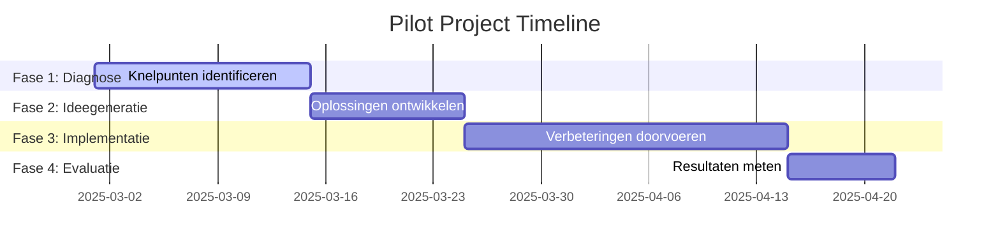

# Hoofdstuk 4: Hoe Start Je met Medewerkerparticipatie?

## De eerste stappen op een transformatieve reis

"We wisten dat we medewerkerparticipatie wilden implementeren, maar hadden geen idee waar te beginnen," vertelt de HR-directeur van een middelgrote productiefaciliteit. "We begonnen enthousiast met een grootschalig initiatief, maar zonder duidelijke structuur of voorbereiding. Na drie maanden was het momentum verdwenen en waren medewerkers cynischer dan ooit. Pas toen we een stap terug namen en een doordachte, gefaseerde aanpak ontwikkelden, begon participatie echt te leven in onze organisatie."

Dit verhaal staat niet op zichzelf. Onderzoek toont aan dat 78% van de mislukte participatie-initiatieven struikelt over onvoldoende voorbereiding en een gebrek aan duidelijke implementatiestrategie. In dit hoofdstuk ontdek je hoe je concreet aan de slag gaat met medewerkerparticipatie in jouw organisatie. We bieden een praktische routekaart met stapsgewijze aanpak, voorbeelden uit de praktijk en direct toepasbare tools.

Medewerkerparticipatie implementeren is vergelijkbaar met het aanleggen van een tuin. Je kunt niet simpelweg zaadjes strooien en verwachten dat er een bloeiende tuin ontstaat. Er is voorbereiding van de grond nodig, zorgvuldige selectie van wat je wilt planten, regelmatig onderhoud, en geduld om de resultaten te zien groeien. Met de juiste aanpak kan echter elke organisatie een vruchtbare participatiecultuur ontwikkelen.

## Een routekaart voor succesvolle implementatie

De implementatie van medewerkerparticipatie verloopt het meest succesvol via een gestructureerd proces met zes essentiële stappen. Deze stappen bouwen op elkaar voort en creëren een solide fundament voor duurzame participatie.

```mermaid
graph LR
    A[1. Cultuurdiagnose] --> B[2. Pilotselectie]
    B --> C[3. Kaderontwerp]
    C --> D[4. Werkgroep formeren]
    D --> E[5. Launch toolkit]
    E --> F[6. Evaluatiemechanisme]
    
    style A fill:#f9f,stroke:#333,stroke-width:2px
    style B fill:#bbf,stroke:#333,stroke-width:1px
    style C fill:#bbf,stroke:#333,stroke-width:1px
    style D fill:#bbf,stroke:#333,stroke-width:1px
    style E fill:#bbf,stroke:#333,stroke-width:1px
    style F fill:#bbf,stroke:#333,stroke-width:1px
```

*Figuur 1: De zes stappen voor het implementeren van medewerkerparticipatie*

## Stap 1: Cultuurdiagnose - Ken je startpunt

"We dachten dat we onze organisatiecultuur goed kenden, maar toen we echt gingen meten, ontdekten we blinde vlekken die cruciaal waren voor het slagen van ons participatie-initiatief," vertelt een verandermanager bij een grote retailorganisatie. "Sommige afdelingen bleken al veel participatiever dan we dachten, terwijl andere afdelingen kampten met een diep wantrouwen dat eerst moest worden aangepakt."

Voordat je begint met het implementeren van participatieve praktijken, is het essentieel om de huidige staat van je organisatiecultuur te begrijpen. Een grondige diagnose geeft je inzicht in de startpositie, helpt bij het identificeren van kansen en uitdagingen, en biedt een nulmeting waartegen je later vooruitgang kunt afzetten.

### De kunst van het luisteren

Begin met het verzamelen en analyseren van bestaande data uit medewerkerstevredenheidsonderzoeken, exit-interviews en interne surveys. Let specifiek op indicatoren die betrekking hebben op autonomie, betrokkenheid bij besluitvorming en vertrouwen in het management. Deze bestaande data biedt vaak al waardevolle inzichten zonder dat je nieuwe metingen hoeft uit te voeren.

Een elektronicafabrikant ontdekte bij het analyseren van hun jaarlijkse medewerkersonderzoek dat afdelingen met de laagste scores op "vertrouwen in besluitvorming" ook het hoogste personeelsverloop hadden. Dit bood een duidelijk aanknopingspunt voor gerichte participatie-interventies. "We hadden deze correlatie nooit eerder opgemerkt," vertelt de HR-manager. "Het maakte duidelijk dat we niet alleen aan participatie moesten werken, maar eerst aan het fundamentele vertrouwen tussen medewerkers en management."

Vul bestaande data aan met een gerichte quick scan die specifiek focust op participatie-aspecten. Deze scan moet anoniem zijn om eerlijke antwoorden te garanderen, kort zijn (maximaal 5 minuten invultijd) om hoge respons te krijgen, en specifieke vragen bevatten over participatie-ervaring. Vragen als "In welke mate voel je dat je ideeën serieus worden genomen?" en "Hoe vaak word je betrokken bij beslissingen die impact hebben op je werk?" geven directe inzichten in de huidige participatiecultuur.

Een softwarebedrijf startte haar participatietraject met een Trust Index meting, geïnspireerd door de "Great Place to Work" methodologie. Deze index meet de mate van vertrouwen, respect, eerlijkheid, trots en kameraadschap binnen de organisatie. Lage scores op onderdelen als "Gehoord worden" en "Betrokkenheid bij besluitvorming" vormden een startpunt voor gerichte participatie-initiatieven. "De objectieve data hielp ons om het gesprek te verschuiven van meningen naar feiten," legt de directeur uit. "Het maakte duidelijk dat dit niet ging om een 'soft' HR-initiatief, maar om een fundamenteel organisatievraagstuk."

### De waarde van context

Plaats je resultaten in context door ze te vergelijken met benchmarks uit je industrie. Dit helpt om te bepalen of bepaalde uitdagingen organisatie-specifiek zijn of breder voorkomen in de sector. Een zorginstelling ontdekte dat hun scores op "autonomie in het werk" significant lager waren dan het sectorgemiddelde, terwijl hun scores op "teamcohesie" juist hoger waren. Dit hielp hen om hun participatie-aanpak te richten op het vergroten van professionele autonomie, terwijl ze de sterke teamcultuur als fundament konden gebruiken.

De cultuurdiagnose is niet alleen waardevol voor het ontwerp van je participatie-aanpak, maar ook voor het creëren van bewustzijn en urgentie. Door de resultaten breed te delen en te bespreken, creëer je een gemeenschappelijk begrip van de startpositie en de noodzaak voor verandering. Een productiebedrijf organiseerde afdelingssessies waarin de resultaten van hun diagnose werden besproken, wat leidde tot openhartige gesprekken over barrières voor participatie en ideeën om deze te overwinnen. "Deze sessies waren eigenlijk al de eerste stap in participatie," vertelt een teamleider. "Voor het eerst spraken we openlijk over hoe beslissingen werden genomen en wat daarin beter kon."

## Stap 2: Pilotselectie - Kies een kansrijk startpunt

Na de diagnose is het tijd om een geschikte pilot te selecteren. Een goed gekozen pilot maximaliseert de kans op vroeg succes, wat cruciaal is voor het opbouwen van momentum en draagvlak. Organisaties die beginnen met zorgvuldig geselecteerde pilots slagen 3,4 keer vaker in hun bredere participatie-implementatie.

"Onze eerste poging om participatie te implementeren mislukte omdat we te groot begonnen," vertelt de operationeel directeur van een logistiek bedrijf. "We wilden meteen de hele organisatie transformeren. Bij onze tweede poging kozen we één specifiek proces met een duidelijk probleem en betrokken de direct betrokken medewerkers. Het verschil was enorm - binnen drie maanden hadden we tastbare resultaten en waren medewerkers uit andere afdelingen nieuwsgierig hoe zij ook konden deelnemen."

### De kunst van het strategisch kiezen

Een succesvolle pilot is tijdsbegrensd, met een duidelijke start en eind. Een korte tijdshorizon (maximaal 3 maanden) zorgt voor focus en urgentie, en maakt snelle leercycli mogelijk. Een Nederlandse bank introduceerde "Agile Squads" die begonnen als 12-weken pilots. Dit was kort genoeg om engagement hoog te houden maar lang genoeg om betekenisvolle resultaten te boeken. "De tijdslimiet creëerde een gezonde druk," legt een teamlid uit. "We wisten dat we binnen 12 weken resultaten moesten laten zien, wat ons hielp om gefocust te blijven en niet te verzanden in eindeloze discussies."

Definieer vooraf concrete, meetbare doelstellingen die direct gekoppeld zijn aan bedrijfsresultaten. Dit kunnen operationele meetwaarden zijn zoals doorlooptijdverkorting, financiële indicatoren zoals kostenreductie, of medewerkergerelateerde meetwaarden zoals betrokkenheidsscores. Een supermarktketen's pilot voor winkeloptimalisatie had als concrete doelstelling een 15% reductie in out-of-stock situaties, wat een duidelijk meetpunt creëerde. "Door een specifieke, meetbare doelstelling te kiezen, konden we objectief bepalen of de participatieve aanpak werkte," vertelt de retailmanager. "Toen we na twee maanden al 18% reductie hadden bereikt, was dat een krachtig argument voor het uitbreiden van de aanpak."

Selecteer een pilot die van nature samenwerking tussen verschillende functies of afdelingen vereist. Dit doorbreekt silo's, demonstreert direct de waarde van diverse perspectieven, en creëert bredere betrokkenheid in de organisatie. Een energiebedrijf vormde "Transitieteams" die bewust technische, commerciële en duurzaamheidsexpertise combineerden. Dit leidde tot oplossingen die geen van de individuele disciplines alleen had kunnen bedenken. "De cross-functionele samenstelling was aanvankelijk ongemakkelijk," herinnert een teamlid zich. "We spraken verschillende 'talen' en hadden verschillende prioriteiten. Maar juist die diversiteit leidde uiteindelijk tot doorbraken die we anders nooit hadden bereikt."

### De balans tussen ambitie en haalbaarheid

De ideale pilot balanceert tussen ambitie en haalbaarheid. Het vraagstuk moet belangrijk genoeg zijn om aandacht en resources te rechtvaardigen, maar niet zo complex dat succes onwaarschijnlijk wordt. Een farmaceutisch bedrijf koos bewust voor een middelgroot proces-optimalisatieproject als hun eerste participatie-pilot. "We hadden grotere uitdagingen kunnen aanpakken," legt de projectleider uit, "maar we wilden eerst bewijzen dat de aanpak werkte voordat we het toepasten op onze meest kritieke processen."

Kies bij voorkeur een pilot die aansluit bij een actuele uitdaging of kans in de organisatie. Zo wordt participatie direct relevant en waardevol, in plaats van een losstaand "nice-to-have" initiatief. Een hotelketen implementeerde participatie als onderdeel van hun reactie op veranderende gastbehoeften na de COVID-19 pandemie. Door frontline medewerkers te betrekken bij het herontwerpen van de gastervaring, werd participatie direct gekoppeld aan een strategische prioriteit. "Participatie was geen doel op zich, maar een middel om een urgent bedrijfsprobleem op te lossen," vertelt de general manager. "Dat gaf het initiatief een natuurlijke urgentie en relevantie."

## Stap 3: Kaderontwerp - Schep duidelijkheid

Een duidelijk kader is essentieel om participatie te structureren zonder het te bureaucratiseren. Het biedt helderheid over wat participatie wel en niet inhoudt, en voorkomt daarmee zowel schijnparticipatie als eindeloze discussies zonder conclusie.

"In onze eerste participatie-initiatieven waren we bang om te veel kaders te stellen, omdat we dachten dat dit de creativiteit zou beperken," vertelt een innovatiemanager bij een technologiebedrijf. "Het resultaat was chaos - eindeloze discussies zonder beslissingen, frustratie bij medewerkers die niet wisten wat er met hun input gebeurde, en uiteindelijk cynisme over het hele concept. Toen we duidelijke kaders introduceerden, zagen we juist meer creativiteit en betere resultaten, omdat mensen wisten binnen welke grenzen ze konden opereren en wat ze konden verwachten."

### De architectuur van effectieve participatie

Een effectief participatieprotocol begint met een duidelijke beslissingsmatrix die specificeert welke beslissingen volledig participatief zijn (bindend), welke adviserend zijn, en welke buiten de scope van participatie vallen. Deze transparantie voorkomt teleurstelling en cynisme. Een coöperatieve bank gebruikt een visuele matrix die per beslissingstype aangeeft of medewerkers worden geïnformeerd, geconsulteerd, meebeslissen of zelfstandig beslissen. "Deze matrix heeft eindeloze discussies voorkomen," vertelt een teamleider. "Iedereen weet precies waar ze aan toe zijn en welke invloed ze kunnen verwachten. Dat schept vertrouwen en voorkomt teleurstelling."

Definieer duidelijke rollen binnen het participatieproces: wie faciliteert sessies, wie documenteert uitkomsten, en wie bewaakt de implementatie van besluiten. Een chemieconcern werkt met roterende rollen waarbij teamleden afwisselend facilitator, notulist en implementatie-champion zijn. Dit verdeelt eigenaarschap en ontwikkelt verschillende vaardigheden. "Door de rollen te roteren, voorkomen we dat participatie afhankelijk wordt van één persoon," legt een HR-manager uit. "Het democratiseert het proces en zorgt ervoor dat iedereen verschillende perspectieven ervaart."

Leg vast hoe en wanneer communicatie plaatsvindt: kanalen voor participatie zelf (zoals wekelijkse stand-ups of digitale platforms), communicatie over voortgang en resultaten, en feedbackmechanismen. Een brouwerij heeft een "Better Decisions" framework dat per participatietype het optimale communicatiekanaal en de ideale frequentie specificeert. "Communicatie is de levensader van participatie," vertelt de communicatiemanager. "Door vooraf duidelijke afspraken te maken over hoe en wanneer we communiceren, voorkomen we dat mensen zich buitengesloten voelen of dat informatie verloren gaat."

### Balanceren tussen structuur en flexibiliteit

Het kader moet voldoende structuur bieden om richting te geven, maar ook flexibiliteit om aan te passen aan verschillende contexten en behoeften. Een retailorganisatie ontwikkelde een modulair participatieprotocol dat teams konden aanpassen aan hun specifieke situatie, binnen bepaalde kernprincipes. "We hebben geleerd dat één aanpak niet voor iedereen werkt," vertelt de HR-directeur. "Door teams de vrijheid te geven om het protocol aan te passen aan hun context, creëerden we meer eigenaarschap en betere resultaten."

Het kader moet ook duidelijk maken wat participatie niet is. Het is geen consensus-besluitvorming over alle onderwerpen, geen vervanging van leiderschap, en geen vrijblijvende discussie zonder consequenties. Door deze grenzen expliciet te maken, voorkom je misverstanden en teleurstelling. Een zorginstelling maakte in hun participatiehandvest expliciet duidelijk dat bepaalde beslissingen, zoals die rond patiëntveiligheid en wettelijke vereisten, niet onderhevig waren aan participatieve besluitvorming. "Deze duidelijkheid was cruciaal," vertelt een afdelingshoofd. "Het hielp om realistische verwachtingen te scheppen en voorkwam dat we energie verspilden aan discussies over onderwerpen waar we weinig speelruimte hadden."

Ontwikkel een eenvoudige, visuele beslissingsmatrix die leidinggevenden kunnen gebruiken om te bepalen welke beslissingen zich lenen voor welke vorm van participatie. Dit voorkomt zowel over- als onderconsultatie en maakt participatie tot een bewuste, strategische keuze in plaats van een willekeurig proces.

## Stap 4: Werkgroep formeren - Creëer ambassadeurs

Een cruciale succesfactor bij het implementeren van medewerkerparticipatie is het samenstellen van een effectieve werkgroep. Deze groep fungeert als katalysator en ambassadeur voor het participatieproces binnen de organisatie.

"De kwaliteit van onze werkgroep bepaalde in hoge mate het succes van ons participatie-initiatief," vertelt een verandermanager bij een grote financiële instelling. "We hadden bewust gekozen voor een diverse groep met verschillende perspectieven en niveaus binnen de organisatie. In het begin leidde dit tot uitdagende discussies, maar uiteindelijk zorgde juist die diversiteit ervoor dat het initiatief breed gedragen werd en dat we blinde vlekken konden identificeren die we anders hadden gemist."

### De kracht van representatie en vrijwilligheid

Zorg voor een werkgroep die een afspiegeling vormt van de afdeling of organisatie, met diversiteit in functieniveaus, verschillende afdelingen, variatie in anciënniteit, en diverse perspectieven. Een zorginstelling zorgde ervoor dat hun participatiewerkgroep bestond uit zowel zorgprofessionals, administratief personeel, als teamleiders. Dit leidde tot een breder draagvlak voor de initiatieven. "De diversiteit in onze werkgroep zorgde ervoor dat we beslissingen namen die werkten voor de hele organisatie, niet alleen voor een specifieke groep," vertelt een deelnemer. "Het hielp ook om weerstand te verminderen, omdat mensen zich vertegenwoordigd voelden in het proces."

Dwing niemand om deel te nemen aan de werkgroep. Gedwongen participatie ondermijnt het hele concept, terwijl vrijwillige deelname zorgt voor intrinsieke motivatie en eigenaarschap. Een IT-dienstverlener stelde de werkgroep samen op basis van open sollicitaties, waarbij medewerkers hun motivatie konden toelichten. Dit resulteerde in een groep intrinsiek gemotiveerde ambassadeurs. "De energie en toewijding van vrijwilligers is onvervangbaar," legt de HR-directeur uit. "Ze zijn niet alleen deelnemers, maar worden echte ambassadeurs die het gedachtegoed uitdragen in de organisatie."

### De werkgroep als microkosmos

Besteed bewust aandacht aan het creëren van een hecht team binnen de werkgroep. Organiseer kennismakingsactiviteiten, definieer gezamenlijke waarden en werkafspraken, en creëer veiligheid om open te communiceren. Een productiebedrijf startte hun participatietraject met een volledige dag teambuilding voor de werkgroep. Dit resulteerde in sterke onderlinge verbindingen die cruciaal bleken tijdens latere uitdagingen. "De werkgroep moet een microkosmos zijn van de participatiecultuur die je wilt creëren," vertelt de facilitator. "Als participatie niet werkt binnen de werkgroep, hoe kun je dan verwachten dat het werkt in de bredere organisatie?"

De werkgroep moet effectief kunnen samenwerken met leidinggevenden. Organiseer gezamenlijke sessies, stem verwachtingen af, verduidelijk rollen, en ontwikkel een gezamenlijke visie. Een retailketen organiseerde maandelijkse dialoogsessies tussen de participatiewerkgroep en het managementteam. Dit bevorderde wederzijds begrip en vertrouwen. "Deze sessies waren essentieel om de kloof tussen de werkgroep en het management te overbruggen," vertelt een deelnemer. "Ze zorgden ervoor dat we niet in een bubbel opereerden, maar echt impact konden hebben op de organisatie."

Geef de werkgroep een duidelijk mandaat en zichtbare steun. Wees als leidinggevende aanwezig bij belangrijke momenten en toon oprechte interesse in hun werk. Dit signaleert naar de hele organisatie dat participatie serieus wordt genomen. Een CEO van een middelgrote onderneming woonde consequent de presentaties van de participatiewerkgroep bij en stelde oprechte, nieuwsgierige vragen. "Zijn aanwezigheid en interesse maakten een enorm verschil," herinnert een werkgroeplid zich. "Het gaf ons legitimiteit en liet zien dat dit niet zomaar een HR-initiatief was, maar een strategische prioriteit voor het bedrijf."

## Stap 5: Launch toolkit - Maak een professionele start

Een professionele, goed voorbereide lancering zet de toon voor het hele participatietraject. Het signaleert dat participatie serieus wordt genomen en niet slechts een modegril is.

"De manier waarop we ons participatie-initiatief lanceerden, bepaalde in hoge mate hoe het werd ontvangen," vertelt een communicatiemanager bij een verzekeringsmaatschappij. "Bij eerdere initiatieven hadden we simpelweg een e-mail gestuurd en verwacht dat mensen wel zouden aanhaken. Dit keer pakten we het groots aan, met een goed doordachte kickoff, duidelijke communicatiematerialen, en een concreet plan voor de eerste weken. Het verschil in respons was enorm - mensen voelden dat dit iets belangrijks was, niet zomaar een nieuw managementidee."

### De eerste indruk telt

Een gestandaardiseerde kickoff-presentatie die het waarom, wat en hoe van participatie uitlegt, aangepast is aan de specifieke context van de pilot, inspirerend maar ook concreet is, en duidelijke verwachtingen en volgende stappen bevat, zet de toon voor het hele traject. Een bank heeft een "Participation Kickoff Deck" ontwikkeld dat naast informatie ook interactieve elementen zoals real-time polls bevat om direct participatie te modelleren. "We wilden niet alleen over participatie praten, maar het direct laten ervaren," legt de projectleider uit. "De interactieve elementen in onze kickoff zorgden ervoor dat mensen meteen een positieve ervaring hadden met participatie."

Een participatiehandvest dat principes, spelregels en wederzijdse verwachtingen vastlegt, door alle deelnemers wordt ondertekend, en dient als gezamenlijk referentiepunt, creëert een gevoel van commitment en gedeelde verantwoordelijkheid. Een verzekeraar gebruikt een handvest dat tijdens een ceremoniële kickoff wordt ondertekend door zowel leidinggevenden als teamleden. "Het ondertekenen van het handvest was een krachtig symbolisch moment," vertelt een deelnemer. "Het maakte duidelijk dat dit een gezamenlijke reis was, waarin iedereen - van directeur tot medewerker - zich committeerde aan dezelfde principes."

Een vooraf geconfigureerde digitale omgeving waar alle participatie-gerelateerde informatie wordt gedeeld, discussies plaatsvinden, en besluitvorming wordt vastgelegd, maakt participatie toegankelijk en transparant. Een reisplatform creëert voor elk participatie-initiatief een dedicated digitale hub die tools integreert zoals Miro voor visuele samenwerking, Slack voor discussies, en Trello voor het bijhouden van actiepunten. "De digitale omgeving democratiseerde participatie," legt een IT-manager uit. "Het maakte het mogelijk voor mensen om bij te dragen ongeacht hun locatie of werkschema, en zorgde voor transparantie in het hele proces."

### Voorbij de lancering

De launch toolkit moet niet alleen de kickoff ondersteunen, maar ook de eerste weken van het participatietraject. Ontwikkel een "first 30 days" plan met concrete activiteiten, mijlpalen en check-ins om momentum te behouden na de initiële lancering. Een telecombedrijf ontwikkelde een gedetailleerd 30-dagen plan voor hun participatie-pilots, met wekelijkse thema's, specifieke activiteiten, en regelmatige reflectiemomenten. "De eerste 30 dagen zijn cruciaal om gewoontes te vormen," legt de projectleider uit. "Door een gestructureerd plan te hebben, zorgden we ervoor dat participatie niet wegzakte na het initiële enthousiasme."

Ontwikkel een standaard launch toolkit die teams kunnen aanpassen aan hun specifieke context. Dit bespaart tijd, zorgt voor consistentie, en verhoogt de professionaliteit van participatie-initiatieven. Een multinational heeft een modulaire toolkit ontwikkeld die lokale teams kunnen aanpassen aan hun cultuur en context, terwijl ze toch gebruik maken van beproefde materialen en methoden. "De toolkit gaf teams een vliegende start," vertelt de global HR-director. "Ze hoefden niet alles zelf uit te vinden, maar konden voortbouwen op wat al werkte in andere delen van de organisatie."

## Stap 6: Evaluatiemechanisme - Meet en verbeter

Systematische evaluatie is cruciaal om participatie te verbeteren en de waarde ervan aan te tonen. Zonder robuuste evaluatie blijft participatie kwetsbaar voor budgetbezuinigingen en managementwisselingen.

"Wat je meet, krijg je gedaan," vertelt een data-analist bij een groot productiebedrijf. "Door systematisch de impact van onze participatie-initiatieven te meten, konden we niet alleen het proces verbeteren, maar ook de waarde ervan aantonen aan het management. Dit was cruciaal om blijvende steun en middelen te krijgen. De data vertelde een overtuigend verhaal dat anekdotes alleen nooit hadden kunnen vertellen."

### De ritmes van evaluatie

Korte, frequente metingen van sleutelindicatoren zoals betrokkenheid, ervaren invloed, en voortgang maken snelle bijsturing mogelijk. Een verzekeringsgroep gebruikt een 3-vragenlijst die wekelijks wordt uitgestuurd en minder dan een minuut kost om in te vullen. "Deze pulse checks gaven ons real-time inzicht in hoe het participatieproces werd ervaren," legt de projectleider uit. "We konden snel bijsturen als we zagen dat de betrokkenheid daalde of als mensen het gevoel hadden dat hun input niet werd gewaardeerd."

Een grondiger evaluatiemoment halverwege de pilot, waarbij zowel proces als voorlopige resultaten worden beoordeeld, is het moment om substantiële aanpassingen te maken indien nodig. Een pensioenverzekeraar combineert in hun mid-term reviews kwantitatieve data met gefaciliteerde reflectiesessies om dieper inzicht te krijgen in wat werkt en wat niet. "De mid-term review was een keerpunt in ons participatietraject," vertelt een deelnemer. "We ontdekten dat bepaalde groepen zich buitengesloten voelden door de gekozen communicatiekanalen. Door dit halverwege te identificeren en aan te passen, konden we het traject nog bijsturen en inclusief maken."

Een uitgebreide evaluatie na afloop van de pilot, inclusief berekening van de Return on Investment, harde metrics (tijdsbesparing, kostenreductie), en zachte factoren (verbeterde medewerkerstevredenheid), biedt een compleet beeld van de impact. Een accountantskantoor heeft een gestandaardiseerd ROI-model ontwikkeld specifiek voor participatie-initiatieven, dat zowel directe als indirecte baten kwantificeert. "Dit model hielp ons om de business case voor participatie hard te maken," legt de financieel directeur uit. "We konden aantonen dat participatie niet alleen 'leuk' was, maar ook substantiële financiële voordelen opleverde."

### Van meten naar leren

Evaluatie moet niet alleen gericht zijn op het meten van resultaten, maar ook op het leren en verbeteren van het participatieproces zelf. Organiseer reflectiesessies waarin deelnemers kunnen delen wat werkte, wat niet werkte, en wat ze anders zouden doen in toekomstige participatie-initiatieven. Een technologiebedrijf organiseert na elke participatie-pilot een "retrospective" waarin alle betrokkenen reflecteren op het proces en concrete verbeterpunten identificeren voor toekomstige initiatieven. "Deze retrospectives waren goud waard," vertelt een deelnemer. "Ze zorgden ervoor dat we niet dezelfde fouten bleven maken, maar echt leerden en groeiden als organisatie."

Maak evaluatie een integraal onderdeel van het participatieproces, niet een afterthought. Reserveer tijd en middelen voor grondige evaluatie en gebruik de resultaten actief om het proces te verbeteren en successen te vieren. Een productiebedrijf heeft evaluatie expliciet opgenomen in hun participatieprotocol, met gereserveerde tijd en middelen voor zowel continue monitoring als diepgaande evaluaties. "Door evaluatie te integreren in het proces, werd het een natuurlijk onderdeel van onze werkwijze," legt de kwaliteitsmanager uit. "Het was niet iets extra's dat we moesten doen, maar een essentieel onderdeel van hoe we werkten."

## Praktijkvoorbeeld: Operationele Efficiency Boost

Een middelgrote logistieke dienstverlener kampte met inefficiënties in hun warehouse operaties. In plaats van een traditionele top-down optimalisatie door externe consultants, kozen ze voor een participatieve aanpak met de warehouse medewerkers als centrale spelers.

"We hadden al twee keer externe consultants ingehuurd om onze warehouse operaties te optimaliseren," vertelt de operationeel directeur. "Ze leverden mooie rapporten op, maar de implementatie strandde telkens op weerstand van de werkvloer. Dit keer besloten we het anders aan te pakken en de expertise van onze eigen mensen te benutten. Het was een openbaring."

### Een reis in vier fasen

De pilot volgde een strakke tijdlijn van 8 weken, verdeeld over vier fasen:

*Figuur 2: Tijdlijn van de warehouse optimalisatie pilot*

In de diagnosefase van twee weken identificeerden warehouse medewerkers knelpunten via digitale surveys en fysieke "pijnpuntensessies". "We ontdekten dat 73% van de geïdentificeerde knelpunten niet eerder bekend was bij het management, ondanks reguliere KPI-rapportages," vertelt de projectleider. "Medewerkers hadden bijvoorbeeld opgemerkt dat bepaalde productcategorieën consistent meer pickfouten veroorzaakten door verwarrende labeling, iets wat in geen enkele rapportage naar voren kwam."

In de ideegeneratiefase van 10 dagen werkten cross-functionele teams samen in gefaciliteerde workshops om oplossingen te ontwikkelen voor de top-5 knelpunten. Ze gebruikten technieken zoals "How Might We" vragen en "Crazy 8's" schetssessies om creatief denken te stimuleren. "De meest waardevolle ideeën kwamen van de combinatie van frontline-ervaring en technische expertise," vertelt een teamlid. "Wanneer een warehouse medewerker een probleem beschreef en een technisch specialist direct kon meedenken over oplossingen, ontstonden er inzichten die geen van beide groepen alleen had kunnen bedenken."

De implementatiefase van drie weken was misschien wel het meest revolutionaire onderdeel van de pilot. Teams kregen niet alleen verantwoordelijkheid, maar ook concrete middelen om hun eigen oplossingen te implementeren: een gedelegeerd budget van €5.000 per team, 4 uur per week vrijgestelde tijd, en een transparant Kanban-bord voor voortgangsregistratie. "Dit was het moment waarop mensen echt begonnen te geloven dat het menens was," herinnert een teamleider zich. "Niet alleen mochten ze meedenken, ze kregen ook daadwerkelijk de middelen om hun ideeën te realiseren. Dat maakte alle verschil."

In de evaluatiefase van één week werden de resultaten gemeten tegen vooraf vastgestelde KPI's en werd een ROI-berekening gemaakt. De resultaten waren indrukwekkend: 22% reductie in pickfouten, 14% verhoging in picksnelheid, 31% stijging in medewerkerstevredenheid, en een ROI van 327% binnen 3 maanden.

### De sleutels tot succes

Wat deze pilot bijzonder effectief maakte, was de combinatie van duidelijke structuur en echte autonomie. Er was een helder kader met substantiële beslissingsbevoegdheid daarbinnen. Het management fungeerde als sponsor en ondersteuner, niet als controleur. Er was transparante voortgangsregistratie en een directe koppeling tussen ideeën en implementatie.

"De grootste verrassing was hoe snel mensen eigenaarschap namen," vertelt de operationeel directeur. "We hadden verwacht dat er een aanpassingsperiode zou zijn waarin mensen moesten wennen aan hun nieuwe rol, maar zodra ze merkten dat hun input serieus werd genomen en ze daadwerkelijk beslissingen mochten nemen, was er geen houden meer aan."

Een onverwacht neveneffect was een bredere cultuurverandering: medewerkers begonnen proactief verbetervoorstellen te doen voor andere processen, en managers werden meer ontvankelijk voor input van de werkvloer. "Het heeft onze hele manier van werken veranderd," reflecteert een afdelingsmanager. "Vroeger dachten we dat we als management alle antwoorden moesten hebben. Nu zien we onze rol meer als het faciliteren van de collectieve intelligentie van ons team."

## Praktijkvoorbeeld: "Great Place to Work" Traject

Een middelgroot softwarebedrijf implementeerde participatie als onderdeel van hun "Great Place to Work" strategie. Hun aanpak illustreert hoe je objectieve data kunt gebruiken als startpunt én evaluatie-instrument.

"We wilden niet zomaar een leuke werkplek zijn, maar een organisatie waar mensen echt invloed hebben en zich gehoord voelen," vertelt de HR-directeur. "We besloten om participatie niet als losstaand initiatief te implementeren, maar als integraal onderdeel van onze bredere strategie om een 'Great Place to Work' te worden."

### Data als kompas

Het traject begon met een Trust Index meting (een gestandaardiseerd medewerkerstevredenheidsonderzoek) die lage scores liet zien op "Gehoord worden" (62%) en "Betrokkenheid bij besluitvorming" (58%). "Deze cijfers waren een wake-up call," vertelt de CEO. "We dachten dat we een open cultuur hadden, maar de data vertelde een ander verhaal."

In plaats van een top-down actieplan te ontwikkelen, vormden ze vijf werkgroepen, elk gefocust op een specifiek thema uit de Trust Index. De werkgroepen waren samengesteld uit medewerkers van verschillende afdelingen en niveaus, gebaseerd op vrijwillige deelname, en met expliciet vrijgemaakte tijd (4 uur per week). "We wilden het goede voorbeeld geven," legt de HR-directeur uit. "Als we serieus waren over participatie, moesten we mensen ook de tijd en ruimte geven om te participeren."

De werkgroepen doorliepen vier fasen: een verdiepingsfase van één maand waarin ze de onderliggende oorzaken analyseerden, een ontwerpfase van twee maanden waarin ze concrete interventies ontwikkelden, een implementatiefase van drie maanden waarin ze goedgekeurde interventies uitvoerden, en een evaluatiefase van één maand waarin ze de impact maten.

"De verdiepingsfase was cruciaal," vertelt een werkgroeplid. "In plaats van meteen met oplossingen te komen, namen we de tijd om echt te begrijpen waarom mensen zich niet gehoord voelden. We ontdekten dat het niet zozeer ging om een gebrek aan kanalen voor input, maar om een gebrek aan terugkoppeling over wat er met die input gebeurde."

### Meetbare impact

Na zes maanden toonde een tweede Trust Index meting significante verbeteringen: "Gehoord worden" steeg naar 78% (+16%), "Betrokkenheid bij besluitvorming" naar 74% (+16%), en de algemene medewerkerstevredenheid steeg van 72% naar 83%. Een jaar later bevestigde een derde meting dat de verbeteringen duurzaam waren, met scores die verder stegen naar respectievelijk 82% en 79%.

"De cijfers waren indrukwekkend, maar de verhalen erachter waren nog krachtiger," vertelt de CEO. "Mensen vertelden hoe ze voor het eerst het gevoel hadden dat hun stem ertoe deed, hoe ze trots waren op verbeteringen die ze zelf hadden geïnitieerd, en hoe ze zich meer verbonden voelden met het bedrijf."

### Succesfactoren

Sleutelfactoren in het succes van dit traject waren het gebruik van objectieve data als startpunt én evaluatie-instrument, volledige vrijwilligheid in deelname aan werkgroepen, expliciete tijd en resources voor participatie-activiteiten, nauwe samenwerking tussen werkgroepen en management, en focus op zowel proces (hoe werken we samen?) als inhoud (wat verbeteren we?).

"We hebben geleerd dat participatie niet iets is wat je 'erbij' doet," reflecteert de HR-directeur. "Het vereist een serieuze investering van tijd, aandacht en middelen. Maar de return on investment is enorm, niet alleen in termen van medewerkerstevredenheid, maar ook in termen van innovatie, kwaliteit en uiteindelijk bedrijfsresultaten."

Een onverwacht voordeel was de impact op recruitment en retentie. Het bedrijf zag een stijging van 34% in sollicitaties en een daling van 28% in vrijwillig verloop. "Kandidaten horen van onze medewerkers hoe het is om hier te werken," vertelt de recruitmentmanager. "Die authentieke verhalen over hoe mensen echt invloed hebben, zijn krachtiger dan welke employer branding campagne dan ook."

## Aan de slag: jouw eerste stap

Nu je de zes stappen voor het implementeren van medewerkerparticipatie kent en inspirerende praktijkvoorbeelden hebt gezien, is het tijd om zelf in actie te komen. Maar waar begin je?

"De grootste barrière voor participatie is niet weerstand of gebrek aan middelen, maar uitstelgedrag," vertelt een veranderexpert. "Organisaties blijven vaak steken in de planningsfase, wachtend op het perfecte moment of de perfecte aanpak. Maar participatie leer je door te doen, niet door te plannen."

Welke eerste concrete stap zou jij binnen 48 uur kunnen zetten om participatie in jouw team te initiëren? Deze vraag nodigt uit tot onmiddellijke actie, in plaats van uitgebreide planning. Door de tijdshorizon te beperken tot 48 uur, wordt de focus verlegd naar kleine, haalbare stappen die direct momentum creëren.

Begin met een "minimal viable action" - de kleinst mogelijke actie die toch betekenisvolle beweging in de gewenste richting creëert. Dit kan zo simpel zijn als het organiseren van een informele lunch om participatie te bespreken, het opzetten van een digitaal ideeënbord, het reserveren van 15 minuten in het volgende teamoverleg voor een open discussie, of het vragen aan teamleden om één verbeteridee te delen.

Een teamleider bij een consultancybureau begon haar participatietraject door simpelweg aan het einde van elke vergadering vijf minuten te reserveren voor de vraag: "Wat kunnen we beter doen?" "Het was een kleine stap, maar het signaal was krachtig," vertelt ze. "Het maakte duidelijk dat ik openstond voor input en dat ik bereid was om te luisteren. Binnen enkele weken zag ik al een verandering in hoe mensen zich uitspraken en ideeën deelden."

Het gaat niet om de grootte van de stap, maar om het doorbreken van inertie en het creëren van een eerste positieve ervaring met participatie. Zoals een verandermanager het treffend verwoordt: "De reis van duizend mijl begint met één stap. Maar je moet die stap wel zetten."

[Download quick-start checklist](/hoofdstukken/quick-start-checklist.md){ .md-button .md-button--primary }
