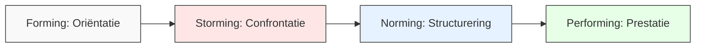
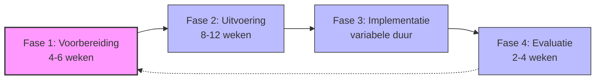
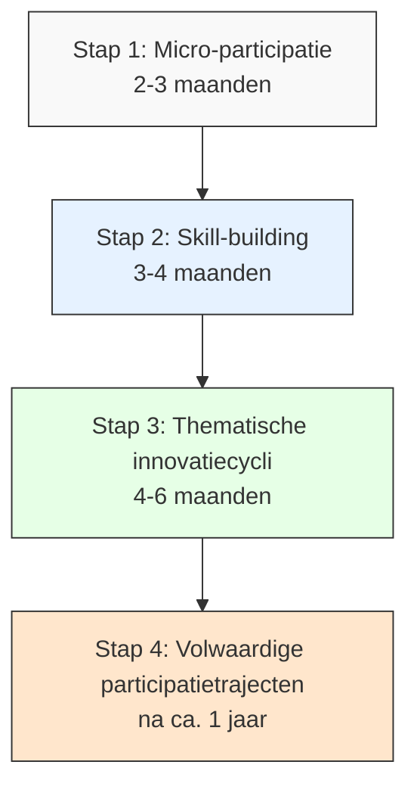

# Hoofdstuk 5: De Structuur en Dynamiek van een Succesvol Participatietraject

## De menselijke kant van participatie

"We hadden alles perfect gepland: een strakke tijdlijn, duidelijke doelstellingen, de juiste tools. Maar we hadden één cruciaal element over het hoofd gezien: de menselijke dynamiek," vertelt een verandermanager bij een grote financiële instelling. "Pas toen we aandacht begonnen te besteden aan groepsvorming, vertrouwen en inclusie, begon ons participatietraject echt te leven. We leerden dat participatie niet alleen een methodiek is, maar vooral een menselijk proces."

In dit hoofdstuk ontdek je hoe je een participatietraject effectief opbouwt en begeleidt. We kijken naar de menselijke kant van participatie, de verschillende fasen van een traject, en hoe je kunt kiezen tussen een volledig traject of een incrementele aanpak. Je leert hoe je de balans vindt tussen structuur en flexibiliteit, en hoe je een traject ontwerpt dat past bij de specifieke context van jouw organisatie.

## De menselijke factor: groepsvorming als fundament

Het succes van participatietrajecten wordt vaak gemeten aan tastbare resultaten zoals efficiëntieverbeteringen of kostenbesparingen. Maar de werkelijke sleutel tot duurzame participatie ligt in de menselijke interacties en groepsprocessen die deze resultaten mogelijk maken.

### De reis van een participatiegroep

Participatiegroepen doorlopen typisch vier ontwikkelingsfasen, gebaseerd op het model van psycholoog Bruce Tuckman. Het herkennen en begeleiden van deze fasen is essentieel voor het succes van je participatietraject.

*Figuur 1: De ontwikkelingsfasen van een participatiegroep*

In de oriëntatiefase (Forming) leren deelnemers elkaar kennen en tasten ze de grenzen van het proces af. Er heerst een sfeer van hoffelijke voorzichtigheid, mensen zoeken naar veiligheid en structuur, en er is veel behoefte aan duidelijkheid over verwachtingen. Een HR-manager bij een productiebedrijf herinnert zich: "In het begin waren mensen afwachtend en voorzichtig. Ze wilden weten wat er van hen verwacht werd en of het veilig was om zich uit te spreken. We hebben toen extra tijd genomen voor kennismaking en het expliciet bespreken van verwachtingen en spelregels. Die investering betaalde zich later dubbel terug."

De confrontatiefase (Storming) is vaak de meest uitdagende maar ook de meest waardevolle fase. Verschillende perspectieven en belangen komen naar voren, wat kan leiden tot spanning en soms zelfs conflict. "We schrokken toen er ineens verhitte discussies ontstonden," vertelt een teamleider bij een zorginstelling. "Ons eerste instinct was om in te grijpen en de harmonie te herstellen. Maar onze facilitator legde uit dat deze fase essentieel was voor authentieke betrokkenheid. Door de verschillende visies en belangen expliciet te maken, creëerden we de basis voor echte samenwerking."

In de structureringsfase (Norming) ontwikkelt de groep gedeelde werkwijzen en afspraken. Er ontstaan gezamenlijke normen, er worden werkafspraken gemaakt, en het onderlinge vertrouwen groeit. Een projectleider bij een overheidsorganisatie vertelt: "Het keerpunt kwam toen we samen expliciete afspraken maakten over hoe we wilden samenwerken. We legden vast hoe we beslissingen zouden nemen, hoe we met meningsverschillen zouden omgaan, en hoe we elkaar feedback zouden geven. Deze gedeelde spelregels gaven houvast en vertrouwen."

De prestatiefase (Performing) is waar de groep effectief samenwerkt en resultaten boekt. Er is productieve samenwerking, flexibiliteit in rollen, en focus op gezamenlijke doelen. "In deze fase veranderde mijn rol als begeleider," vertelt een consultant. "Ik hoefde minder te sturen en kon me meer richten op het verwijderen van obstakels en het vieren van successen. De groep had een eigen ritme en dynamiek ontwikkeld die hen in staat stelde om effectief samen te werken."

### De kracht van psychologische veiligheid

"Ik dacht altijd dat participatie vooral ging om de juiste processen en tools," vertelt een afdelingsmanager bij een technologiebedrijf. "Maar ik heb geleerd dat het allereerst gaat om het creëren van een omgeving waarin mensen zich veilig voelen om hun stem te laten horen. Zonder die veiligheid blijven de beste ideeën onuitgesproken."

Participatie gedijt in een omgeving van psychologische veiligheid - een werkklimaat waarin mensen zich vrij voelen om ideeën, vragen, zorgen en fouten te delen zonder angst voor negatieve gevolgen. Onderzoek toont aan dat dit de belangrijkste voorwaarde is voor effectieve teamparticipatie.

Een retailorganisatie ontdekte dit toen hun eerste participatie-initiatief vastliep. "Mensen deden wel mee aan de sessies, maar de echte issues kwamen niet op tafel," herinnert de HR-directeur zich. "In de wandelgangen hoorden we heel andere verhalen dan in de officiële bijeenkomsten. We realiseerden ons dat we eerst moesten werken aan een cultuur waarin mensen zich veilig voelden om eerlijk te zijn."

Ze implementeerden verschillende interventies om psychologische veiligheid te vergroten: leidinggevenden deelden openlijk hun eigen fouten en leermomenten, er werd actief geluisterd naar zorgen zonder direct in de oplossingsmodus te schieten, en er werd expliciet waardering uitgesproken voor kritische geluiden. "Het duurde even voordat mensen echt geloofden dat het veilig was," vertelt een teamleider. "Maar toen het kwartje eenmaal viel, zagen we een explosie van eerlijkheid, creativiteit en betrokkenheid."

### De kunst van inclusieve facilitatie

"In onze eerste participatiesessies merkten we dat steeds dezelfde mensen aan het woord waren," vertelt een projectleider bij een financiële instelling. "De meer extraverte, hoger opgeleide medewerkers domineerden het gesprek, terwijl anderen - vaak met waardevolle perspectieven - stil bleven. We realiseerden ons dat we actief moesten faciliteren om inclusieve participatie te waarborgen."

Zonder bewuste interventies domineren vaak dezelfde stemmen de discussie, terwijl waardevolle perspectieven ongehoord blijven. Effectieve facilitatietechnieken zorgen dat alle stemmen tot hun recht komen.

Een productiebedrijf implementeerde gerichte gespreksrondes waarin iedereen expliciet de beurt kreeg om input te geven. "Dit simpele maar krachtige mechanisme veranderde de dynamiek volledig," vertelt de facilitator. "Mensen die normaal nooit spraken, deelden nu waardevolle inzichten die we anders hadden gemist."

Een technologiebedrijf laat deelnemers eerst individueel ideeën opschrijven voordat de groepsdiscussie start. "Door eerst individueel na te denken en op te schrijven, worden mensen minder beïnvloed door de meningen van anderen," legt een teamleider uit. "Het zorgt ook dat iedereen al een bijdrage heeft geleverd voordat het gesprek begint, wat de drempel verlaagt om actief deel te nemen."

Een zorginstelling verdeelt grote groepen in kleinere, gemengde teams voor diepere discussies. "In kleine groepen van 4-5 personen durven mensen eerder hun stem te laten horen," vertelt een afdelingshoofd. "We zorgen bewust voor diversiteit in deze subgroepen, zodat verschillende perspectieven en ervaringsniveaus vertegenwoordigd zijn."

Een overheidsorganisatie gebruikt digitale tools die anonieme input mogelijk maken. "Sommige onderwerpen zijn gevoelig, vooral als ze raken aan bestaande machtsverhoudingen," legt een verandermanager uit. "Door anonieme input mogelijk te maken, krijgen we eerlijkere feedback en komen ook kritische perspectieven aan bod."

Als leidinggevende is het belangrijk om bewust te zijn van je eigen invloed. "Ik merkte dat mensen naar mij keken voordat ze iets zeiden, op zoek naar goedkeuring," vertelt een directeur. "Daarom besloot ik bij sommige sessies niet aanwezig te zijn of een neutrale facilitator in te zetten. Het verschil was opmerkelijk - mensen spraken vrijer en kwamen met ideeën die ze in mijn aanwezigheid misschien niet hadden gedeeld."

## De vier fasen van een participatietraject

Een succesvol participatietraject volgt een gestructureerde aanpak die zowel methodisch als flexibel is. Onderzoek toont aan dat trajecten met een duidelijke fasering significant vaker hun doelstellingen behalen dan ad-hoc initiatieven.

"Structuur klinkt misschien als het tegenovergestelde van participatie," reflecteert een verandermanager bij een grote retailorganisatie. "Maar we hebben geleerd dat juist een duidelijke structuur de ruimte creëert waarin participatie kan floreren. Het geeft houvast en richting, waarbinnen creativiteit en eigenaarschap kunnen ontstaan."

*Figuur 2: De vier fasen van een participatietraject*

### Fase 1: Voorbereiding - De basis leggen

"We waren zo enthousiast om aan de slag te gaan dat we de voorbereidingsfase wilden overslaan," vertelt een projectleider bij een technologiebedrijf. "Gelukkig overtuigde onze adviseur ons om toch tijd te investeren in een grondige voorbereiding. Achteraf gezien was dit de sleutel tot ons succes. Door stakeholders in kaart te brengen, draagvlak te meten en een communicatieplan te ontwikkelen, voorkwamen we veel problemen die anders later zouden zijn opgedoken."

De voorbereidingsfase legt het fundament waarop alle latere activiteiten rusten. Organisaties die voldoende tijd investeren in deze fase, rapporteren aanzienlijk hogere slagingspercentages.

Een cruciaal onderdeel van de voorbereiding is stakeholder mapping - het in kaart brengen van directe én indirecte belanghebbenden, hun belangen, zorgen en potentiële bijdragen, en bepalen hoe en wanneer je hen betrekt. Een zorginstelling ontdekte tijdens hun stakeholder mapping dat ze een belangrijke groep over het hoofd hadden gezien: de familieleden van patiënten. "We realiseerden ons dat zij een uniek perspectief hadden dat essentieel was voor ons vraagstuk," vertelt de projectleider. "Door hen vroeg te identificeren en te betrekken, verrijkten we ons participatieproces enorm."

Een draagvlakmeting helpt om de bereidheid tot participatie te peilen, specifieke zorgen of weerstanden te identificeren, en te bepalen waar extra aandacht nodig is om draagvlak te creëren. Een productiebedrijf voerde korte interviews uit met medewerkers op verschillende niveaus om hun houding tegenover het aankomende participatietraject te peilen. "We ontdekten dat er veel scepsis was vanuit eerdere ervaringen met 'schijnparticipatie'," vertelt de HR-manager. "Door deze zorgen expliciet te adresseren en duidelijke afspraken te maken over hoe deze keer anders zou zijn, konden we veel weerstand wegnemen voordat we echt begonnen."

Een communicatieplan specificeert wat, wanneer en hoe wordt gecommuniceerd, stemt boodschappen af op verschillende doelgroepen, en zorgt voor tweerichtingscommunicatie. Een retailorganisatie ontwikkelde een gelaagd communicatieplan met verschillende kanalen en boodschappen voor verschillende doelgroepen. "We beseften dat één boodschap voor iedereen niet zou werken," legt de communicatiemanager uit. "Winkelmedewerkers hadden andere vragen en zorgen dan teamleiders of regiomanagers. Door onze communicatie hierop af te stemmen, zorgden we dat iedereen zich aangesproken voelde."

De selectie van ondersteunende tools is ook een belangrijk onderdeel van de voorbereiding. Kies tools die passen bij de specifieke behoeften van het traject, houd rekening met de digitale volwassenheid van de organisatie, en zorg voor toegankelijkheid voor alle deelnemers. Een financiële instelling koos bewust voor een mix van digitale en analoge tools. "We merkten dat sommige medewerkers zich comfortabeler voelden bij fysieke post-its en flipcharts, terwijl anderen de voorkeur gaven aan digitale tools," vertelt de projectleider. "Door beide opties aan te bieden, zorgden we dat iedereen kon participeren op een manier die bij hen paste."

Een sleutel tot succesvolle voorbereiding is het betrekken van een diverse groep medewerkers bij deze fase. Dit creëert vroeg eigenaarschap en zorgt dat het traject aansluit bij de behoeften en mogelijkheden van verschillende groepen in de organisatie. Een productiebedrijf vormde een voorbereidingsteam met vertegenwoordigers uit verschillende afdelingen, functieniveaus en demografische groepen. "Deze diverse groep hielp ons om blinde vlekken te identificeren en het traject zo te ontwerpen dat het voor iedereen toegankelijk en relevant was," vertelt de HR-directeur.

### Fase 2: Uitvoering - Het hart van participatie

"De uitvoeringsfase was waar de magie gebeurde," vertelt een projectleider bij een overheidsorganisatie. "Na alle voorbereiding zagen we hoe mensen echt betrokken raakten, hoe verschillende perspectieven samenkwamen, en hoe er energie en eigenaarschap ontstond. Het was niet altijd makkelijk - er waren momenten van spanning en onzekerheid - maar juist in die momenten ontstonden de meest waardevolle inzichten."

De uitvoeringsfase vormt het hart van het participatietraject. Hier vindt de daadwerkelijke betrokkenheid en co-creatie plaats via een cyclus van gerichte interacties.

Het begint met een gezamenlijke probleemdefinitie, waarin verschillende perspectieven op het vraagstuk worden verkend, deze worden geïntegreerd tot een gedeeld begrip, en er draagvlak wordt gecreëerd voor de probleemstelling. Een zorginstelling organiseerde een serie workshops waarin medewerkers uit verschillende disciplines hun perspectief deelden op de uitdagingen rond patiëntoverdracht. "We ontdekten dat verschillende afdelingen het probleem heel anders definieerden," vertelt een verpleegkundige. "Door deze verschillende perspectieven expliciet te maken en te integreren, kwamen we tot een veel rijker begrip van het vraagstuk dan wanneer we waren uitgegaan van één definitie."

Creatieve ideegeneratie is de fase waarin innovatieve mogelijkheden worden verkend zonder directe beoordeling, out-of-the-box denken wordt gestimuleerd, en een veilige omgeving wordt gecreëerd om ideeën te delen. Een technologiebedrijf organiseerde "wild idea sessions" waarin medewerkers werden aangemoedigd om de meest creatieve, onconventionele ideeën te delen. "We introduceerden bewust de regel dat er in deze fase geen kritiek mocht worden geleverd," legt de innovatiemanager uit. "Dit creëerde een vrijheid die leidde tot ideeën die we anders nooit hadden overwogen, waarvan sommige uiteindelijk - na verfijning - zeer waardevol bleken."

In de gerichte conceptontwikkeling worden kansrijke ideeën uitgewerkt tot concrete voorstellen, worden concepten getoetst op haalbaarheid en impact, en worden ze verfijnd op basis van feedback. Een retailorganisatie liet cross-functionele teams werken aan het uitwerken van de meest veelbelovende ideeën. "In deze fase werd het concreet," vertelt een teamlid. "We moesten nadenken over praktische implementatie, kosten, tijdlijnen, en potentiële obstakels. Dit hielp om de ideeën te aarden in de realiteit zonder de oorspronkelijke creativiteit te verliezen."

Transparante besluitvorming maakt het besluitvormingsproces helder en inclusief, communiceert duidelijk over genomen besluiten, en vertaalt besluiten naar concrete actieplannen. Een productiebedrijf ontwikkelde een gestructureerd besluitvormingsproces waarin criteria vooraf werden vastgesteld, stemming transparant plaatsvond, en er duidelijke terugkoppeling was over waarom bepaalde ideeën wel of niet werden geselecteerd. "Deze transparantie was cruciaal voor het behouden van vertrouwen en betrokkenheid," legt de projectleider uit. "Zelfs mensen wiens ideeën niet werden geselecteerd, begrepen waarom en bleven betrokken omdat ze het proces als eerlijk ervoeren."

Tijdens de uitvoeringsfase is het belangrijk om alert te zijn op signalen van groeiende cohesie of opkomende spanningen, en je facilitatiestijl aan te passen op basis van waar de groep zich bevindt in het ontwikkelingsproces. Een verandermanager bij een financiële instelling vertelt: "We merkten dat één team vast zat in de stormingfase, met toenemende spanningen en frustraties. In plaats van dit te negeren of glad te strijken, hebben we extra tijd genomen om de onderliggende zorgen en belangen te verkennen. Dit bleek een keerpunt - nadat deze expliciet waren gemaakt, kon het team verder naar een productieve samenwerking."

### Fase 3: Implementatie - Van idee naar realiteit

"De implementatiefase is waar veel participatie-initiatieven stranden," vertelt een operationeel directeur bij een productiebedrijf. "Er zijn geweldige ideeën gegenereerd, er is energie en enthousiasme, maar dan komt het moment om het daadwerkelijk te doen - en dan verzandt het in de dagelijkse realiteit. We hebben geleerd dat juist deze fase extra aandacht en structuur nodig heeft."

De implementatiefase vormt de brug tussen ideeën en werkelijkheid - het moment waarop participatie zijn waarde bewijst door daadwerkelijke verandering te realiseren.

Een heldere rolverdeling is essentieel in deze fase. Definieer voor elke actie wie verantwoordelijk, aansprakelijk, geraadpleegd en geïnformeerd is (RACI-model), zorg dat iedereen zijn rol begrijpt, en creëer eigenaarschap voor specifieke onderdelen. Een zorginstelling gebruikte een visuele RACI-matrix die voor iedereen toegankelijk was. "Dit voorkwam dat acties tussen wal en schip vielen," legt een projectleider uit. "Iedereen wist precies wat van hen verwacht werd en hoe hun rol zich verhield tot die van anderen. Dit creëerde duidelijkheid en accountability."

Voortgangsvisualisatie maakt voortgang zichtbaar via een dashboard, creëert transparantie over de status van acties, en faciliteert tijdige bijsturing. Een retailorganisatie installeerde digitale dashboards in elke winkel die real-time de voortgang van implementatie-initiatieven toonden. "Deze visualisatie had een enorm effect op de motivatie en het eigenaarschap," vertelt een regiomanager. "Teams konden hun voortgang vergelijken met andere winkels, wat een gezonde competitie creëerde. Maar belangrijker nog, het maakte de impact van hun inspanningen zichtbaar, wat enorm motiverend werkte."

Regelmatige stand-ups houden korte, frequente check-ins, houden momentum vast, en maken snelle probleemoplossing mogelijk. Een technologiebedrijf implementeerde dagelijkse 15-minuten stand-ups voor implementatieteams. "Deze korte, gefocuste sessies hielden iedereen op dezelfde pagina en zorgden dat obstakels snel werden geïdentificeerd en aangepakt," legt een teamleider uit. "Het voorkwam dat mensen wekenlang worstelden met problemen die eigenlijk snel opgelost hadden kunnen worden."

Tijdens de implementatiefase is het belangrijk om alert te zijn op de "implementation dip" - een periode waarin energie en focus kunnen verslappen na de intensieve uitvoeringsfase. Een HR-professional bij een financiële instelling vertelt: "We merkten dat na ongeveer een maand de energie begon te zakken. Mensen werden opgeslokt door hun dagelijkse werk en de implementatie-activiteiten schoven naar de achtergrond. We hebben toen bewust momenten ingepland om kleine successen te vieren en de verbinding tussen teamleden te onderhouden. Dit gaf nieuwe energie en hielp om het momentum vast te houden."

### Fase 4: Evaluatie - Leren en verbeteren

"Evaluatie klinkt misschien als een administratieve formaliteit aan het einde van een traject, maar voor ons was het een transformatief moment," vertelt een projectleider bij een overheidsorganisatie. "Door grondig te reflecteren op wat werkte en wat niet, transformeerden we een eenmalig initiatief in een leerervaring die de hele organisatie heeft versterkt."

De evaluatiefase sluit de cyclus en legt tegelijkertijd de basis voor continue verbetering. Een grondige evaluatie transformeert een eenmalig initiatief in een leerervaring die de organisatie duurzaam versterkt.

Een 360-graden feedbackronde verzamelt inzichten van alle betrokkenen, evalueert zowel proces als uitkomsten, en creëert een compleet beeld van sterktes en verbeterpunten. Een zorginstelling organiseerde reflectiesessies met vertegenwoordigers van alle betrokken groepen - van artsen en verpleegkundigen tot administratief personeel en patiënten. "Deze diverse perspectieven gaven ons een veel rijker beeld van de impact van ons traject dan wanneer we alleen naar de harde cijfers hadden gekeken," vertelt de projectleider. "We ontdekten effecten die we niet hadden voorzien, zowel positief als negatief, en kregen waardevolle inzichten voor toekomstige trajecten."

Waardekwantificering kwantificeert waar mogelijk de waarde van het traject, combineert harde en zachte metrics, en bouwt de business case voor toekomstige participatie-initiatieven. Een productiebedrijf ontwikkelde een gebalanceerd scorecard die zowel financiële resultaten (kostenbesparingen, efficiëntieverbeteringen) als menselijke factoren (medewerkerstevredenheid, betrokkenheid, verloop) meetbaar maakte. "Deze kwantificering was cruciaal om de waarde van participatie aan te tonen aan het management en budget te krijgen voor vervolginitiatieven," legt de financieel directeur uit. "Het maakte duidelijk dat participatie niet alleen 'leuk' was, maar ook substantiële bedrijfswaarde creëerde."

Het documenteren van leerpunten zorgt dat inzichten behouden blijven, deelt leerpunten met de bredere organisatie, en voorkomt herhaling van dezelfde fouten. Een retailorganisatie creëerde een "lessons learned repository" - een toegankelijke database waarin inzichten en ervaringen uit verschillende participatietrajecten werden vastgelegd. "Deze kennisbank werd een waardevol hulpmiddel voor teams die nieuwe trajecten startten," vertelt de kennismanager. "Ze konden leren van de ervaringen van anderen en hoefden niet dezelfde fouten te maken."

Maak de evaluatie zelf ook participatief. Laat deelnemers meedenken over hoe het proces is verlopen en wat er beter kan. Dit versterkt het leereffect en creëert eigenaarschap voor toekomstige verbeteringen. Een financiële instelling organiseerde evaluatieworkshops waarin deelnemers zelf het evaluatiekader ontwikkelden. "Door hen te laten bepalen wat succes betekende en hoe we dat zouden meten, creëerden we een veel rijkere en relevantere evaluatie dan wanneer we standaardmetrics hadden gebruikt," legt de projectleider uit.

## Incrementele ontwikkeling als alternatief

"We wilden graag aan de slag met participatie, maar onze organisatie was er nog niet klaar voor om direct een volledig traject te starten," vertelt een HR-directeur bij een middelgrote productiefaciliteit. "In plaats daarvan kozen we voor een incrementele aanpak, waarbij we participatie stap voor stap introduceerden. Dit gaf mensen de tijd om te wennen aan de nieuwe manier van werken en stelde ons in staat om gaandeweg te leren en bij te sturen."

Niet elke organisatie is direct klaar voor een volledig participatietraject zoals hierboven beschreven. Voor organisaties met beperkte ervaring met participatie, hoge werkdruk of specifieke culturele uitdagingen kan een incrementele aanpak effectiever zijn.

*Figuur 3: Groeimodel voor incrementele ontwikkeling van participatie*

### Een geleidelijke reis naar participatie

Begin met micro-participatie - kleine, laagdrempelige betrokkenheidsmomenten die gemakkelijk in bestaande werkprocessen passen. Een zorginstelling introduceerde korte team-check-ins aan het begin of einde van reguliere vergaderingen, waarin teamleden kort konden delen wat goed ging en wat beter kon. "Deze simpele interventie veranderde de dynamiek in onze teams," vertelt een afdelingshoofd. "Mensen begonnen zich uit te spreken over dingen die voorheen onbesproken bleven, en er ontstond een cultuur waarin feedback en verbetering normaal werden."

Een technologiebedrijf implementeerde digitale ideeënboxen met snelle feedback-loops. "We maakten het super eenvoudig voor mensen om ideeën in te dienen via een app, en - nog belangrijker - we zorgden voor snelle terugkoppeling over wat er met die ideeën gebeurde," legt de innovatiemanager uit. "Dit creëerde vertrouwen dat participatie echt impact had, wat mensen motiveerde om meer bij te dragen."

Een retailorganisatie introduceerde korte pulse-surveys over specifieke onderwerpen. "In plaats van jaarlijkse medewerkerstevredenheidsonderzoeken, stelden we wekelijks 2-3 gerichte vragen over actuele thema's," vertelt de HR-manager. "Dit gaf ons real-time inzicht in wat er leefde en stelde ons in staat om snel te reageren op zorgen of kansen."

Investeer vervolgens in het ontwikkelen van vaardigheden die participatie ondersteunen. Een financiële instelling organiseerde trainingen in luistervaardigheden voor alle leidinggevenden. "We realiseerden ons dat effectief luisteren de basis is van participatie, maar dat veel van onze managers hier niet goed in waren," legt de L&D-manager uit. "De training leerde hen om echt te luisteren zonder direct te oordelen of oplossingen aan te dragen, wat een enorm verschil maakte in hoe medewerkers zich gehoord voelden."

Een productiebedrijf organiseerde workshops over constructieve feedback. "We merkten dat mensen vaak terughoudend waren om feedback te geven omdat ze niet wisten hoe ze dit op een constructieve manier konden doen," vertelt een teamleider. "De workshops gaven hen praktische tools en taal om feedback te geven die specifiek, gedragsgericht en opbouwend was."

Een overheidsorganisatie investeerde in de ontwikkeling van facilitatiecompetenties. "We trainden een groep interne facilitators die participatiesessies konden begeleiden," legt de HR-directeur uit. "Dit creëerde een interne capaciteit die we konden inzetten voor verschillende initiatieven, zonder afhankelijk te zijn van externe consultants."

Pas participatie vervolgens toe op specifieke uitdagingen of thema's. Een zorginstelling organiseerde gerichte verbetertrajecten voor concrete knelpunten. "We kozen bewust voor een specifiek probleem dat veel impact had op het dagelijks werk van medewerkers," vertelt een projectleider. "Dit maakte participatie direct relevant en waardevol, en creëerde een positieve eerste ervaring die mensen enthousiast maakte voor meer."

Een technologiebedrijf organiseerde innovatiesessies rond specifieke thema's. "In plaats van open innovatie, kozen we voor gerichte sessies rond thema's als 'klantervaring' of 'interne samenwerking'," legt de innovatiemanager uit. "Deze focus hielp om de sessies productief te houden en leidde tot concrete resultaten die snel geïmplementeerd konden worden."

Een retailorganisatie vormde cross-functionele werkgroepen voor afgebakende vraagstukken. "We brachten mensen uit verschillende afdelingen samen om specifieke uitdagingen aan te pakken," vertelt een regiomanager. "Deze gerichte aanpak zorgde voor snelle successen die het vertrouwen in participatie versterkten en de weg vrijmaakten voor meer ambitieuze initiatieven."

Met de opgebouwde ervaring en vaardigheden kun je uiteindelijk overgaan naar meer omvattende trajecten. Een financiële instelling begon met kleine participatie-initiatieven en bouwde dit over een periode van een jaar uit naar volwaardige strategische participatietrajecten. "Door geleidelijk op te bouwen, creëerden we een solide fundament van vaardigheden, vertrouwen en positieve ervaringen," vertelt de HR-directeur. "Toen we uiteindelijk klaar waren voor grotere trajecten, hadden we al een cultuur waarin participatie normaal was geworden."

Dit groeimodel respecteert de "Zone van Naaste Ontwikkeling" - het idee dat groepen en individuen het beste leren door uitdagingen die net buiten hun huidige comfortzone liggen. Door participatie geleidelijk op te bouwen, creëer je een natuurlijk leerpad dat aansluit bij het ontwikkelingsniveau van de organisatie. "We hebben geleerd dat je niet kunt rennen voordat je kunt lopen," reflecteert een verandermanager. "Door stap voor stap te werken, bouwden we de capaciteit en het vertrouwen op die nodig waren voor duurzame participatie."

## Praktijkvoorbeeld: retailketen transformatie

Een middelgrote Nederlandse retailketen met 35 vestigingen worstelde met stagnerende omzet en toenemende online concurrentie. In plaats van een traditionele top-down herstructurering, koos het management voor een participatieve aanpak.

"We stonden op een kruispunt," vertelt de CEO. "We konden doorgaan op de oude weg en langzaam terrein verliezen, of we konden radicaal vernieuwen. We beseften dat de kennis en creativiteit die we nodig hadden al in onze organisatie aanwezig was - we moesten alleen een manier vinden om deze aan te boren."

### Een participatieve transformatie

In de voorbereidingsfase voerde het bedrijf een grondige stakeholder mapping uit van winkelpersoneel, hoofdkantoormedewerkers en klanten. "We wilden zeker weten dat we alle relevante perspectieven in kaart hadden gebracht," legt de projectleider uit. "Dit hielp ons om te begrijpen wie we op welke manier moesten betrekken."

Een draagvlakmeting via interviews en surveys bracht aan het licht dat er zowel enthousiasme als scepsis was. "Sommige medewerkers waren direct enthousiast, terwijl anderen zich afvroegen of dit weer zo'n managementinitiatief was dat zou doodbloeden," herinnert de HR-directeur zich. "Door deze zorgen serieus te nemen en expliciet te adresseren, konden we veel weerstand wegnemen."

Het bedrijf ontwikkelde een communicatieplan met wekelijkse updates via verschillende kanalen. "Transparante communicatie was essentieel," vertelt de communicatiemanager. "We deelden niet alleen successen, maar ook uitdagingen en leermomenten. Dit creëerde vertrouwen en betrokkenheid."

In de uitvoeringsfase organiseerde het bedrijf regionale workshops waarin teams door een gestructureerd proces werkten. "We zorgden voor een balans tussen openheid voor input van alle niveaus en duidelijke kaders van management," legt een facilitator uit. "Dit gaf mensen de vrijheid om creatief te zijn, maar wel binnen een richting die aansloot bij de strategische doelen van de organisatie."

Het bedrijf combineerde lokale en centrale sessies om zowel specifieke als overkoepelende uitdagingen aan te pakken. "Sommige problemen waren uniek voor bepaalde winkels of regio's, terwijl andere organisatiebreed waren," vertelt een regiomanager. "Door op beide niveaus te werken, konden we maatwerk leveren waar nodig, maar ook schaalvoordelen behalen waar mogelijk."

De implementatie verliep in drie golven van initiatieven. "We begonnen met quick wins die snel resultaat opleverden en vertrouwen creëerden," legt de operationeel directeur uit. "Vervolgens pakten we complexere uitdagingen aan die meer tijd en coördinatie vereisten."

Het bedrijf implementeerde een "buddy-aanpak" waarbij voorlopende winkels werden gekoppeld aan winkels die nog moesten beginnen. "Deze peer-to-peer kennisdeling was ongelooflijk waardevol," vertelt een winkelmanager. "We leerden van elkaars ervaringen en fouten, wat het implementatieproces versnelde en verbeterde."

Een wekelijkse voortgangsvisualisatie via een dashboard zorgde voor transparantie en accountability. "Iedereen kon zien hoe het ging, wat motiverend werkte en een gezonde competitie creëerde," legt de projectleider uit. "Het maakte ook duidelijk waar extra ondersteuning nodig was."

In de evaluatiefase voerde het bedrijf een kwantitatieve meting uit van resultaten (omzet, klanttevredenheid, medewerkerstevredenheid), een kwalitatieve evaluatie via focusgroepen, en documentatie van leerpunten voor toekomstige trajecten. "Deze grondige evaluatie hielp ons om de waarde van participatie hard te maken en lessen te trekken voor de toekomst," vertelt de HR-directeur.

### Indrukwekkende resultaten

De resultaten van deze participatieve transformatie waren indrukwekkend: 18% omzetstijging in pilotwinkels, 92% medewerkerstevredenheid (een stijging van 23 procentpunten), en een blijvende cultuurverandering waarbij winkelpersoneel proactief verbetervoorstellen is gaan indienen.

"Het meest waardevolle resultaat was misschien wel de cultuurverandering," reflecteert de CEO. "We zijn veranderd van een top-down organisatie naar een bedrijf waar ideeën van overal komen en waar mensen zich eigenaar voelen van hun werk en de resultaten."

De succesfactoren waren oprechte waardering voor de expertise en inzichten van frontline medewerkers, duidelijke kaders gecombineerd met substantiële beslissingsruimte, peer-to-peer kennisdeling tussen winkels, en zichtbare steun van senior management.

"Wat echt het verschil maakte, was dat het management niet alleen zei dat ze participatie belangrijk vonden, maar dit ook toonden door aanwezig te zijn, te luisteren, en beslissingsbevoegdheid te delen," vertelt een winkelmedewerker. "Dit creëerde vertrouwen dat onze input er echt toe deed."

## De balans tussen structuur en menselijkheid

Een succesvol participatietraject vindt de juiste balans tussen methodische structuur en mensgerichte processen. De fasering en tools bieden het skelet, maar de aandacht voor groepsdynamica, vertrouwen en inclusie vormt het kloppende hart van participatie.

"In het begin waren we te gefocust op de methodiek en tools," reflecteert een verandermanager bij een grote zorginstelling. "We hadden perfect uitgewerkte processen, maar vergaten dat participatie uiteindelijk draait om mensen en relaties. Toen we meer aandacht begonnen te besteden aan de menselijke kant - vertrouwen bouwen, inclusief faciliteren, verschillen waarderen - begon participatie echt te leven."

### Praktische overwegingen bij het ontwerpen van je traject

Bij het ontwerpen van een participatietraject zijn er verschillende praktische overwegingen die de effectiviteit en haalbaarheid bepalen.

Overweeg zorgvuldig welke tijdsinvestering realistisch is voor jouw organisatie. Hoeveel tijd kunnen deelnemers vrijmaken naast hun reguliere werk? Welke ondersteuning is beschikbaar voor facilitatie en coördinatie? Hoe urgent is het vraagstuk dat je wilt aanpakken? Een productiebedrijf koos bewust voor korte, frequente sessies in plaats van lange workshops. "We merkten dat mensen moeilijk een hele dag konden vrijmaken, maar wel bereid waren om regelmatig een uur te investeren," vertelt de projectleider. "Door het op te delen in kleinere stukken, maakten we participatie haalbaar zonder de continuïteit te verliezen."

Bepaal hoe je het traject wilt faseren. Is een volledig traject nodig, of past een incrementele aanpak beter? Welke fasen vereisen meer of minder tijd in jouw specifieke context? Hoe sluit je aan bij bestaande plannings- en besluitvormingscycli? Een financiële instelling stemde hun participatietraject bewust af op hun jaarlijkse strategiecyclus. "Door participatie te integreren in bestaande processen, werd het een natuurlijk onderdeel van hoe we werken in plaats van iets extra's," legt de strategisch directeur uit.

Denk na over de optimale schaal voor je traject. Begin je met een pilot in één team of afdeling? Hoe zorg je voor representativiteit zonder het proces te complex te maken? Hoe schaal je succesvolle aanpakken op naar de bredere organisatie? Een zorginstelling begon met een pilot op één afdeling, verfijnde de aanpak op basis van de ervaringen, en rolde deze vervolgens gefaseerd uit naar andere afdelingen. "Door klein te beginnen, konden we leren en bijsturen voordat we opschaalde," vertelt de projectleider. "Dit verhoogde de kans op succes aanzienlijk."

Participatietrajecten die te ambitieus starten, lopen het risico halverwege te stranden door resource-uitputting of prioriteitsverschuivingen. Begin liever klein en bouw succes op succes, dan te groot te beginnen en momentum te verliezen. "We hebben geleerd dat het beter is om een klein traject succesvol af te ronden dan een groot traject half," reflecteert een verandermanager. "Succes creëert energie en draagvlak voor meer, terwijl een half afgemaakt traject cynisme en weerstand voedt."

## Aan de slag: bepaal je aanpak

Nu je inzicht hebt in de structuur en dynamiek van een participatietraject, is het tijd om na te denken over de aanpak die het beste past bij jouw organisatie. Welke tijdsinvestering zou realistisch zijn voor een eerste participatietraject in jouw organisatie? Hoe zou je dit faseren?

Overweeg of een incrementele aanpak beter past bij jouw organisatie dan een volledig uitgerold traject. Soms is klein beginnen en organisch groeien effectiever dan direct groots uitrollen. Een HR-directeur bij een middelgrote organisatie vertelt: "We begonnen met een wekelijkse 15-minuten participatiesessie in teamoverleggen. Dit was laagdrempelig en paste gemakkelijk in bestaande routines. Toen mensen gewend raakten aan deze vorm van participatie, breidden we uit naar maandelijkse thematische verbeterworkshops en uiteindelijk naar kwartaalse innovatiedagen."

Door succeservaringen te creëren, bouw je natuurlijk momentum op voor meer omvattende participatie in de toekomst. "Elke kleine overwinning creëerde vertrouwen en enthousiasme voor de volgende stap," vertelt een teamleider. "Na een jaar hadden we een cultuur gecreëerd waarin participatie de norm was geworden, niet de uitzondering."

Het belangrijkste is om te beginnen en te leren door te doen. Participatie is geen perfect uitgestippeld pad, maar een reis van ontdekking en groei. Door bewust aandacht te besteden aan zowel de structuur als de menselijke dynamiek, creëer je de voorwaarden voor een succesvol participatietraject dat waarde creëert voor zowel de organisatie als de betrokken medewerkers.

[Download tijdsinschattingstool](/hoofdstukken/tijdsinschattingstool.md){ .md-button .md-button--primary }
