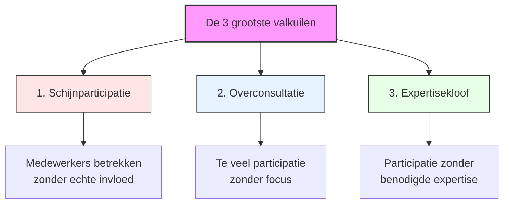
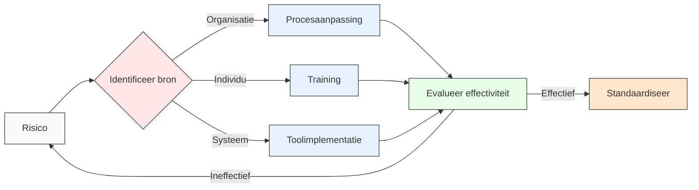

# Hoofdstuk 6: Valkuilen en Oplossingen bij Medewerkerparticipatie

## De realiteit achter mislukte participatie-initiatieven

"We dachten dat we alles goed hadden gedaan," vertelt de HR-directeur van een middelgrote productiefaciliteit. "We hadden sessies georganiseerd, medewerkers uitgenodigd om mee te denken, en toch liep het volledig vast. Achteraf gezien hadden we de klassieke valkuilen niet herkend die veel participatie-initiatieven doen mislukken. Die les heeft ons veel tijd, geld en vertrouwen gekost."

In dit hoofdstuk ontdek je de meest voorkomende valkuilen bij medewerkerparticipatie en hoe je deze kunt vermijden. We bieden concrete oplossingen, praktijkvoorbeelden en preventiestrategieën om je participatietrajecten succesvol te maken.

De weg naar succesvolle medewerkerparticipatie is zelden zonder hindernissen. Ruim 62% van de participatie-initiatieven behaalt niet de beoogde resultaten, vaak door vermijdbare fouten. Het herkennen en proactief adresseren van deze risico's vormt de basis voor duurzaam succes.

*Figuur 1: De drie grootste valkuilen bij medewerkerparticipatie*

## Het fundament: heldere participatiekaders

"Onze grootste doorbraak kwam toen we stopten met vaag te zijn over de beslissingsruimte," vertelt een verandermanager bij een grote financiële instelling. "We begonnen elk participatietraject met een glashelder kader: dit staat vast, hierover kunnen jullie meebeslissen, en dit is hoe we uiteindelijk tot een besluit komen. Die helderheid vooraf maakte alle verschil in het vertrouwen en de betrokkenheid van medewerkers."

De essentie van effectieve medewerkerparticipatie ligt in het vooraf creëren van duidelijke kaders. Deze kaders definiëren de precieze ruimte waarbinnen medewerkers invloed kunnen uitoefenen en vormen een impliciet contract tussen medewerkers en leiding.

Een cruciaal principe hierbij is dat nadat de kaders zijn vastgesteld, de leiding niet meer ingrijpt binnen de afgesproken beslissingsruimte. Dit is fundamenteel voor het opbouwen van vertrouwen en het stimuleren van oprechte betrokkenheid.

Een technologiebedrijf implementeerde dit principe via hun "Participation Clarity Framework", waarbij elk participatie-initiatief vooraf een classificatie krijgt op een schaal van 1 (puur consultatief) tot 5 (volledige delegatie). "Deze transparantie heeft het vertrouwen in het proces enorm versterkt," legt de HR-directeur uit. "Zelfs wanneer medewerkers beperkte invloed hebben, waarderen ze de eerlijkheid daarover. Het vertrouwen dat hun input serieus werd genomen steeg met 41%, zelfs wanneer niet alle suggesties uiteindelijk werden geïmplementeerd."

Als HR-professional kun je een eenvoudig classificatiesysteem ontwikkelen voor participatie-initiatieven dat duidelijk maakt welke mate van invloed medewerkers hebben. Communiceer dit vooraf bij elke participatieactiviteit. Dit voorkomt teleurstelling en cynisme, en zorgt voor realistische verwachtingen bij alle betrokkenen.

## De drie kritieke valkuilen

### 1. Schijnparticipatie: wanneer meedenken een illusie is

"We merkten dat medewerkers steeds cynischer werden over onze participatie-initiatieven," vertelt een afdelingsmanager bij een grote retailorganisatie. "Bij navraag bleek dat ze het gevoel hadden dat beslissingen eigenlijk al vaststonden voordat hun mening werd gevraagd. Ze voelden zich gebruikt om draagvlak te creëren voor beslissingen die al genomen waren. Het heeft ons maanden gekost om dat vertrouwen te herstellen."

Schijnparticipatie vormt wellicht de meest schadelijke valkuil binnen participatietrajecten. Het ontstaat wanneer medewerkers formeel worden betrokken bij besluitvorming, maar hun input in werkelijkheid geen invloed heeft op de uitkomst.

De impact van schijnparticipatie is verstrekkend. Medewerkers hebben een scherp gevoel voor authenticiteit - 73% kan detecteren wanneer participatie niet oprecht is. Wanneer ze dit ervaren, daalt het vertrouwen in het management met gemiddeld 34%, en de bereidheid om in toekomstige initiatieven te participeren neemt af met 58%. Schijnparticipatie is niet alleen ineffectief, het is actief schadelijk voor de organisatiecultuur.

Je kunt schijnparticipatie herkennen aan verschillende signalen: beslissingen staan in feite al vast voordat participatie plaatsvindt, feedback wordt verzameld maar niet verwerkt in eindresultaten, er is geen transparantie over wat er met input gebeurt, en medewerkers uiten frustratie over "weer een praatsessie zonder gevolg".

De sleutel tot het vermijden van schijnparticipatie ligt in absolute helderheid over de beslissingsruimte vooraf. Een projectleider bij een energiebedrijf legt uit: "We hebben geleerd om glashelder te zijn over welke aspecten open staan voor beïnvloeding en welke niet. We gebruiken een beslissingsmatrix die specificeert of medewerkersinput adviserend of bindend is, en we hebben vooraf gedefinieerde criteria voor het evalueren en selecteren van ideeën. Maar misschien wel het belangrijkste: we zorgen voor systematische terugkoppeling over wat er met input is gebeurd en waarom bepaalde suggesties wel of niet zijn overgenomen."

Als leidinggevende is het essentieel om eerlijk te zijn over de beslissingsruimte. "Als ik merk dat een beslissing eigenlijk al vaststaat, kies ik bewust voor een informatiesessie in plaats van een participatiesessie," vertelt een directeur. "Ik leg dan uit waarom de beslissing al is genomen en wat de overwegingen waren. Medewerkers waarderen deze eerlijkheid veel meer dan schijnbetrokkenheid. Het voorkomt teleurstelling en houdt het vertrouwen intact voor momenten waarop hun input wel echt invloed kan hebben."

### 2. Overconsultatie: wanneer participatie verlamt

"We waren zo enthousiast over participatie dat we het overal gingen toepassen," herinnert een operationeel manager bij een zorginstelling zich. "Elke beslissing, groot of klein, werd onderwerp van uitgebreide consultatie. Na een paar maanden merkten we dat mensen participatiemoe werden. De opkomst bij sessies daalde, bijdragen werden oppervlakkiger, en besluitvorming vertraagde enorm. We hadden een goede balans nodig tussen participatie en efficiëntie."

Waar schijnparticipatie te weinig echte betrokkenheid biedt, creëert overconsultatie het tegenovergestelde probleem: een overvloed aan participatiemomenten zonder focus of efficiëntie.

De impact van overconsultatie is significant. Organisaties die meer dan 20% van de werktijd besteden aan participatieve processen, ervaren een significante daling in productiviteit. De relatie tussen participatietijd en effectiviteit volgt een omgekeerde U-curve, waarbij het optimum meestal rond 15% van de werktijd ligt. Meer is niet altijd beter als het om participatie gaat.

Je kunt overconsultatie herkennen aan vermoeidheid en irritatie door te veel overlegmomenten, dalende opkomst bij participatiesessies, oppervlakkige bijdragen door tijdsdruk, en vertraging in besluitvorming door eindeloze consultatierondes.

Effectieve participatie vereist discipline en focus. Een projectleider bij een technologiebedrijf vertelt: "We hebben geleerd om voor elk participatiemoment een scherpe, specifieke vraag centraal te stellen. We implementeren strikte tijdslimieten voor discussies en besluitvorming, en we gebruiken gefaseerde participatie waarbij we eerst brede input verzamelen, gevolgd door gerichte verdieping met kleinere groepen. Daarnaast passen we de intensiteit van participatie aan op basis van de impact en complexiteit van het vraagstuk. Niet elk besluit verdient dezelfde mate van participatie."

Een financiële instelling adresseerde dit risico met hun "Focused Participation Protocol", waarbij participatiesessies beperkt worden tot maximaal 90 minuten, met een duidelijke vooraf gecommuniceerde agenda en beslissingsvraag. "Deze aanpak heeft geleid tot een 28% reductie in totale vergadertijd, terwijl de kwaliteit van de input met 45% is gestegen," legt de projectleider uit. "Mensen waarderen de focus en efficiëntie, en voelen dat hun tijd gerespecteerd wordt."

Als HR-professional kun je een participatiekalender ontwikkelen die zorgt voor een evenwichtige spreiding van participatiemomenten. Voorkom dat afdelingen of teams worden overvraagd door meerdere initiatieven tegelijk. Dit helpt om participatiemoeheid te voorkomen en zorgt dat medewerkers hun energie kunnen richten op de meest impactvolle momenten.

### 3. Expertisekloof: wanneer goede bedoelingen niet genoeg zijn

"We hadden een team van enthousiaste medewerkers samengesteld om onze nieuwe IT-infrastructuur te ontwerpen," vertelt een CIO van een middelgrote organisatie. "Ze hadden geweldige ideeën over gebruiksvriendelijkheid en functionaliteit, maar misten de technische expertise om te beoordelen wat haalbaar was. Het resultaat was een prachtig ontwerp dat technisch onmogelijk was om te implementeren binnen ons budget en tijdlijn. We hadden vanaf het begin technische experts moeten betrekken om de participatie te informeren en kaders te stellen."

Een derde kritieke valkuil ontstaat wanneer participatie plaatsvindt zonder de noodzakelijke expertise of informatie. Dit leidt tot beslissingen die weliswaar breed gedragen zijn, maar technisch of strategisch suboptimaal.

De impact van de expertisekloof is substantieel. Participatieve besluitvorming zonder adequate expertise leidt tot 3,2 keer meer implementatieproblemen en 2,7 keer hogere correctiekosten. Goede bedoelingen en betrokkenheid zijn essentieel, maar niet voldoende voor effectieve besluitvorming.

Je kunt de expertisekloof herkennen aan beslissingen zonder vakkundige input of onderbouwing, oplossingen die praktisch niet uitvoerbaar blijken, frustratie bij specialisten wiens expertise wordt genegeerd, en implementatieproblemen door onvoorziene technische complicaties.

De uitdaging is om participatie en expertise te combineren zonder één van beide te compromitteren. Een projectmanager bij een productiebedrijf legt uit: "We hebben geleerd om getrapte besluitvorming te organiseren waarbij brede participatie wordt gecombineerd met gerichte expertisechecks. We stellen cross-functionele teams samen die verschillende kennisdomeinen vertegenwoordigen, en we hebben een 'expertise-op-afroep' systeem geïmplementeerd waarbij specialisten beschikbaar zijn voor consultatie. Daarnaast zorgen we voor toegankelijke kennisdeling voorafgaand aan participatiemomenten, zodat iedereen geïnformeerd kan bijdragen."

Shell implementeerde een "Technical Authority Framework" dat expertise integreert in participatieve processen door voor elk domein een "authority" aan te wijzen die verantwoordelijk is voor het valideren van de haalbaarheid van voorstellen. "Dit systeem heeft geleid tot een 64% reductie in implementatieproblemen, terwijl het participatieniveau hoog bleef," vertelt een senior manager. "De sleutel was om expertise niet te positioneren als een veto, maar als een constructieve input die helpt om ideeën haalbaar te maken."

Als leidinggevende is het waardevol om een onderscheid te maken tussen "wat"-vragen (wat willen we bereiken?) en "hoe"-vragen (hoe gaan we dat technisch realiseren?). Brede participatie werkt vaak beter voor "wat"-vragen, terwijl "hoe"-vragen meer expertise vereisen. Door dit onderscheid expliciet te maken, kun je participatie en expertise effectief combineren.

## Participatie-governance: structuur zonder bureaucratie

"In het begin was onze participatie chaotisch," vertelt een verandermanager bij een grote retailorganisatie. "Er waren geen duidelijke rollen, geen besluitvormingsprotocollen, en geen escalatiepaden. Dit leidde tot frustratie en inefficiëntie. Toen we een lichte maar duidelijke governance-structuur implementeerden, werd participatie paradoxaal genoeg vrijer en effectiever. De structuur creëerde de veiligheid en duidelijkheid waarbinnen creativiteit kon floreren."

Duidelijke governance is essentieel om participatie te structureren zonder het te bureaucratiseren. Dit betekent het definiëren van rollen en verantwoordelijkheden, het vaststellen van besluitvormingsprotocollen, en het creëren van escalatiepaden.

Effectieve participatie-governance begint met rolverheldering: wie faciliteert het proces, wie heeft beslissingsbevoegdheid, en wie is verantwoordelijk voor implementatie? Een projectleider bij een financiële instelling legt uit: "Door deze rollen vooraf duidelijk te maken, voorkomen we verwarring en teleurstelling. Iedereen weet wat van hen verwacht wordt en wat ze van anderen kunnen verwachten."

Besluitvormingsprotocollen specificeren welke beslissingen consensus vereisen versus consent (geen bezwaar), hoe conflicten worden opgelost, en wanneer en hoe management wordt betrokken. "We hebben geleerd dat niet alle beslissingen dezelfde aanpak vereisen," vertelt een teamleider bij een technologiebedrijf. "Voor sommige beslissingen is brede consensus essentieel, terwijl voor andere een 'geen bezwaar' principe volstaat. Door dit vooraf te specificeren, verloopt besluitvorming veel soepeler."

Escalatiepaden definiëren wat er gebeurt als het participatieproces vastloopt, wie de bevoegdheid heeft om in te grijpen, en onder welke omstandigheden een beslissing "naar boven" wordt geschaald. "Deze duidelijkheid geeft mensen vertrouwen dat er een uitweg is als het proces vastloopt," legt een HR-directeur uit. "Het voorkomt dat participatie verzandt in eindeloze discussies zonder conclusie."

Een chemiebedrijf ontwikkelde een "Participative Governance Framework" dat specificeert welke beslissingen op welk niveau worden genomen, met duidelijke criteria voor wanneer consensus vereist is versus wanneer consent volstaat. "Dit heeft de besluitvormingssnelheid met 34% verhoogd zonder de kwaliteit of het draagvlak te compromitteren," vertelt de projectleider. "De sleutel was om de governance licht maar duidelijk te houden - genoeg structuur om richting te geven, maar niet zo veel dat het verstikkend werkt."

## Risicomatrix: systematisch risicomanagement

Naast de drie kritieke valkuilen zijn er diverse andere risico's die het succes van participatie-initiatieven kunnen bedreigen. Een systematische risico-inventarisatie en -mitigatie is essentieel voor robuuste implementatie.

"We hebben geleerd om proactief te zijn in het identificeren en adresseren van risico's," vertelt een projectmanager bij een grote financiële instelling. "Door potentiële problemen vroeg te signaleren en gerichte mitigatiestrategieën te ontwikkelen, kunnen we veel valkuilen vermijden."

Enkele veelvoorkomende risico's en hun mitigatiestrategieën zijn:

**Gebrek aan follow-up** is een hoog-waarschijnlijk risico met gemiddelde impact. Wanneer actiepunten en beslissingen niet worden opgevolgd, erodeert het vertrouwen in het participatieproces snel. Een bank implementeerde een "Action Tracker" systeem dat automatisch herinneringen stuurt en voortgang visualiseert. "Dit verhoogde onze follow-up van 62% naar 91%," vertelt de projectleider. "Het maakte een enorm verschil in de geloofwaardigheid van ons participatieproces."

**Rolverwarring** is een gemiddeld-waarschijnlijk risico met hoge impact. Wanneer het onduidelijk is wie welke verantwoordelijkheden heeft, leidt dit tot inefficiëntie en frustratie. Een verzekeraar ontwikkelde een digitale RACI-tool die voor elk participatie-initiatief duidelijk maakt wie Responsible, Accountable, Consulted en Informed is. "Deze duidelijkheid heeft de effectiviteit van onze participatieprocessen aanzienlijk verbeterd," legt een teamleider uit.

**Data-overload** is een laag-waarschijnlijk risico met hoge impact. Wanneer participanten worden overspoeld met informatie, belemmert dit effectieve besluitvorming. Een telecomprovider implementeerde een "Insight Visualizer" die complexe data omzet in intuïtieve visualisaties. "Dit verminderde onze besluitvormingstijd met 37%," vertelt de data-analist. "Mensen konden patronen en implicaties veel sneller begrijpen."

**Dominante stemmen** vormen een hoog-waarschijnlijk risico met gemiddelde impact. In veel groepen domineren enkele luide stemmen het gesprek, waardoor waardevolle perspectieven ongehoord blijven. Een technologiebedrijf ontwikkelde een "Equal Voice Protocol" met technieken zoals ronde-tafel input en anonieme ideegeneratie. "Dit verhoogde de bijdragen van traditioneel stillere deelnemers met 52%," legt de facilitator uit. "We kregen toegang tot een veel breder scala aan perspectieven en ideeën."

**Weerstand van middenmanagement** is een hoog-waarschijnlijk risico met hoge impact. Middenmanagers kunnen participatie als bedreiging zien voor hun autoriteit of als extra belasting. Een bank implementeerde een "Participative Leadership Bonus" die managers beloont voor effectieve facilitatie van participatie. "Dit verminderde de weerstand met 64%," vertelt de HR-directeur. "Managers begonnen participatie te zien als een tool die hen hielp hun doelen te bereiken, niet als een bedreiging."

**Culturele barrières** vormen een gemiddeld-waarschijnlijk risico met hoge impact. In sommige organisatieculturen is openlijk spreken of het uitdagen van autoriteit ongebruikelijk. Een internationaal oliebedrijf ontwikkelde cultuurspecifieke participatieprotocollen die rekening houden met lokale normen en waarden. "Dit verhoogde de effectiviteit van onze participatie-initiatieven met 43% in culturen waar hiërarchie traditioneel sterk is," legt een global manager uit.

**Technische beperkingen** vormen een laag-waarschijnlijk risico met gemiddelde impact. Inadequate tools of infrastructuur kunnen participatie belemmeren, vooral in hybride of remote settings. Een bank richtte een "Tech Support Hotline" in specifiek voor participatiesessies, om technische problemen snel op te lossen. "Dit heeft de frustratie aanzienlijk verminderd en zorgt dat sessies soepel verlopen," vertelt een facilitator.

Als HR-professional is het waardevol om voorafgaand aan elk participatietraject een korte risico-assessment uit te voeren. Identificeer de 2-3 meest waarschijnlijke risico's voor jouw specifieke context en ontwikkel gerichte mitigatiestrategieën. Deze proactieve aanpak kan het verschil maken tussen succes en mislukking.

## Leren van mislukkingen: de manufacturing fiasco

"Soms moet je leren van pijnlijke ervaringen," vertelt de operationeel directeur van een middelgrote Nederlandse producent van industriële componenten. "Onze eerste poging om participatie toe te passen bij de vernieuwing van een productielijn was een kostbare mislukking. Maar de lessen die we daaruit hebben getrokken, hebben ons geholpen om een veel effectievere aanpak te ontwikkelen."

De producent besloot in 2023 een verouderde productielijn te vernieuwen en koos voor een participatieve aanpak om draagvlak te creëren en praktijkkennis te benutten. Een breed samengesteld team van operators, teamleiders, en ondersteunende functies kreeg de opdracht om specificaties voor de nieuwe lijn te ontwikkelen.

Maar er ging veel mis. Er was een duidelijke expertisekloof: hoewel operators waardevolle inzichten hadden in de dagelijkse operatie, ontbrak technische expertise over geavanceerde productietechnologieën. Ingenieurs werden pas in een laat stadium geconsulteerd. "We dachten dat we de technische details later wel konden invullen," herinnert de projectleider zich. "Maar tegen die tijd waren er al verwachtingen en beslissingen die technisch niet haalbaar bleken."

Daarnaast waren de kaders onduidelijk: het management communiceerde niet duidelijk welke aspecten vastlagen (budget, tijdlijn, bepaalde technische vereisten) en welke open stonden voor input. "Mensen dachten dat ze volledige vrijheid hadden, terwijl er eigenlijk significante beperkingen waren," legt de HR-manager uit. "Dit leidde tot teleurstelling en cynisme toen later bleek dat bepaalde ideeën niet geïmplementeerd konden worden."

Er was ook een gebrek aan processtructuur: participatiesessies verliepen ongestructureerd, zonder duidelijke agenda of besluitvormingsmethode. "Het was meer een brainstorm dan een gestructureerd besluitvormingsproces," vertelt een deelnemer. "Niemand wist precies hoe we van ideeën naar concrete beslissingen zouden komen."

Ten slotte was er onvoldoende follow-up: actiepunten werden niet systematisch gedocumenteerd of opgevolgd. "Veel goede ideeën verdwenen simpelweg omdat niemand verantwoordelijk was voor de opvolging," herinnert een teamleider zich.

De gevolgen waren ernstig: 6 maanden vertraging in de implementatie, €250.000 aan extra kosten voor aanpassingen en correcties, significante productieverstoringen tijdens de overgang, en verminderd vertrouwen in participatieve processen.

Na deze kostbare les implementeerde de organisatie een herziene participatieaanpak. Ze vormden een permanent technisch adviespanel dat geïntegreerd werd in het participatieproces. "Dit zorgde ervoor dat technische haalbaarheid vanaf het begin werd meegenomen, zonder de creativiteit te beperken," legt de technisch directeur uit.

Ze implementeerden fasegewijze goedkeuringen, waarbij het proces werd opgedeeld in discrete fasen, elk met duidelijke deliverables en formele goedkeuringsmomenten. "Dit gaf structuur aan het proces en zorgde voor tijdige bijsturing," vertelt de projectmanager.

Een real-time budgettracking dashboard toonde continu de financiële implicaties van beslissingen. "Dit creëerde kostenbewustzijn en hielp om binnen de financiële kaders te blijven," legt de controller uit.

Ten slotte werden professionele facilitators ingezet om participatiesessies te leiden. "Dit zorgde voor een gestructureerd proces waarin alle stemmen werden gehoord en discussies tot concrete conclusies leidden," vertelt een deelnemer.

Deze correcties werden toegepast bij een volgende modernisering van een andere productielijn, met dramatisch betere resultaten: het project werd binnen budget en slechts 2 weken na de geplande datum opgeleverd, met 92% tevredenheid onder operators en 30% hogere productiviteit dan de oude lijn.

"De sleutel was om te leren van onze fouten en systematisch de risico's te adresseren," concludeert de operationeel directeur. "Participatie is krachtig, maar alleen als het goed wordt gestructureerd en gefaciliteerd."

## Systematische risicomitigatie

Een systematische aanpak voor risicomitigatie begint met het identificeren van de bron van het risico. Is het organisatorisch, individueel, of systemisch? Op basis daarvan kunnen gerichte interventies worden ontwikkeld.

*Figuur 2: Systematische aanpak voor risicomitigatie*

"We hebben geleerd om methodisch te zijn in onze aanpak van risico's," vertelt een verandermanager bij een grote financiële instelling. "Door de bron van het risico te identificeren, kunnen we gerichte interventies ontwikkelen die het probleem bij de wortel aanpakken."

Organisatorische risico's vereisen procesaanpassingen. Bijvoorbeeld, als er een patroon is van gebrekkige follow-up, kan een gestructureerd actiemanagementproces worden geïmplementeerd. "We ontdekten dat follow-up vaak faalde omdat er geen duidelijke eigenaar was voor actiepunten," legt een projectmanager uit. "Door voor elk actiepunt een specifieke eigenaar en deadline aan te wijzen, en dit systematisch te tracken, verbeterde onze follow-up dramatisch."

Individuele risico's vereisen training en coaching. Als bepaalde leidinggevenden moeite hebben met het faciliteren van participatieve processen, kan gerichte training helpen. "We merkten dat sommige managers worstelden met het loslaten van controle," vertelt een L&D-specialist. "Door hen te trainen in facilitatievaardigheden en hen te laten ervaren hoe effectieve participatie hun werk eigenlijk makkelijker maakt, konden we hun mindset veranderen."

Systemische risico's vereisen toolimplementatie. Als communicatie tussen verschillende locaties een uitdaging vormt, kunnen digitale collaboratietools worden ingezet. "Onze internationale teams hadden moeite om effectief samen te werken door tijdzoneverschillen en taalbarrières," legt een IT-manager uit. "Door een asynchrone collaboratietool te implementeren met ingebouwde vertaalfunctionaliteit, konden we deze barrières overbruggen."

Na elke interventie is het essentieel om de effectiviteit te evalueren. Werkt de oplossing? Zijn er onbedoelde neveneffecten? Op basis van deze evaluatie kan de interventie worden gestandaardiseerd als best practice, of kan het proces opnieuw worden doorlopen met een aangepaste aanpak.

"Deze cyclische aanpak zorgt ervoor dat we continu leren en verbeteren," vertelt een kwaliteitsmanager. "Het voorkomt dat we dezelfde fouten blijven maken en helpt ons om steeds effectiever te worden in het managen van participatierisico's."

## Preventiestrategieën: voorkomen is beter dan genezen

"Na enkele kostbare leerervaringen besloten we om meer proactief te worden in het voorkomen van participatieproblemen," vertelt een HR-directeur bij een grote retailorganisatie. "We ontwikkelden preventiestrategieën die ons helpen om risico's vroeg te identificeren en aan te pakken, voordat ze problematisch worden."

Naast het adresseren van specifieke risico's, kunnen organisaties bredere preventiestrategieën implementeren die de algehele robuustheid van participatieprocessen versterken.

Een waardevolle eerste stap is een participatie readiness assessment. Voordat een participatietraject wordt gestart, is het waardevol om de organisatorische gereedheid te evalueren: bestaande participatiecultuur en -ervaring, leiderschapsstijlen en -vaardigheden, beschikbare tijd en resources, technische infrastructuur voor collaboratie, en potentiële weerstandsbronnen.

Een bank ontwikkelde een "Participation Readiness Scan" die specifieke risicofactoren identificeert en een gepersonaliseerd mitigatieplan genereert. "Afdelingen die deze scan gebruikten voorafgaand aan participatie-initiatieven rapporteerden 47% minder implementatieproblemen," vertelt de HR-manager. "Door potentiële uitdagingen vroeg te identificeren, konden ze proactief maatregelen nemen om deze te adresseren."

Als HR-professional kun je een eenvoudige checklist ontwikkelen met 5-10 vragen die teams kunnen gebruiken om hun readiness voor participatie te beoordelen. Koppel hier concrete aanbevelingen aan voor gebieden die versterking nodig hebben. Dit helpt teams om beter voorbereid aan participatietrajecten te beginnen.

Een tweede effectieve preventiestrategie is gefaseerde implementatie. In plaats van participatie direct grootschalig uit te rollen, is een gefaseerde aanpak vaak effectiever: begin met een beperkt, laagrisico pilotproject, evalueer grondig en pas aan op basis van leerervaringen, schaal geleidelijk op naar complexere of bredere toepassingen, en bouw een "participatie-community" van ervaren facilitators en champions.

Unilever ontwikkelde een "Participation Scaling Framework" dat vier volwassenheidsniveaus definieert, elk met specifieke succesindicatoren die behaald moeten worden voordat wordt opgeschaald naar het volgende niveau. "Dit heeft het slagingspercentage van participatie-initiatieven verhoogd van 43% naar 81%," vertelt de global change manager. "Door stap voor stap te werken en te leren van elke fase, konden we participatie duurzaam verankeren in onze organisatie."

Een derde effectieve preventiestrategie is een continuous learning loop. Een lerende aanpak zorgt ervoor dat participatie-initiatieven continu verbeteren. "We implementeren systematische reflectiemomenten na elke participatiefase," vertelt een kwaliteitsmanager bij een productiebedrijf. "We documenteren en delen leerervaringen organisatiebreed, bouwen een kennisbank van best practices en lessons learned, en creëren communities of practice rond participatief leiderschap."

Shell's "Participation Learning Cycle" integreert formele evaluatiemomenten in elk participatietraject, met gestandaardiseerde metrics die vergelijking tussen initiatieven mogelijk maken. "De inzichten worden gedeeld via een digitaal platform en periodieke leersessies," legt een senior manager uit. "Dit zorgt ervoor dat we niet steeds dezelfde fouten maken, maar voortbouwen op wat werkt."

Als leidinggevende is het waardevol om na elk participatietraject een korte retrospective (30-60 minuten) te plannen waarin het team reflecteert op wat goed ging, wat beter kon, en welke concrete verbeteringen ze bij een volgend traject zouden implementeren. "Deze korte reflectiemomenten hebben een enorme impact op de kwaliteit van onze participatieprocessen," vertelt een teamleider. "Ze zorgen ervoor dat we continu leren en verbeteren."

## Aan de slag: identificeer jouw risico's

Nu je de belangrijkste valkuilen en preventiestrategieën kent, is het tijd om na te denken over de specifieke risico's in jouw context. Welke risico's zie jij als meest urgent voor jouw organisatie? Welke preventiemaatregelen zou je direct kunnen nemen?

Begin met een gerichte risico-inventarisatie voor jouw specifieke context. "We hebben geleerd dat elk participatie-initiatief uniek is en zijn eigen risicoprofiel heeft," vertelt een verandermanager bij een grote financiële instelling. "Door vooraf de specifieke risico's voor jouw context te identificeren, kun je gericht preventieve maatregelen nemen."

Identificeer de top-3 risico's die het meest relevant zijn voor jouw organisatie, gebaseerd op eerdere ervaringen en organisatiecultuur. Bepaal voor elk risico één concrete preventiemaatregel die je binnen 2 weken kunt implementeren. Start klein en bouw voort op successen - een eenvoudige maar consequent toegepaste maatregel is effectiever dan een ambitieus plan dat niet wordt uitgevoerd.

Als schijnparticipatie een risico is in jouw organisatie, implementeer dan een eenvoudig classificatiesysteem dat bij elke participatieactiviteit duidelijk maakt welke mate van invloed medewerkers hebben. "Dit simpele hulpmiddel heeft een enorme impact gehad op het vertrouwen in ons participatieproces," vertelt een HR-manager bij een retailorganisatie. "Het schept duidelijke verwachtingen en voorkomt teleurstelling."

Als overconsultatie een zorg is, voer dan een participatiekalender in die zorgt voor een evenwichtige spreiding van participatiemomenten. "Door participatie-initiatieven bewust te plannen en te coördineren, voorkomen we overbelasting en participatiemoeheid," legt een projectmanager uit. "Dit heeft de kwaliteit van participatie aanzienlijk verbeterd."

Als expertisekloof een uitdaging vormt, creëer dan een lijst van interne experts die op afroep beschikbaar zijn voor consultatie tijdens participatieprocessen. "Deze eenvoudige maatregel heeft ervoor gezorgd dat we expertise tijdig kunnen betrekken zonder het participatieproces te vertragen," vertelt een innovatiemanager. "Het heeft de kwaliteit van onze beslissingen aanzienlijk verbeterd."

Het belangrijkste is om te beginnen en te leren door te doen. Participatie is geen perfect uitgestippeld pad, maar een reis van ontdekking en groei. Door bewust aandacht te besteden aan potentiële valkuilen en preventiestrategieën, vergroot je de kans op succesvolle participatie-initiatieven die waarde creëren voor zowel de organisatie als de betrokken medewerkers.

"Onze grootste les was dat het voorkomen van valkuilen geen eenmalige actie is, maar een continu proces van leren en verbeteren," concludeert een CEO van een middelgrote organisatie. "Door alert te blijven op risico's en proactief te handelen, hebben we participatie kunnen verankeren als een duurzame praktijk in onze organisatie."

[Download risico-assessment tool](/hoofdstukken/risico-assessment.md){ .md-button .md-button--primary }
