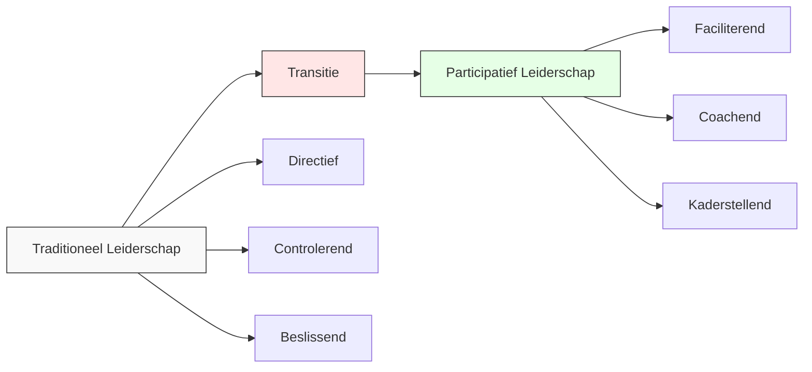
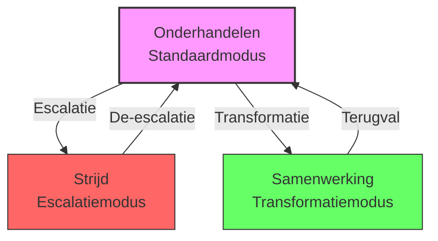
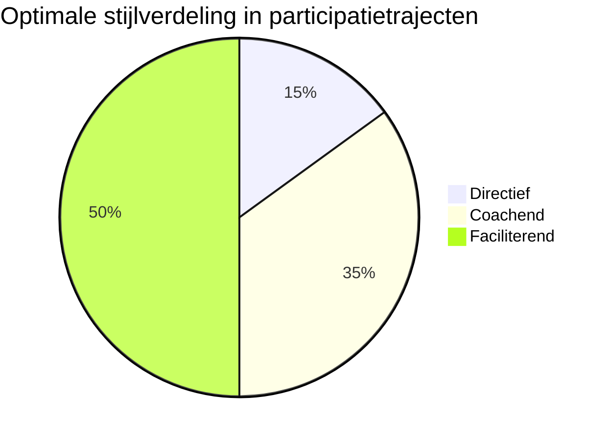
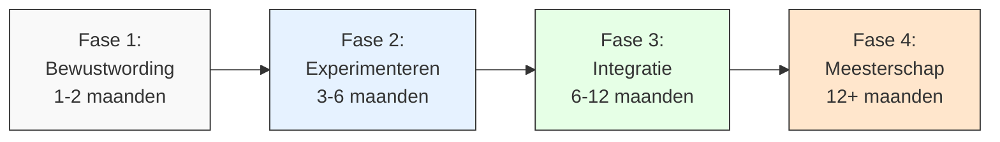

# Hoofdstuk 7: De Rol van de Leidinggevende

## De transformatie van leiderschap in participatieve organisaties

"Ik dacht dat ik een goede leider was omdat ik altijd duidelijke richting gaf en beslissingen nam," vertelt een afdelingsmanager bij een grote financiële instelling. "Maar toen we begonnen met medewerkerparticipatie, realiseerde ik me dat ik eigenlijk in de weg stond. Ik moest leren om minder te praten en meer te luisteren, minder te beslissen en meer te faciliteren. Het was een fundamentele verschuiving in mijn identiteit als leider."

In dit hoofdstuk ontdek je welke leiderschapsvaardigheden essentieel zijn voor succesvolle medewerkerparticipatie. We kijken naar de kerncompetenties van participatief leiderschap, verschillende leiderschapsstijlen, en hoe je deze vaardigheden stap voor stap kunt ontwikkelen.

De transitie naar een participatieve organisatie vereist een fundamentele verschuiving in de rol van leidinggevenden. Waar traditioneel leiderschap vaak draait om directieve sturing en controle, vraagt participatief leiderschap om een andere mindset en vaardighedenset. Leidinggevenden die deze transitie succesvol maken, zijn drie keer effectiever in het implementeren van organisatieveranderingen, behalen twee keer hogere medewerkerstevredenheidsscores, en stimuleren significant meer innovatie en creativiteit in hun teams.

*Figuur 1: De transitie van traditioneel naar participatief leiderschap*

## Drie kerncompetenties voor participatief leiderschap

### 1. Faciliterend leiderschap: de kunst van het mogelijk maken

"Mijn grootste uitdaging was om te stoppen met het geven van antwoorden," vertelt een directeur van een middelgrote productiefaciliteit. "Ik was gewend om de expert te zijn, degene met de oplossingen. Maar ik ontdekte dat wanneer ik een stap terug deed en de juiste vragen stelde in plaats van antwoorden te geven, er veel betere ideeën naar boven kwamen. Mijn rol veranderde van beslisser naar facilitator, en dat maakte alle verschil."

De kern van participatief leiderschap is de verschuiving van "leider als beslisser" naar "leider als facilitator". Deze faciliterende rol omvat drie kritieke elementen: het creëren van psychologische veiligheid, het vinden van balans tussen sturen en loslaten, en het ontwikkelen van conflictmediatievaardigheden.

#### De fundamentele voorwaarde: psychologische veiligheid

Psychologische veiligheid - het gevoel dat men zich kwetsbaar kan opstellen zonder negatieve consequenties - is de fundamentele voorwaarde voor oprechte participatie. Teams met hoge psychologische veiligheid genereren significant meer innovatieve ideeën en zijn effectiever in probleemoplossing.

Een HR-directeur bij een grote retailorganisatie legt uit: "We ontdekten dat de kwaliteit van participatie direct gekoppeld was aan de mate van psychologische veiligheid in teams. Waar mensen zich vrij voelden om risico's te nemen en eerlijk te zijn, zagen we veel meer creativiteit en betrokkenheid. Waar die veiligheid ontbrak, bleef participatie oppervlakkig en voorzichtig."

Er zijn vier praktische gedragsprincipes die leidinggevenden kunnen toepassen om psychologische veiligheid te versterken. Ten eerste, modelleer kwetsbaarheid door eigen fouten te erkennen. "Toen ik als directeur openlijk toegaf dat mijn strategie niet had gewerkt en deelde wat ik daarvan had geleerd, veranderde de dynamiek in het team volledig," vertelt een CEO. "Mensen begonnen ook hun eigen fouten en leermomenten te delen, wat leidde tot veel diepere gesprekken en betere beslissingen."

Ten tweede, reageer nieuwsgierig op afwijkende meningen. Een teamleider bij een technologiebedrijf vertelt: "Ik heb geleerd om 'Interessant, vertel me meer' te zeggen wanneer iemand een mening uit die afwijkt van de consensus. Dit simpele zinnetje opent de deur voor diepere verkenning en laat zien dat verschillende perspectieven gewaardeerd worden."

Ten derde, luister actief zonder direct te oordelen. "De kunst van het luisteren is misschien wel de belangrijkste leiderschapsvaardigheid," legt een senior manager uit. "Niet het soort luisteren waarbij je wacht tot je kunt reageren, maar echt luisteren met de intentie om te begrijpen. Dit betekent soms comfortabel zijn met stilte, doorvragen, en je eigen oordelen opschorten."

Ten vierde, frame feedback als een gezamenlijke zoektocht naar verbetering. "De manier waarop je feedback geeft, bepaalt hoe veilig mensen zich voelen," vertelt een teamcoach. "Wanneer je feedback presenteert als een gezamenlijke verkenning in plaats van een eenzijdig oordeel, creëer je een omgeving waarin mensen open staan voor groei en verbetering."

Een financiële instelling trainde leidinggevenden in deze vier gedragsprincipes, wat leidde tot een significante stijging in het aantal gerapporteerde verbetervoorstellen. "Het was verbazingwekkend om te zien hoe snel de cultuur veranderde toen leidinggevenden consequent deze principes toepasten," vertelt de L&D-manager. "Binnen drie maanden zagen we een verdubbeling van het aantal ideeën dat medewerkers inbrachten."

Als leidinggevende kun je elke participatiesessie beginnen met een korte check-in waarin je expliciet benoemt dat alle ideeën en perspectieven welkom zijn. Reageer consistent positief op bijdragen, zelfs als ze uitdagend of kritisch zijn. "Deze kleine interventie zet de toon voor de hele sessie," legt een facilitator uit. "Het creëert een container van veiligheid waarin mensen zich vrij voelen om hun echte gedachten te delen."

#### De delicate balans: sturen en loslaten

Effectieve participatieve leiders vinden een delicate balans tussen kaders stellen en ruimte geven. Ze definiëren duidelijke grenzen en verwachtingen, maar laten binnen die grenzen maximale autonomie toe.

"In het begin was ik bang dat participatie betekende dat ik alle controle moest opgeven," herinnert een operationeel manager zich. "Maar ik ontdekte dat het eigenlijk gaat om het creëren van een speelveld met duidelijke grenzen, waarbinnen mensen maximale vrijheid hebben. Dit gaf mij als leider eigenlijk meer controle over wat echt belangrijk was, terwijl het team de ruimte had om te bepalen hoe ze binnen die kaders opereerden."

Er zijn vier praktische toepassingen van deze balans. Ten eerste, wees duidelijk over niet-onderhandelbare randvoorwaarden zoals budget, tijdlijn, en wettelijke vereisten. "Transparantie over de kaders is essentieel," legt een projectmanager uit. "Door vanaf het begin duidelijk te maken wat de niet-onderhandelbare elementen zijn, voorkom je teleurstelling en frustratie later in het proces."

Ten tweede, specificeer het gewenste eindresultaat, niet de weg ernaartoe. "Ik heb geleerd om de 'wat' te definiëren en het team de 'hoe' te laten bepalen," vertelt een afdelingshoofd. "Dit geeft richting zonder creativiteit te beperken, en leidt vaak tot oplossingen die ik zelf nooit had bedacht."

Ten derde, pas je stijl aan op basis van de situatie en de ontwikkelingsfase van je team. "Verschillende teams hebben verschillende niveaus van ondersteuning nodig," legt een HR-directeur uit. "Een nieuw team heeft mogelijk meer structuur en begeleiding nodig, terwijl een ervaren team meer autonomie aankan. De kunst is om je stijl aan te passen aan wat het team op dat moment nodig heeft."

Ten vierde, wees consistent in principes, maar flexibel in de toepassing. "Participatief leiderschap betekent niet dat je altijd dezelfde aanpak gebruikt," vertelt een CEO. "Het betekent dat je consistent bent in je commitment aan participatie, maar flexibel in hoe je dit toepast in verschillende situaties."

Een technologiebedrijf ontwikkelde een raamwerk dat specificeert wanneer verschillende leiderschapsstijlen passend zijn: directief bij crisis of veiligheidskwesties, coachend bij ontwikkeling van nieuwe vaardigheden, en faciliterend bij innovatie en procesverbetering. "Dit raamwerk heeft onze leiders geholpen om bewuster te schakelen tussen verschillende stijlen, afhankelijk van wat de situatie vereist," legt de HR-directeur uit. "Het heeft de effectiviteit van ons leiderschap aanzienlijk verbeterd."

#### De uitdaging van verschillen: conflictmediatievaardigheden

Participatie leidt onvermijdelijk tot het zichtbaar worden van verschillende perspectieven en belangen. De vaardigheid om deze verschillen productief te maken in plaats van destructief, is essentieel voor participatief leiderschap.

"In het begin was ik bang voor conflict," vertelt een teamleider bij een zorginstelling. "Ik zag verschillende meningen als een probleem dat opgelost moest worden. Maar ik heb geleerd dat juist in die verschillen de grootste waarde zit. De kunst is om die verschillen productief te maken in plaats van ze te vermijden of glad te strijken."

In de interactie tussen leidinggevenden en medewerkers kunnen drie fundamentele relatiepatronen worden onderscheiden: onderhandelen, strijd, en samenwerking.

*Figuur 2: De drie interactiepatronen tussen leiding en medewerkers*

In veel organisaties is onderhandelen de default interactiemodus. Beide partijen zien elkaar als tegenspelers met deels overlappende, deels conflicterende belangen. De focus ligt op posities en compromissen, er zijn impliciete of expliciete ruilrelaties ("als jij X doet, dan krijg je Y"), en er is strategisch informatiemanagement (niet alle kaarten op tafel). Het resultaat is vaak suboptimale oplossingen die niemand volledig tevreden stellen.

"Onderhandelen was onze standaardmodus," vertelt een HR-directeur bij een financiële instelling. "Medewerkers kwamen met een voorstel, management kwam met een tegenvoorstel, en we eindigden ergens in het midden. Het voelde als een zero-sum game waarin niemand echt kreeg wat ze wilden."

Wanneer onderhandelen vastloopt, kan de relatie escaleren naar strijd. De focus verschuift naar winnen ten koste van de ander, standpunten verharden, en er kunnen persoonlijke aanvallen en defensieve reacties ontstaan. Het resultaat is beschadigde relaties en verlies van vertrouwen.

"We hebben periodes gehad waarin de relatie tussen management en medewerkers echt vijandig werd," herinnert een vakbondsvertegenwoordiger zich. "Beide partijen waren zo gefocust op het verdedigen van hun positie dat ze het gemeenschappelijke doel uit het oog verloren. Het kostte maanden om het vertrouwen te herstellen."

De meest productieve maar ook meest uitdagende relatievorm is samenwerking. Hier ligt de focus op gezamenlijke probleemoplossing, er is transparante uitwisseling van informatie en perspectieven, en er is exploratie van onderliggende belangen in plaats van posities. Het resultaat is innovatieve oplossingen die voor alle partijen meerwaarde creëren.

"De doorbraak kwam toen we stopten met onderhandelen en begonnen met echt samenwerken," vertelt een directeur. "We creëerden een proces waarin we eerst de onderliggende belangen van alle partijen verkenden, voordat we over oplossingen begonnen te praten. Dit leidde tot veel creatievere oplossingen die voor iedereen waarde creëerden."

Er zijn vier vaardigheden die leidinggevenden kunnen ontwikkelen om de transformatie naar samenwerking te faciliteren. Ten eerste, belangen identificeren: kijk voorbij posities naar de onderliggende behoeften, zorgen en aspiraties van alle betrokkenen. "De sleutel is om te vragen 'waarom is dit belangrijk voor je?' in plaats van te blijven hangen in 'wat wil je?'," legt een mediator uit. "Dit opent de deur naar veel meer mogelijkheden."

Ten tweede, gemeenschappelijke doelen articuleren: formuleer overkoepelende doelen die individuele belangen overstijgen. "Door te focussen op wat we samen willen bereiken, creëren we een context waarin samenwerking natuurlijker wordt," vertelt een teamleider. "Het verschuift de aandacht van 'mijn belang versus jouw belang' naar 'ons gezamenlijke doel'."

Ten derde, procesontwerp: creëer interactieprocessen die samenwerking faciliteren in plaats van competitie aanmoedigen. "De manier waarop je een gesprek structureert, bepaalt in hoge mate de uitkomst," legt een facilitator uit. "Door bewust processen te ontwerpen die verschillende perspectieven waarderen en integreren, creëer je de voorwaarden voor echte samenwerking."

Ten vierde, vertrouwen opbouwen: vertoon consistent betrouwbaar gedrag en bevorder transparantie. "Vertrouwen is de valuta van samenwerking," vertelt een CEO. "Het wordt opgebouwd door kleine, consistente acties die laten zien dat je betrouwbaar bent en het beste voorhebt met alle betrokkenen."

Een energiebedrijf implementeerde dit model in hun leiderschapsontwikkelingsprogramma, waarbij leidinggevenden leerden om bewust te schakelen van onderhandelen naar samenwerken. "Dit resulteerde in 42% meer constructieve uitkomsten van teamconflicten en significant snellere besluitvorming bij complexe vraagstukken," vertelt de L&D-manager. "Leidinggevenden rapporteerden ook een veel hogere tevredenheid met hun rol, omdat ze minder tijd besteedden aan het managen van conflicten en meer aan het faciliteren van echte vooruitgang."

Als HR-professional kun je een korte training ontwikkelen voor leidinggevenden over het herkennen van en omgaan met deze drie interactiepatronen. Focus op concrete technieken om van onderhandelen naar samenwerking te bewegen. "Deze training was een eye-opener voor onze managers," vertelt een HR-directeur. "Ze begonnen patronen te herkennen in hun interacties en ontwikkelden vaardigheden om bewust naar samenwerking te bewegen wanneer dat waardevol was."

### 2. Besluitvormingsarchitectuur: de structuur van participatie

"We dachten dat participatie betekende dat iedereen over alles moest meebeslissen," vertelt een operationeel directeur bij een productiebedrijf. "Het resultaat was eindeloze vergaderingen, vertraagde besluitvorming, en uiteindelijk frustratie bij zowel management als medewerkers. We leerden dat effectieve participatie juist vraagt om een duidelijke besluitvormingsarchitectuur - een raamwerk dat specificeert wie, wanneer, en hoe betrokken wordt bij verschillende soorten beslissingen."

Participatief leiderschap vereist niet alleen interpersoonlijke vaardigheden, maar ook het vermogen om besluitvormingsprocessen zodanig te structureren dat ze participatie faciliteren zonder te verzanden in eindeloze discussies of onduidelijke verantwoordelijkheden.

#### De kunst van differentiatie: beslisniveaus bepalen

Niet alle beslissingen lenen zich voor dezelfde mate van participatie. Effectieve leiders maken expliciet onderscheid tussen verschillende besluitvormingsniveaus en communiceren dit transparant.

"De doorbraak kwam toen we stopten met het behandelen van alle beslissingen als gelijk," vertelt een afdelingsmanager bij een financiële instelling. "We ontwikkelden een raamwerk dat duidelijk maakte welke beslissingen puur informatief waren, welke consultatief, en welke echt participatief. Dit creëerde duidelijkheid en voorkwam teleurstelling."

Er zijn vier besluitvormingsniveaus die leidinggevenden kunnen onderscheiden. Het eerste niveau is informeren: de beslissing is genomen en wordt alleen gecommuniceerd. Dit is passend bij niet-onderhandelbare zaken zoals wettelijke vereisten of veiligheid. "Het is belangrijk om duidelijk uit te leggen waarom bepaalde beslissingen niet participatief kunnen zijn," legt een compliance officer uit. "Wanneer mensen de rationale begrijpen, accepteren ze het meestal wel dat ze hier geen invloed op hebben."

Het tweede niveau is consulteren: input wordt gevraagd maar is niet bindend. Dit is passend bij beslissingen die expertise vereisen maar waar gebruikersperspectief waardevol is. "We vragen actief input van medewerkers over hoe we bepaalde regelgeving kunnen implementeren," vertelt een kwaliteitsmanager. "Hun praktijkervaring is onmisbaar, ook al ligt de uiteindelijke beslissing bij het management vanwege compliance-verantwoordelijkheden."

Het derde niveau is consenteren: de beslissing wordt genomen tenzij er zwaarwegende bezwaren zijn. Dit is passend bij beslissingen met brede impact waar draagvlak essentieel is. "Dit model heeft onze besluitvorming enorm versneld," vertelt een projectmanager. "In plaats van te streven naar unanimiteit, gaan we door tenzij iemand een fundamenteel bezwaar heeft dat de beslissing onwerkbaar zou maken. Dit voorkomt dat één persoon het proces kan blokkeren zonder goede reden."

Het vierde niveau is consensus: actieve instemming van alle betrokkenen is vereist. Dit is passend bij fundamentele beslissingen die volledige commitment vereisen. "Voor strategische beslissingen die het hart van onze organisatie raken, nemen we de tijd om echte consensus te bereiken," legt een directeur uit. "Het kost meer tijd aan de voorkant, maar bespaart enorm veel tijd in de implementatie omdat iedereen volledig gecommitteerd is."

Een coöperatieve bank die dit model implementeerde, rapporteerde een significante reductie in frustratie over besluitvormingsprocessen. "Medewerkers waardeerden de transparantie over welk type besluitvorming van toepassing was, zelfs wanneer ze niet de volledige beslissingsbevoegdheid hadden," vertelt de HR-directeur. "Het creëerde realistische verwachtingen en voorkwam teleurstelling."

#### De veiligheidsklep: escalatieprocedures ontwerpen

Zelfs de best ontworpen participatieve processen kunnen vastlopen. Effectieve leiders creëren duidelijke paden voor wanneer dit gebeurt, zodat impasses niet leiden tot verlamming of terugval naar autoritaire besluitvorming.

"We hadden een participatief proces dat volledig vastliep omdat twee afdelingen fundamenteel verschillende visies hadden," herinnert een projectleider zich. "Zonder een duidelijk escalatiepad had dit het einde van het project kunnen betekenen. Maar omdat we vooraf hadden afgesproken hoe we met zulke situaties zouden omgaan, konden we het proces weer vlot trekken zonder terug te vallen in top-down besluitvorming."

Een effectieve escalatieprocedure bevat vier elementen. Ten eerste, specifieke criteria voor wanneer een beslissing geëscaleerd moet worden. "We hebben duidelijke triggers gedefinieerd, zoals wanneer een beslissing meer dan twee weken vertraagd is of wanneer er fundamentele onenigheid is over de richting," legt een programmamanager uit. "Dit voorkomt dat escalatie een kwestie van persoonlijke voorkeur wordt."

Ten tweede, duidelijkheid over wie betrokken wordt bij verschillende escalatieniveaus. "We hebben een getrapt systeem waarbij eerst het team zelf, dan de direct leidinggevende, en pas in laatste instantie het senior management betrokken wordt," vertelt een HR-manager. "Dit zorgt ervoor dat beslissingen zo dicht mogelijk bij het werk blijven."

Ten derde, concrete tijdslijnen voor elk escalatieniveau. "We hebben afgesproken dat elk niveau maximaal een week heeft om tot een besluit te komen," legt een projectleider uit. "Dit voorkomt dat het proces eindeloos voortduurt en creëert een gezonde druk om tot oplossingen te komen."

Ten vierde, transparante communicatie over het proces en de uitkomst. "Wanneer een beslissing geëscaleerd wordt, communiceren we dit breed, inclusief de rationale en het verwachte tijdspad," vertelt een communicatiemanager. "Dit voorkomt geruchten en zorgt dat iedereen op dezelfde pagina blijft."

Bij een internationale financiële instelling heeft een dergelijk raamwerk de gemiddelde tijd om tot een besluit te komen bij complexe vraagstukken significant verminderd. "Voorheen konden beslissingen weken of zelfs maanden vastlopen in eindeloze discussies," vertelt de COO. "Nu hebben we een duidelijk pad om uit impasses te komen, wat de besluitvormingssnelheid aanzienlijk heeft verhoogd zonder de kwaliteit te compromitteren."

#### De cirkel sluiten: transparante terugkoppeling garanderen

De cirkel van participatie wordt pas echt gesloten wanneer deelnemers zien wat er met hun input gebeurt. Effectieve leiders zorgen voor systematische terugkoppeling, zelfs - of juist - wanneer niet alle suggesties worden overgenomen.

"De grootste klacht die we hoorden over eerdere participatie-initiatieven was: 'We geven input, maar horen nooit wat ermee gebeurt'," vertelt een HR-directeur. "Dit creëerde cynisme en verminderde de bereidheid om in de toekomst bij te dragen. Door systematische terugkoppeling te implementeren, hebben we dit patroon doorbroken."

Effectieve terugkoppeling heeft vier elementen. Ten eerste, tijdigheid: binnen een vooraf afgesproken termijn. "We hebben de regel dat binnen twee weken na een participatiesessie terugkoppeling moet worden gegeven," legt een projectmanager uit. "Dit houdt het momentum vast en toont respect voor de tijd die mensen hebben geïnvesteerd."

Ten tweede, volledigheid: alle ontvangen input wordt geadresseerd. "We zorgen ervoor dat elke suggestie, hoe klein ook, erkenning krijgt," vertelt een teamleider. "Dit laat zien dat we alle bijdragen serieus nemen, niet alleen de grote ideeën."

Ten derde, specificiteit: concrete uitleg waarom ideeën wel of niet worden overgenomen. "Algemene antwoorden zoals 'past niet in de strategie' zijn niet voldoende," legt een directeur uit. "We geven specifieke redenen waarom bepaalde ideeën wel of niet worden geïmplementeerd, wat begrip en acceptatie bevordert."

Ten vierde, respectvol: waardering voor alle bijdragen, ongeacht of ze worden geïmplementeerd. "De toon van de terugkoppeling is minstens zo belangrijk als de inhoud," vertelt een communicatiespecialist. "Door oprechte waardering te tonen voor alle input, zelfs als we er niet mee doorgaan, houden we de deur open voor toekomstige bijdragen."

Als leidinggevende kun je een standaard terugkoppelingsformat ontwikkelen dat je na elke participatiesessie gebruikt. Deel dit binnen 48 uur na de sessie met alle deelnemers, zodat ze zien wat er met hun input gebeurt. "Dit simpele hulpmiddel heeft een enorme impact gehad op het vertrouwen in ons participatieproces," vertelt een afdelingsmanager. "Mensen zien dat hun input serieus wordt genomen, zelfs als niet alle ideeën worden geïmplementeerd."

### 3. Feedback meesterschap: de kunst van continue verbetering

"In onze traditionele cultuur was feedback iets dat één keer per jaar gebeurde tijdens de beoordelingscyclus," vertelt een HR-directeur bij een grote retailorganisatie. "Het was eenrichtingsverkeer van manager naar medewerker, en vaak meer een formaliteit dan een echt leermiddel. In onze participatieve cultuur is feedback een continue stroom van informatie die in alle richtingen vloeit - van leidinggevende naar medewerker, van medewerker naar leidinggevende, en tussen medewerkers onderling."

In een participatieve organisatie is feedback niet langer een jaarlijks ritueel, maar een continue stroom van informatie die in alle richtingen vloeit. Dit vereist nieuwe vaardigheden en systemen.

#### De kracht van meervoudig perspectief: 360° feedback implementatie

Traditionele top-down beoordelingen maken plaats voor multidirectionele feedback die een completer beeld geeft van iemands functioneren en ontwikkeling.

"De eerste keer dat ik 360° feedback ontving, was het confronterend," herinnert een senior manager zich. "Ik was gewend aan feedback van mijn leidinggevende, maar nu kreeg ik ook input van mijn team, collega's, en zelfs klanten. Het gaf me een veel rijker beeld van mijn impact en blinde vlekken dan traditionele beoordelingen ooit hadden gedaan."

Effectieve 360° feedback heeft vier kenmerken. Ten eerste, input van diverse bronnen: leidinggevenden, collega's, interne klanten, externe stakeholders. "De diversiteit van perspectieven is wat 360° feedback zo waardevol maakt," legt een L&D-specialist uit. "Verschillende stakeholders ervaren je op verschillende manieren, en samen geven ze een completer beeld dan één enkel perspectief ooit kan."

Ten tweede, focus op ontwikkeling, niet op beoordeling. "We hebben 360° feedback bewust losgekoppeld van de formele beoordelingscyclus," vertelt een HR-directeur. "Dit zorgt ervoor dat mensen eerlijker feedback geven en ontvangen, omdat het niet direct gekoppeld is aan beloning of promotie."

Ten derde, specifieke gedragingen en hun impact, niet algemene persoonlijkheidskenmerken. "We trainen mensen om feedback te geven over concrete gedragingen en de impact daarvan, niet over persoonlijkheid of intenties," legt een coach uit. "In plaats van 'je bent niet empathisch' wordt het 'wanneer je mensen onderbreekt in vergaderingen, voelen ze zich niet gehoord'."

Ten vierde, concrete, actionable suggesties voor verbetering. "Feedback is pas waardevol als je er iets mee kunt," vertelt een teamleider. "We moedigen mensen aan om specifieke suggesties te geven voor hoe iemand effectiever kan zijn, niet alleen wat er niet goed gaat."

Bij een grote bank leidde de implementatie van 360° feedback tot significant meer gerichte ontwikkelingsplannen en hogere tevredenheid met het feedbackproces. "Mensen waarderen de rijkere, meer genuanceerde feedback die ze krijgen," vertelt de HR-directeur. "Het heeft geleid tot veel meer betekenisvolle ontwikkelingsgesprekken en concrete groei."

#### De blik vooruit: real-time feedforward systemen

Naast periodieke formele feedback, faciliteren effectieve leiders continue, informele uitwisseling van observaties en suggesties, gericht op toekomstige verbetering in plaats van beoordeling van het verleden.

"We hebben ontdekt dat feedback vaak te laat komt en te veel focust op wat er in het verleden is gebeurd," vertelt een innovatiemanager. "Feedforward daarentegen is toekomstgericht en constructief. Het gaat niet om wat je verkeerd hebt gedaan, maar om hoe je het in de toekomst nog beter kunt doen."

Effectieve feedforward heeft vier kenmerken. Ten eerste, toekomstgericht in plaats van retrospectief. "In plaats van te zeggen 'je presentatie was niet goed gestructureerd', wordt het 'bij je volgende presentatie zou het helpen om te beginnen met je belangrijkste conclusies'," legt een communicatietrainer uit. "Dit voelt minder als kritiek en meer als hulp."

Ten tweede, specifiek en actionable. "Vage suggesties zoals 'wees proactiever' zijn niet behulpzaam," vertelt een coach. "Concrete suggesties zoals 'het zou helpen als je aan het begin van elk project expliciet vraagt wat de verwachtingen zijn' geven mensen iets tastbaars om mee aan de slag te gaan."

Ten derde, positief geformuleerd als suggestie, niet als kritiek. "De toon maakt een enorm verschil," legt een teamleider uit. "Wanneer feedforward wordt gepresenteerd als een helpende suggestie in plaats van een correctie, staat de ontvanger er veel meer voor open."

Ten vierde, frequent en laagdrempelig. "We moedigen mensen aan om feedforward te delen wanneer het relevant is, niet te wachten op formele momenten," vertelt een HR-manager. "Dit creëert een cultuur van continue verbetering en maakt feedback een normaal onderdeel van dagelijkse interacties."

Organisaties die feedforward-systemen implementeren zien een significante toename in de frequentie van peer-to-peer feedback en concrete verbeteringen op basis van ontvangen suggesties. "Het heeft de drempel voor het geven en ontvangen van feedback enorm verlaagd," vertelt een afdelingsmanager. "Mensen zien het niet meer als een bedreiging maar als een geschenk."

Als HR-professional kun je een eenvoudig digitaal platform implementeren waar medewerkers laagdrempelig feedforward kunnen geven aan collega's. Train medewerkers in het geven van constructieve, toekomstgerichte suggesties. "Dit platform heeft de frequentie van peer feedback verdrievoudigd," vertelt een L&D-specialist. "Het heeft een cultuur gecreëerd waarin continue verbetering de norm is."

#### De vinger aan de pols: psychologische veiligheid meten

Effectieve leiders monitoren systematisch de psychologische veiligheid in hun teams, omdat dit de fundamentele voorwaarde is voor oprechte participatie en eerlijke feedback.

"We dachten dat we een open cultuur hadden totdat we het gingen meten," vertelt een afdelingsmanager bij een grote financiële instelling. "De resultaten waren een wake-up call. Er waren significante verschillen tussen teams, en sommige groepen scoorden veel lager dan we hadden verwacht. Dit gaf ons een duidelijk startpunt voor gerichte interventies."

Er zijn verschillende vragen die je kunt stellen om psychologische veiligheid te meten, zoals: "Ik durf fouten toe te geven in dit team", "Afwijkende meningen worden gewaardeerd in onze discussies", "Ik voel me vrij om risico's te nemen in mijn werk", en "Als ik een probleem zie, voel ik me veilig om dit aan te kaarten".

Een chemieconcern dat regelmatig psychologische veiligheid meet, rapporteerde een significante stijging in gerapporteerde veiligheid over een periode van twee jaar, gekoppeld aan gerichte interventies voor teams die laag scoorden. "We gebruiken de metingen niet alleen om te monitoren, maar vooral om te leren en te verbeteren," legt de HR-directeur uit. "Teams die hoog scoren delen hun best practices, en teams die worstelen krijgen gerichte ondersteuning."

Als leidinggevende kun je een korte, anonieme survey implementeren om de psychologische veiligheid in je team te meten. Gebruik de resultaten niet om mensen te beoordelen, maar om een gesprek te starten over hoe jullie samen een veiligere omgeving kunnen creëren. "Deze metingen hebben ons geholpen om een open gesprek te voeren over onderwerpen die voorheen taboe waren," vertelt een teamleider. "Het heeft de deur geopend naar echte verandering."

## Leiderschapsstijlen matrix: flexibel schakelen

"Ik dacht dat participatief leiderschap betekende dat je altijd faciliterend moest zijn," vertelt een afdelingsmanager bij een technologiebedrijf. "Maar ik heb geleerd dat effectief participatief leiderschap juist vraagt om flexibiliteit - het vermogen om bewust te schakelen tussen verschillende stijlen, afhankelijk van de situatie en de behoeften van het team."

De effectiviteit van verschillende leiderschapsstijlen varieert afhankelijk van de fase van het participatietraject en de specifieke context. Een flexibele, situationele benadering is daarom essentieel.

*Figuur 3: Optimale verdeling van leiderschapsstijlen in een participatietraject*

### Directieve stijl: duidelijkheid en richting

Deze stijl is met name waardevol in specifieke situaties: in de beginfase van een traject bij het stellen van kaders, bij niet-onderhandelbare randvoorwaarden, en in situaties waar snelle besluitvorming cruciaal is zoals veiligheidskwesties of acute crises.

"Er zijn momenten waarop directief leiderschap niet alleen gepast is, maar essentieel," legt een operationeel directeur uit. "Tijdens een veiligheidsincident is er geen tijd voor uitgebreide consultatie. Op zulke momenten verwachten mensen duidelijke instructies en besluitvaardigheid."

De directieve stijl kenmerkt zich door duidelijke instructies en verwachtingen, expliciete grenzen en kaders, besluitvaardigheid, en heldere communicatie. "De kunst is om directief te zijn zonder autoritair te worden," vertelt een crisismanager. "Het gaat om het bieden van duidelijkheid en richting, niet om het onderdrukken van input of het negeren van expertise."

Als leidinggevende is het belangrijk om transparant te zijn wanneer je een directieve stijl hanteert. Leg uit waarom deze aanpak in deze specifieke situatie nodig is, zodat medewerkers begrijpen dat het geen terugval is naar een niet-participatieve cultuur. "Ik ben altijd expliciet wanneer ik schakel naar een meer directieve stijl," vertelt een teamleider. "Ik leg uit waarom dit nodig is en voor welke aspecten, en maak ook duidelijk wanneer we weer teruggaan naar een meer participatieve aanpak. Deze transparantie voorkomt verwarring en houdt het vertrouwen intact."

### Coachende stijl: ontwikkeling en groei

Deze stijl is bijzonder effectief tijdens de ontwikkelingsfase van participatieve vaardigheden, wanneer teams nog leren hoe ze effectief kunnen samenwerken in een meer autonome setting.

"Coachend leiderschap is als het leren fietsen," legt een HR-directeur uit. "Je houdt het zadel vast terwijl iemand leert balanceren, maar je laat geleidelijk los naarmate ze meer vaardigheid ontwikkelen. Het doel is altijd om mensen te helpen zelfstandig te worden, niet om ze afhankelijk te maken van jouw begeleiding."

De coachende stijl kenmerkt zich door vragen stellen in plaats van antwoorden geven, reflectie stimuleren, ondersteuning bieden bij het vinden van eigen oplossingen, en een balans tussen uitdaging en ondersteuning. "De essentie van coaching is niet om mensen te vertellen wat ze moeten doen, maar om hen te helpen hun eigen antwoorden te vinden," vertelt een leiderschapscoach. "Dit versterkt niet alleen hun probleemoplossend vermogen, maar ook hun vertrouwen en eigenaarschap."

Er zijn verschillende krachtige coachingsvragen die leidinggevenden kunnen gebruiken, zoals: "Wat zou gebeuren als deze beperking er niet was?", "Hoe zou je dit aanpakken als je volledige autonomie had?", "Wat heb je nodig om de volgende stap te zetten?", en "Welke andere perspectieven zouden waardevol kunnen zijn?"

"Deze vragen openen nieuwe mogelijkheden en perspectieven," legt een teamcoach uit. "Ze helpen mensen om buiten hun gebruikelijke denkkaders te treden en creatievere oplossingen te vinden."

Als HR-professional kun je een toolkit ontwikkelen met coachingsvragen die leidinggevenden kunnen gebruiken in verschillende situaties. Train hen in het stellen van open, reflectieve vragen die participatie stimuleren. "Deze toolkit is een van onze meest gewaardeerde hulpmiddelen geworden," vertelt een L&D-manager. "Het geeft leidinggevenden concrete handvatten om hun teams te coachen naar meer autonomie en eigenaarschap."

### Faciliterende stijl: ruimte en ondersteuning

Deze stijl domineert in de uitvoeringsfase van participatietrajecten, wanneer teams de capaciteit hebben ontwikkeld om zelfstandig te functioneren.

"Als faciliterend leider ben je als een tuinman," legt een directeur uit. "Je creëert de optimale condities voor groei, verwijdert obstakels, en ondersteunt waar nodig, maar je laat de planten zelf groeien. Je vertrouwt op hun intrinsieke capaciteit om te bloeien."

De faciliterende stijl kenmerkt zich door focus op het proces, niet op de inhoud, het creëren van optimale condities voor teameffectiviteit, het verwijderen van obstakels, en het verbinden van het team met de bredere organisatie. "Als faciliterend leider ben je niet de ster van de show," vertelt een teamleider. "Je succes wordt gemeten aan hoe goed het team functioneert zonder jouw directe interventie."

Er zijn verschillende facilitatietechnieken die leidinggevenden kunnen toepassen, zoals visuele facilitatie (werken met post-its, whiteboards, digitale tools), gestructureerde besluitvormingsmethoden (dot-voting, fist-to-five, etc.), inclusieve discussietechnieken (rondes, breakouts, silent brainstorming), en conflictmediatie (belangen verhelderen, gemeenschappelijke grond vinden).

"Deze technieken zijn de gereedschappen van de faciliterende leider," legt een facilitator uit. "Ze helpen om participatie te structureren zonder het te controleren, en zorgen ervoor dat alle stemmen gehoord worden en alle perspectieven worden meegenomen."

Een consultancybureau traint al hun managers in facilitatietechnieken, wat heeft geleid tot 40% effectievere vergaderingen en significant hogere participatiescores in medewerkerstevredenheidsonderzoeken. "De investering in facilitatievaardigheden heeft zichzelf vele malen terugverdiend," vertelt de L&D-directeur. "Niet alleen in termen van efficiëntie, maar ook in de kwaliteit van beslissingen en het engagement van medewerkers."

## Praktijkvoorbeeld: digitale transformatie in de financiële sector

"We stonden voor een enorme uitdaging," vertelt de CIO van een grote financiële instelling. "We moesten een grootschalige digitale transformatie doorvoeren binnen een beperkte tijdsperiode, maar eerdere top-down implementatiepogingen hadden geleid tot veranderingsmoeheid, implementatieweerstand, en een lage adoptiegraad van nieuwe systemen. We beseften dat we het fundamenteel anders moesten aanpakken."

Als illustratie van de theoretische principes in de praktijk, beschouwen we een geanonimiseerde case study die de toepassing van participatief leiderschap demonstreert in een complexe verandercontext.

De financiële instelling stond voor de opgave om een grootschalige digitale transformatie door te voeren binnen een beperkte tijdsperiode. Eerdere top-down implementatiepogingen hadden geleid tot veranderingsmoeheid, implementatieweerstand, en een lage adoptiegraad van nieuwe systemen.

De weerstand manifesteerde zich met name onder ervaren medewerkers met lange dienstverbanden. Een medewerkersonderzoek bevestigde dat onzekerheid over de persoonlijke impact van verandering een primaire bron van weerstand vormde.

"We realiseerden ons dat de weerstand niet voortkwam uit koppigheid of technologievrees, maar uit legitieme zorgen over hoe de verandering hun werk en expertise zou beïnvloeden," legt de HR-directeur uit. "Door deze zorgen serieus te nemen en medewerkers actief te betrekken bij het vormgeven van de transformatie, konden we de weerstand omzetten in betrokkenheid."

### Een participatieve aanpak voor digitale transformatie

De doorbraak kwam met de implementatie van drie participatieve leiderschapsinterventies. De eerste was bidirectionele kennisuitwisseling, waarbij een programma werd opgezet waarin senior managers en digitaal vaardige junior medewerkers kennis uitwisselden. Senior managers deelden domeinkennis en bedrijfscontext, terwijl junior medewerkers digitale vaardigheden en nieuwe werkwijzen deelden. De sessies volgden een gestructureerd format met concrete deliverables, en hiërarchische barrières werden doorbroken door roulerende facilitatorrollen.

"Deze uitwisseling was een openbaring," vertelt een senior manager. "Ik realiseerde me dat ik veel kon leren van jongere collega's over digitale mogelijkheden, terwijl ik hen kon helpen om deze mogelijkheden te verbinden met onze bedrijfscontext en klantbehoeften. Het creëerde een sfeer van wederzijds respect en gezamenlijk leren."

De tweede interventie was gedistribueerde innovatiebudgettering, waarbij een deel van het transformatiebudget werd gereserveerd voor bottom-up initiatieven. Teams konden voorstellen indienen voor innovatieve oplossingen, beoordelingscriteria waren transparant (impact, haalbaarheid, leerpotentieel), ook "productief falen" werd gewaardeerd als leermogelijkheid, en medewerkers hadden daadwerkelijke beslissingsbevoegdheid over de besteding.

"Dit was een game-changer," vertelt een teamleider. "Plotseling hadden we niet alleen een stem, maar ook echte middelen om onze ideeën te implementeren. Dit creëerde een gevoel van eigenaarschap en verantwoordelijkheid dat we nog nooit eerder hadden ervaren."

De derde interventie was transparante prestatievisualisatie, waarbij alle kritieke prestatie-indicatoren transparant werden gemaakt via interactieve dashboards. Dit gaf real-time inzicht in voortgang en resultaten, was toegankelijk voor alle medewerkers (niet alleen management), vormde de basis voor datagedreven discussies en besluitvorming, en creëerde gedeeld begrip van uitdagingen en successen.

"Transparantie was essentieel voor het opbouwen van vertrouwen," legt de CIO uit. "Door alle medewerkers toegang te geven tot dezelfde data als het management, creëerden we een gedeelde realiteit en een gemeenschappelijke taal om over voortgang en uitdagingen te praten."

### Indrukwekkende resultaten

De participatieve aanpak leidde tot indrukwekkende resultaten: 87% adoptiegraad van nieuwe systemen (vs. 34% bij eerdere top-down implementaties), 22 medewerker-gedreven innovaties die werden opgeschaald naar de hele organisatie, 40% reductie in implementatietijd vergeleken met eerdere digitale transformaties, en 28 punten stijging in medewerkerstevredenheid tijdens de transformatieperiode.

"De resultaten overtroffen al onze verwachtingen," vertelt de CEO. "Niet alleen in termen van technische implementatie, maar vooral in de culturele transformatie die plaatsvond. Medewerkers veranderden van passieve ontvangers van verandering in actieve vormgevers van onze digitale toekomst."

Wat deze case bijzonder relevant maakt, is hoe het demonstreert dat effectieve participatie niet simpelweg een kwestie is van "medewerkers betrekken", maar van het zorgvuldig ontwerpen van participatieve processen die aansluiten bij de specifieke organisatiecontext en veranderingsuitdaging.

"De sleutel was niet alleen dát we medewerkers betrokken, maar hóe we hen betrokken," legt de transformatiemanager uit. "We creëerden specifieke mechanismen die aansloten bij onze context en uitdaging, en gaven mensen echte invloed binnen duidelijke kaders. Dit maakte alle verschil."

## Ontwikkelpad voor participatief leiderschap

"De transitie naar participatief leiderschap was een van de meest uitdagende maar ook meest belonende reizen in mijn carrière," vertelt een directeur bij een grote retailorganisatie. "Het vereiste niet alleen het aanleren van nieuwe vaardigheden, maar een fundamentele verschuiving in mijn identiteit als leider. Dit gebeurde niet overnight, maar was een geleidelijk proces van bewustwording, experimenteren, integratie, en uiteindelijk meesterschap."

De transitie naar participatief leiderschap is geen eenmalige gebeurtenis maar een ontwikkelingsreis die tijd, reflectie en gerichte oefening vereist. Onderzoek toont aan dat leiders gemiddeld 12-18 maanden nodig hebben om deze transitie volledig te maken.

*Figuur 4: Ontwikkelpad voor participatief leiderschap*

### Fase 1: Bewustwording - het begin van de reis

De reis begint met het ontwikkelen van bewustzijn rond de eigen leiderschapsstijl en de impact daarvan op participatie.

"De eerste stap was om echt te begrijpen hoe mijn leiderschapsstijl de participatie in mijn team beïnvloedde," vertelt een afdelingsmanager. "Ik dacht dat ik al participatief was, maar feedback van mijn team liet zien dat ik nog steeds veel beslissingen nam zonder hen echt te betrekken. Deze bewustwording was confronterend maar essentieel."

In deze fase zijn er verschillende ontwikkelactiviteiten die waardevol zijn, zoals leiderschapsstijlassessments, 360° feedback specifiek gericht op participatieve competenties, reflectieve journaling over eigen leiderschapspraktijken, en observatie van rolmodellen in participatief leiderschap.

"Het assessment was een eye-opener," herinnert een teamleider zich. "Het liet zien dat mijn dominante stijl nog steeds vrij directief was, vooral onder druk. Dit hielp me om bewuster te worden van mijn automatische reacties en te beginnen met het ontwikkelen van alternatieve benaderingen."

Effectieve bewustwordingsprogramma's combineren gevalideerde assessments met gestructureerde reflectiesessies waarin leiders hun dominante stijl identificeren en de situaties waarin deze wel en niet effectief is. "De combinatie van data en reflectie was krachtig," vertelt een HR-directeur. "Het hielp leiders om niet alleen intellectueel te begrijpen wat participatief leiderschap inhoudt, maar ook emotioneel te verbinden met waarom het belangrijk is."

Als HR-professional kun je een eenvoudig zelfassessment ontwikkelen dat leidinggevenden helpt om hun huidige leiderschapsstijl te identificeren en bewust te worden van hun sterke punten en ontwikkelgebieden in participatief leiderschap. "Dit zelfassessment was een waardevol startpunt voor onze leiderschapsontwikkeling," vertelt een L&D-manager. "Het creëerde een gemeenschappelijke taal en een gedeeld begrip van wat participatief leiderschap inhoudt."

### Fase 2: Experimenteren - leren door te doen

Met toegenomen bewustzijn beginnen leiders te experimenteren met nieuwe gedragspatronen en technieken.

"Kennis is niet genoeg," legt een leiderschapscoach uit. "Je moet nieuwe gedragingen daadwerkelijk oefenen om ze te integreren. Dit is vaak ongemakkelijk in het begin, zoals leren fietsen als volwassene. Maar door consistent te oefenen, worden nieuwe gedragingen geleidelijk natuurlijker."

In deze fase zijn er verschillende ontwikkelactiviteiten die waardevol zijn, zoals gesimuleerde scenario's en rollenspellen, peer coaching en feedback, video-analyse van eigen facilitatiesessies, en gerichte praktijkopdrachten met reflectie.

"De rollenspellen voelden in het begin ongemakkelijk, maar waren ongelooflijk waardevol," vertelt een manager. "Ze gaven me de kans om nieuwe benaderingen te oefenen in een veilige omgeving, voordat ik ze toepaste in echte situaties met mijn team."

Effectieve experimenteerprogramma's creëren veilige leeromgevingen waarin leiders nieuwe participatieve technieken kunnen oefenen zonder angst voor negatieve consequenties. "We creëerden 'experimenteerzones' waar leiders konden oefenen met nieuwe benaderingen," legt een L&D-specialist uit. "We maakten expliciet dat het oké was om fouten te maken en dat het ging om leren, niet om perfect presteren."

Als leidinggevende kun je beginnen met het experimenteren in laagrisico situaties, zoals interne teamvergaderingen, voordat je participatieve technieken toepast in kritieke of zichtbare contexten. "Ik begon met het faciliteren van onze wekelijkse teamvergaderingen op een meer participatieve manier," vertelt een afdelingsmanager. "Dit gaf me de kans om nieuwe vaardigheden te ontwikkelen in een vertrouwde omgeving, voordat ik ze toepaste in bredere organisatiecontexten."

### Fase 3: Integratie - van bewust naar onbewust bekwaam

In deze fase worden nieuwe leiderschapsgedragingen steeds natuurlijker en geïntegreerd in de dagelijkse praktijk.

"Na maanden van bewust oefenen, merkte ik dat participatieve benaderingen steeds natuurlijker begonnen te voelen," vertelt een directeur. "Ik hoefde niet meer na te denken over elke interactie; het werd steeds meer mijn default manier van werken."

In deze fase zijn er verschillende ontwikkelactiviteiten die waardevol zijn, zoals gerichte coaching op specifieke uitdagingen, praktijkopdrachten met toenemende complexiteit, just-in-time resources voor specifieke situaties, en reflectie-in-actie oefeningen.

"De coaching was essentieel in deze fase," vertelt een teamleider. "Het hielp me om specifieke uitdagingen te adresseren die opkwamen naarmate ik participatiever werd, zoals hoe om te gaan met weerstand of hoe besluitvorming te faciliteren in complexe situaties."

Digitale leerplatforms die just-in-time resources bieden voor specifieke uitdagingen helpen leiders om participatieve technieken toe te passen wanneer ze deze nodig hebben. "Onze digitale toolkit was een lifesaver," vertelt een manager. "Ik kon snel een specifieke facilitatietechniek of coachingsvraag opzoeken wanneer ik deze nodig had, wat me hielp om participatief te blijven, zelfs in uitdagende situaties."

### Fase 4: Meesterschap en mentorschap - de cirkel rond maken

In de laatste fase bereiken leiders een niveau van onbewuste bekwaamheid in participatief leiderschap en beginnen ze anderen te mentoren in deze reis.

"Het meest bevredigende aspect van mijn ontwikkeling als participatief leider was het moment waarop ik anderen kon beginnen te helpen op hun eigen reis," vertelt een senior manager. "Het voelde als het doorgeven van een geschenk dat mijn eigen leiderschap en leven had verrijkt."

In deze fase zijn er verschillende ontwikkelactiviteiten die waardevol zijn, zoals mentorschap van opkomende participatieve leiders, leiden van communities of practice, faciliteren van leerinterventies voor anderen, en bijdragen aan de organisatiebrede participatiecultuur.

"Als mentor kon ik anderen helpen om sneller te groeien dan ik had gedaan, omdat ze konden leren van mijn ervaringen en fouten," vertelt een directeur. "Dit versnelde de verspreiding van participatief leiderschap door de hele organisatie."

Effectieve meesterschapsprogramma's identificeren leiders die excelleren in participatief leiderschap en trainen hen in effectief mentorschap - het vermogen om anderen te begeleiden in hun ontwikkeling zonder afhankelijkheid te creëren. "We leerden mentoren om niet simpelweg antwoorden te geven, maar om de juiste vragen te stellen die anderen hielpen om hun eigen antwoorden te vinden," legt een L&D-specialist uit. "Dit is de essentie van participatief mentorschap."

Als HR-professional kun je een formeel mentorprogramma creëren waarin ervaren participatieve leiders gekoppeld worden aan leidinggevenden die deze vaardigheden willen ontwikkelen. Zorg voor structuur en ondersteuning om deze mentorrelaties effectief te maken. "Ons mentorprogramma heeft de ontwikkeling van participatief leiderschap aanzienlijk versneld," vertelt een HR-directeur. "Het heeft een vliegwieleffect gecreëerd waarbij elke generatie leiders de volgende helpt om te groeien."

## Aan de slag: ontwikkel je participatieve leiderschapsvaardigheden

Nu je de kerncompetenties, leiderschapsstijlen en het ontwikkelpad voor participatief leiderschap hebt verkend, is het tijd om na te denken over je eigen ontwikkeling. Welke leiderschapsvaardigheid zou jij prioritair willen ontwikkelen om participatie te versterken? Welke eerste stap kun je hierin zetten?

"De reis naar participatief leiderschap begint met één bewuste stap," vertelt een leiderschapscoach. "Het gaat niet om perfectie, maar om progressie - elke kleine verandering in je leiderschapsstijl kan een significante impact hebben op de participatie en betrokkenheid in je team."

Focus op één specifieke vaardigheid tegelijk. Onderzoek toont aan dat gerichte aandacht voor één ontwikkelgebied significant effectiever is dan het gelijktijdig werken aan meerdere vaardigheden. "Door me te focussen op één vaardigheid - in mijn geval actief luisteren - kon ik echte vooruitgang boeken," vertelt een teamleider. "Na een paar weken van bewuste oefening, begon het natuurlijker te voelen en kon ik zien hoe het de dynamiek in mijn team positief beïnvloedde."

Er zijn verschillende eerste stappen die je kunt zetten, zoals het plannen van een 360° feedback sessie specifiek gericht op je participatieve leiderschapsvaardigheden, het bijwonen van een workshop over facilitatietechnieken, het experimenteren met een nieuwe participatieve vergadervorm in je eerstvolgende teamoverleg, of het vinden van een mentor die sterk is in participatief leiderschap.

"Mijn eerste stap was simpel maar krachtig," vertelt een afdelingsmanager. "Ik begon elke teamvergadering met een check-in waarin iedereen kort kon delen waar ze mee bezig waren en wat ze nodig hadden. Deze kleine verandering creëerde direct meer openheid en betrokkenheid."

Het gaat niet om de grootte van de stap, maar om het zetten van een concrete, specifieke actie die je op weg helpt naar een meer participatieve leiderschapsstijl. "Begin klein, maar begin," adviseert een CEO. "Elke reis begint met één stap, en de reis naar participatief leiderschap is een van de meest waardevolle reizen die je als leider kunt maken."

[Download leiderschapsontwikkelingsplan](/hoofdstukken/leiderschapsontwikkelingsplan.md){ .md-button .md-button--primary }
