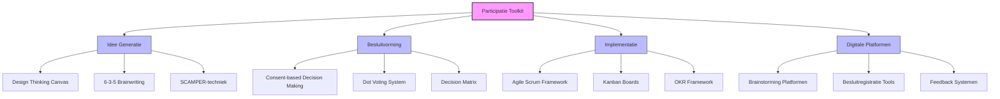

# Hoofdstuk 8: Praktische Tools en Methoden

## De juiste gereedschappen voor effectieve participatie

"We hadden alle goede intenties om medewerkers te betrekken, maar onze sessies verliepen chaotisch en leverden weinig concrete resultaten op," vertelt een HR-manager bij een middelgrote organisatie. "Pas toen we investeerden in de juiste participatietools en -methoden, zagen we echte vooruitgang. Het was alsof we eindelijk het juiste gereedschap hadden gevonden om onze participatie-ambities waar te maken."

In dit hoofdstuk ontdek je concrete tools en methoden om medewerkerparticipatie in de praktijk te brengen. We beginnen met het fundament van groepsdynamica en bouwen daarop voort met specifieke instrumenten voor verschillende fasen van het participatieproces.

## Groepsdynamica als fundament voor participatie

"Voordat we over specifieke tools begonnen na te denken, moesten we eerst investeren in de basis: het creëren van een team waarin mensen zich veilig voelden om hun stem te laten horen," legt een teamleider bij een technologiebedrijf uit. "Zonder dat fundament zouden zelfs de meest geavanceerde participatietools weinig effect hebben gehad."

Voordat specifieke participatietools effectief kunnen worden ingezet, is het essentieel te investeren in groepsvorming en de relatie met de leidinggevende. Zonder dit fundament zullen zelfs de beste tools weinig effect hebben.

### De ontwikkelingsreis van teams

Teams doorlopen verschillende ontwikkelingsfasen voordat ze optimaal kunnen functioneren en participeren. Het model van Tuckman onderscheidt vier essentiële fasen: forming, storming, norming en performing.

"Ons team zat duidelijk in de storming-fase," herinnert een projectmanager zich. "Er waren spanningen en verschillende visies op hoe we moesten werken. We maakten de fout om direct complexe participatietools te willen inzetten, maar dat versterkte alleen maar de verwarring. Toen we een stap terug deden en eerst investeerden in tools die ons hielpen om constructief met verschillen om te gaan, maakten we eindelijk vooruitgang."

In de forming of oriëntatiefase leren teamleden elkaar kennen en is psychologische veiligheid nog fragiel. In deze fase zijn laagdrempelige kennismakingsactiviteiten en eenvoudige brainstorming-methoden het meest effectief. De rol van de leidinggevende is om structuur te bieden en verwachtingen te verhelderen.

"In het begin hielden we het simpel," vertelt een teamleider. "We begonnen elke vergadering met een korte check-in waarin iedereen iets persoonlijks kon delen. Dit hielp om verbinding te creëren en een veilige sfeer op te bouwen. Pas daarna gingen we over tot inhoudelijke discussies."

In de storming of conflictfase komen verschillen in opvattingen en werkstijlen aan de oppervlakte. In deze fase zijn tools die verschillende perspectieven zichtbaar maken en gestructureerde discussiemethoden waardevol. De leidinggevende speelt een belangrijke rol in het faciliteren van constructieve confrontatie en het waarderen van verschillen.

"We merkten dat mensen verschillende ideeën hadden over hoe we moesten samenwerken," vertelt een afdelingsmanager. "In plaats van dit te negeren, hebben we een sessie georganiseerd waarin iedereen zijn ideale werkwijze kon presenteren. Door deze verschillen expliciet te maken en te bespreken, konden we tot gedeelde afspraken komen die voor iedereen werkten."

In de norming of normeringsfase ontwikkelt het team gedeelde normen en werkwijzen. In deze fase zijn een participatiehandvest en besluitvormingsprotocollen effectieve tools. De leidinggevende helpt om participatieprincipes te verankeren in teamafspraken.

"Het keerpunt kwam toen we samen ons teamhandvest opstelden," vertelt een teamcoördinator. "We legden vast hoe we wilden samenwerken, hoe we beslissingen zouden nemen, en hoe we met elkaar zouden communiceren. Dit document werd ons anker en hielp ons om consistent te blijven, zelfs in uitdagende situaties."

In de performing of prestatiefase functioneert het team als een coherent geheel. In deze fase kunnen geavanceerde participatiemethoden en zelfsturende werkvormen worden ingezet. De leidinggevende neemt een meer faciliterende en coachende rol aan en geeft het team ruimte.

"Nu ons team in de performing-fase zit, kunnen we veel complexere participatievormen aan," vertelt een teamleider bij een consultancybureau. "We gebruiken Open Space Technology voor onze strategiesessies en werken met zelfsturende werkgroepen die volledige autonomie hebben binnen hun domein. Mijn rol is vooral om de juiste vragen te stellen en obstakels weg te nemen."

Als leidinggevende is het essentieel om te bepalen in welke ontwikkelingsfase je team zich bevindt voordat je participatietools selecteert. Kies tools die passen bij de huidige fase en help het team geleidelijk naar de volgende fase te groeien.

### De onmisbare basis: psychologische veiligheid

"We hadden alle processen en tools perfect ingericht, maar toch bleef echte participatie uit," vertelt een HR-directeur bij een grote financiële instelling. "Toen we dieper gingen graven, ontdekten we dat mensen zich simpelweg niet veilig voelden om hun echte gedachten te delen. Ze waren bang voor negatieve consequenties als ze kritisch waren of fouten toegaven. Pas toen we actief begonnen te werken aan psychologische veiligheid, zagen we een doorbraak in de kwaliteit van participatie."

Onderzoek van Amy Edmondson toont aan dat psychologische veiligheid - het gedeelde geloof dat het team veilig is voor interpersoonlijke risico's - de belangrijkste voorspeller is van effectieve teamparticipatie. Zonder deze basis zullen zelfs de meest geavanceerde participatietools weinig effect hebben.

Er zijn drie manieren waarop leidinggevenden psychologische veiligheid kunnen versterken. Ten eerste, toegankelijkheid modelleren door eigen kwetsbaarheid te tonen en fouten te erkennen, open te staan voor feedback op je eigen functioneren, en vragen te stellen in plaats van altijd antwoorden te geven.

"Een keerpunt in ons team kwam toen ik als directeur openlijk toegaf dat mijn strategie niet had gewerkt," vertelt een CEO. "Ik deelde wat ik daarvan had geleerd en vroeg het team om hulp bij het ontwikkelen van een betere aanpak. Dit veranderde de dynamiek volledig - mensen begonnen ook hun eigen uitdagingen en leermomenten te delen, wat leidde tot veel eerlijkere en productievere gesprekken."

Ten tweede, nieuwsgierigheid stimuleren door actief vragen te stellen en door te vragen, verschillende perspectieven expliciet te waarderen, en "ik weet het niet" te normaliseren als startpunt voor leren.

"Ik heb geleerd om 'Interessant, vertel me meer' te zeggen wanneer iemand een mening uit die afwijkt van de consensus," vertelt een teamleider. "Dit simpele zinnetje opent de deur voor diepere verkenning en laat zien dat verschillende perspectieven gewaardeerd worden. Het heeft de kwaliteit van onze discussies enorm verbeterd."

Ten derde, inclusief leiderschap door actief diverse perspectieven uit te nodigen, dominante stemmen te begrenzen en stillere stemmen ruimte te geven, en verschillende communicatiestijlen te accommoderen.

"We merkten dat in onze vergaderingen altijd dezelfde drie mensen aan het woord waren," vertelt een afdelingsmanager. "We hebben bewust interventies ingevoerd om dit patroon te doorbreken, zoals rondes waarin iedereen kort zijn perspectief deelt, of schriftelijke input voorafgaand aan de vergadering. Dit heeft ervoor gezorgd dat we veel meer diverse inzichten krijgen en betere beslissingen nemen."

Als HR-professional kun je vragen over psychologische veiligheid opnemen in medewerkerstevredenheidsonderzoeken. Bijvoorbeeld: "In ons team kunnen mensen problemen en moeilijke kwesties aankaarten" en "In ons team worden fouten gezien als leermogelijkheden". Dit geeft je waardevolle data om gericht te werken aan het versterken van psychologische veiligheid waar dat nodig is.

### De kracht van verbinding: groepscohesie en participatie

"We hadden een team van briljante individuen, maar ze functioneerden niet als een coherent geheel," vertelt een projectmanager bij een technologiebedrijf. "Iedereen was gefocust op zijn eigen taken en er was weinig gevoel van gedeelde verantwoordelijkheid. Pas toen we bewust begonnen te investeren in teamcohesie, zagen we dat mensen zich echt gingen inzetten voor het collectieve succes."

De mate van cohesie binnen een team bepaalt in hoge mate de bereidheid tot authentieke participatie. Cohesie ontwikkelt zich langs drie dimensies: taakcohesie (de gedeelde commitment aan teamdoelen en -taken), sociale cohesie (de interpersoonlijke aantrekkingskracht tussen teamleden), en waargenomen cohesie (het gevoel van eenheid en 'erbij horen').

"We ontdekten dat we vooral hadden geïnvesteerd in taakcohesie - we hadden duidelijke doelen en rollen," legt een HR-manager uit. "Maar we hadden de sociale dimensie verwaarloosd. Toen we begonnen met teamlunches en informele activiteiten, zagen we dat mensen elkaar beter leerden kennen als persoon, niet alleen als collega. Dit versterkte het vertrouwen en de bereidheid om samen te werken."

Participatietools moeten bewust worden geselecteerd om deze drie dimensies te versterken, afhankelijk van de specifieke behoeften van het team in zijn ontwikkelingsfase.

Voor het versterken van taakcohesie zijn gezamenlijke doelstellingssessies, teamcharters, en succesviering effectieve activiteiten. "We hebben een kwartaalritueel waarin we onze gezamenlijke successen vieren," vertelt een teamleider. "We reflecteren op wat we samen hebben bereikt en erkennen ieders bijdrage. Dit versterkt het gevoel dat we samen aan iets waardevols werken."

Voor het versterken van sociale cohesie zijn informele teamactiviteiten, persoonlijke check-ins, en waarderingsrituelen waardevol. "We beginnen elke vergadering met een korte persoonlijke check-in," legt een afdelingsmanager uit. "Mensen delen iets over hun weekend, een boek dat ze hebben gelezen, of iets anders persoonlijks. Dit helpt om verbinding te creëren en elkaar als mens te zien, niet alleen als collega."

Voor het versterken van waargenomen cohesie helpt het om een teamidentiteit te ontwikkelen (naam, logo) en gedeelde taal te creëren. "Ons team heeft een eigen naam en logo ontwikkeld," vertelt een teamcoördinator. "Het klinkt misschien simpel, maar het heeft echt geholpen om een gevoel van identiteit en trots te creëren. Mensen voelen zich deel van iets speciaals."

## Toolkit voor verschillende fasen van participatie

*Figuur 1: Overzicht van participatietools per fase*

"De doorbraak kwam toen we beseften dat verschillende fasen van het participatieproces verschillende tools vereisen," vertelt een verandermanager bij een grote organisatie. "We hadden altijd dezelfde brainstormmethode gebruikt voor alles, maar ontdekten dat we specifieke tools nodig hadden voor besluitvorming en implementatie. Toen we de juiste tool voor elke fase begonnen te gebruiken, zagen we een enorme verbetering in de effectiviteit van onze participatieprocessen."

De effectiviteit van medewerkerparticipatie wordt sterk beïnvloed door de keuze en toepassing van de juiste tools en methoden. Een goed ontworpen toolkit biedt structuur zonder creativiteit te beperken, bevordert inclusiviteit zonder efficiëntie te verliezen, en garandeert transparantie zonder overbelasting.

Organisaties die doelbewust investeren in participatietools behalen 3,4 keer vaker hun doelstellingen dan organisaties die ad-hoc benaderingen hanteren. "Het maakt echt verschil of je bewust nadenkt over welke tools je wanneer inzet," bevestigt een HR-directeur. "Het is als het verschil tussen een professional met het juiste gereedschap en een amateur die probeert alles met een hamer op te lossen."

### 1. Idee generatie tools: de kunst van creatieve participatie

"We hadden altijd dezelfde mensen die met dezelfde soort ideeën kwamen," vertelt een innovatiemanager bij een productiebedrijf. "We beseften dat we nieuwe manieren nodig hadden om creativiteit te stimuleren en diverse perspectieven naar boven te halen. Door verschillende ideegeneratietools te introduceren, zagen we een explosie van nieuwe, verfrissende ideeën die we anders nooit hadden ontdekt."

De eerste fase van elk participatieproces draait om het genereren van diverse, innovatieve ideeën. Effectieve ideegeneratie combineert kwantiteit (veel ideeën) met diversiteit (verschillende perspectieven).

#### Design Thinking Canvas: empathie als startpunt

Deze visuele tool structureert het creatieve proces door deelnemers door vijf fasen te leiden: empathize (inleven in de gebruiker/stakeholder), define (het probleem helder formuleren), ideate (zoveel mogelijk ideeën genereren), prototype (ideeën tastbaar maken), en test (feedback verzamelen en verfijnen).

"Design Thinking heeft ons geholpen om uit onze interne bubbel te stappen," vertelt een productmanager. "In plaats van direct oplossingen te bedenken, begonnen we met het echt begrijpen van de behoeften van onze gebruikers. Dit leidde tot veel relevantere en impactvolle ideeën."

Deze tool is bijzonder effectief bij complexe problemen waar gebruikersperspectief essentieel is. "We gebruikten Design Thinking om ons onboardingproces te vernieuwen," legt een HR-manager uit. "Door eerst diepgaande interviews te houden met nieuwe medewerkers over hun ervaringen, ontdekten we pijnpunten die we anders nooit hadden gezien. Dit gaf ons een veel duidelijker beeld van wat we moesten oplossen."

Als facilitator is het belangrijk om te zorgen voor een goede balans tussen divergeren (breed verkennen) en convergeren (focus aanbrengen). Besteed voldoende tijd aan de empathize-fase om te voorkomen dat oplossingen worden bedacht voor de verkeerde problemen. "De verleiding is groot om snel naar oplossingen te springen," waarschuwt een facilitator. "Maar de kracht van Design Thinking zit juist in het grondig verkennen van het probleem voordat je aan oplossingen begint te denken."

#### 6-3-5 Brainwriting Methode: gelijke kansen voor alle stemmen

Deze gestructureerde techniek combineert individuele reflectie met collectieve creativiteit: 6 deelnemers schrijven elk 3 ideeën op in 5 minuten. Daarna roteren de bladen en bouwt iedereen voort op de ideeën van anderen. Na vijf rondes zijn er 90 ideeën gegenereerd.

"Deze methode was een openbaring voor ons team," vertelt een afdelingsmanager. "In onze reguliere brainstorms domineerden altijd dezelfde extraverte personen het gesprek. Met 6-3-5 Brainwriting kreeg iedereen gelijke kans om bij te dragen, en we ontdekten dat sommige van onze stillere teamleden de meest briljante ideeën hadden."

Deze tool is bijzonder waardevol wanneer je snel veel ideeën wilt genereren en wilt voorkomen dat enkele dominante stemmen het gesprek bepalen. "We gebruiken deze methode nu standaard bij het begin van elk nieuw project," legt een projectmanager uit. "Het geeft ons een rijke basis van ideeën om mee te werken, en zorgt ervoor dat iedereen zich gehoord voelt vanaf het begin."

Deze methode werkt goed in teams waar sommige leden terughoudend zijn om ideeën mondeling te delen. De schriftelijke aanpak geeft iedereen gelijke kans om bij te dragen. "We hebben gemerkt dat deze methode vooral waardevol is in cross-culturele teams," vertelt een HR-professional. "In sommige culturen is men terughoudender om in een groep te spreken, maar via deze schriftelijke methode komen alle perspectieven toch naar voren."

#### SCAMPER-techniek: doorbreken van vaste denkpatronen

Deze gerichte ideegeneratietechniek gebruikt zeven denkrichtingen om bestaande concepten te transformeren: Substitueren (wat kun je vervangen?), Combineren (wat kun je samenvoegen?), Aanpassen (wat kun je wijzigen?), Modificeren (wat kun je vergroten of verkleinen?), Productief gebruiken voor andere doeleinden (waar kun je het nog meer voor gebruiken?), Elimineren (wat kun je weglaten?), en Reorganiseren (wat kun je anders ordenen?).

"SCAMPER heeft ons geholpen om uit vastgeroeste denkpatronen te breken," vertelt een innovatiemanager. "We hadden jarenlang hetzelfde product op dezelfde manier gemaakt, en het was moeilijk om daar anders naar te kijken. Door systematisch elke SCAMPER-vraag te stellen, ontdekten we mogelijkheden die we anders nooit hadden gezien."

Deze tool is bijzonder effectief wanneer je vastloopt in bestaande denkpatronen of bestaande processen/producten wilt verbeteren. "We gebruikten SCAMPER om ons jaarlijkse beoordelingsproces te vernieuwen," vertelt een HR-directeur. "Door vragen te stellen als 'Wat als we jaarlijkse beoordelingen vervangen door continue feedback?' of 'Kunnen we zelf-evaluatie combineren met peer feedback?', kwamen we tot een volledig nieuw systeem dat veel beter aansloot bij onze agile werkwijze."

Een HR-afdeling gebruikte SCAMPER om hun beoordelingsproces te vernieuwen. Door systematisch elk element te bevragen, ontwikkelden ze een innovatief systeem dat beter aansloot bij hun agile werkwijze. "Het mooie van SCAMPER is dat het je dwingt om elk aspect van een bestaand proces of product onder de loep te nemen," legt de HR-manager uit. "Dit leidt tot veel gerichtere en concretere ideeën dan een algemene brainstorm."

### 2. Besluitvormingstools: van ideeën naar actie

"We hadden nooit gebrek aan ideeën," vertelt een operationeel directeur bij een grote retailorganisatie. "Ons probleem was dat we niet effectief konden beslissen welke ideeën we zouden implementeren. Vergaderingen duurden eindeloos, en vaak werden beslissingen later weer teruggedraaid omdat er geen echte consensus was. Toen we gestructureerde besluitvormingstools introduceerden, veranderde alles. We konden eindelijk effectief en inclusief beslissingen nemen die ook echt werden uitgevoerd."

Na ideegeneratie volgt de uitdaging om collectief tot beslissingen te komen die zowel kwalitatief sterk als breed gedragen zijn. Dit vereist specifieke tools die structuur bieden aan het besluitvormingsproces.

#### Consent-based Decision Making: voorbij consensus

In tegenstelling tot consensus (iedereen moet actief instemmen), vereist consent alleen dat er geen overwegend bezwaar is. Een besluit wordt genomen wanneer niemand een beargumenteerd bezwaar heeft dat aantoont dat het voorstel schade zou toebrengen aan het team of de organisatie.

"Consent-based besluitvorming was een game-changer voor ons," vertelt een teamleider bij een non-profit organisatie. "Voorheen probeerden we altijd unanimiteit te bereiken, wat vaak leidde tot verwaterde compromissen of eindeloze discussies. Met consent konden we veel sneller beslissingen nemen zonder in te leveren op kwaliteit of draagvlak."

Deze methode is bijzonder waardevol bij beslissingen die brede betrokkenheid vereisen maar waar consensus te tijdrovend zou zijn. Het proces verloopt in zeven stappen: voorstel presenteren, verhelderende vragen stellen, reactieronde (eerste indrukken), aanpassingen aan voorstel, bezwarenronde, integratie van bezwaren, en consentronde.

"De sleutel is om mensen te trainen in het onderscheid tussen persoonlijke voorkeuren en beargumenteerde bezwaren," legt een facilitator uit. "Niet elke aarzeling is een geldig bezwaar in het consent-proces. Een geldig bezwaar moet aantonen dat het voorstel schade zou toebrengen aan het team of de organisatie, niet alleen dat iemand een andere voorkeur heeft."

Als leidinggevende is het waardevol om teams te trainen in het onderscheid tussen persoonlijke voorkeuren en beargumenteerde bezwaren. "We hebben gemerkt dat mensen in het begin vaak moeite hebben met dit onderscheid," vertelt een teamcoach. "Ze denken dat elk ongemak of elke aarzeling een geldig bezwaar is. Door hier expliciet aandacht aan te besteden in training, hebben we het besluitvormingsproces veel effectiever gemaakt."

#### Dot Voting System: visuele prioritering

Deze visuele prioriteringstechniek geeft elke deelnemer een beperkt aantal "stemmen" (vaak in de vorm van stickers) die ze kunnen verdelen over verschillende opties. Het resultaat is een visuele heatmap van collectieve voorkeuren.

"Dot voting heeft onze vergaderingen getransformeerd," vertelt een projectmanager. "In plaats van eindeloze discussies over welke ideeën prioriteit zouden moeten krijgen, kunnen we nu in vijf minuten een duidelijk beeld krijgen van de collectieve voorkeuren. Het is visueel, inclusief, en ongelooflijk efficiënt."

Deze methode is bijzonder effectief voor snelle prioritering van ideeën of opties in een groep. Er zijn verschillende variaties mogelijk: gelijke verdeling (iedereen krijgt evenveel stemmen), gewogen verdeling (verschillende rollen krijgen verschillende aantallen stemmen), of categorische stemming (verschillende kleuren voor verschillende criteria zoals haalbaarheid, impact, etc.).

Een gemeentelijke organisatie gebruikte dot voting om uit 30 verbetervoorstellen de top 5 te selecteren voor directe implementatie. "Door elke afdeling een eigen kleur stickers te geven, werd ook zichtbaar welke voorstellen breed gedragen werden versus welke vooral belangrijk waren voor specifieke afdelingen," legt de projectleider uit. "Dit gaf ons waardevolle inzichten in de verschillende perspectieven en hielp ons om een gebalanceerde selectie te maken."

#### Decision Matrix: systematische evaluatie

Deze analytische tool helpt teams om opties systematisch te evalueren tegen meerdere criteria, waarbij elk criterium een verschillend gewicht kan krijgen afhankelijk van het belang.

"De decision matrix heeft ons geholpen om emotie uit het besluitvormingsproces te halen," vertelt een operationeel manager. "In plaats van te discussiëren op basis van persoonlijke voorkeuren, konden we opties objectief evalueren tegen vooraf bepaalde criteria. Dit maakte het proces veel transparanter en minder gevoelig voor politiek."

Deze tool is bijzonder waardevol bij complexe beslissingen met meerdere opties en verschillende beoordelingscriteria. De implementatie verloopt in zes stappen: definieer de opties die beoordeeld moeten worden, bepaal de beoordelingscriteria (bijv. kosten, impact, haalbaarheid), ken gewichten toe aan elk criterium (bijv. op schaal 1-5), score elke optie op elk criterium (bijv. op schaal 1-10), vermenigvuldig scores met gewichten en tel op voor totaalscore, en vergelijk totaalscores om beste optie te bepalen.

"We gebruiken deze methode bij het evalueren van verschillende HR-initiatieven of leveranciers," vertelt een HR-directeur. "De transparante, systematische aanpak helpt om subjectiviteit te verminderen en maakt de rationale achter beslissingen expliciet. Dit is vooral waardevol wanneer we moeilijke keuzes moeten maken met beperkte middelen."

### 3. Implementatie tools: van besluit naar resultaat

"We waren geweldig in het genereren van ideeën en het nemen van beslissingen, maar struikelden bij de implementatie," vertelt een operationeel directeur. "Projecten liepen uit, verantwoordelijkheden waren onduidelijk, en uiteindelijk verwaterden veel goede initiatieven. Toen we gerichte implementatietools introduceerden, zagen we eindelijk de resultaten van onze participatie-inspanningen."

De waarde van participatie wordt uiteindelijk bepaald door de effectieve implementatie van genomen besluiten. Implementatietools zorgen voor duidelijke verantwoordelijkheden, transparante voortgangsmonitoring, en effectieve coördinatie.

#### Agile Scrum Framework: iteratief en adaptief

Dit iteratieve projectmanagementraamwerk verdeelt werk in korte sprints (meestal 2-4 weken), met dagelijkse stand-ups, regelmatige reviews, en retrospectives om continu te leren en aan te passen.

"Scrum heeft ons geholpen om van grote, overweldigende projecten naar behapbare, iteratieve cycli te gaan," vertelt een projectmanager. "In plaats van maanden te werken zonder feedback, krijgen we nu elke twee weken input en kunnen we snel bijsturen. Dit heeft niet alleen onze implementatiesnelheid verhoogd, maar ook de kwaliteit van wat we opleveren."

Deze methode is bijzonder effectief bij complexe projecten waar flexibiliteit en snelle aanpassing belangrijk zijn. De kernelementen zijn sprint planning (team selecteert werk voor de komende sprint), daily stand-up (korte dagelijkse check-in over voortgang en obstakels), sprint review (demonstratie van voltooide werk aan stakeholders), en sprint retrospective (reflectie op het proces en identificatie van verbeterpunten).

Een HR-transformatieteam gebruikte Scrum om een nieuw onboardingprogramma te ontwikkelen. "Door het werk op te delen in tweewekelijkse sprints en regelmatig feedback te verzamelen van nieuwe medewerkers, konden we snel bijsturen en een programma ontwikkelen dat perfect aansloot bij de behoeften," legt de HR-manager uit. "We ontdekten al vroeg in het proces dat onze aannames over wat nieuwe medewerkers nodig hadden niet helemaal klopten, en konden direct aanpassingen maken."

Als leidinggevende kun je beginnen met een "light" versie van Scrum als je team nog geen ervaring heeft met agile werken. "Focus eerst op de dagelijkse stand-ups en korte iteraties voordat je alle ceremonies implementeert," adviseert een agile coach. "Dit helpt teams om geleidelijk te wennen aan de agile mindset zonder overweldigd te raken door alle nieuwe processen."

#### Kanban Boards: visualiseer de werkstroom

Deze visuele managementtool toont werk in verschillende stadia van voltooiing, meestal in kolommen die de workflow representeren (bijv. "Te doen", "In uitvoering", "Voltooid").

"Kanban heeft ons geholpen om bottlenecks in onze werkprocessen zichtbaar te maken," vertelt een operationeel manager. "Voorheen hadden we geen idee waarom sommige taken zo lang duurden. Met Kanban konden we letterlijk zien waar werk bleef hangen, en gerichte maatregelen nemen om de doorstroming te verbeteren."

Deze tool is bijzonder waardevol voor het visualiseren en managen van werkstromen, vooral bij doorlopende processen. De kernelementen zijn visualisatie van werk (alle taken zijn zichtbaar op het bord), beperking van werk-in-uitvoering (WIP) met een maximumaantal taken per fase, flow management (focus op het soepel doorstromen van werk), en expliciete procesafspraken (duidelijke regels voor hoe werk door het systeem stroomt).

Een communicatieteam gebruikte een Kanban-bord om hun contentproductieproces te stroomlijnen. "Door WIP-limieten in te stellen, voorkwamen we overbelasting en konden we onze doorlooptijd met 40% verkorten," vertelt de teamleider. "We ontdekten dat we te veel projecten tegelijk in uitvoering hadden, waardoor alles vertraagde. Door bewust te limiteren hoeveel we tegelijk doen, gaat alles veel sneller."

Digitale Kanban-tools zoals Trello of Microsoft Planner zijn laagdrempelig en kunnen teams helpen om snel aan de slag te gaan met visueel werkmanagement. "We begonnen met een fysiek bord met post-its, maar zijn later overgestapt op een digitale tool toen we remote gingen werken," vertelt een projectcoördinator. "Het digitale bord biedt dezelfde visualisatie, maar met het voordeel dat iedereen er altijd en overal toegang toe heeft."

#### OKR Framework: focus en alignment

Dit doelstellingsraamwerk verbindt ambitieuze, kwalitatieve doelen (Objectives) met specifieke, meetbare resultaten (Key Results) die succes definiëren.

"OKRs hebben ons geholpen om focus te creëren en iedereen op dezelfde lijn te krijgen," vertelt een directeur bij een softwarebedrijf. "Voorheen had iedereen zijn eigen interpretatie van wat succes betekende. Met OKRs hebben we een gemeenschappelijke taal en duidelijke, meetbare doelen die voor iedereen zichtbaar zijn. Dit heeft onze executiekracht enorm versterkt."

Deze methode is bijzonder waardevol voor het aligneren van teams rond gemeenschappelijke doelen en het creëren van focus en transparantie. De kernelementen zijn Objectives (inspirerende, kwalitatieve doelstellingen), Key Results (3-5 meetbare resultaten per objective), cascadering (organisatiedoelen vertalen naar team- en individuele doelen), en regelmatige check-ins (wekelijkse of tweewekelijkse voortgangsbesprekingen).

Een financiële dienstverlener implementeerde OKRs om hun transformatie naar een meer klantgerichte organisatie te sturen. "Door duidelijke, meetbare resultaten te definiëren, zoals 'Net Promoter Score verhogen van 15 naar 30', creëerden we focus en konden we vooruitgang transparant maken," legt de transformatiemanager uit. "Dit gaf iedereen een duidelijk beeld van wat we probeerden te bereiken en hoe we vorderden."

Als leidinggevende kun je beginnen met een beperkt aantal OKRs (1-3 per team) en focus op kwaliteit boven kwantiteit. "Zorg dat objectives echt inspirerend zijn en dat key results ambitieus maar haalbaar zijn," adviseert een OKR-coach. "Het is beter om een paar dingen echt goed te doen dan veel dingen half."

### 4. Digitale platformen: participatie in een hybride wereld

"De pandemie dwong ons om onze participatieprocessen volledig te digitaliseren," vertelt een HR-directeur bij een internationale organisatie. "Aanvankelijk was dit een uitdaging, maar we ontdekten al snel dat digitale tools ons in staat stelden om meer mensen te betrekken, over verschillende locaties en tijdzones heen. Het heeft onze participatie inclusiever en toegankelijker gemaakt dan ooit tevoren."

In een toenemend digitale en hybride werkwereld zijn digitale platformen essentieel geworden voor effectieve participatie. Ze overbruggen geografische afstanden, faciliteren asynchrone bijdragen, en creëren permanente repositories van collectieve kennis.

Er zijn verschillende typen digitale platformen die elk hun eigen sterke punten hebben. Brainstorming-platformen zoals Miro en Mural zijn uitstekend voor visuele collaboratie. "Deze tools hebben ons in staat gesteld om virtuele whiteboard-sessies te houden die net zo effectief zijn als fysieke sessies," vertelt een innovatiemanager. "Het mooie is dat iedereen tegelijk kan bijdragen, en dat alle input automatisch wordt gedocumenteerd."

Besluitregistratie-tools zoals Loomio en DecisionWise zorgen voor transparante tracking van beslissingen. "Voorheen raakten beslissingen vaak verloren in e-mailthreads of vergadernotities," legt een projectmanager uit. "Nu hebben we een centrale plaats waar alle beslissingen worden vastgelegd, inclusief de context en rationale. Dit voorkomt misverstanden en zorgt dat iedereen op dezelfde pagina blijft."

Feedback-systemen zoals Officevibe en Culture Amp maken continue meting mogelijk. "We hebben afgestapt van de jaarlijkse medewerkerstevredenheidsonderzoeken," vertelt een HR-manager. "In plaats daarvan sturen we wekelijks korte pulse surveys naar een steekproef van medewerkers. Dit geeft ons real-time inzicht in hoe mensen zich voelen en stelt ons in staat om snel bij te sturen waar nodig."

Projectmanagement-tools zoals Asana en Monday.com zijn waardevol voor complexe trajecten. "Deze tools geven iedereen inzicht in de voortgang en afhankelijkheden van het project," legt een programmamanager uit. "Dit creëert transparantie en maakt het gemakkelijker voor mensen om te zien hoe hun bijdragen passen in het grotere geheel."

Als HR-professional is het belangrijk om platformen te kiezen die passen bij de digitale volwassenheid van je organisatie. "Een te complexe tool kan de participatie juist belemmeren in plaats van faciliteren," waarschuwt een digitale transformatie-expert. "Begin met laagdrempelige tools en bouw van daaruit verder naarmate de digitale vaardigheden en het vertrouwen groeien."

## Template: Participatiehandvest

"Het participatiehandvest is ons anker geworden," vertelt een teamleider bij een consultancybureau. "Wanneer we voor uitdagingen staan of in oude patronen dreigen terug te vallen, grijpen we terug naar dit document dat we samen hebben opgesteld. Het herinnert ons aan onze gedeelde principes en afspraken over hoe we willen samenwerken."

Een participatiehandvest is een krachtig instrument om verwachtingen te aligneren, principes te verankeren, en commitment te formaliseren. Het dient als referentiepunt en "grondwet" voor participatieve samenwerking.

Een effectief participatiehandvest bevat verschillende elementen. Ten eerste, principes die de fundamentele waarden en overtuigingen van het team weerspiegelen, zoals "Elk idee verdient een eerlijke evaluatie", "Besluiten worden genomen op basis van gedeelde inzichten", en "Feedback is een geschenk - geef en ontvang het constructief".

Ten tweede, concrete afspraken over hoe participatie in de praktijk wordt vormgegeven, zoals "Wekelijkse ideesessies op dinsdag 10-12u", "Maandelijkse besluitreview op laatste vrijdag", en "Kwartaarlijkse retrospectives".

Ten derde, een duidelijk besluitvormingsprotocol dat specificeert welke typen beslissingen op welke manier worden genomen, zoals informatieve besluiten, consultatieve besluiten, consent-based besluiten, en consensus besluiten.

"Het gezamenlijk ontwikkelen van het handvest is minstens zo waardevol als het eindresultaat," benadrukt een teamcoach. "Door samen te bepalen hoe we willen samenwerken, creëren we niet alleen duidelijkheid maar ook eigenaarschap en commitment. Iedereen voelt zich medeverantwoordelijk voor het naleven van de afspraken die we samen hebben gemaakt."

Als leidinggevende is het belangrijk om het hele team te betrekken bij het opstellen van het handvest en ervoor te zorgen dat iedereen zich kan vinden in de principes en afspraken. "We hebben verschillende iteraties doorlopen voordat we tot de definitieve versie kwamen," vertelt een afdelingsmanager. "Dit kostte tijd, maar zorgde ervoor dat het echt een gedeeld document werd dat door iedereen werd gedragen."

## Aan de slag: selecteer de juiste tools

"De grootste les die we hebben geleerd, is dat je niet alle tools tegelijk moet proberen te implementeren," vertelt een verandermanager bij een grote organisatie. "Begin met één tool die aansluit bij je meest urgente behoefte, implementeer deze goed, en bouw van daaruit verder. Het gaat niet om de hoeveelheid tools, maar om de juiste tool op het juiste moment."

Nu je een overzicht hebt van verschillende participatietools, is het tijd om na te denken over welke tool of methode jouw team direct zou kunnen implementeren om participatie te versterken. Wat is de eerste actie die je zou kunnen ondernemen?

Begin met een tool die aansluit bij de huidige ontwikkelingsfase van je team. Voor teams in de forming fase zijn laagdrempelige kennismakingsactiviteiten en een eenvoudig participatiehandvest een goed startpunt. "We begonnen met simpele check-ins aan het begin van elke vergadering," vertelt een teamleider. "Dit hielp om een veilige sfeer te creëren en verbinding te bouwen, wat essentieel was in deze vroege fase."

Voor teams in de storming fase zijn gestructureerde discussiemethoden zoals consent-based decision making waardevol. "Deze methode gaf ons een kader om constructief met verschillende meningen om te gaan," legt een projectmanager uit. "Het hielp ons om voorbij persoonlijke voorkeuren te kijken en te focussen op wat werkbaar was voor het team als geheel."

Voor teams in de norming fase zijn visuele werkmanagementtools zoals Kanban boards effectief. "Het Kanban-bord hielp ons om onze werkprocessen te standaardiseren en transparant te maken," vertelt een teamcoördinator. "Dit creëerde duidelijkheid over wie wat deed en in welke fase verschillende taken zich bevonden."

Voor teams in de performing fase kunnen geavanceerde participatiemethoden zoals Open Space Technology worden geïntroduceerd. "Deze methode gaf ons de vrijheid om zelf te bepalen welke onderwerpen we wilden bespreken en hoe we dat wilden doen," vertelt een senior manager. "Het stelde ons in staat om onze collectieve intelligentie optimaal te benutten."

Het belangrijkste is om te beginnen met één tool, deze goed te implementeren, en van daaruit verder te bouwen. "Kies een tool die aansluit bij een concrete behoefte of uitdaging in je team," adviseert een veranderexpert. "Dit vergroot de kans dat mensen de waarde ervan inzien en bereid zijn om het een kans te geven."

### Model voor blijvende verandering

"Uiteindelijk gaat het niet alleen om de tools, maar om een fundamentele verschuiving in hoe we samenwerken en waarde creëren," reflecteert een CEO. "We hebben ontdekt dat echte, blijvende verandering begint bij zingeving - het begrijpen waarom participatie belangrijk is voor ons als individuen en als organisatie."

Het volgende model helpt om een blijvende verandering tot stand te brengen:

1. **Zingeving:** Start het gesprek over wat iedereen drijft en wat de invloed is op de samenwerkingsrelatie. "We begonnen met diepgaande gesprekken over waarom participatie belangrijk was voor ieder van ons," vertelt een HR-directeur. "Dit creëerde een gedeeld begrip en motivatie die essentieel was voor het succes van onze transformatie."

2. **Samenwerkingsrelatie:** Een sterke samenwerkingsrelatie, gebaseerd op vertrouwen en gedeelde waarden, heeft invloed op hoe bedrijfsprocessen worden vormgegeven. "Naarmate het vertrouwen groeide, zagen we dat mensen steeds meer bereid waren om samen te werken en kennis te delen," legt een teamleider uit. "Dit leidde tot natuurlijke verbeteringen in onze werkprocessen."

3. **Bedrijfsprocessen:** Effectieve bedrijfsprocessen, die participatie faciliteren en waarderen, hebben invloed op de kwaliteit van het eindproduct. "Door participatie te integreren in onze kernprocessen, zoals productontwikkeling en besluitvorming, zagen we een directe impact op de kwaliteit en innovativiteit van onze producten," vertelt een productmanager.

4. **Het eindproduct:** Uiteindelijk leidt dit alles tot betere eindproducten en diensten die waarde creëren voor klanten en andere stakeholders. "Onze klanten merken het verschil," bevestigt een salesmanager. "Ze zien producten die beter aansluiten bij hun behoeften, en ze waarderen de passie en eigenaarschap die onze medewerkers uitstralen."

Dit model benadrukt dat duurzame participatie niet alleen gaat over tools en technieken, maar over een holistische benadering die begint bij zingeving en doorwerkt in alle aspecten van de organisatie. "Het is een reis, geen bestemming," concludeert een verandermanager. "Maar met de juiste mindset, tools en aanpak kan elke organisatie de kracht van participatie benutten om betere resultaten te bereiken en een meer betrokken en gemotiveerde werkplek te creëren."

[Download toolkit selectiemodel](/hoofdstukken/toolkit-selectiemodel.md){ .md-button .md-button--primary }
