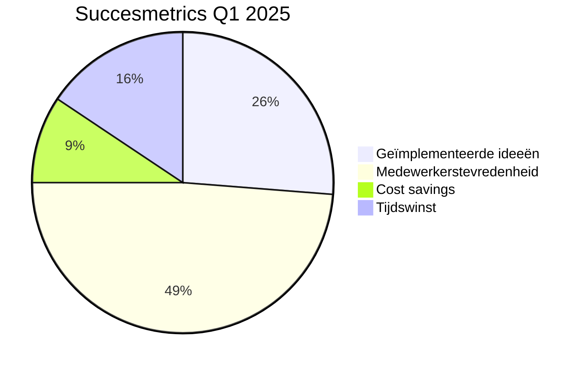

# Hoofdstuk 9: Hoe Meet Je Succes?

## De waarde van meten in participatietrajecten

"We waren enthousiast begonnen met medewerkerparticipatie en zagen positieve signalen, maar toen het management vroeg naar concrete resultaten, stonden we met lege handen," vertelt een HR-directeur bij een middelgrote organisatie. "We hadden geen systematische manier om de impact te meten en konden daardoor de waarde niet aantonen. Bij de volgende bezuinigingsronde was ons participatieprogramma een van de eerste dingen die sneuvelden. Een harde les in het belang van goede meetmethoden."

Het meten van de effectiviteit van medewerkerparticipatie is essentieel voor continue verbetering, het rechtvaardigen van investeringen, en het verankeren van participatieve praktijken in de organisatiecultuur. Zonder robuuste meetmethoden blijft participatie kwetsbaar voor budgetbezuinigingen en managementwisselingen.

Organisaties die systematisch de impact van participatie meten, ontwikkelen significant vaker duurzame participatiepraktijken dan organisaties zonder formele meetprocessen. "Toen we begonnen met het systematisch meten van onze participatie-initiatieven, veranderde de perceptie binnen de organisatie," vertelt een verandermanager. "Het was niet langer een 'leuk-om-te-hebben' activiteit, maar een strategische aanpak met aantoonbare resultaten."

Een effectief KPI (Key Performance Indicator) framework voor participatie combineert kwantitatieve en kwalitatieve metrics, en balanceert tussen proces- en resultaatindicatoren. Het ideale framework is voldoende gestandaardiseerd om vergelijking over tijd mogelijk te maken, maar ook flexibel genoeg om aan te passen aan de specifieke context en doelstellingen van elk participatie-initiatief.

## Kwantitatieve metrics: de taal van resultaten

"In gesprekken met de directie merkten we dat anekdotes over succesvolle participatie-initiatieven niet voldoende waren," vertelt een programmamanager bij een grote financiële instelling. "Ze wilden harde cijfers zien. Toen we konden aantonen dat onze participatieve aanpak had geleid tot 23% kostenreductie en 18% hogere medewerkerstevredenheid, veranderde de toon van het gesprek volledig. Kwantitatieve metrics spreken de taal die besluitvormers begrijpen."

Kwantitatieve metrics bieden objectieve, vergelijkbare data die trends zichtbaar maken en de zakelijke waarde van participatie kunnen onderbouwen. Ze vormen de ruggengraat van elk meetframework.

### Participatiegraad: de breedte van betrokkenheid

Deze basismetric meet het percentage medewerkers dat actief deelneemt aan participatie-initiatieven. Het is een indicator voor de breedte van betrokkenheid en de inclusiviteit van het proces.

"We ontdekten dat onze participatiegraad sterk verschilde per afdeling," vertelt een HR-manager bij een retailorganisatie. "In sommige teams was meer dan 80% van de medewerkers actief betrokken, terwijl in andere teams dit percentage onder de 20% lag. Dit gaf ons waardevolle inzichten in waar we extra aandacht moesten besteden aan het creëren van een participatieve cultuur."

De participatiegraad kan worden verfijnd door onderscheid te maken tussen verschillende niveaus van participatie: passief (informatie ontvangen), reactief (feedback geven op voorstellen), actief (bijdragen aan ideegeneratie), en proactief (initiëren van nieuwe participatiemogelijkheden). Een "Participation Depth Index" combineert deze niveaus in een gewogen score die een genuanceerder beeld geeft dan een binaire deelname/niet-deelname metric.

"Door niet alleen te kijken naar wie deelneemt, maar ook hoe ze deelnemen, kregen we een veel rijker beeld van de participatiecultuur in onze organisatie," legt een verandermanager uit. "We ontdekten dat in sommige teams veel mensen passief deelnamen, terwijl in andere teams een kleinere groep zeer actief en proactief was. Dit hielp ons om gerichte interventies te ontwikkelen voor verschillende teams."

### Implementatiesnelheid: van idee naar actie

Deze metric meet de tijd die verstrijkt tussen het genereren van een idee en de daadwerkelijke implementatie. Het is een indicator voor de effectiviteit van het participatieproces en de mate waarin de organisatie in staat is om input om te zetten in concrete actie.

"De grootste frustratie onder onze medewerkers was niet dat hun ideeën werden afgewezen, maar dat ze in een zwart gat leken te verdwijnen," vertelt een operationeel directeur bij een productiebedrijf. "Toen we begonnen met het meten van implementatiesnelheid, ontdekten we dat het gemiddeld 127 dagen duurde voordat een idee werd geïmplementeerd. Door dit inzicht konden we gericht werken aan het stroomlijnen van ons besluitvormings- en implementatieproces, en binnen zes maanden hadden we de doorlooptijd teruggebracht naar 42 dagen."

Door de doorlooptijd van ideeën door verschillende fasen van het implementatieproces te monitoren, kunnen knelpunten worden geïdentificeerd waar ideeën vertragen of stranden. "We ontdekten dat ideeën vooral vastliepen in de goedkeuringsfase," legt een projectmanager uit. "Door het goedkeuringsproces te herstructureren en meer beslissingsbevoegdheid te delegeren naar teams, konden we deze bottleneck aanpakken en de totale implementatiesnelheid aanzienlijk verhogen."

### ROI van participatie-initiatieven: de zakelijke waarde

Deze metric kwantificeert de financiële waarde die wordt gecreëerd door participatie-initiatieven, afgezet tegen de geïnvesteerde resources (tijd, geld, aandacht).

"In het begin was het een uitdaging om de ROI van participatie te berekenen," vertelt een financieel directeur. "Maar we ontwikkelden een model dat zowel directe als indirecte baten meeneemt. Directe baten zoals kostenbesparingen en efficiëntieverbeteringen waren relatief eenvoudig te kwantificeren. Voor indirecte baten zoals verminderd personeelsverloop en verhoogde medewerkerstevredenheid ontwikkelden we conversiemodellen die deze 'zachte' factoren vertalen naar financiële impact."

Een gestandaardiseerd ROI-model neemt zowel directe als indirecte baten mee. Directe baten omvatten kostenbesparingen, omzetgroei, en efficiëntieverbeteringen die direct toe te schrijven zijn aan participatie-initiatieven. Indirecte baten omvatten verminderd personeelsverloop, verhoogde medewerkerstevredenheid, en verbeterde klanttevredenheid, die kunnen worden gekwantificeerd via gevalideerde conversiemodellen.

"Toen we konden aantonen dat onze participatie-initiatieven een ROI van 327% hadden opgeleverd over een periode van 18 maanden, veranderde de perceptie van participatie binnen de directie," vertelt een HR-directeur. "Het werd niet langer gezien als een kostenpost, maar als een strategische investering met een aantoonbaar rendement."

### Innovatie-impact: de creatieve waarde

Deze metric meet de bijdrage van participatie aan innovatie, uitgedrukt in metrics zoals het aantal geïmplementeerde innovaties, patentaanvragen, of nieuwe productontwikkelingen die voortkomen uit participatieve processen.

"We hadden altijd het gevoel dat participatie leidde tot meer innovatie, maar konden dit niet hard maken," vertelt een innovatiemanager bij een technologiebedrijf. "Door systematisch bij te houden welke innovaties voortkwamen uit participatieve processen versus traditionele R&D, konden we aantonen dat participatieve innovatie niet alleen meer ideeën opleverde, maar ook ideeën die gemiddeld 34% sneller werden geïmplementeerd en 28% hogere klanttevredenheidsscores behaalden."

Een goed ontworpen innovatie-index combineert kwantitatieve metrics (aantal geïmplementeerde innovaties, geschatte waarde) met kwalitatieve beoordelingen van de disruptiviteit en strategische alignment van innovaties. "We ontwikkelden een scorecard die niet alleen kijkt naar het aantal innovaties, maar ook naar de potentiële impact en strategische relevantie," legt een productmanager uit. "Dit gaf ons een genuanceerder beeld van de innovatieve waarde die door participatie werd gecreëerd."

### Kwaliteitsverbetering: de operationele waarde

Deze metric meet de impact van participatie op productkwaliteit, servicekwaliteit, of proceskwaliteit, uitgedrukt in indicatoren zoals defectreductie, klanttevredenheid, of first-time-right percentages.

"Onze kwaliteitsmanagers waren aanvankelijk sceptisch over participatie," herinnert een operationeel directeur zich. "Ze vreesden dat het zou leiden tot compromissen in kwaliteitsstandaarden. Maar toen we begonnen met het meten van de impact van participatie op kwaliteitsmetrics, zagen we het tegenovergestelde. Teams met hoge participatiescores vertoonden gemiddeld 42% minder kwaliteitsproblemen dan teams met lage scores."

Een correlatie-analyse kan de relatie onderzoeken tussen participatiegraad in teams en kwaliteitsmetrics. Longitudinale studies kunnen causale verbanden aantonen tussen de diepte van medewerkerparticipatie in verbeterprocessen en de reductie in kwaliteitsproblemen.

"We ontdekten een sterke correlatie tussen de mate waarin operators betrokken waren bij het ontwerpen van hun werkprocessen en de kwaliteit van het eindproduct," vertelt een kwaliteitsmanager bij een productiebedrijf. "Dit heeft ons kwaliteitsprogramma fundamenteel veranderd - participatie is nu een integraal onderdeel van onze kwaliteitsstrategie."

## Kwalitatieve metrics: het verhaal achter de cijfers

"De kwantitatieve metrics gaven ons inzicht in wat er gebeurde, maar de kwalitatieve metrics hielpen ons te begrijpen waarom," vertelt een HR-directeur bij een grote zorginstelling. "Ze boden context en nuance die essentieel waren voor het interpreteren van de cijfers en het ontwikkelen van effectieve interventies."

Kwalitatieve metrics vangen aspecten van participatie die niet eenvoudig te kwantificeren zijn, maar essentieel zijn voor het begrijpen van de diepere impact en dynamiek. Ze bieden context en nuance die kwantitatieve data alleen niet kan leveren.

### Medewerkertevredenheid: de menselijke dimensie

De employee Net Promoter Score (eNPS) meet de mate waarin medewerkers de organisatie zouden aanbevelen als werkgever, wat een indicator is voor algemene tevredenheid en betrokkenheid. Specifiek voor participatie kan een aangepaste vraag worden gebruikt: "Hoe waarschijnlijk is het dat je collega's zou aanmoedigen om deel te nemen aan participatie-initiatieven?"

"De eNPS gaf ons een goede baseline, maar we ontdekten dat we dieper moesten graven om echt te begrijpen hoe participatie de medewerkerstevredenheid beïnvloedde," vertelt een HR-manager. "Door gerichte follow-up vragen te stellen, kregen we veel rijkere inzichten in de specifieke aspecten van participatie die het meest waardevol waren voor medewerkers."

Voor een dieper begrip van medewerkertevredenheid in relatie tot participatie is het essentieel om eNPS te combineren met gerichte follow-up vragen die specifiek ingaan op de participatie-ervaring, zoals: "In welke mate voel je dat je input serieus wordt genomen?", "Hoe heeft participatie je gevoel van eigenaarschap beïnvloed?", "In hoeverre voel je je gewaardeerd voor je bijdragen aan participatie-initiatieven?", "Hoe heeft participatie je verbondenheid met de organisatie beïnvloed?", en "In welke mate heeft participatie je professionele ontwikkeling versterkt?"

"Deze vragen hielpen ons om specifieke verbeterpunten te identificeren," legt een teamleider uit. "We ontdekten bijvoorbeeld dat medewerkers zich gewaardeerd voelden voor hun bijdragen, maar niet altijd het gevoel hadden dat hun input serieus werd genomen. Dit leidde tot gerichte interventies om de terugkoppeling na participatiesessies te verbeteren."

Deze combinatie van kwantitatieve scores en kwalitatieve inzichten biedt een multidimensionaal beeld van de impact van participatie op medewerkerstevredenheid. Door deze metingen regelmatig uit te voeren, kunnen organisaties trends identificeren en gerichte verbeteringen doorvoeren in hun participatiedesign.

### Leiderschapsvertrouwen: het fundament van participatie

Deze metric meet het vertrouwen dat medewerkers hebben in het leiderschap van de organisatie, met name in de context van participatie. Het reflecteert de perceptie van oprechtheid en commitment aan participatieve principes.

"We ontdekten dat leiderschapsvertrouwen een cruciale voorspeller was van participatiesucces," vertelt een organisatiepsycholoog. "In teams waar medewerkers weinig vertrouwen hadden in de bereidheid van leiders om macht te delen en oprecht open te staan voor input, bleef participatie oppervlakkig en had het weinig impact. In teams met hoog leiderschapsvertrouwen daarentegen, zagen we veel diepere en effectievere vormen van participatie."

Een "Leadership Trust Barometer" kan specifiek het vertrouwen meten in de bereidheid van leiders om macht te delen en oprecht open te staan voor input. Door deze metric te koppelen aan leiderschapsontwikkelingsprogramma's, kan een organisatie gericht werken aan het versterken van vertrouwen, wat correlaties kan vertonen met hogere participatiegraden.

"We hebben onze leiderschapsontwikkelingsprogramma's aangepast om specifiek te focussen op het opbouwen van vertrouwen in de context van participatie," vertelt een L&D-manager. "Dit heeft geleid tot een significante stijging in zowel leiderschapsvertrouwen als participatie-effectiviteit."

### Innovatieklimaat index: de culturele dimensie

Deze metric evalueert de mate waarin de organisatiecultuur innovatie en creatief denken ondersteunt, wat vaak een indicator is voor de effectiviteit van participatieve praktijken.

"We merkten dat participatie-initiatieven veel effectiever waren in teams met een sterk innovatieklimaat," vertelt een innovatiemanager. "In deze teams voelden mensen zich veilig om risico's te nemen, nieuwe ideeën te delen, en te experimenteren. Dit creëerde een vruchtbare bodem voor participatie om te floreren."

Een goed ontworpen "Innovation Climate Survey" meet meerdere dimensies van innovatieklimaat, waaronder psychologische veiligheid, experimenteerruimte, en tolerantie voor risico en falen. Door deze index te tracken voor en na participatie-interventies, kan worden aangetoond hoe goed ontworpen participatieprocessen het innovatieklimaat kunnen verbeteren.

"We zagen een duidelijke wisselwerking tussen participatie en innovatieklimaat," legt een verandermanager uit. "Participatie-initiatieven verbeterden het innovatieklimaat, en een sterker innovatieklimaat maakte participatie effectiever. Dit creëerde een positieve spiraal die de algehele organisatiecultuur versterkte."

### Narratieve feedback: de menselijke ervaring

Naast gestructureerde metrics is het verzamelen van verhalen en ervaringen van deelnemers essentieel om de menselijke dimensie van participatie te begrijpen en te communiceren.

"De cijfers vertelden ons dat participatie werkte, maar de verhalen maakten duidelijk waarom het zo krachtig was," vertelt een communicatiemanager. "Wanneer een operator vertelt hoe zijn suggestie heeft geleid tot een procesverbetering die zijn dagelijks werk veiliger en efficiënter heeft gemaakt, of wanneer een teamleider beschrijft hoe participatie het teamvertrouwen heeft versterkt - dat zijn de verhalen die resoneren en inspireren."

Een systematische verzameling van narratieve feedback via korte interviews, schriftelijke reflecties, en gefaciliteerde storytelling sessies kan waardevolle inzichten opleveren. Deze verhalen kunnen thematisch worden geanalyseerd om patronen te identificeren en worden gebruikt in interne communicatie om de impact van participatie te illustreren. Deze kwalitatieve data draagt bij aan een dieper begrip van de transformatieve effecten van participatie op individueel niveau.

"We hebben een 'participatieverhalen' sectie op ons intranet gecreëerd waar medewerkers hun ervaringen kunnen delen," vertelt een interne communicatiespecialist. "Deze verhalen zijn niet alleen inspirerend voor anderen, maar helpen ons ook om patronen te identificeren in wat participatie succesvol maakt in verschillende contexten."

## Meetinstrumenten en rijker verantwoorden

"We hadden jarenlang geprobeerd om de waarde van participatie te communiceren met spreadsheets vol cijfers," vertelt een HR-directeur. "Maar het was pas toen we overstapten op een multidimensionale benadering, die zowel kwantitatieve als kwalitatieve aspecten omvatte, dat we echt in staat waren om de rijke waarde van participatie over te brengen aan alle stakeholders."

De keuze van de juiste meetinstrumenten is cruciaal voor het verzamelen van betrouwbare, actionable data. Effectieve instrumenten zijn gebruiksvriendelijk, minimaal invasief in werkprocessen, en leveren tijdige inzichten die direct kunnen worden omgezet in verbeteracties.

### Het principe van rijker verantwoorden

Bij het meten van participatiesucces is het essentieel om het principe van "rijker verantwoorden" toe te passen. Dit principe stelt dat effectieve verantwoording altijd meerdere dimensies moet omvatten om een volledig beeld te geven van de waarde en impact. In de context van medewerkerparticipatie betekent dit dat rapportages niet moeten focussen op één enkele metric (zoals ROI of participatiegraad), maar een gebalanceerde set van indicatoren moeten presenteren die verschillende aspecten van succes belichten.

"We hebben geleerd dat verschillende stakeholders verschillende aspecten van participatie waarderen," legt een programmamanager uit. "De CFO is geïnteresseerd in ROI en kostenbesparingen, de COO in kwaliteitsverbeteringen en operationele efficiëntie, en de CHRO in medewerkerstevredenheid en retentie. Door een multidimensionaal beeld te presenteren, kunnen we de waarde van participatie communiceren op een manier die resoneert met verschillende stakeholders."

Rijker verantwoorden gaat verder dan alleen cijfers; het omvat ook beelden en verhalen die de context en de menselijke dimensie van participatie belichten. Een voorbeeld hiervan is de metafoor van de "dry highgrounds" en de "muddy lowlands," die de kloof beschrijft tussen de beleidswereld en de operationele realiteit. Beleidsmakers bevinden zich vaak op de "dry highgrounds," waar ze overzicht hebben en abstracte beslissingen nemen, terwijl de mensen in de operatie zich in de "muddy lowlands" bevinden, waar ze dagelijks worstelen met de complexiteit van de uitvoering.

"Deze metafoor resoneerde sterk binnen onze organisatie," vertelt een verandermanager. "Het hielp ons om te begrijpen waarom top-down beslissingen vaak niet werkten in de praktijk, en waarom participatie zo waardevol was om de kloof tussen beleid en uitvoering te overbruggen."

Rijker verantwoorden probeert deze kloof te overbruggen door de verhalen en ervaringen van de mensen in de "muddy lowlands" te integreren in de evaluatie van participatie-initiatieven. "Door de stemmen van mensen op de werkvloer te integreren in onze rapportages, creëerden we een veel rijker en genuanceerder beeld van de impact van participatie," legt een communicatiespecialist uit. "Dit hielp om de abstracte cijfers tot leven te brengen en de menselijke dimensie van participatie zichtbaar te maken."

Een andere methode om aan integrale evaluatie te doen is "the whole system in a room." Deze methode brengt alle relevante stakeholders samen in één ruimte om gezamenlijk de resultaten en de impact van participatie te evalueren. Door verschillende perspectieven en ervaringen samen te brengen, ontstaat een rijker en genuanceerder beeld van de waarde van participatie.

"We organiseren halfjaarlijkse evaluatiesessies waarbij we mensen van alle niveaus en afdelingen samenbrengen," vertelt een facilitator. "Door deze diverse perspectieven samen te brengen, krijgen we een veel completer beeld van de impact van participatie dan we ooit zouden kunnen krijgen uit alleen cijfers of alleen de perspectieven van het management."

Een multidimensionaal verantwoordingsmodel voor participatie omvat typisch vijf dimensies. De procesmatige dimensie kijkt naar hoe effectief en inclusief het participatieproces zelf was. De resultaatdimensie focust op welke concrete uitkomsten en verbeteringen zijn gerealiseerd. De menselijke dimensie evalueert wat de impact was op medewerkerstevredenheid, betrokkenheid en ontwikkeling. De organisatorische dimensie onderzoekt hoe participatie heeft bijgedragen aan bredere organisatiedoelstellingen en cultuurverandering. En de leerdimensie kijkt naar welke inzichten en capaciteiten zijn ontwikkeld die toekomstige participatie kunnen versterken.

"Door deze vijf dimensies te integreren in onze meetinstrumenten en rapportages, kunnen we een veel rijker en genuanceerder beeld geven van participatiesucces dan mogelijk zou zijn met een eendimensionale benadering," legt een programmamanager uit. "Dit helpt ons om de volledige waarde van participatie zichtbaar te maken en te communiceren naar alle stakeholders."

| Meting               | Tool                          | Frequentie     | Dimensie |
|----------------------|-------------------------------|----------------|----------|
| Participatie-engagement | Pulse surveys              | Wekelijks      | Proces   |
| Besluitkwaliteit     | 360° feedback ronde          | Per project    | Resultaat|
| Economisch effect     | Cost-benefit analyse         | Kwartaal       | Resultaat|
| Medewerkerstevredenheid | eNPS + diepte-interviews   | Maandelijks    | Menselijk|
| Cultuurimpact        | Cultural assessment          | Halfjaarlijks  | Organisatie|
| Leereffect           | Competentie-mapping          | Kwartaal       | Leren    |

### Meetinstrumenten voor medewerkerstevredenheid

Gezien het belang van medewerkerstevredenheid als indicator voor participatiesucces, verdienen de meetinstrumenten hiervoor speciale aandacht.

"We hebben ontdekt dat medewerkerstevredenheid een van de meest waardevolle indicatoren is voor het succes van participatie op lange termijn," vertelt een HR-directeur. "Als medewerkers tevreden zijn met het participatieproces en de resultaten ervan, is de kans veel groter dat ze blijven deelnemen en bijdragen."

Er zijn verschillende typen instrumenten die kunnen worden gebruikt om medewerkerstevredenheid te meten. Gestructureerde tevredenheidsmetingen zoals de eNPS (Employee Net Promoter Score) bieden een kwantitatieve baseline-meting die eenvoudig te implementeren en te tracken is over tijd. Participatie-specifieke tevredenheidssurveys gaan dieper in op verschillende aspecten van de participatie-ervaring. En pulse checks - ultrakorte, frequente metingen van slechts 1-2 vragen - kunnen trends in medewerkerssentiment identificeren zonder survey-vermoeidheid te veroorzaken.

"We hebben afgestapt van lange, jaarlijkse tevredenheidsonderzoeken," vertelt een HR-manager. "In plaats daarvan sturen we wekelijks korte pulse checks naar een steekproef van medewerkers. Dit geeft ons veel actueler inzicht in hoe mensen zich voelen en stelt ons in staat om snel bij te sturen waar nodig."

Naast deze kwantitatieve instrumenten zijn er ook waardevolle kwalitatieve instrumenten. Semi-gestructureerde interviews bieden diepgaande gesprekken met een representatieve steekproef van medewerkers om rijke, contextuele inzichten te verzamelen. Focus groepen faciliteren groepsdiscussies die collectieve perspectieven en gedeelde ervaringen kunnen onthullen. En reflectiejournals stimuleren gestructureerde zelfreflectie door deelnemers over hun participatie-ervaring en de impact op hun werkbeleving.

"De combinatie van kwantitatieve en kwalitatieve instrumenten geeft ons een veel rijker beeld van de medewerkerstevredenheid dan we ooit zouden kunnen krijgen uit alleen surveys," legt een onderzoeker uit. "De kwantitatieve data helpt ons om trends te identificeren en vergelijkingen te maken, terwijl de kwalitatieve inzichten ons helpen om de onderliggende redenen en context te begrijpen."

Er zijn ook observationele methoden die waardevolle inzichten kunnen bieden. Participatieve observatie door getrainde observatoren die participatieprocessen bijwonen en interactiepatronen, engagement-niveaus, en non-verbale signalen documenteren. En gedragsanalyse door monitoring van objectieve gedragsindicatoren zoals vrijwillige deelname aan vervolginitiatieven, kennisdeling, of peer-to-peer ondersteuning.

"Observationele methoden geven ons inzicht in aspecten van participatie die mensen misschien niet expliciet benoemen in surveys of interviews," vertelt een organisatiepsycholoog. "Door te observeren hoe mensen daadwerkelijk interacteren tijdens participatieprocessen, kunnen we subtiele patronen identificeren die anders onopgemerkt zouden blijven."

Door deze instrumenten te combineren in een geïntegreerd meetprogramma, kunnen organisaties een genuanceerd begrip ontwikkelen van hoe participatie de medewerkerstevredenheid beïnvloedt, en welke specifieke aspecten van het participatieproces de grootste impact hebben.

### Meetinstrumenten voor eindresultaten

Naast medewerkerstevredenheid is het meten van concrete eindresultaten essentieel voor het rechtvaardigen van investeringen in participatie.

"Uiteindelijk moet participatie leiden tot concrete verbeteringen in de organisatie," vertelt een operationeel directeur. "Door systematisch de eindresultaten te meten, kunnen we aantonen dat participatie niet alleen 'leuk' is voor medewerkers, maar ook substantiële waarde creëert voor de organisatie."

Er zijn verschillende kwantitatieve resultaatmetingen die waardevol zijn. Een ROI-analyse biedt een systematische berekening van de financiële returns op participatie-investeringen, inclusief zowel directe als indirecte baten. Implementatie-metrics tracken het percentage geïmplementeerde ideeën, implementatiesnelheid, en de duurzaamheid van implementaties over tijd. En performance-indicatoren meten specifieke KPIs die direct beïnvloed worden door participatie-initiatieven, zoals productiviteit, kwaliteit, of klanttevredenheid.

"We hebben een dashboard ontwikkeld dat real-time inzicht geeft in de implementatie en impact van participatie-initiatieven," vertelt een business intelligence specialist. "Dit maakt de concrete resultaten zichtbaar voor iedereen in de organisatie en creëert transparantie en accountability."

Naast deze kwantitatieve metingen zijn er ook waardevolle kwalitatieve resultaatbeoordelingen. Impact narratives bieden gestructureerde documentatie van significante verbeteringen of innovaties die zijn voortgekomen uit participatie, inclusief de bredere impact op de organisatie. Stakeholder assessments verzamelen evaluaties door diverse belanghebbenden (niet alleen deelnemers) van de waarde en impact van participatieresultaten. En longitudinale case studies bieden diepgaande analyses van specifieke participatie-initiatieven over langere tijd om de volledige impact te documenteren.

"We hebben een serie case studies ontwikkeld die de impact van participatie-initiatieven over tijd documenteren," vertelt een kennismanager. "Deze verhalen laten zien hoe kleine ideeën kunnen uitgroeien tot substantiële verbeteringen, en hoe participatie kan leiden tot onverwachte positieve neveneffecten die niet direct zichtbaar zijn in de kwantitatieve metrics."

Door zowel kwantitatieve als kwalitatieve resultaatmetingen te integreren, kunnen organisaties een compleet beeld krijgen van de waarde die wordt gecreëerd door participatie, van directe financiële returns tot bredere organisatorische verbeteringen.

## Multidimensionale dashboards: visualisatie van succes

"Toen we ons eerste participatiedashboard lanceerden, was het een openbaring voor veel mensen in de organisatie," vertelt een data-analist bij een grote financiële instelling. "Voor het eerst konden ze de volledige impact van participatie zien, van proceseffectiviteit en medewerkerstevredenheid tot financiële resultaten en innovatie-output. Het maakte participatie tastbaar en meetbaar op een manier die voorheen niet mogelijk was."

Een effectief participatiedashboard visualiseert key metrics op een manier die zowel strategisch overzicht als operationele details biedt. Het maakt trends zichtbaar, faciliteert vergelijking, en stimuleert data-gedreven besluitvorming over participatie-initiatieven. In lijn met het principe van rijker verantwoorden, is een effectief dashboard altijd multidimensionaal.

### Theoretisch kader voor dashboardontwerp

Een goed ontworpen participatiedashboard is gebaseerd op vijf principes. Ten eerste, multidimensionaliteit: het dashboard integreert metrics uit verschillende dimensies (proces, resultaat, menselijk, organisatorisch, leren) om een holistisch beeld te geven. Ten tweede, gelaagdheid: het dashboard biedt zowel high-level overzichten als mogelijkheden om in te zoomen op specifieke details, afhankelijk van de behoeften van verschillende stakeholders. Ten derde, contextualisering: metrics worden gepresenteerd in context, met relevante benchmarks, targets, en historische trends om betekenisvolle interpretatie mogelijk te maken. Ten vierde, actionability: het dashboard is ontworpen om niet alleen te informeren maar ook actie te stimuleren, met duidelijke indicaties van waar interventie nodig is. En ten vijfde, toegankelijkheid: de visualisaties zijn intuïtief en begrijpelijk voor verschillende stakeholders, ongeacht hun data-geletterdheid.

"Deze principes hebben ons geholpen om een dashboard te ontwikkelen dat niet alleen informeert maar ook inspireert," vertelt een business intelligence specialist. "Het dashboard vertelt een verhaal over de impact van participatie, en nodigt mensen uit om deel uit te maken van dat verhaal."

### Visualisatie van multidimensionale data

Dit voorbeeld toont een high-level overzicht van participatieresultaten voor Q1 2025, met focus op vier kernmetrics die verschillende dimensies vertegenwoordigen: proceseffectiviteit (geïmplementeerde ideeën), menselijke impact (medewerkerstevredenheid), en resultaatdimensies (cost savings en tijdswinst).

"Visualisaties zoals deze helpen om complexe data toegankelijk te maken voor een breed publiek," legt een data-visualisatie expert uit. "Ze maken het mogelijk om in één oogopslag de belangrijkste resultaten te zien en patronen te identificeren die anders verborgen zouden blijven in tabellen met cijfers."

Een volledig multidimensionaal dashboard is echter meer gelaagd, met verschillende views voor verschillende stakeholders. De strategische view toont high-level metrics zoals totale ROI, participatiegraad, en strategische alignment van initiatieven. Het visualiseert trends over tijd en vergelijkt prestaties tegen targets en benchmarks.

"De strategische view is ontworpen voor senior management," vertelt een dashboard-ontwerper. "Het geeft hen een snel overzicht van de belangrijkste resultaten en trends, zonder hen te overspoelen met details. Dit helpt hen om strategische beslissingen te nemen over de toekomst van participatie-initiatieven."

De operationele view focust op procesmetrics zoals implementatiesnelheid, besluitkwaliteit, en teamengagement. Het biedt actionable insights voor het verbeteren van participatieprocessen en het adresseren van knelpunten.

"De operationele view is het werkpaard van het dashboard," legt een projectmanager uit. "Het helpt ons om dagelijks te zien waar we staan, waar knelpunten zitten, en waar we actie moeten ondernemen. Het is een essentieel hulpmiddel voor het managen van participatie-initiatieven."

De medewerker view geeft individuele medewerkers inzicht in hun eigen participatiepatronen, de impact van hun bijdragen, en mogelijkheden voor verdere betrokkenheid. Deze transparantie versterkt eigenaarschap en motivatie.

"De medewerker view was een game-changer voor ons," vertelt een teamleider. "Het geeft medewerkers direct inzicht in hoe hun bijdragen impact hebben, wat enorm motiverend werkt. Het creëert ook een gezonde vorm van competitie, waarbij teams elkaar inspireren om actiever te participeren."

### Integratie van data en inzichten

Een geavanceerd participatiedashboard wordt gevoed door automatische data-integratie vanuit verschillende bronnen, waaronder participatieplatforms en tools, HR-systemen en medewerkerstevredenheidsmetingen, projectmanagement- en implementatietools, financiële systemen voor ROI-berekeningen, en kwaliteits- en performancemanagementsystemen.

"De kracht van ons dashboard ligt in de integratie van data uit verschillende bronnen," vertelt een data-architect. "Door deze verschillende perspectieven samen te brengen, krijgen we een veel completer beeld van de impact van participatie dan we ooit zouden kunnen krijgen uit één enkele databron."

Moderne dashboards maken gebruik van data-analyse technieken om correlaties en patronen te identificeren die menselijke analisten mogelijk zouden missen, zoals de relatie tussen participatiefrequentie en innovatie-output, de optimale teamgrootte voor verschillende typen participatie-initiatieven, voorspellende indicatoren voor succesvolle implementatie, en factoren die medewerkerstevredenheid met participatieprocessen het sterkst beïnvloeden.

"De predictieve analyses in ons dashboard hebben ons geholpen om veel proactievere beslissingen te nemen," legt een data scientist uit. "In plaats van alleen te reageren op problemen nadat ze zijn opgetreden, kunnen we nu potentiële knelpunten identificeren voordat ze zich manifesteren en preventieve maatregelen nemen."

Door deze geavanceerde analyses te integreren in toegankelijke visualisaties, stellen multidimensionale dashboards organisaties in staat om datagedreven beslissingen te nemen over hun participatieprocessen, wat leidt tot continue verbetering en optimalisatie.

"Uiteindelijk gaat het niet om de technologie of de data, maar om de inzichten en acties die eruit voortvloeien," benadrukt een verandermanager. "Een goed dashboard maakt complexe data toegankelijk en actionable, zodat mensen op alle niveaus van de organisatie geïnformeerde beslissingen kunnen nemen die participatie effectiever maken."

## Meetuitdagingen en oplossingen

"Meten is weten, maar meten is ook een uitdaging," vertelt een onderzoeksmanager bij een grote organisatie. "We liepen tegen verschillende obstakels aan bij het meten van participatiesucces, van attributieproblemen tot meetvermoeidheid. Maar door deze uitdagingen systematisch aan te pakken, hebben we een robuust meetsysteem kunnen ontwikkelen dat ons waardevolle inzichten geeft."

Het meten van participatiesucces brengt specifieke uitdagingen met zich mee die bewuste strategieën vereisen om te adresseren.

### Uitdaging 1: Attributie

Een fundamentele uitdaging is het isoleren van de impact van participatie van andere factoren die resultaten beïnvloeden. Hoe weet je zeker dat verbeteringen toe te schrijven zijn aan participatie en niet aan andere variabelen?

"In het begin worstelden we met de vraag of de verbeteringen die we zagen echt het resultaat waren van onze participatie-initiatieven, of dat ze door andere factoren werden veroorzaakt," vertelt een onderzoeker. "We hadden behoefte aan een meer rigoureuze aanpak om de specifieke impact van participatie te isoleren."

Een effectieve aanpak is het implementeren van quasi-experimentele designs waarbij sommige afdelingen participatieve methoden implementeren terwijl vergelijkbare afdelingen dat niet doen, wat een vorm van controlegroep creëert. Door resultaten te vergelijken tussen deze groepen, kan de specifieke impact van participatie beter worden geïsoleerd.

"We hebben een pilot opgezet waarbij we participatieve methoden implementeerden in drie van onze zes productiefaciliteiten, terwijl de andere drie als controlegroep dienden," legt een operationeel directeur uit. "Na zes maanden zagen we dat de participatieve faciliteiten significant meer procesverbeteringen hadden gerealiseerd en hogere medewerkerstevredenheidsscores hadden dan de controlegroep, zelfs na controle voor andere variabelen zoals leeftijd van de faciliteit en ervaring van het management."

Een andere effectieve strategie is het gebruik van tijdreeksanalyse, waarbij metrics worden gemeten voor, tijdens en na participatie-interventies. Longitudinale studies kunnen duidelijke "knikpunten" in performance metrics identificeren die samenvallen met de introductie van participatieve praktijken, wat sterke indicaties geeft van causale relaties.

"Door onze metrics over een langere periode te tracken, konden we duidelijke veranderingen zien die samenhingen met de introductie van participatieve praktijken," vertelt een data-analist. "We zagen bijvoorbeeld een significante stijging in het aantal geïmplementeerde verbeterideeën direct na de introductie van ons participatieplatform, en deze stijging zette door in de maanden daarna."

### Uitdaging 2: Zachte factoren kwantificeren

Veel waardevolle outcomes van participatie zijn "zacht" en moeilijk te kwantificeren, zoals verbeterde samenwerking, verhoogd vertrouwen, of dieper eigenaarschap.

"Sommige van de meest waardevolle effecten van participatie zijn juist de minst tastbare," vertelt een HR-directeur. "Hoe meet je bijvoorbeeld het gevoel van eigenaarschap dat ontstaat wanneer medewerkers betrokken worden bij besluitvorming? Of de versterkte teamcohesie die voortkomt uit gezamenlijke probleemoplossing?"

Een effectieve benadering combineert kwantitatieve metrics met kwalitatieve methoden zoals narratieve analyse, observatiestudies, en diepte-interviews. Een goed ontworpen "Participation Impact Framework" gebruikt gevalideerde schalen om zachte factoren te meten, aangevuld met rijke kwalitatieve data die context en nuance biedt.

"We hebben een mixed-methods benadering ontwikkeld die zowel kwantitatieve als kwalitatieve data integreert," legt een onderzoeker uit. "We gebruiken gevalideerde schalen om factoren zoals psychologische veiligheid en teamcohesie te meten, en combineren dit met diepte-interviews en observatiestudies om de context en nuance te begrijpen. Deze combinatie geeft ons een veel rijker beeld van de impact van participatie dan we ooit zouden kunnen krijgen uit alleen cijfers."

Deze mixed-methods benadering leidt tot een meer holistische waardering van participatie-impact, inclusief onverwachte positieve effecten zoals verbeterde cross-functionele relaties en spontane kennisdeling die niet zichtbaar zijn in puur kwantitatieve analyses.

Een innovatieve aanpak is het gebruik van "proxy metrics" - meetbare indicatoren die correleren met moeilijk kwantificeerbare factoren. Voorbeelden hiervan zijn "vrijwillige overuren" als proxy voor intrinsieke motivatie en "cross-departementale communicatiefrequentie" als proxy voor samenwerkingskwaliteit.

"We ontdekten dat bepaalde meetbare gedragingen sterk correleren met moeilijk kwantificeerbare factoren," vertelt een data scientist. "Bijvoorbeeld, de frequentie waarmee medewerkers vrijwillig deelnemen aan niet-verplichte verbeterinitiatieven bleek een sterke indicator te zijn voor intrinsieke motivatie en eigenaarschap. Door deze proxy metrics te tracken, konden we indirect de ontwikkeling van deze zachte factoren monitoren."

### Uitdaging 3: Meetvermoeidheid

Frequente metingen kunnen leiden tot survey-vermoeidheid en dalende responsratio's, wat de kwaliteit en representativiteit van data ondermijnt.

"We merkten dat onze responsratio's begonnen te dalen naarmate we meer surveys uitstuurden," vertelt een HR-manager. "Mensen werden 'survey-moe' en vulden de vragenlijsten steeds minder zorgvuldig in, wat de betrouwbaarheid van onze data ondermijnde."

Een effectieve oplossing is "embedded measurement" waarbij dataverzameling wordt geïntegreerd in natuurlijke werkprocessen in plaats van als separate activiteit. Een digitaal participatieplatform kan automatisch metrics verzamelen zoals deelnamefrequentie, bijdragepatronen, en implementatievoortgang als onderdeel van het normale gebruik.

"We hebben ons participatieplatform zo ontworpen dat het automatisch data verzamelt over hoe mensen het gebruiken," legt een IT-manager uit. "Dit geeft ons waardevolle inzichten zonder dat we mensen hoeven te belasten met extra surveys. We kunnen zien wie actief bijdraagt, welke ideeën de meeste interactie genereren, en hoe snel ideeën door het implementatieproces bewegen."

Dit kan worden aangevuld met micro-surveys van slechts 1-2 vragen die roteren tussen gebruikers, zodat geen enkele gebruiker overbelast wordt maar collectief toch comprehensive data wordt verzameld. "We sturen elke medewerker slechts één vraag per week, maar door deze vragen te roteren tussen medewerkers, verzamelen we collectief data over een breed scala aan onderwerpen," vertelt een onderzoeker. "Dit heeft onze responsratio's verhoogd van 30-40% naar meer dan 80%."

Een complementaire strategie is het gebruik van "pulse" metingen - ultrakorte, frequente check-ins die minimale tijd vereisen. Een dagelijkse pulse kan medewerkers één vraag per dag stellen, die in minder dan 10 seconden kan worden beantwoord via een mobiele app. De hoge frequentie maakt het mogelijk om subtiele veranderingen in sentiment en ervaring te detecteren die kwartaal- of jaarlijkse metingen zouden missen.

"Onze dagelijkse pulse check vraagt medewerkers simpelweg om hun tevredenheid met het participatieproces te scoren op een schaal van 1-5," legt een HR-technologie specialist uit. "Dit kost hen slechts enkele seconden, maar geeft ons waardevolle real-time inzichten in hoe het sentiment evolueert. We kunnen direct zien wanneer er een dip is in tevredenheid en snel actie ondernemen om de oorzaak te onderzoeken."

## Theoretisch model: implementatieversnelling

"We hadden een duidelijk probleem: medewerkers waren enthousiast over participatie, maar raakten gefrustreerd door de trage implementatie van hun ideeën," vertelt een operationeel directeur bij een productiebedrijf. "We beseften dat we een gerichte aanpak nodig hadden om de implementatiesnelheid te verhogen, en ontwikkelden een model dat zich specifiek richtte op deze uitdaging."

Een theoretisch model voor het verbeteren van participatie-effectiviteit richt zich op de implementatiesnelheid van verbeterinitiatieven. Dit model biedt waardevolle inzichten voor organisaties die worstelen met lange doorlooptijden van idee tot implementatie.

Veel organisaties hebben een traditie van medewerkersbetrokkenheid bij verbeterinitiatieven, maar worstelen met de implementatiesnelheid. Ideeën doorlopen vaak een langdurig beoordelings- en goedkeuringsproces, wat leidt tot frustratie bij medewerkers en gemiste kansen voor operationele verbetering. In typische gevallen kan de gemiddelde tijd van idee tot implementatie oplopen tot 120 dagen of meer, wat betekent dat sommige voorstellen al verouderd zijn tegen de tijd dat ze worden geïmplementeerd.

"We ontdekten dat de gemiddelde doorlooptijd van idee tot implementatie in onze organisatie 143 dagen was," vertelt een procesverbeteringsmanager. "Dit leidde tot enorme frustratie onder medewerkers, die het gevoel hadden dat hun ideeën in een zwart gat verdwenen. Sommige medewerkers stopten zelfs met het indienen van ideeën omdat ze het gevoel hadden dat er toch niets mee gebeurde."

Een effectieve aanpak focust op één primaire metric: implementatietijd van verbeterinitiatieven. Deze keuze is strategisch - door te focussen op één duidelijke, meetbare indicator kunnen organisaties gerichte verbeteringen doorvoeren en duidelijke resultaten demonstreren.

Een drieledige meetstrategie is optimaal. Ten eerste, een baseline assessment: een grondige analyse van historische data identificeert de gemiddelde implementatietijd en breekt deze op in verschillende fasen: ideegeneratie, initiële review, diepte-analyse, goedkeuring, en implementatie. Deze analyse onthult waar de grootste bottlenecks zich bevinden in het proces.

"Onze baseline assessment was een eye-opener," vertelt een data-analist. "We ontdekten dat ideeën gemiddeld 12 dagen in de ideegeneratiefase zaten, 28 dagen in initiële review, 47 dagen in diepte-analyse, 31 dagen in de goedkeuringsfase, en 25 dagen in de implementatiefase. Dit maakte duidelijk dat de diepte-analyse en goedkeuringsfasen de grootste bottlenecks waren."

Ten tweede, process metrics: specifieke metrics voor elke fase van het proces, zoals "first response time" (tijd tot eerste feedback op een idee), "decision velocity" (aantal beslissingen per week), en "implementation completion rate" (percentage van geplande implementatiestappen voltooid op tijd) geven inzicht in specifieke verbeterpunten.

"Door specifieke metrics te definiëren voor elke fase van het proces, konden we veel gerichter verbeteringen doorvoeren," legt een projectmanager uit. "We ontdekten bijvoorbeeld dat de 'first response time' gemiddeld 14 dagen was, wat leidde tot een gevoel van verwaarlozing bij medewerkers die ideeën hadden ingediend. Door hier specifiek op te focussen, konden we deze tijd terugbrengen naar 2 dagen, wat een enorm verschil maakte in de perceptie van medewerkers."

Ten derde, outcome metrics: naast de primaire metric (totale implementatietijd) zijn secundaire outcomes zoals medewerkerstevredenheid met het proces, percentage geïmplementeerde ideeën dat de beoogde resultaten behaalt, en ROI van verbeterinitiatieven essentieel voor een multidimensionaal beeld van succes.

"We wilden niet alleen sneller implementeren, maar ook betere resultaten behalen," vertelt een innovatiemanager. "Door ook te meten hoe succesvol de geïmplementeerde ideeën waren in het bereiken van hun beoogde doelen, konden we ervoor zorgen dat snelheid niet ten koste ging van kwaliteit."

Op basis van de meetresultaten kunnen gerichte interventies worden geïmplementeerd. Visuele management systemen zoals dashboards die real-time de status en voortgang van alle verbeterinitiatieven tonen creëren transparantie en een gezonde druk op besluitvormers en implementatieteams om voortgang te boeken.

"We hebben een groot digitaal bord in onze centrale hal geïnstalleerd dat de status van alle verbeterinitiatieven toont," vertelt een facilitair manager. "Dit creëerde niet alleen transparantie, maar ook een gezonde vorm van sociale druk - niemand wilde verantwoordelijk zijn voor een initiatief dat te lang in dezelfde fase bleef hangen."

Gedecentraliseerde besluitvorming, waarbij teams autonomie krijgen om initiatieven onder een bepaalde investerings- of impactdrempel zelf goed te keuren, kan ook helpen. Alleen initiatieven boven deze drempels vereisen senior management goedkeuring.

"We hebben de beslissingsbevoegdheid gedecentraliseerd, zodat teams zelf beslissingen kunnen nemen over initiatieven met een investering onder de €5.000," legt een operationeel directeur uit. "Dit heeft geleid tot een enorme versnelling van het besluitvormingsproces, omdat ongeveer 70% van alle initiatieven onder deze drempel valt."

Een agile implementatiemethodologie, met korte cycli en regelmatige stand-ups om obstakels snel te identificeren en adresseren, versnelt het proces aanzienlijk. "We hebben een sprint-gebaseerde benadering geïmplementeerd voor de uitvoering van verbeterinitiatieven," vertelt een projectmanager. "Door het werk op te delen in tweewekelijkse sprints en dagelijkse stand-ups te houden om obstakels te identificeren, konden we de implementatiesnelheid aanzienlijk verhogen."

Erkenningssystemen, waarbij formele vieringen voor succesvolle implementaties worden gehouden en zowel de ideegeneratoren als de implementatieteams worden erkend, versterken de gewenste cultuur. "We hebben een maandelijkse 'implementatie-ceremonie' ingevoerd waarbij we succesvolle implementaties vieren en de betrokken teams erkennen," vertelt een HR-manager. "Dit heeft niet alleen de motivatie verhoogd, maar ook de zichtbaarheid van succesvolle participatie-initiatieven in de hele organisatie."

De impact van deze metric-gedreven aanpak kan substantieel zijn. "Door te focussen op implementatiesnelheid als onze primaire metric, hebben we de gemiddelde doorlooptijd van idee tot implementatie teruggebracht van 143 naar 47 dagen - een reductie van 67%," vertelt een operationeel directeur. "Dit heeft niet alleen geleid tot een significante stijging in medewerkerstevredenheid met het participatieproces, maar ook tot substantiële kostenbesparingen en efficiëntieverbeteringen omdat goede ideeën veel sneller worden geïmplementeerd."

Wat dit model bijzonder waardevol maakt, is hoe de focus op één primaire metric (implementatietijd) als katalysator kan fungeren voor bredere verbeteringen in het participatieproces. Door deze metric centraal te stellen in communicatie, dashboards, en management reviews, kan organisatiebrede alignment en urgentie worden gecreëerd rond het versnellen van implementatie.

Een voorspelbaar neveneffect is dat verhoogde implementatiesnelheid leidt tot een significante stijging in het aantal ingediende ideeën. "Naarmate medewerkers zagen dat hun ideeën snel werden geïmplementeerd, begonnen ze veel meer ideeën in te dienen," vertelt een innovatiemanager. "We zagen een stijging van 230% in het aantal ingediende ideeën in de zes maanden na onze interventies. Dit creëerde een positieve feedback loop: meer ideeën leidden tot meer implementaties, wat weer leidde tot meer ideeën."

De metriek functioneert niet alleen als meetinstrument, maar als een krachtig signaal over wat de organisatie waardeert. "Door implementatiesnelheid te meten en te vieren, communiceren we dat actie en resultaat worden gewaardeerd boven perfectie en uitgebreide analyse," legt een verandermanager uit. "Dit heeft een fundamentele verschuiving teweeggebracht in onze cultuur, van een focus op perfectie naar een focus op progressie."

## Evolutie van meetpraktijken: van basis naar geavanceerd

"Onze meetpraktijken zijn geëvolueerd naarmate onze participatie-initiatieven volwassener werden," vertelt een programmamanager bij een grote organisatie. "Wat werkte in het begin was niet meer voldoende naarmate we verder kwamen. We hebben geleerd dat effectieve meetpraktijken moeten meegroeien met de volwassenheid van participatie in de organisatie."

Effectieve meetpraktijken evolueren mee met de volwassenheid van participatie in de organisatie. Wat werkt in de beginfase verschilt van wat nodig is in meer mature stadia. Een model voor deze evolutie omvat drie fasen.

### Fase 1: Baseline metrics (0-6 maanden)

In de beginfase is het essentieel om een nulmeting te etableren en eenvoudige, directe metrics te implementeren die vroege successen kunnen aantonen.

"In het begin hielden we het simpel," vertelt een HR-manager. "We focusten op drie kernmetrics: hoeveel mensen deden mee, hoeveel ideeën werden daadwerkelijk geïmplementeerd, en hoe tevreden waren deelnemers met het proces. Deze eenvoudige metrics gaven ons een duidelijk beeld van onze startpositie en hielpen ons om vroege successen aan te tonen."

De meest effectieve startmetrics zijn participatiegraad (percentage deelnemende medewerkers), implementatieratio (percentage ideeën dat wordt geïmplementeerd), en deelnemerstevredenheid (algemene tevredenheid met het participatieproces).

Deze eenvoudige metrics zijn gemakkelijk te verzamelen en te communiceren, en bieden snelle validatie van de waarde van participatie. Positieve vroege resultaten creëren momentum voor verdere investering en expansie.

"De eerste resultaten waren cruciaal voor het creëren van momentum," bevestigt een verandermanager. "Toen we konden laten zien dat 67% van de medewerkers had deelgenomen, 42% van de ideeën was geïmplementeerd, en de gemiddelde tevredenheidsscore 8,2 op 10 was, creëerde dit enthousiasme en steun voor verdere investeringen in participatie."

### Fase 2: Verfijnde metrics (6-18 maanden)

Naarmate participatie evolueert, worden metrics verfijnder en meer gedifferentieerd om dieper inzicht te bieden in verschillende aspecten van het proces.

"Na ongeveer zes maanden merkten we dat onze basismetrics niet meer voldoende waren om de nuances van ons participatieproces te vangen," vertelt een data-analist. "We hadden behoefte aan meer verfijnde metrics die ons konden helpen om specifieke aspecten van het proces te verbeteren."

In deze fase evolueert het meetsysteem van algemene tevredenheidsscores naar specifieke metrics voor verschillende fasen van het participatieproces, zoals ideation effectiveness (kwaliteit en diversiteit van gegenereerde ideeën), decision inclusivity (mate waarin diverse perspectieven worden meegenomen in besluitvorming), en implementation fidelity (mate waarin implementatie de oorspronkelijke intentie van het idee behoudt).

"We begonnen te meten hoe divers de ideeën waren die werden gegenereerd, hoe inclusief het besluitvormingsproces was, en hoe getrouw de implementatie was aan de oorspronkelijke intentie van het idee," legt een programmamanager uit. "Deze meer granulaire metrics hielpen ons om specifieke verbeterpunten te identificeren en gerichte interventies te ontwikkelen."

Deze granulaire metrics helpen om specifieke verbeterpunten te identificeren en gerichte interventies te ontwikkelen. "Door te focussen op specifieke aspecten van het proces, konden we veel gerichtere verbeteringen doorvoeren," bevestigt een verandermanager. "Bijvoorbeeld, toen we ontdekten dat de diversiteit van ideeën relatief laag was, konden we specifieke brainstorming-technieken introduceren die verschillende perspectieven stimuleerden."

### Fase 3: Systemische metrics (18+ maanden)

In mature stadia verschuift de focus naar systemische impact en de integratie van participatie in bredere organisatieprocessen en -cultuur.

"Na ongeveer anderhalf jaar begonnen we te kijken naar hoe participatie bijdroeg aan bredere organisatiedoelstellingen en -capaciteiten," vertelt een strategisch adviseur. "We wilden begrijpen hoe participatie onze innovatiecapaciteit, ons leervermogen, en onze adaptieve capaciteit beïnvloedde."

Een mature meetframework integreert participatiemetrics met bredere organisatie-indicatoren zoals innovatiecapaciteit (vermogen om nieuwe ideeën te genereren en implementeren), organisatieleren (snelheid en effectiviteit waarmee de organisatie zich aanpast), en adaptief vermogen (flexibiliteit en responsiviteit op veranderende omstandigheden).

"We ontwikkelden een 'Participative Organization Index' die metrics uit verschillende domeinen combineerde," legt een onderzoeker uit. "Deze index hielp ons om te evalueren hoe participatie bijdroeg aan de algehele organisatieperformance en -veerkracht, en informeerde strategische beslissingen over hoe participatie te integreren in kernprocessen zoals strategieontwikkeling, talentmanagement, en kapitaalallocatie."

Deze holistische benadering kan leiden tot strategische beslissingen om participatie te integreren in kernprocessen zoals strategieontwikkeling, talentmanagement, en kapitaalallocatie. "Participatie is niet langer een apart initiatief, maar een integraal onderdeel van hoe we werken," bevestigt een CEO. "Het is verweven in onze strategieontwikkeling, ons talentmanagement, en onze besluitvormingsprocessen. De metrics die we gebruiken reflecteren deze integratie en helpen ons om de systemische impact van participatie te begrijpen en te versterken."

## Reflectie: wat werkt voor jouw organisatie?

"De belangrijkste les die we hebben geleerd, is dat er geen one-size-fits-all benadering is voor het meten van participatiesucces," reflecteert een HR-directeur. "Wat werkt voor de ene organisatie, werkt misschien niet voor de andere. Het is essentieel om een meetaanpak te ontwikkelen die aansluit bij de specifieke context, doelstellingen, en cultuur van je organisatie."

> "Welke drie metrics zouden voor jouw organisatie het meest betekenisvol zijn om participatiesucces te meten?"

Deze reflectievraag nodigt uit tot een contextuele benadering van participatiemeting. Door te vragen naar specifiek drie metrics, stimuleert de vraag prioritering en focus, in plaats van een uitputtende maar onpraktische lijst.

"We hebben geleerd dat het beter is om te focussen op een beperkte set 'North Star' metrics dan te proberen alles te meten," vertelt een programmamanager. "Door te focussen op de drie metrics die het meest betekenisvol zijn voor onze specifieke context en doelstellingen, konden we veel effectiever zijn in het realiseren van onze strategische doelstellingen."

De vraag erkent impliciet dat de meest waardevolle metrics verschillen per organisatie, afhankelijk van factoren zoals de primaire doelstellingen van participatie (
# Hoofdstuk 9: Hoe Meet Je Succes?

## De waarde van meten in participatietrajecten

"We waren enthousiast begonnen met medewerkerparticipatie en zagen positieve signalen, maar toen het management vroeg naar concrete resultaten, stonden we met lege handen," vertelt een HR-directeur bij een middelgrote organisatie. "We hadden geen systematische manier om de impact te meten en konden daardoor de waarde niet aantonen. Bij de volgende bezuinigingsronde was ons participatieprogramma een van de eerste dingen die sneuvelden. Een harde les in het belang van goede meetmethoden."

Het meten van de effectiviteit van medewerkerparticipatie is essentieel voor continue verbetering, het rechtvaardigen van investeringen, en het verankeren van participatieve praktijken in de organisatiecultuur. Zonder robuuste meetmethoden blijft participatie kwetsbaar voor budgetbezuinigingen en managementwisselingen.

Organisaties die systematisch de impact van participatie meten, ontwikkelen significant vaker duurzame participatiepraktijken dan organisaties zonder formele meetprocessen. "Toen we begonnen met het systematisch meten van onze participatie-initiatieven, veranderde de perceptie binnen de organisatie," vertelt een verandermanager. "Het was niet langer een 'leuk-om-te-hebben' activiteit, maar een strategische aanpak met aantoonbare resultaten."

Een effectief KPI (Key Performance Indicator) framework voor participatie combineert kwantitatieve en kwalitatieve metrics, en balanceert tussen proces- en resultaatindicatoren. Het ideale framework is voldoende gestandaardiseerd om vergelijking over tijd mogelijk te maken, maar ook flexibel genoeg om aan te passen aan de specifieke context en doelstellingen van elk participatie-initiatief.

## Kwantitatieve metrics: de taal van resultaten

"In gesprekken met de directie merkten we dat anekdotes over succesvolle participatie-initiatieven niet voldoende waren," vertelt een programmamanager bij een grote financiële instelling. "Ze wilden harde cijfers zien. Toen we konden aantonen dat onze participatieve aanpak had geleid tot 23% kostenreductie en 18% hogere medewerkerstevredenheid, veranderde de toon van het gesprek volledig. Kwantitatieve metrics spreken de taal die besluitvormers begrijpen."

Kwantitatieve metrics bieden objectieve, vergelijkbare data die trends zichtbaar maken en de zakelijke waarde van participatie kunnen onderbouwen. Ze vormen de ruggengraat van elk meetframework.

### Participatiegraad: de breedte van betrokkenheid

Deze basismetric meet het percentage medewerkers dat actief deelneemt aan participatie-initiatieven. Het is een indicator voor de breedte van betrokkenheid en de inclusiviteit van het proces.

"We ontdekten dat onze participatiegraad sterk verschilde per afdeling," vertelt een HR-manager bij een retailorganisatie. "In sommige teams was meer dan 80% van de medewerkers actief betrokken, terwijl in andere teams dit percentage onder de 20% lag. Dit gaf ons waardevolle inzichten in waar we extra aandacht moesten besteden aan het creëren van een participatieve cultuur."

De participatiegraad kan worden verfijnd door onderscheid te maken tussen verschillende niveaus van participatie: passief (informatie ontvangen), reactief (feedback geven op voorstellen), actief (bijdragen aan ideegeneratie), en proactief (initiëren van nieuwe participatiemogelijkheden). Een "Participation Depth Index" combineert deze niveaus in een gewogen score die een genuanceerder beeld geeft dan een binaire deelname/niet-deelname metric.

"Door niet alleen te kijken naar wie deelneemt, maar ook hoe ze deelnemen, kregen we een veel rijker beeld van de participatiecultuur in onze organisatie," legt een verandermanager uit. "We ontdekten dat in sommige teams veel mensen passief deelnamen, terwijl in andere teams een kleinere groep zeer actief en proactief was. Dit hielp ons om gerichte interventies te ontwikkelen voor verschillende teams."

### Implementatiesnelheid: van idee naar actie

Deze metric meet de tijd die verstrijkt tussen het genereren van een idee en de daadwerkelijke implementatie. Het is een indicator voor de effectiviteit van het participatieproces en de mate waarin de organisatie in staat is om input om te zetten in concrete actie.

"De grootste frustratie onder onze medewerkers was niet dat hun ideeën werden afgewezen, maar dat ze in een zwart gat leken te verdwijnen," vertelt een operationeel directeur bij een productiebedrijf. "Toen we begonnen met het meten van implementatiesnelheid, ontdekten we dat het gemiddeld 127 dagen duurde voordat een idee werd geïmplementeerd. Door dit inzicht konden we gericht werken aan het stroomlijnen van ons besluitvormings- en implementatieproces, en binnen zes maanden hadden we de doorlooptijd teruggebracht naar 42 dagen."

Door de doorlooptijd van ideeën door verschillende fasen van het implementatieproces te monitoren, kunnen knelpunten worden geïdentificeerd waar ideeën vertragen of stranden. "We ontdekten dat ideeën vooral vastliepen in de goedkeuringsfase," legt een projectmanager uit. "Door het goedkeuringsproces te herstructureren en meer beslissingsbevoegdheid te delegeren naar teams, konden we deze bottleneck aanpakken en de totale implementatiesnelheid aanzienlijk verhogen."

### ROI van participatie-initiatieven: de zakelijke waarde

Deze metric kwantificeert de financiële waarde die wordt gecreëerd door participatie-initiatieven, afgezet tegen de geïnvesteerde resources (tijd, geld, aandacht).

"In het begin was het een uitdaging om de ROI van participatie te berekenen," vertelt een financieel directeur. "Maar we ontwikkelden een model dat zowel directe als indirecte baten meeneemt. Directe baten zoals kostenbesparingen en efficiëntieverbeteringen waren relatief eenvoudig te kwantificeren. Voor indirecte baten zoals verminderd personeelsverloop en verhoogde medewerkerstevredenheid ontwikkelden we conversiemodellen die deze 'zachte' factoren vertalen naar financiële impact."

Een gestandaardiseerd ROI-model neemt zowel directe als indirecte baten mee. Directe baten omvatten kostenbesparingen, omzetgroei, en efficiëntieverbeteringen die direct toe te schrijven zijn aan participatie-initiatieven. Indirecte baten omvatten verminderd personeelsverloop, verhoogde medewerkerstevredenheid, en verbeterde klanttevredenheid, die kunnen worden gekwantificeerd via gevalideerde conversiemodellen.

"Toen we konden aantonen dat onze participatie-initiatieven een ROI van 327% hadden opgeleverd over een periode van 18 maanden, veranderde de perceptie van participatie binnen de directie," vertelt een HR-directeur. "Het werd niet langer gezien als een kostenpost, maar als een strategische investering met een aantoonbaar rendement."

### Innovatie-impact: de creatieve waarde

Deze metric meet de bijdrage van participatie aan innovatie, uitgedrukt in metrics zoals het aantal geïmplementeerde innovaties, patentaanvragen, of nieuwe productontwikkelingen die voortkomen uit participatieve processen.

"We hadden altijd het gevoel dat participatie leidde tot meer innovatie, maar konden dit niet hard maken," vertelt een innovatiemanager bij een technologiebedrijf. "Door systematisch bij te houden welke innovaties voortkwamen uit participatieve processen versus traditionele R&D, konden we aantonen dat participatieve innovatie niet alleen meer ideeën opleverde, maar ook ideeën die gemiddeld 34% sneller werden geïmplementeerd en 28% hogere klanttevredenheidsscores behaalden."

Een goed ontworpen innovatie-index combineert kwantitatieve metrics (aantal geïmplementeerde innovaties, geschatte waarde) met kwalitatieve beoordelingen van de disruptiviteit en strategische alignment van innovaties. "We ontwikkelden een scorecard die niet alleen kijkt naar het aantal innovaties, maar ook naar de potentiële impact en strategische relevantie," legt een productmanager uit. "Dit gaf ons een genuanceerder beeld van de innovatieve waarde die door participatie werd gecreëerd."

### Kwaliteitsverbetering: de operationele waarde

Deze metric meet de impact van participatie op productkwaliteit, servicekwaliteit, of proceskwaliteit, uitgedrukt in indicatoren zoals defectreductie, klanttevredenheid, of first-time-right percentages.

"Onze kwaliteitsmanagers waren aanvankelijk sceptisch over participatie," herinnert een operationeel directeur zich. "Ze vreesden dat het zou leiden tot compromissen in kwaliteitsstandaarden. Maar toen we begonnen met het meten van de impact van participatie op kwaliteitsmetrics, zagen we het tegenovergestelde. Teams met hoge participatiescores vertoonden gemiddeld 42% minder kwaliteitsproblemen dan teams met lage scores."

Een correlatie-analyse kan de relatie onderzoeken tussen participatiegraad in teams en kwaliteitsmetrics. Longitudinale studies kunnen causale verbanden aantonen tussen de diepte van medewerkerparticipatie in verbeterprocessen en de reductie in kwaliteitsproblemen.

"We ontdekten een sterke correlatie tussen de mate waarin operators betrokken waren bij het ontwerpen van hun werkprocessen en de kwaliteit van het eindproduct," vertelt een kwaliteitsmanager bij een productiebedrijf. "Dit heeft ons kwaliteitsprogramma fundamenteel veranderd - participatie is nu een integraal onderdeel van onze kwaliteitsstrategie."

## Kwalitatieve metrics: het verhaal achter de cijfers

"De kwantitatieve metrics gaven ons inzicht in wat er gebeurde, maar de kwalitatieve metrics hielpen ons te begrijpen waarom," vertelt een HR-directeur bij een grote zorginstelling. "Ze boden context en nuance die essentieel waren voor het interpreteren van de cijfers en het ontwikkelen van effectieve interventies."

Kwalitatieve metrics vangen aspecten van participatie die niet eenvoudig te kwantificeren zijn, maar essentieel zijn voor het begrijpen van de diepere impact en dynamiek. Ze bieden context en nuance die kwantitatieve data alleen niet kan leveren.

### Medewerkertevredenheid: de menselijke dimensie

De employee Net Promoter Score (eNPS) meet de mate waarin medewerkers de organisatie zouden aanbevelen als werkgever, wat een indicator is voor algemene tevredenheid en betrokkenheid. Specifiek voor participatie kan een aangepaste vraag worden gebruikt: "Hoe waarschijnlijk is het dat je collega's zou aanmoedigen om deel te nemen aan participatie-initiatieven?"

"De eNPS gaf ons een goede baseline, maar we ontdekten dat we dieper moesten graven om echt te begrijpen hoe participatie de medewerkerstevredenheid beïnvloedde," vertelt een HR-manager. "Door gerichte follow-up vragen te stellen, kregen we veel rijkere inzichten in de specifieke aspecten van participatie die het meest waardevol waren voor medewerkers."

Voor een dieper begrip van medewerkertevredenheid in relatie tot participatie is het essentieel om eNPS te combineren met gerichte follow-up vragen die specifiek ingaan op de participatie-ervaring, zoals: "In welke mate voel je dat je input serieus wordt genomen?", "Hoe heeft participatie je gevoel van eigenaarschap beïnvloed?", "In hoeverre voel je je gewaardeerd voor je bijdragen aan participatie-initiatieven?", "Hoe heeft participatie je verbondenheid met de organisatie beïnvloed?", en "In welke mate heeft participatie je professionele ontwikkeling versterkt?"

"Deze vragen hielpen ons om specifieke verbeterpunten te identificeren," legt een teamleider uit. "We ontdekten bijvoorbeeld dat medewerkers zich gewaardeerd voelden voor hun bijdragen, maar niet altijd het gevoel hadden dat hun input serieus werd genomen. Dit leidde tot gerichte interventies om de terugkoppeling na participatiesessies te verbeteren."

Deze combinatie van kwantitatieve scores en kwalitatieve inzichten biedt een multidimensionaal beeld van de impact van participatie op medewerkerstevredenheid. Door deze metingen regelmatig uit te voeren, kunnen organisaties trends identificeren en gerichte verbeteringen doorvoeren in hun participatiedesign.

### Leiderschapsvertrouwen: het fundament van participatie

Deze metric meet het vertrouwen dat medewerkers hebben in het leiderschap van de organisatie, met name in de context van participatie. Het reflecteert de perceptie van oprechtheid en commitment aan participatieve principes.

"We ontdekten dat leiderschapsvertrouwen een cruciale voorspeller was van participatiesucces," vertelt een organisatiepsycholoog. "In teams waar medewerkers weinig vertrouwen hadden in de bereidheid van leiders om macht te delen en oprecht open te staan voor input, bleef participatie oppervlakkig en had het weinig impact. In teams met hoog leiderschapsvertrouwen daarentegen, zagen we veel diepere en effectievere vormen van participatie."

Een "Leadership Trust Barometer" kan specifiek het vertrouwen meten in de bereidheid van leiders om macht te delen en oprecht open te staan voor input. Door deze metric te koppelen aan leiderschapsontwikkelingsprogramma's, kan een organisatie gericht werken aan het versterken van vertrouwen, wat correlaties kan vertonen met hogere participatiegraden.

"We hebben onze leiderschapsontwikkelingsprogramma's aangepast om specifiek te focussen op het opbouwen van vertrouwen in de context van participatie," vertelt een L&D-manager. "Dit heeft geleid tot een significante stijging in zowel leiderschapsvertrouwen als participatie-effectiviteit."

### Innovatieklimaat index: de culturele dimensie

Deze metric evalueert de mate waarin de organisatiecultuur innovatie en creatief denken ondersteunt, wat vaak een indicator is voor de effectiviteit van participatieve praktijken.

"We merkten dat participatie-initiatieven veel effectiever waren in teams met een sterk innovatieklimaat," vertelt een innovatiemanager. "In deze teams voelden mensen zich veilig om risico's te nemen, nieuwe ideeën te delen, en te experimenteren. Dit creëerde een vruchtbare bodem voor participatie om te floreren."

Een goed ontworpen "Innovation Climate Survey" meet meerdere dimensies van innovatieklimaat, waaronder psychologische veiligheid, experimenteerruimte, en tolerantie voor risico en falen. Door deze index te tracken voor en na participatie-interventies, kan worden aangetoond hoe goed ontworpen participatieprocessen het innovatieklimaat kunnen verbeteren.

"We zagen een duidelijke wisselwerking tussen participatie en innovatieklimaat," legt een verandermanager uit. "Participatie-initiatieven verbeterden het innovatieklimaat, en een sterker innovatieklimaat maakte participatie effectiever. Dit creëerde een positieve spiraal die de algehele organisatiecultuur versterkte."

### Narratieve feedback: de menselijke ervaring

Naast gestructureerde metrics is het verzamelen van verhalen en ervaringen van deelnemers essentieel om de menselijke dimensie van participatie te begrijpen en te communiceren.

"De cijfers vertelden ons dat participatie werkte, maar de verhalen maakten duidelijk waarom het zo krachtig was," vertelt een communicatiemanager. "Wanneer een operator vertelt hoe zijn suggestie heeft geleid tot een procesverbetering die zijn dagelijks werk veiliger en efficiënter heeft gemaakt, of wanneer een teamleider beschrijft hoe participatie het teamvertrouwen heeft versterkt - dat zijn de verhalen die resoneren en inspireren."

Een systematische verzameling van narratieve feedback via korte interviews, schriftelijke reflecties, en gefaciliteerde storytelling sessies kan waardevolle inzichten opleveren. Deze verhalen kunnen thematisch worden geanalyseerd om patronen te identificeren en worden gebruikt in interne communicatie om de impact van participatie te illustreren. Deze kwalitatieve data draagt bij aan een dieper begrip van de transformatieve effecten van participatie op individueel niveau.

"We hebben een 'participatieverhalen' sectie op ons intranet gecreëerd waar medewerkers hun ervaringen kunnen delen," vertelt een interne communicatiespecialist. "Deze verhalen zijn niet alleen inspirerend voor anderen, maar helpen ons ook om patronen te identificeren in wat participatie succesvol maakt in verschillende contexten."

## Meetinstrumenten en rijker verantwoorden

"We hadden jarenlang geprobeerd om de waarde van participatie te communiceren met spreadsheets vol cijfers," vertelt een HR-directeur. "Maar het was pas toen we overstapten op een multidimensionale benadering, die zowel kwantitatieve als kwalitatieve aspecten omvatte, dat we echt in staat waren om de rijke waarde van participatie over te brengen aan alle stakeholders."

De keuze van de juiste meetinstrumenten is cruciaal voor het verzamelen van betrouwbare, actionable data. Effectieve instrumenten zijn gebruiksvriendelijk, minimaal invasief in werkprocessen, en leveren tijdige inzichten die direct kunnen worden omgezet in verbeteracties.

### Het principe van rijker verantwoorden

Bij het meten van participatiesucces is het essentieel om het principe van "rijker verantwoorden" toe te passen. Dit principe stelt dat effectieve verantwoording altijd meerdere dimensies moet omvatten om een volledig beeld te geven van de waarde en impact. In de context van medewerkerparticipatie betekent dit dat rapportages niet moeten focussen op één enkele metric (zoals ROI of participatiegraad), maar een gebalanceerde set van indicatoren moeten presenteren die verschillende aspecten van succes belichten.

"We hebben geleerd dat verschillende stakeholders verschillende aspecten van participatie waarderen," legt een programmamanager uit. "De CFO is geïnteresseerd in ROI en kostenbesparingen, de COO in kwaliteitsverbeteringen en operationele efficiëntie, en de CHRO in medewerkerstevredenheid en retentie. Door een multidimensionaal beeld te presenteren, kunnen we de waarde van participatie communiceren op een manier die resoneert met verschillende stakeholders."

Rijker verantwoorden gaat verder dan alleen cijfers; het omvat ook beelden en verhalen die de context en de menselijke dimensie van participatie belichten. Een voorbeeld hiervan is de metafoor van de "dry highgrounds" en de "muddy lowlands," die de kloof beschrijft tussen de beleidswereld en de operationele realiteit. Beleidsmakers bevinden zich vaak op de "dry highgrounds," waar ze overzicht hebben en abstracte beslissingen nemen, terwijl de mensen in de operatie zich in de "muddy lowlands" bevinden, waar ze dagelijks worstelen met de complexiteit van de uitvoering.

"Deze metafoor resoneerde sterk binnen onze organisatie," vertelt een verandermanager. "Het hielp ons om te begrijpen waarom top-down beslissingen vaak niet werkten in de praktijk, en waarom participatie zo waardevol was om de kloof tussen beleid en uitvoering te overbruggen."

Rijker verantwoorden probeert deze kloof te overbruggen door de verhalen en ervaringen van de mensen in de "muddy lowlands" te integreren in de evaluatie van participatie-initiatieven. "Door de stemmen van mensen op de werkvloer te integreren in onze rapportages, creëerden we een veel rijker en genuanceerder beeld van de impact van participatie," legt een communicatiespecialist uit. "Dit hielp om de abstracte cijfers tot leven te brengen en de menselijke dimensie van participatie zichtbaar te maken."

Een andere methode om aan integrale evaluatie te doen is "the whole system in a room." Deze methode brengt alle relevante stakeholders samen in één ruimte om gezamenlijk de resultaten en de impact van participatie te evalueren. Door verschillende perspectieven en ervaringen samen te brengen, ontstaat een rijker en genuanceerder beeld van de waarde van participatie.

"We organiseren halfjaarlijkse evaluatiesessies waarbij we mensen van alle niveaus en afdelingen samenbrengen," vertelt een facilitator. "Door deze diverse perspectieven samen te brengen, krijgen we een veel completer beeld van de impact van participatie dan we ooit zouden kunnen krijgen uit alleen cijfers of alleen de perspectieven van het management."

Een multidimensionaal verantwoordingsmodel voor participatie omvat typisch vijf dimensies. De procesmatige dimensie kijkt naar hoe effectief en inclusief het participatieproces zelf was. De resultaatdimensie focust op welke concrete uitkomsten en verbeteringen zijn gerealiseerd. De menselijke dimensie evalueert wat de impact was op medewerkerstevredenheid, betrokkenheid en ontwikkeling. De organisatorische dimensie onderzoekt hoe participatie heeft bijgedragen aan bredere organisatiedoelstellingen en cultuurverandering. En de leerdimensie kijkt naar welke inzichten en capaciteiten zijn ontwikkeld die toekomstige participatie kunnen versterken.

"Door deze vijf dimensies te integreren in onze meetinstrumenten en rapportages, kunnen we een veel rijker en genuanceerder beeld geven van participatiesucces dan mogelijk zou zijn met een eendimensionale benadering," legt een programmamanager uit. "Dit helpt ons om de volledige waarde van participatie zichtbaar te maken en te communiceren naar alle stakeholders."

| Meting               | Tool                          | Frequentie     | Dimensie |
|----------------------|-------------------------------|----------------|----------|
| Participatie-engagement | Pulse surveys              | Wekelijks      | Proces   |
| Besluitkwaliteit     | 360° feedback ronde          | Per project    | Resultaat|
| Economisch effect     | Cost-benefit analyse         | Kwartaal       | Resultaat|
| Medewerkerstevredenheid | eNPS + diepte-interviews   | Maandelijks    | Menselijk|
| Cultuurimpact        | Cultural assessment          | Halfjaarlijks  | Organisatie|
| Leereffect           | Competentie-mapping          | Kwartaal       | Leren    |

### Meetinstrumenten voor medewerkerstevredenheid

Gezien het belang van medewerkerstevredenheid als indicator voor participatiesucces, verdienen de meetinstrumenten hiervoor speciale aandacht.

"We hebben ontdekt dat medewerkerstevredenheid een van de meest waardevolle indicatoren is voor het succes van participatie op lange termijn," vertelt een HR-directeur. "Als medewerkers tevreden zijn met het participatieproces en de resultaten ervan, is de kans veel groter dat ze blijven deelnemen en bijdragen."

Er zijn verschillende typen instrumenten die kunnen worden gebruikt om medewerkerstevredenheid te meten. Gestructureerde tevredenheidsmetingen zoals de eNPS (Employee Net Promoter Score) bieden een kwantitatieve baseline-meting die eenvoudig te implementeren en te tracken is over tijd. Participatie-specifieke tevredenheidssurveys gaan dieper in op verschillende aspecten van de participatie-ervaring. En pulse checks - ultrakorte, frequente metingen van slechts 1-2 vragen - kunnen trends in medewerkerssentiment identificeren zonder survey-vermoeidheid te veroorzaken.

"We hebben afgestapt van lange, jaarlijkse tevredenheidsonderzoeken," vertelt een HR-manager. "In plaats daarvan sturen we wekelijks korte pulse checks naar een steekproef van medewerkers. Dit geeft ons veel actueler inzicht in hoe mensen zich voelen en stelt ons in staat om snel bij te sturen waar nodig."

Naast deze kwantitatieve instrumenten zijn er ook waardevolle kwalitatieve instrumenten. Semi-gestructureerde interviews bieden diepgaande gesprekken met een representatieve steekproef van medewerkers om rijke, contextuele inzichten te verzamelen. Focus groepen faciliteren groepsdiscussies die collectieve perspectieven en gedeelde ervaringen kunnen onthullen. En reflectiejournals stimuleren gestructureerde zelfreflectie door deelnemers over hun participatie-ervaring en de impact op hun werkbeleving.

"De combinatie van kwantitatieve en kwalitatieve instrumenten geeft ons een veel rijker beeld van de medewerkerstevredenheid dan we ooit zouden kunnen krijgen uit alleen surveys," legt een onderzoeker uit. "De kwantitatieve data helpt ons om trends te identificeren en vergelijkingen te maken, terwijl de kwalitatieve inzichten ons helpen om de onderliggende redenen en context te begrijpen."

Er zijn ook observationele methoden die waardevolle inzichten kunnen bieden. Participatieve observatie door getrainde observatoren die participatieprocessen bijwonen en interactiepatronen, engagement-niveaus, en non-verbale signalen documenteren. En gedragsanalyse door monitoring van objectieve gedragsindicatoren zoals vrijwillige deelname aan vervolginitiatieven, kennisdeling, of peer-to-peer ondersteuning.

"Observationele methoden geven ons inzicht in aspecten van participatie die mensen misschien niet expliciet benoemen in surveys of interviews," vertelt een organisatiepsycholoog. "Door te observeren hoe mensen daadwerkelijk interacteren tijdens participatieprocessen, kunnen we subtiele patronen identificeren die anders onopgemerkt zouden blijven."

Door deze instrumenten te combineren in een geïntegreerd meetprogramma, kunnen organisaties een genuanceerd begrip ontwikkelen van hoe participatie de medewerkerstevredenheid beïnvloedt, en welke specifieke aspecten van het participatieproces de grootste impact hebben.

### Meetinstrumenten voor eindresultaten

Naast medewerkerstevredenheid is het meten van concrete eindresultaten essentieel voor het rechtvaardigen van investeringen in participatie.

"Uiteindelijk moet participatie leiden tot concrete verbeteringen in de organisatie," vertelt een operationeel directeur. "Door systematisch de eindresultaten te meten, kunnen we aantonen dat participatie niet alleen 'leuk' is voor medewerkers, maar ook substantiële waarde creëert voor de organisatie."

Er zijn verschillende kwantitatieve resultaatmetingen die waardevol zijn. Een ROI-analyse biedt een systematische berekening van de financiële returns op participatie-investeringen, inclusief zowel directe als indirecte baten. Implementatie-metrics tracken het percentage geïmplementeerde ideeën, implementatiesnelheid, en de duurzaamheid van implementaties over tijd. En performance-indicatoren meten specifieke KPIs die direct beïnvloed worden door participatie-initiatieven, zoals productiviteit, kwaliteit, of klanttevredenheid.

"We hebben een dashboard ontwikkeld dat real-time inzicht geeft in de implementatie en impact van participatie-initiatieven," vertelt een business intelligence specialist. "Dit maakt de concrete resultaten zichtbaar voor iedereen in de organisatie en creëert transparantie en accountability."

Naast deze kwantitatieve metingen zijn er ook waardevolle kwalitatieve resultaatbeoordelingen. Impact narratives bieden gestructureerde documentatie van significante verbeteringen of innovaties die zijn voortgekomen uit participatie, inclusief de bredere impact op de organisatie. Stakeholder assessments verzamelen evaluaties door diverse belanghebbenden (niet alleen deelnemers) van de waarde en impact van participatieresultaten. En longitudinale case studies bieden diepgaande analyses van specifieke participatie-initiatieven over langere tijd om de volledige impact te documenteren.

"We hebben een serie case studies ontwikkeld die de impact van participatie-initiatieven over tijd documenteren," vertelt een kennismanager. "Deze verhalen laten zien hoe kleine ideeën kunnen uitgroeien tot substantiële verbeteringen, en hoe participatie kan leiden tot onverwachte positieve neveneffecten die niet direct zichtbaar zijn in de kwantitatieve metrics."

Door zowel kwantitatieve als kwalitatieve resultaatmetingen te integreren, kunnen organisaties een compleet beeld krijgen van de waarde die wordt gecreëerd door participatie, van directe financiële returns tot bredere organisatorische verbeteringen.

## Multidimensionale dashboards: visualisatie van succes

"Toen we ons eerste participatiedashboard lanceerden, was het een openbaring voor veel mensen in de organisatie," vertelt een data-analist bij een grote financiële instelling. "Voor het eerst konden ze de volledige impact van participatie zien, van proceseffectiviteit en medewerkerstevredenheid tot financiële resultaten en innovatie-output. Het maakte participatie tastbaar en meetbaar op een manier die voorheen niet mogelijk was."

Een effectief participatiedashboard visualiseert key metrics op een manier die zowel strategisch overzicht als operationele details biedt. Het maakt trends zichtbaar, faciliteert vergelijking, en stimuleert data-gedreven besluitvorming over participatie-initiatieven. In lijn met het principe van rijker verantwoorden, is een effectief dashboard altijd multidimensionaal.

### Theoretisch kader voor dashboardontwerp

Een goed ontworpen participatiedashboard is gebaseerd op vijf principes. Ten eerste, multidimensionaliteit: het dashboard integreert metrics uit verschillende dimensies (proces, resultaat, menselijk, organisatorisch, leren) om een holistisch beeld te geven. Ten tweede, gelaagdheid: het dashboard biedt zowel high-level overzichten als mogelijkheden om in te zoomen op specifieke details, afhankelijk van de behoeften van verschillende stakeholders. Ten derde, contextualisering: metrics worden gepresenteerd in context, met relevante benchmarks, targets, en historische trends om betekenisvolle interpretatie mogelijk te maken. Ten vierde, actionability: het dashboard is ontworpen om niet alleen te informeren maar ook actie te stimuleren, met duidelijke indicaties van waar interventie nodig is. En ten vijfde, toegankelijkheid: de visualisaties zijn intuïtief en begrijpelijk voor verschillende stakeholders, ongeacht hun data-geletterdheid.

"Deze principes hebben ons geholpen om een dashboard te ontwikkelen dat
