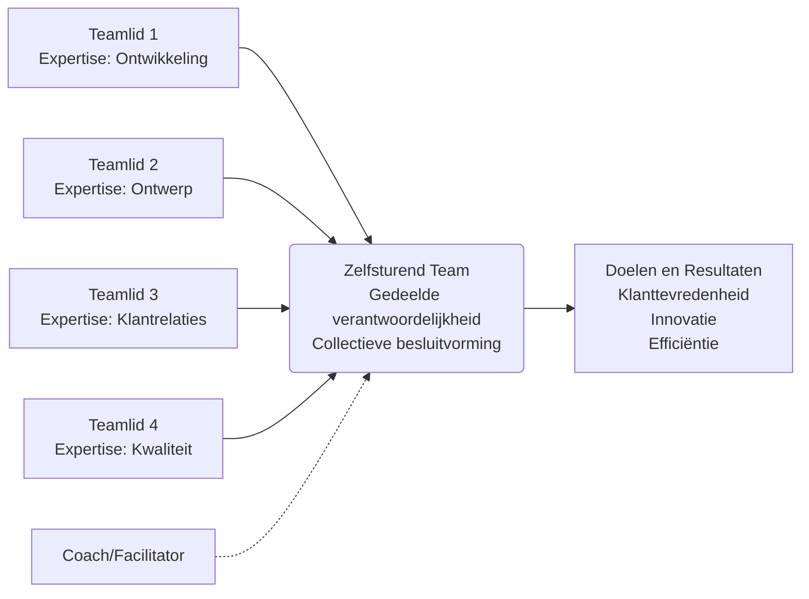

## Hoofdstuk 1: Wat zijn Zelfsturende Teams?

In het hedendaagse organisatielandschap, waar flexibiliteit en innovatie steeds belangrijker worden, vormen zelfsturende teams een krachtig antwoord op de uitdagingen van een snel veranderende wereld. Maar wat verstaan we precies onder dit concept, en hoe onderscheiden zelfsturende teams zich van traditionele werkstructuren?

Zelfsturende teams zijn groepen medewerkers die gezamenlijk verantwoordelijkheid dragen voor het complete werkproces: van planning en uitvoering tot evaluatie en verbetering. Ze opereren met een hoge mate van autonomie, waarbij ze zelfstandig beslissingen nemen over hun werkwijze, problemen oplossen en continu streven naar optimalisatie van hun processen en resultaten. Dit alles gebeurt zonder directe aansturing of controle van een traditionele manager.

[Plaats hier een afbeelding van een zelfsturend team]

### De essentie van zelfsturende teams

De kracht van zelfsturende teams ligt in hun fundamentele kenmerken die samen een nieuwe manier van werken mogelijk maken. Deze kenmerken zijn niet simpelweg losse elementen, maar vormen een geïntegreerd geheel dat de basis legt voor effectieve zelfsturing.

**Autonomie** vormt het hart van zelfsturende teams. Deze autonomie gaat verder dan alleen de vrijheid om taken in te plannen; het omvat de ruimte om zelf te bepalen hoe het werk wordt aangepakt, welke methoden worden gebruikt en hoe resources worden toegewezen. Bij een internationaal bedrijf dat bekend staat om zijn radicale democratische werkwijze, bepalen teams zelfs hun eigen werktijden, kiezen ze hun eigen leiders en stellen ze in sommige gevallen zelfs hun eigen salarissen vast (Semler, 2001). Deze vergaande autonomie heeft geleid tot uitzonderlijke betrokkenheid en innovatie.

Deze autonomie is onlosmakelijk verbonden met **verantwoordelijkheid**. Zelfsturende teams zijn niet alleen vrij in hoe ze werken, maar dragen ook de volledige verantwoordelijkheid voor hun resultaten. Ze zijn aanspreekbaar op het behalen van doelstellingen en de kwaliteit van hun output. Dit creëert een natuurlijke balans: de vrijheid om keuzes te maken gaat hand in hand met de verantwoordelijkheid voor de consequenties van die keuzes.

Een softwarebedrijf in Nederland implementeerde zelfsturende teams waarbij elk team verantwoordelijk werd voor een specifiek productonderdeel, inclusief planning, ontwikkeling, kwaliteitscontrole en klanttevredenheid. Aanvankelijk worstelden sommige teams met deze volledige verantwoordelijkheid, maar na een aanpassingsperiode leidde het tot een dieper gevoel van eigenaarschap en trots in het werk. Een teamlid verwoordde het als volgt: "Vroeger kon ik wijzen naar management als iets niet goed ging. Nu besef ik dat wij als team zelf verantwoordelijk zijn voor ons succes of falen, en dat motiveert me om elke dag mijn beste werk te leveren."

**Collectieve besluitvorming** is een ander cruciaal kenmerk. In plaats van beslissingen die van bovenaf worden opgelegd, ontwikkelen zelfsturende teams processen om gezamenlijk tot besluiten te komen. Dit kan variëren van consensusmodellen tot gedelegeerde besluitvorming, afhankelijk van de context en het type beslissing. Deze collectieve aanpak zorgt ervoor dat diverse perspectieven worden meegenomen, wat vaak leidt tot rijkere en meer doordachte beslissingen.

Bij een middelgrote zorginstelling implementeerde een zelfsturend wijkteam een besluitvormingsmodel waarbij routinebeslissingen werden gedelegeerd aan individuele teamleden met specifieke expertise, terwijl strategische beslissingen collectief werden genomen tijdens wekelijkse teamsessies. Dit hybride model bleek zeer effectief: het combineerde de efficiëntie van individuele besluitvorming met de rijkdom van collectieve wijsheid waar dat het meest waardevol was.

**Probleemoplossend vermogen** is essentieel voor zelfsturende teams. Zonder een manager die obstakels wegneemt, moeten teams in staat zijn om zelf problemen te identificeren, analyseren en op te lossen. Dit vereist niet alleen technische vaardigheden, maar ook creativiteit, doorzettingsvermogen en het vermogen om buiten gebaande paden te denken.

**Continue verbetering** vormt de dynamische component van zelfsturende teams. Ze zijn niet tevreden met de status quo, maar zoeken voortdurend naar manieren om hun processen, producten en diensten te verbeteren. Dit manifesteert zich in regelmatige reflectiemomenten, experimenten met nieuwe werkwijzen en een cultuur waarin feedback wordt gewaardeerd als een middel tot groei.

### De structuur van zelfsturende teams

De structuur van zelfsturende teams verschilt fundamenteel van traditionele hiërarchische structuren. In plaats van een piramide met duidelijke gezagslijnen, functioneren zelfsturende teams meer als een netwerk van onderling verbonden rollen en verantwoordelijkheden. Deze structuur is niet statisch maar dynamisch, en past zich aan naarmate de behoeften van het team en de organisatie evolueren.

In deze structuur brengt elk teamlid unieke expertise en perspectieven in, die samen bijdragen aan het bereiken van gemeenschappelijke doelen. De rol van een coach of facilitator (indien aanwezig) is niet om te sturen of te controleren, maar om het team te ondersteunen in hun ontwikkeling en het overwinnen van obstakels.

Bij een innovatieve hypotheekverstrekker in Nederland is de organisatie opgebouwd uit zelfsturende teams zonder traditionele managers. In plaats daarvan heeft elk team een "lead link" die verantwoordelijk is voor het verbinden van het team met de rest van de organisatie, en een "facilitator" die het team helpt bij het optimaliseren van hun processen. Deze rollen roteren regelmatig tussen teamleden, wat zorgt voor een dynamische structuur waarin leiderschap wordt gedeeld en iedereen de kans krijgt om verschillende perspectieven te ervaren (Laloux, 2014).

### Traditionele hiërarchische teams vs. zelfsturende teams: een paradigmaverschuiving

De overgang van traditionele naar zelfsturende teams vertegenwoordigt niet slechts een structurele verandering, maar een fundamentele verschuiving in hoe we denken over werk, leiderschap en menselijk potentieel. Deze paradigmaverschuiving manifesteert zich in verschillende dimensies:

| Dimensie         | Traditionele teams | Zelfsturende teams |
| ---------------- | ------------------ | ------------------- |
| Leiderschap      | Top-down, geconcentreerd bij formele leiders | Gedeeld, situationeel, gebaseerd op expertise en context |
| Besluitvorming   | Centraal, vaak vertraagd door goedkeuringsprocessen | Decentraal, dicht bij waar de informatie beschikbaar is |
| Verantwoordelijkheid | Individueel, gefragmenteerd per functie | Collectief, gedeeld voor het gehele proces en resultaat |
| Autonomie        | Beperkt, binnen voorgeschreven kaders | Hoog, met ruimte voor eigen invulling en innovatie |
| Focus            | Taken en activiteiten | Resultaten en waardecreatie |
| Aanpassingsvermogen | Traag, beperkt door hiërarchie | Snel, direct reagerend op veranderingen |
| Leren en ontwikkeling | Gestuurd door management, formele training | Continu, peer-to-peer, geïntegreerd in het werk |
| Motivatie        | Vaak extrinsiek, gebaseerd op beloning en controle | Intrinsiek, gebaseerd op autonomie, meesterschap en zingeving |

Deze verschillen zijn niet zwart-wit; in de praktijk bevinden veel teams zich ergens op een continuüm tussen deze twee modellen. De verschuiving naar zelfsturing is vaak een geleidelijk proces, waarbij teams stap voor stap meer autonomie en verantwoordelijkheid krijgen.

Een financiële dienstverlener implementeerde zelfsturende teams in fasen. Ze begonnen met het geven van teams meer autonomie over hun dagelijkse werkprocessen, terwijl strategische beslissingen nog centraal werden genomen. Naarmate teams meer ervaring en vertrouwen opbouwden, kregen ze geleidelijk meer verantwoordelijkheden, inclusief budgetbeheer, personeelsplanning en strategische besluitvorming. Deze geleidelijke aanpak stelde zowel teams als de bredere organisatie in staat om te wennen aan de nieuwe manier van werken en de nodige vaardigheden en systemen te ontwikkelen.

### De evolutie van zelfsturende teams: van experiment naar mainstream

Het concept van zelfsturende teams heeft een rijke historische ontwikkeling doorgemaakt, evoluerend van radicaal experiment naar een steeds meer geaccepteerde organisatievorm. Deze evolutie weerspiegelt bredere verschuivingen in ons denken over werk, leiderschap en menselijk potentieel.

De wortels van zelfsturende teams liggen in de sociotechnische systeemtheorie die in de jaren 1950 en 1960 werd ontwikkeld aan het Tavistock Institute in Londen. Onderzoekers zoals Eric Trist en Fred Emery bestudeerden Britse kolenmijnen en ontdekten dat teams die autonomie hadden over hun werkmethoden niet alleen gelukkiger waren, maar ook productiever dan teams die werkten onder strikte hiërarchische controle (Trist & Bamforth, 1951). Deze bevindingen legden de basis voor het idee dat optimale prestaties worden bereikt wanneer zowel de sociale als de technische aspecten van werk worden geoptimaliseerd.

In de jaren 1970 en 1980 experimenteerden bedrijven zoals Volvo en Toyota met verschillende vormen van teamautonomie in hun productiefaciliteiten. Volvo's fabriek in Kalmar, Zweden, werd beroemd om zijn teamgebaseerde productiesysteem, waarbij teams verantwoordelijk waren voor complete assemblageprocessen in plaats van individuele taken aan een lopende band (Berggren, 1992). Toyota's productiesysteem, met zijn focus op continue verbetering (kaizen) en respect voor mensen, integreerde elementen van zelfsturing in een lean productieomgeving (Liker, 2004).

De jaren 1990 zagen een bredere adoptie van zelfsturende teams, vooral in kennisintensieve industrieën zoals software-ontwikkeling. Bedrijven als W.L. Gore (maker van Gore-Tex) en Morning Star (een tomatenverwerkingsbedrijf) gingen nog verder door hiërarchie grotendeels te elimineren en te vervangen door netwerken van zelfsturende teams en peer-to-peer commitments (Hamel, 2011).

In de 21e eeuw hebben nieuwe organisatiemodellen zoals Holacracy (ontwikkeld door Brian Robertson en geïmplementeerd bij bedrijven zoals Zappos) en Sociocracy 3.0 de principes van zelfsturing verder geformaliseerd en gecodificeerd (Robertson, 2015). Deze modellen bieden gestructureerde frameworks voor gedistribueerde besluitvorming, dynamische rollenverdelingen en evolutionaire verandering.

### Hedendaagse manifestaties van zelfsturing

In het huidige organisatielandschap manifesteert zelfsturing zich in verschillende vormen, elk met eigen accenten en toepassingen:

**Agile werkwijzen** hebben zelfsturende teams tot een hoeksteen gemaakt van moderne softwareontwikkeling. Scrum-teams, bijvoorbeeld, zijn zelfsturend binnen de kaders van sprints en product backlogs. Ze bepalen zelf hoe ze user stories implementeren, verdelen het werk onderling, en houden dagelijkse stand-ups om voortgang te bespreken en obstakels te identificeren. De rol van de Scrum Master is niet om het team te managen, maar om hen te faciliteren en belemmeringen weg te nemen (Schwaber & Sutherland, 2020).

Een verzekeringsbedrijf in Nederland implementeerde Agile werkwijzen waarbij multidisciplinaire teams verantwoordelijk werden voor complete klantreistrajecten. Elk team bestond uit specialisten in claims, polisbeheer, klantenservice en IT, die samen werkten aan het optimaliseren van de klantervaring. Deze teams hadden de vrijheid om hun eigen processen te ontwerpen en verbeteringen door te voeren zonder goedkeuring van hogerhand. Het resultaat was een drastische verkorting van doorlooptijden en een significante verbetering in klanttevredenheid.

**Holacracy** biedt een meer geformaliseerd framework voor zelfsturing, met duidelijke regels voor besluitvorming, rollenverdelingen en organisatorische evolutie. In plaats van een traditionele hiërarchie werkt Holacracy met "cirkels" (teams) die genest zijn binnen grotere cirkels. Elke cirkel heeft autonomie binnen zijn domein, en rollen worden dynamisch aangepast naarmate de behoeften van de organisatie evolueren (Robertson, 2015).

**Lean management**, met zijn focus op continue verbetering en respect voor mensen, integreert elementen van zelfsturing in een breder framework voor operationele excellentie. Lean teams hebben de autonomie en verantwoordelijkheid om verspilling te identificeren en te elimineren, processen te verbeteren en kwaliteitsproblemen op te lossen (Womack & Jones, 2003).

**Teal organisaties**, een concept geïntroduceerd door Frederic Laloux in zijn boek "Reinventing Organizations", vertegenwoordigen een evolutionaire stap in organisatieontwikkeling. Deze organisaties worden gekenmerkt door zelfsturing, heelheid (het verwelkomen van de hele persoon op het werk) en een evolutionair doel (de organisatie als een levend organisme met een eigen richting) (Laloux, 2014).

Dezelfde hypotheekverstrekker die eerder werd genoemd, heeft zich ontwikkeld tot een "Teal" organisatie met volledig zelfsturende teams, radicale transparantie (inclusief salarissen) en een sterke focus op purpose en menselijke ontwikkeling. De organisatie heeft geen managers, maar werkt met rollen die roteren tussen teamleden. Beslissingen worden genomen door degenen die er het meest door worden beïnvloed, na advies van relevante experts en belanghebbenden. Dit "adviesproces" zorgt voor zowel autonomie als alignment binnen de organisatie.

### Zelfsturing in de praktijk: een Nederlands succesverhaal

Om de principes van zelfsturende teams in actie te illustreren, kijken we naar een concreet voorbeeld uit de Nederlandse praktijk.

Een middelgroot marketingbureau worstelde met hoge werkdruk, verminderde creativiteit en toenemend personeelsverloop. Projecten werden traditioneel gemanaged, met accountmanagers die de klantrelatie beheerden, creatief directeuren die de creatieve richting bepaalden, en uitvoerende professionals (ontwerpers, copywriters, developers) die taken uitvoerden volgens strakke specificaties en deadlines.

Na een periode van reflectie en marktonderzoek besloot de directie om te experimenteren met zelfsturende teams. Ze vormden multidisciplinaire teams rond specifieke klanten of industrieën, waarbij elk team bestond uit professionals met verschillende expertisegebieden. Deze teams kregen volledige verantwoordelijkheid voor hun klantenportfolio, van acquisitie en conceptontwikkeling tot uitvoering en evaluatie.

De transitie verliep niet zonder uitdagingen. Sommige medewerkers, gewend aan duidelijke richtlijnen en afgebakende verantwoordelijkheden, voelden zich aanvankelijk onzeker in de nieuwe structuur. Voormalige managers worstelden met hun nieuwe rol als coach en facilitator. En sommige klanten waren verward door het nieuwe model, waarbij ze niet langer één vast aanspreekpunt hadden maar met het hele team communiceerden.

Om deze uitdagingen te adresseren, investeerde het bureau in training en coaching. Teams kregen workshops in besluitvorming, conflicthantering en effectieve communicatie. Coaches werkten één-op-één met teamleden die moeite hadden met de transitie. En klanten werden zorgvuldig geïntroduceerd in de nieuwe werkwijze, met duidelijke uitleg over de voordelen die het voor hen zou opleveren.

Na een jaar waren de resultaten opmerkelijk. De klanttevredenheid was gestegen met 25%, omdat klanten nu direct toegang hadden tot het volledige creatieve team en snellere, meer geïntegreerde oplossingen kregen. De medewerkerstevredenheid was toegenomen, met een daling in ziekteverzuim en personeelsverloop. En de creativiteit bloeide op, met teams die innovatieve, cross-disciplinaire oplossingen ontwikkelden die voorheen niet mogelijk waren geweest in de silowerking van het oude model.

Een van de meest verrassende uitkomsten was de spontane ontwikkeling van kennisdeling en innovatie tussen teams. Zonder formele structuren begonnen teams regelmatig "show & tell" sessies te organiseren waar ze hun werk en learnings deelden. Dit leidde tot een rijke kruisbestuiving van ideeën en technieken die de algehele kwaliteit van het werk verder verhoogde.

De sleutelfactoren in dit succes waren:
1. Een duidelijke visie en purpose die teams richting gaf zonder hun autonomie te beperken
2. Investering in de ontwikkeling van de benodigde vaardigheden en mindsets
3. Geduld en ruimte voor teams om te experimenteren en te leren van fouten
4. Aanpassing van systemen (zoals beloningen en evaluaties) om teamwerk te ondersteunen
5. Leiderschap dat dienend was aan de teams in plaats van controlerend

### Reflectievragen voor uw organisatie

Om de potentiële waarde van zelfsturende teams voor uw eigen context te verkennen, overweeg de volgende vragen:

1. Welke aspecten van uw huidige werkprocessen zouden baat kunnen hebben bij meer autonomie en gedeelde verantwoordelijkheid?

2. Hoe zou zelfsturing kunnen bijdragen aan het adresseren van uitdagingen waar uw team of organisatie momenteel mee worstelt?

3. Welke vaardigheden en mindsets zouden uw teamleden moeten ontwikkelen om effectief te functioneren in een zelfsturende omgeving?

4. Welke elementen van uw huidige organisatiecultuur zouden zelfsturing ondersteunen, en welke zouden belemmerend kunnen werken?

5. Hoe zou uw eigen rol veranderen in een meer zelfsturende context, en welke aanpassingen zou dit van u vragen?

### Praktische eerste stappen naar zelfsturing

De reis naar zelfsturing begint niet met een radicale reorganisatie, maar met doordachte, incrementele stappen die ruimte creëren voor autonomie en gedeelde verantwoordelijkheid:

1. **Begin met het delegeren van betekenisvolle beslissingen** aan uw team. Kies beslissingen die impact hebben op hun werk en waar hun expertise waardevol is. Bijvoorbeeld, laat het team beslissen over de aanpak van een project, de verdeling van taken, of de oplossing voor een terugkerend probleem.

2. **Creëer regelmatige reflectiemomenten** waarin het team kan bespreken wat goed gaat, wat beter kan, en hoe ze hun werkprocessen kunnen verbeteren. Deze retrospectives zijn een krachtig instrument voor continue verbetering en teamleren.

3. **Experimenteer met roulerende rollen** voor specifieke verantwoordelijkheden zoals het faciliteren van vergaderingen, het bijhouden van voortgang, of het vertegenwoordigen van het team naar buiten. Dit bouwt capaciteit binnen het team en voorkomt afhankelijkheid van één persoon.

4. **Investeer in de ontwikkeling van cruciale vaardigheden** zoals effectieve communicatie, constructieve feedback, besluitvorming en conflicthantering. Deze vaardigheden vormen het fundament voor succesvolle zelfsturing.

5. **Vier successen en leer van mislukkingen**. Erken en vier wanneer het team goede resultaten behaalt door zelfsturing. Maar creëer ook een veilige omgeving waarin mislukkingen worden gezien als waardevolle leermomenten, niet als redenen om terug te keren naar meer controle.

Door deze stappen te nemen, kunt u geleidelijk een omgeving creëren waarin zelfsturing kan floreren, zonder de risico's van een abrupte, allesomvattende transformatie.

### Bronnen

Berggren, C. (1992). *Alternatives to Lean Production: Work Organization in the Swedish Auto Industry*. Cornell University Press.

Hamel, G. (2011). First, Let's Fire All the Managers. *Harvard Business Review*, 89(12), 48-60.

Laloux, F. (2014). *Reinventing Organizations: A Guide to Creating Organizations Inspired by the Next Stage of Human Consciousness*. Nelson Parker.

Liker, J. K. (2004). *The Toyota Way: 14 Management Principles from the World's Greatest Manufacturer*. McGraw-Hill.

Robertson, B. J. (2015). *Holacracy: The New Management System for a Rapidly Changing World*. Henry Holt and Co.

Schwaber, K., & Sutherland, J. (2020). *The Scrum Guide: The Definitive Guide to Scrum: The Rules of the Game*.

Semler, R. (2001). *Maverick: The Success Story Behind the World's Most Unusual Workplace*. Random House.

Trist, E. L., & Bamforth, K. W. (1951). Some Social and Psychological Consequences of the Longwall Method of Coal-Getting: An Examination of the Psychological Situation and Defences of a Work Group in Relation to the Social Structure and Technological Content of the Work System. *Human Relations*, 4(1), 3-38.

Womack, J. P., & Jones, D. T. (2003). *Lean Thinking: Banish Waste and Create Wealth in Your Corporation*. Free Press.
