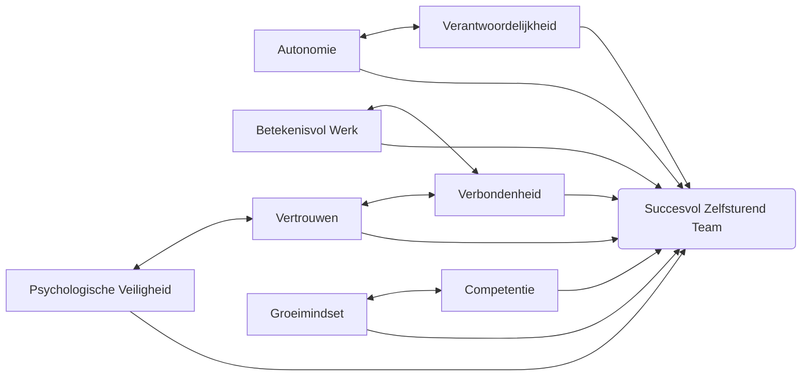

## Hoofdstuk 2: De Psychologie achter Zelfsturende Teams

De kracht van zelfsturende teams ligt niet alleen in hun organisatiestructuur, maar vooral in hoe ze aansluiten bij fundamentele menselijke psychologische behoeften. Om het succes van zelfsturende teams volledig te begrijpen, moeten we kijken naar de psychologische principes die eraan ten grondslag liggen en hoe deze bijdragen aan verhoogde motivatie, betrokkenheid en prestaties.

[Plaats hier een afbeelding van de psychologie achter zelfsturende teams]

### De zelfbeschikkingstheorie: fundament voor intrinsieke motivatie

De zelfbeschikkingstheorie (Self-Determination Theory) van psychologen Richard Ryan en Edward Deci biedt een krachtig kader om te begrijpen waarom zelfsturende teams zo effectief kunnen zijn. Deze theorie stelt dat mensen drie fundamentele psychologische behoeften hebben: autonomie, competentie en verbondenheid. Wanneer deze behoeften worden vervuld, ervaren mensen intrinsieke motivatie – de natuurlijke neiging om te leren, te groeien en uitdagingen aan te gaan vanuit een innerlijke drijfveer, niet vanwege externe beloningen of druk (Ryan & Deci, 2000).

**Autonomie** – de behoefte om zelf keuzes te maken en controle te hebben over het eigen leven – staat centraal in zelfsturende teams. Wanneer medewerkers zelf kunnen beslissen hoe ze hun werk aanpakken, welke methoden ze gebruiken en hoe ze hun tijd indelen, ervaren ze een gevoel van eigenaarschap en persoonlijke verantwoordelijkheid. Dit gevoel van autonomie is een krachtige motivator die leidt tot hogere betrokkenheid, creativiteit en doorzettingsvermogen.

Een onderzoek bij een technologiebedrijf in Nederland toonde aan dat teams die meer autonomie kregen over hun werkprocessen niet alleen productiever waren, maar ook significant hogere niveaus van werkplezier en betrokkenheid rapporteerden. Een teamlid verwoordde het als volgt: "Voor het eerst in mijn carrière voel ik dat ik echt mezelf kan zijn op het werk. Ik hoef niet te wachten op toestemming om een goed idee uit te voeren, en dat geeft me enorm veel energie."

**Competentie** – de behoefte om effectief te zijn en te groeien in vaardigheden – wordt in zelfsturende teams bevorderd doordat medewerkers worden aangemoedigd om hun talenten te ontwikkelen en in te zetten. In plaats van beperkt te worden tot nauw gedefinieerde functieomschrijvingen, kunnen teamleden in zelfsturende teams rollen en taken op zich nemen die aansluiten bij hun sterke punten en ontwikkelingsambities.

Bij een financiële dienstverlener werd een zelfsturend team gevormd waarin een medewerker met een passie voor data-analyse, maar zonder formele rol in dit gebied, de kans kreeg om een dashboard te ontwikkelen voor klanttevredenheid. Dit project leidde niet alleen tot waardevolle inzichten voor het bedrijf, maar stelde de medewerker ook in staat om nieuwe vaardigheden te ontwikkelen en erkenning te krijgen voor talenten die in een traditionele structuur onopgemerkt zouden zijn gebleven.

**Verbondenheid** – de behoefte om betekenisvolle relaties te hebben en deel uit te maken van een gemeenschap – wordt versterkt in zelfsturende teams door de intensievere samenwerking en gedeelde verantwoordelijkheid. Wanneer teamleden samen beslissingen nemen, problemen oplossen en successen vieren, ontstaat een dieper gevoel van verbondenheid dan in hiërarchische structuren waar relaties vaak worden gedefinieerd door rapportagelijnen.

Een zelfsturend team in een zorginstelling ontwikkelde een sterke onderlinge band door samen de verantwoordelijkheid te dragen voor de zorg van hun patiënten. Een verpleegkundige beschreef: "We zijn niet langer individuele zorgverleners die toevallig in hetzelfde gebouw werken. We zijn een hecht team dat samen verantwoordelijk is voor het welzijn van onze patiënten. We kennen elkaars sterke punten en zwaktes, en we steunen elkaar door dik en dun."

### De psychologie van talentontwikkeling en -benutting

Zelfsturende teams creëren een unieke omgeving waarin talenten kunnen floreren op manieren die in traditionele structuren vaak niet mogelijk zijn. Dit komt door verschillende psychologische mechanismen:

**Natuurlijke rolontwikkeling** in plaats van opgelegde functies. In zelfsturende teams ontstaan rollen vaak organisch, gebaseerd op natuurlijke sterktes, interesses en de behoeften van het team. Dit contrasteert met traditionele organisaties waar functies vaak rigide zijn gedefinieerd en mensen moeten passen in vooraf bepaalde vakjes.

Een softwareontwikkelingsteam bij een e-commercebedrijf ontdekte dat een van hun ontwikkelaars een natuurlijk talent had voor het communiceren met klanten en het vertalen van technische concepten naar begrijpelijke taal. Zonder formele herstructurering nam deze persoon geleidelijk een rol op zich als liaison tussen het ontwikkelteam en de klanten, wat leidde tot betere productontwikkeling en hogere klanttevredenheid. In een traditionele structuur zou deze overgang waarschijnlijk maanden van goedkeuringen en formele functiewijzigingen hebben vereist.

**Psychologische veiligheid** – het gedeelde geloof dat het team een veilige omgeving is voor interpersoonlijk risico nemen – is cruciaal voor talentontwikkeling. In zelfsturende teams, waar hiërarchische barrières zijn verminderd, kunnen mensen zich veiliger voelen om nieuwe ideeën te delen, vragen te stellen en fouten te maken zonder angst voor negatieve consequenties.

Google's Project Aristotle, een uitgebreid onderzoek naar teameffectiviteit, identificeerde psychologische veiligheid als de belangrijkste factor voor succesvolle teams (Rozovsky, 2015). Zelfsturende teams die bewust investeren in het creëren van een veilige omgeving – door bijvoorbeeld open communicatie te bevorderen, actief te luisteren en constructieve feedback te geven – zien vaak een bloei van creativiteit en innovatie omdat mensen zich vrij voelen om hun volledige potentieel te benutten.

**Groeimindset cultivering** gebeurt natuurlijk in zelfsturende teams. Het concept van de groeimindset, ontwikkeld door psycholoog Carol Dweck, beschrijft het geloof dat vaardigheden en intelligentie kunnen worden ontwikkeld door toewijding en hard werken (Dweck, 2006). In zelfsturende teams, waar mensen worden aangemoedigd om nieuwe rollen te proberen en buiten hun comfortzone te treden, wordt een groeimindset gestimuleerd.

Een zelfsturend marketingteam bij een mediabedrijf implementeerde een "leercultuur" waarin teamleden werden aangemoedigd om regelmatig nieuwe vaardigheden te leren en te delen met het team. Ze reserveerden elke vrijdagmiddag voor kennisdeling en experimenteren met nieuwe technieken. Deze praktijk leidde niet alleen tot een bredere vaardighedenset binnen het team, maar ook tot een cultuur waarin continu leren werd gewaardeerd en gevierd.

### Het psychologische ecosysteem van succesvolle zelfsturende teams

Het succes van zelfsturende teams is niet afhankelijk van één enkele factor, maar van een complex samenspel van psychologische elementen die elkaar versterken en een positief ecosysteem creëren. Dit ecosysteem kan worden gevisualiseerd als een netwerk van onderling verbonden factoren:

In dit ecosysteem versterken de verschillende elementen elkaar. Autonomie en verantwoordelijkheid zijn bijvoorbeeld nauw met elkaar verbonden: meer autonomie leidt tot een groter gevoel van verantwoordelijkheid, en het nemen van verantwoordelijkheid rechtvaardigt meer autonomie. Evenzo versterken vertrouwen en psychologische veiligheid elkaar: in een omgeving waar mensen zich veilig voelen, groeit het vertrouwen, en waar vertrouwen heerst, voelen mensen zich veiliger om zichzelf te uiten.

Een cruciaal element in dit ecosysteem is **betekenisvol werk** – het gevoel dat het werk dat men doet waardevol is en bijdraagt aan een groter geheel. Zelfsturende teams hebben vaak een directer zicht op de impact van hun werk, omdat ze betrokken zijn bij het hele proces in plaats van slechts een klein onderdeel. Dit gevoel van betekenis is een krachtige motivator die bijdraagt aan werkgeluk en betrokkenheid.

Bij een uitgeverij werd een zelfsturend team verantwoordelijk voor het complete publicatieproces van een tijdschrift, van conceptontwikkeling tot distributie. Waar medewerkers voorheen slechts een klein deel van het proces zagen, hadden ze nu zicht op hoe hun werk bijdroeg aan het eindproduct en de impact ervan op lezers. Een redacteur beschreef: "Vroeger bewerkte ik artikelen zonder te weten wat ermee gebeurde. Nu zie ik hoe mijn werk bijdraagt aan een tijdschrift waar lezers enthousiast over zijn, en dat geeft mijn werk een heel nieuwe dimensie van betekenis."

### De transformatieve impact op werkgeluk en betrokkenheid

De psychologische voordelen van zelfsturende teams vertalen zich direct naar meetbare verbeteringen in werkgeluk, betrokkenheid en prestaties. Deze impact manifesteert zich op verschillende niveaus:

**Op individueel niveau** ervaren medewerkers in zelfsturende teams vaak een dieper gevoel van voldoening en zingeving in hun werk. Ze hebben meer controle over hun dagelijkse activiteiten, kunnen hun sterke punten beter benutten, en zien een directere link tussen hun inspanningen en resultaten. Dit leidt tot hogere niveaus van werkgeluk en intrinsieke motivatie.

Een longitudinaal onderzoek bij een consultancybedrijf volgde medewerkers voor en na de transitie naar zelfsturende teams. Na een jaar rapporteerden medewerkers gemiddeld 27% hogere scores op werkgeluk en 34% hogere scores op betekenisvol werk. Interessant genoeg waren deze verbeteringen het sterkst bij medewerkers die aanvankelijk het meest sceptisch waren over de verandering.

**Op teamniveau** leidt de verhoogde autonomie en gedeelde verantwoordelijkheid tot sterkere samenwerkingsverbanden en een dieper gevoel van verbondenheid. Teams ontwikkelen een collectieve identiteit en trots op hun werk, wat resulteert in hogere collectieve effectiviteit – het gedeelde geloof in het vermogen van het team om doelen te bereiken.

Een zelfsturend team bij een gemeente ontwikkelde een sterke teamidentiteit die zich uitte in gedeelde rituelen, zoals wekelijkse reflectiemomenten en gezamenlijke vieringen van successen. Deze collectieve praktijken versterkten het gevoel van verbondenheid en creëerden een positieve teamcultuur die nieuwe teamleden snel absorbeerden.

**Op organisatieniveau** vertalen de psychologische voordelen van zelfsturende teams zich in tastbare bedrijfsresultaten: lager ziekteverzuim, minder personeelsverloop, hogere productiviteit en meer innovatie. Organisaties met zelfsturende teams zijn vaak veerkrachtiger in tijden van verandering, omdat medewerkers gewend zijn aan autonomie en probleemoplossing.

### Wetenschappelijke onderbouwing: wat zegt het onderzoek?

De psychologische voordelen van zelfsturende teams worden ondersteund door een groeiend corpus van wetenschappelijk onderzoek:

Een meta-analyse van 42 studies door de Universiteit van Amsterdam toonde aan dat zelfsturende teams geassocieerd worden met gemiddeld 23% hogere medewerkerstevredenheid en 17% hogere productiviteit vergeleken met traditioneel gemanagede teams (De Vries et al., 2018). Deze effecten waren het sterkst in kennisintensieve industrieën en in organisaties met een ondersteunende cultuur.

Onderzoek van Gallup heeft consistent aangetoond dat autonomie en de mogelijkheid om dagelijks te doen waar je goed in bent behoren tot de belangrijkste voorspellers van werkbetrokkenheid (Harter et al., 2016). Hun data laat zien dat teams met hoge niveaus van autonomie en talentontwikkeling gemiddeld 41% minder kwaliteitsdefecten produceren, 22% hogere winstgevendheid hebben, en 37% minder absenteïsme ervaren.

Een longitudinale studie bij een zorgnetwerk volgde de implementatie van zelfsturende teams over een periode van drie jaar. De resultaten toonden niet alleen verbeteringen in medewerkerstevredenheid en patiënttevredenheid, maar ook in klinische uitkomsten. Teams die hogere scores hadden op psychologische veiligheid en collectieve effectiviteit vertoonden de sterkste verbeteringen, wat het belang van deze psychologische factoren onderstreept.

Neurowetenschappelijk onderzoek biedt ook inzichten in waarom zelfsturende teams zo effectief kunnen zijn. fMRI-studies hebben aangetoond dat autonomie en betekenisvol werk dopamineproductie stimuleren – een neurotransmitter geassocieerd met motivatie en beloning – en activiteit verhogen in hersengebieden geassocieerd met creativiteit en complex denken (Rock & Cox, 2012). Dit suggereert dat de psychologische voordelen van zelfsturende teams een neurologische basis hebben.

### De psychologische uitdagingen van zelfsturing

Hoewel zelfsturende teams significante psychologische voordelen bieden, brengen ze ook unieke uitdagingen met zich mee die aandacht en ondersteuning vereisen:

**Omgaan met ambiguïteit en onzekerheid** kan voor sommige teamleden een uitdaging zijn. In traditionele structuren bieden duidelijke hiërarchieën, functieomschrijvingen en procedures een gevoel van zekerheid en duidelijkheid. In zelfsturende teams moeten mensen leren navigeren in een omgeving met meer ambiguïteit, wat voor sommigen stress en onzekerheid kan veroorzaken.

Een IT-bedrijf dat overstapte op zelfsturende teams merkte dat ongeveer 20% van de medewerkers moeite had met de toegenomen ambiguïteit. Ze implementeerden een ondersteuningsprogramma met coaching en peer-mentoring, specifiek gericht op het ontwikkelen van vaardigheden voor het omgaan met onzekerheid. Dit programma hielp medewerkers om ambiguïteit te zien als een kans voor creativiteit en groei in plaats van als een bron van stress.

**Balanceren tussen autonomie en alignment** is een andere psychologische uitdaging. Mensen hebben behoefte aan zowel vrijheid als structuur, aan zowel individuele expressie als collectieve richting. In zelfsturende teams kan het vinden van de juiste balans tussen deze schijnbaar tegenstrijdige behoeften complex zijn.

Een productiebedrijf loste dit op door wat ze noemden "minimale kritieke specificaties" te ontwikkelen – een beperkte set van duidelijke kaders en principes die richting gaven zonder de autonomie van teams te beperken. Teams hadden volledige vrijheid in hoe ze opereerden binnen deze kaders, wat zowel de behoefte aan autonomie als aan duidelijkheid bevredigde.

**Interpersoonlijke dynamiek en conflicthantering** worden complexer in zelfsturende teams, waar traditionele hiërarchieën niet beschikbaar zijn om conflicten op te lossen. Teams moeten leren om constructief om te gaan met verschillende perspectieven, stijlen en persoonlijkheden zonder te kunnen terugvallen op een manager die beslissingen neemt.

Een consultancybureau investeerde in training voor alle teamleden in constructieve conflicthantering en non-violente communicatie. Ze ontwikkelden ook een peer-mediationproces waarbij teamleden uit andere teams konden worden ingeschakeld om te helpen bij het oplossen van vastgelopen conflicten. Deze aanpak erkende dat conflict een natuurlijk en potentieel waardevol onderdeel is van teamwerk, maar dat teams ondersteuning nodig hebben om er constructief mee om te gaan.

### Praktische toepassingen: de psychologie vertalen naar actie

Het begrijpen van de psychologische principes achter zelfsturende teams is waardevol, maar de echte impact komt van het vertalen van deze inzichten naar concrete praktijken en interventies:

**Creëer psychologische veiligheid** door:
- Actief te luisteren en alle perspectieven te waarderen
- Fouten te behandelen als leermogelijkheden, niet als mislukkingen
- Transparant te zijn over onzekerheden en kwetsbaarheden
- Constructieve feedback te normaliseren in alle richtingen

**Versterk intrinsieke motivatie** door:
- Betekenisvolle doelen te verbinden aan dagelijkse taken
- Ruimte te geven voor autonomie in hoe werk wordt uitgevoerd
- Mogelijkheden te creëren voor continue ontwikkeling en groei
- Successen te vieren en erkenning te geven voor bijdragen

**Bevorder talentontwikkeling** door:
- Regelmatige reflectiemomenten over sterktes en interesses
- Flexibele rolverdelingen die aansluiten bij natuurlijke talenten
- Peer-coaching en kennisdeling te faciliteren
- Experimenteerruimte te bieden voor het ontwikkelen van nieuwe vaardigheden

Een technologiebedrijf implementeerde een "talentmarktplaats" binnen hun zelfsturende teams. Teamleden konden projecten of taken posten waarvoor ze hulp nodig hadden, en anderen konden zich aanmelden op basis van hun interesses of ontwikkelingsdoelen. Dit systeem maakte het mogelijk voor mensen om nieuwe vaardigheden te ontwikkelen en hun talenten breder in te zetten dan hun formele rol zou toestaan.

### Reflectievragen voor leiders en teams

Om de psychologische dimensie van zelfsturende teams in uw eigen context te verkennen, overweeg de volgende vragen:

1. In hoeverre worden de fundamentele psychologische behoeften (autonomie, competentie, verbondenheid) van teamleden momenteel vervuld in uw organisatie?

2. Welke aspecten van uw huidige cultuur en werkwijzen bevorderen psychologische veiligheid, en welke belemmeren deze?

3. Hoe zou u de balans tussen autonomie en alignment kunnen verbeteren in uw teams?

4. Welke mechanismen heeft u om talenten te identificeren en te ontwikkelen buiten formele functieomschrijvingen?

5. Hoe meet en evalueert u momenteel het werkgeluk en de betrokkenheid van uw medewerkers, en hoe zou u deze inzichten kunnen gebruiken om uw aanpak te verfijnen?

### Praktische hulpmiddelen voor psychologische ondersteuning

Om de psychologische dimensie van zelfsturende teams te ondersteunen, kunt u de volgende praktische hulpmiddelen overwegen:

1. **Team Canvas** - Een visueel hulpmiddel om teamdoelen, waarden, sterktes en werkafspraken expliciet te maken, wat bijdraagt aan gedeeld begrip en psychologische veiligheid.

2. **Sterkte-gebaseerde rolontwikkeling** - Een gestructureerd proces om rollen te definiëren en toe te wijzen op basis van natuurlijke sterktes en interesses in plaats van traditionele functieomschrijvingen.

3. **Reflectie- en feedbackprotocollen** - Gestructureerde methoden voor individuele en collectieve reflectie die dieper leren en continue verbetering bevorderen.

4. **Besluitvormingsmatrices** - Hulpmiddelen om duidelijkheid te creëren over hoe verschillende soorten beslissingen worden genomen, wat bijdraagt aan zowel autonomie als alignment.

5. **Psychologische veiligheidsmetingen** - Regelmatige assessments om het niveau van psychologische veiligheid in teams te meten en gebieden voor verbetering te identificeren.

Door bewust aandacht te besteden aan de psychologische dimensie van zelfsturende teams, kunt u een omgeving creëren waarin mensen niet alleen effectief samenwerken, maar ook floreren als individuen, hun volledige potentieel ontwikkelen, en diepere voldoening vinden in hun werk.

### Bronnen

De Vries, R. E., Van den Hooff, B., & De Ridder, J. A. (2018). Self-managing teams and employee outcomes: The mediating role of need satisfaction. *Journal of Organizational Behavior*, 39(4), 406-421.

Dweck, C. S. (2006). *Mindset: The new psychology of success*. Random House.

Harter, J. K., Schmidt, F. L., Agrawal, S., Plowman, S. K., & Blue, A. (2016). *The relationship between engagement at work and organizational outcomes*. Gallup.

Rock, D., & Cox, C. (2012). SCARF in 2012: Updating the social neuroscience of collaborating with others. *NeuroLeadership Journal*, 4, 1-16.

Rozovsky, J. (2015). The five keys to a successful Google team. *re:Work*. https://rework.withgoogle.com/blog/five-keys-to-a-successful-google-team/

Ryan, R. M., & Deci, E. L. (2000). Self-determination theory and the facilitation of intrinsic motivation, social development, and well-being. *American Psychologist*, 55(1), 68-78.
