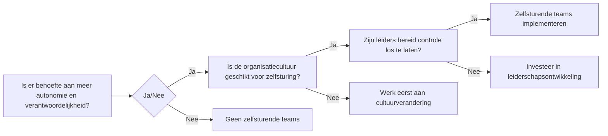

## Hoofdstuk 3: Waarom Zelfsturende Teams Implementeren?

In een wereld waarin organisaties steeds sneller moeten inspelen op veranderende marktomstandigheden en klantverwachtingen, bieden zelfsturende teams een krachtig antwoord. De implementatie van zelfsturende teams is niet slechts een organisatorische herstructurering, maar een fundamentele verschuiving in hoe we denken over werk, leiderschap en menselijk potentieel.

[Plaats hier een infographic over de voordelen van zelfsturende teams]

### De business case voor zelfsturende teams

De overtuigende business case voor zelfsturende teams is gebaseerd op een reeks onderling verbonden voordelen die zowel de organisatie als de individuele medewerkers ten goede komen.

**Verhoogde productiviteit en efficiëntie** vormen een primair voordeel. Wanneer teams zelf beslissingen kunnen nemen over hun werkprocessen, verdwijnen veel van de vertragingen die gepaard gaan met traditionele hiërarchische goedkeuringsprocessen. Een onderzoek van McKinsey toonde aan dat organisaties met zelfsturende teams tot 30% productiever zijn dan traditionele organisaties (McKinsey & Company, 2017). Dit komt doordat teams sneller kunnen reageren op problemen, resources effectiever kunnen toewijzen en werkprocessen continu kunnen optimaliseren vanuit hun directe ervaring.

Bij een e-commercebedrijf in Nederland leidde de implementatie van zelfsturende teams tot een aanzienlijke verbetering in de afhandeling van klantvragen. Teams kregen de vrijheid om hun eigen werkwijze te bepalen, wat resulteerde in 25% snellere responstijden en een stijging van 15% in klanttevredenheid binnen zes maanden.

**Innovatie en creativiteit** floreren in omgevingen waar medewerkers zich vrij voelen om ideeën te delen en te experimenteren. Zelfsturende teams creëren precies zo'n omgeving. Zonder de beperkingen van rigide hiërarchieën en met de autonomie om nieuwe benaderingen te verkennen, kunnen teams innovatieve oplossingen ontwikkelen voor complexe problemen. Google's beroemde "20% tijd"-beleid, waarbij medewerkers een deel van hun tijd kunnen besteden aan zelfgekozen projecten, illustreert hoe autonomie kan leiden tot baanbrekende innovaties zoals Gmail en Google Maps (Schmidt & Rosenberg, 2014).

**Verhoogd werkgeluk en betrokkenheid** zijn cruciale factoren in het succes van zelfsturende teams. Uit onderzoek van Gallup blijkt dat medewerkers die controle hebben over hun werk en betekenisvolle beslissingen kunnen nemen, aanzienlijk meer betrokken zijn (Harter et al., 2016). Deze betrokkenheid vertaalt zich direct naar betere prestaties, minder ziekteverzuim en een sterkere loyaliteit aan de organisatie.

Een softwarebedrijf implementeerde zelfsturende teams na jaren van traditioneel management. Na de transitie steeg de medewerkerstevredenheid met 40%, daalde het ziekteverzuim met 25% en nam het personeelsverloop af van 18% naar 7% op jaarbasis. Medewerkers rapporteerden een sterker gevoel van eigenaarschap en trots in hun werk, wat leidde tot hogere kwaliteit en klanttevredenheid.

**Verbeterde klanttevredenheid** is een natuurlijk gevolg wanneer teams direct kunnen reageren op klantbehoeften zonder door lagen van goedkeuring te moeten gaan. Zelfsturende teams kunnen sneller beslissingen nemen, flexibeler reageren op veranderende eisen en een persoonlijkere service bieden. Dit resulteert in klanten die zich beter begrepen en gewaardeerd voelen.

### Beslismodel: wanneer zijn zelfsturende teams geschikt?

Hoewel de voordelen van zelfsturende teams aanzienlijk zijn, is deze aanpak niet universeel toepasbaar in elke context. Een zorgvuldige afweging van organisatorische factoren, teamdynamiek en de aard van het werk is essentieel voordat men overgaat tot implementatie.

De geschiktheid van zelfsturende teams hangt af van verschillende factoren. Ten eerste speelt de aard van het werk een cruciale rol. Werk dat complex is, creativiteit vereist en waarbij verschillende perspectieven waardevol zijn, leent zich uitstekend voor zelfsturing. Daarentegen kunnen zeer gestandaardiseerde processen of werk met strikte veiligheidsprotocollen minder geschikt zijn voor volledige zelfsturing.

De organisatiecultuur vormt een tweede belangrijke factor. Een cultuur die al waarde hecht aan openheid, vertrouwen en experimenteren zal de transitie naar zelfsturing gemakkelijker maken. Organisaties met een sterk hiërarchische of controlerende cultuur zullen eerst moeten werken aan het ontwikkelen van een meer ondersteunende omgeving voordat zelfsturende teams succesvol kunnen worden geïmplementeerd.

Ten derde is de bereidheid van het management om controle los te laten cruciaal. Leiders moeten bereid zijn om van controleurs naar coaches te transformeren, wat een fundamentele verschuiving in leiderschapsstijl vereist. Dit kan voor sommige leiders een uitdaging vormen, vooral als hun identiteit en succes nauw verbonden zijn met traditionele managementpraktijken.

### Zelfsturende teams in verschillende sectoren: praktijkvoorbeelden

De kracht van zelfsturende teams manifesteert zich in diverse sectoren, elk met hun eigen unieke uitdagingen en successen.

**In de IT-sector** heeft een internationaal muziekstreamingbedrijf een innovatief model ontwikkeld met "squads" (zelfsturende teams) die verantwoordelijk zijn voor specifieke productfuncties (Kniberg & Ivarsson, 2012). Deze teams hebben de vrijheid om te beslissen hoe ze hun doelen bereiken, welke technologieën ze gebruiken en hoe ze samenwerken. Dit model heeft het bedrijf geholpen om snel te innoveren en te reageren op veranderende marktomstandigheden in de competitieve muziekstreamingmarkt.

Een softwarebedrijf in Nederland implementeerde zelfsturende teams na jaren van traditionele projectmanagementmethoden. Het bedrijf worstelde met vertragingen in projectoplevering en kwaliteitsproblemen. Na de transitie naar zelfsturende teams kregen ontwikkelaars, testers en productspecialisten gezamenlijke verantwoordelijkheid voor complete productfuncties. De teams bepaalden zelf hun werkwijze, planning en kwaliteitsstandaarden. Binnen een jaar daalden de ontwikkelingstijden met 30%, verbeterde de kwaliteit aanzienlijk en rapporteerden klanten hogere tevredenheid met zowel het product als de communicatie.

**In de zorgsector** heeft een thuiszorgorganisatie in Nederland internationaal erkenning gekregen voor hun model van zelfsturende wijkzorgteams (Gray et al., 2015). De organisatie bestaat uit kleine teams van 10-12 verpleegkundigen die alle aspecten van de zorg voor hun patiënten beheren, van planning tot administratie. Dit model heeft niet alleen geleid tot hogere patiënt- en medewerkerstevredenheid, maar ook tot kostenbesparingen van ongeveer 40% vergeleken met traditionele thuiszorgorganisaties.

Een concreet voorbeeld binnen deze organisatie is een team in een kleine gemeente dat geconfronteerd werd met een plotselinge toename van zorgvragen door een vergrijzende bevolking. In plaats van te wachten op directieven van bovenaf, analyseerde het team zelf de situatie, herverdeelde de werklast, ontwikkelde nieuwe samenwerkingsverbanden met lokale huisartsen en implementeerde een efficiënter planningssysteem. Het resultaat was dat ze meer patiënten konden helpen zonder de kwaliteit van zorg te compromitteren of burn-out bij teamleden te veroorzaken.

**In het onderwijs** experimenteren steeds meer scholen met zelfsturende docententeams die verantwoordelijkheid nemen voor het curriculum, de pedagogische aanpak en de leerlingbegeleiding. Een innovatief onderwijsmodel in Nederland is hiervan een voorbeeld, waarbij docententeams (coaches genoemd) gezamenlijk verantwoordelijk zijn voor het leerproces van leerlingen, zonder traditionele vakken, roosters of klaslokalen (Facer, 2011).

**In de productiesector** heeft een groothandel in fietsen en fietsonderdelen zelfsturende teams geïmplementeerd in hun magazijn- en logistieke operaties. Teams zijn verantwoordelijk voor hun eigen planning, kwaliteitscontrole en procesverbetering. Dit heeft geleid tot een efficiëntieverbetering van 20% en een significante daling in fouten bij orderpicking.

### De reis naar zelfsturing: een strategische benadering

De beslissing om zelfsturende teams te implementeren vereist een doordachte, strategische benadering die verder gaat dan een eenvoudige stapsgewijze handleiding. Het is een transformatieve reis die begint met een duidelijke visie en doelstellingen.

**Begin met waarom**: Voordat u besluit om zelfsturende teams te implementeren, is het essentieel om te begrijpen waarom deze aanpak waardevol zou zijn voor uw specifieke organisatie. Welke problemen probeert u op te lossen? Welke kansen wilt u benutten? Een duidelijk begrip van uw motivatie zal richting geven aan het hele proces en helpen bij het overwinnen van weerstand.

Bij een financiële dienstverlener begon de transitie naar zelfsturende teams met een serie workshops waarin leidinggevenden en medewerkers samen de uitdagingen van de organisatie in kaart brachten. Ze identificeerden trage besluitvorming, gebrek aan innovatie en dalende medewerkerstevredenheid als kernproblemen. Door deze gezamenlijke diagnose ontstond een gedeeld begrip van waarom verandering noodzakelijk was, wat cruciaal bleek voor het latere succes.

**Creëer de juiste condities**: Zelfsturende teams floreren in een omgeving van vertrouwen, transparantie en psychologische veiligheid. Voordat teams volledig autonoom kunnen functioneren, moet de organisatie investeren in het creëren van deze condities. Dit kan betekenen dat bestaande machtsdynamieken, beloningssystemen en communicatiepatronen moeten worden herzien.

**Ontwikkel de benodigde competenties**: Zelfsturing vereist specifieke vaardigheden die mogelijk niet aanwezig zijn in een traditioneel gemanagede organisatie. Teams hebben training en coaching nodig in besluitvorming, conflicthantering, feedback geven, probleemoplossing en zelforganisatie. Leiders hebben ondersteuning nodig bij de transitie van directief leiderschap naar coachend leiderschap.

**Start klein en leer**: Begin met een pilot in een deel van de organisatie waar de condities het meest gunstig zijn. Dit biedt de mogelijkheid om te leren, aan te passen en successen te vieren voordat de aanpak breder wordt uitgerold. Documenteer zorgvuldig wat werkt en wat niet, en gebruik deze inzichten om uw aanpak te verfijnen.

**Pas systemen en structuren aan**: Zelfsturende teams kunnen niet optimaal functioneren binnen systemen en structuren die ontworpen zijn voor hiërarchische organisaties. Beloningssystemen, prestatiemetingen, budgetteringsprocessen en besluitvormingsstructuren moeten worden aangepast om zelfsturing te ondersteunen in plaats van te belemmeren.

### Leiderschapsuitdagingen bij zelfsturende teams

De transitie naar zelfsturende teams brengt significante uitdagingen met zich mee voor leiders op alle niveaus van de organisatie. Deze uitdagingen vereisen een fundamentele heroverweging van wat leiderschap betekent en hoe het wordt uitgeoefend.

**Van controleren naar faciliteren**: Voor veel leiders is de grootste uitdaging de verschuiving van een controlerende rol naar een faciliterende rol. In plaats van beslissingen te nemen en werk toe te wijzen, moeten leiders leren hoe ze teams kunnen ondersteunen in het nemen van hun eigen beslissingen. Dit vereist een hoog niveau van emotionele intelligentie, zelfbewustzijn en de bereidheid om kwetsbaar te zijn.

Een afdelingshoofd bij een verzekeraar worstelde aanvankelijk met deze transitie. Gewend aan het nemen van alle beslissingen, vond hij het moeilijk om zijn team ruimte te geven. Door coaching en reflectie realiseerde hij zich dat zijn behoefte aan controle voortkwam uit angst voor fouten en een sterke identificatie met zijn rol als probleemoplosser. Door deze inzichten kon hij geleidelijk een meer faciliterende stijl ontwikkelen, waarbij hij vragen stelde in plaats van antwoorden te geven en het team hielp om zelf oplossingen te vinden.

**Balanceren tussen autonomie en alignment**: Een tweede uitdaging is het vinden van de juiste balans tussen teamautonomie en organisatorische alignment. Hoe zorgen leiders ervoor dat zelfsturende teams werken aan de juiste prioriteiten zonder hun autonomie te ondermijnen? Dit vereist een verschuiving van directe controle naar het creëren van duidelijke kaders en het faciliteren van transparante communicatie tussen teams en de bredere organisatie.

**Omgaan met verschillende snelheden van adaptatie**: Niet alle teams en individuen zullen even snel of gemakkelijk de transitie naar zelfsturing maken. Sommigen zullen de nieuwe vrijheid en verantwoordelijkheid omarmen, terwijl anderen zich overweldigd of onzeker kunnen voelen. Leiders moeten in staat zijn om verschillende niveaus van ondersteuning te bieden, afhankelijk van waar teams zich bevinden in hun ontwikkeling.

### Rolspecifieke perspectieven

De transitie naar zelfsturende teams raakt verschillende rollen binnen de organisatie op unieke wijzen en vereist specifieke aanpassingen en ondersteuning.

**Voor HR-professionals** betekent de implementatie van zelfsturende teams een fundamentele herziening van traditionele HR-praktijken. Werving en selectie moeten zich richten op kandidaten die gedijen in autonome omgevingen en beschikken over sterke samenwerkings- en zelfmanagementvaardigheden. Beoordelings- en beloningssystemen moeten worden aangepast om teamresultaten en collectieve prestaties te waarderen, niet alleen individuele bijdragen. Ontwikkelingsprogramma's moeten worden ontworpen om de specifieke vaardigheden te cultiveren die nodig zijn voor effectieve zelfsturing, zoals besluitvorming, conflicthantering en facilitatie.

Een HR-directeur bij een technologiebedrijf herstructureerde het hele performance management systeem om zelfsturende teams te ondersteunen. In plaats van jaarlijkse beoordelingen door managers, implementeerde ze een systeem van continue peer feedback, teamreflecties en gezamenlijke doelstellingen. Dit leidde tot meer betekenisvolle ontwikkelingsgesprekken en een sterkere focus op teamleren en -groei.

**Voor managers** vereist de transitie naar zelfsturende teams een fundamentele herdefiniëring van hun rol. In plaats van werk toe te wijzen en te controleren, moeten managers leren hoe ze teams kunnen coachen, faciliteren en ondersteunen. Ze moeten leren vertrouwen op de collectieve intelligentie van het team in plaats van op hun eigen expertise. Dit kan een uitdagende identiteitstransformatie zijn, vooral voor managers die zijn gepromoveerd op basis van hun technische vaardigheden of besluitvaardigheid.

**Voor teamleden** biedt zelfsturing zowel kansen als uitdagingen. Ze krijgen meer autonomie en invloed, maar ook meer verantwoordelijkheid. Ze moeten leren navigeren in complexere sociale dynamieken, deelnemen aan besluitvormingsprocessen en verantwoordelijkheid nemen voor resultaten. Dit vereist een proactieve mindset en de bereidheid om buiten de traditionele functieomschrijvingen te denken en te handelen.

### Reflectievragen voor organisaties

Om te bepalen of zelfsturende teams geschikt zijn voor uw organisatie, overweeg de volgende diepgaande reflectievragen:

1. Welke specifieke uitdagingen of kansen in uw organisatie zouden baat kunnen hebben bij meer autonomie en gedeelde verantwoordelijkheid?

2. Hoe zou de huidige cultuur van uw organisatie reageren op een verschuiving naar meer zelfsturing? Welke aspecten zouden ondersteunend zijn en welke zouden weerstand kunnen bieden?

3. In hoeverre zijn uw huidige leiders bereid en in staat om een meer faciliterende rol aan te nemen? Welke ondersteuning zouden ze nodig hebben in deze transitie?

4. Welke teams of afdelingen in uw organisatie zouden het meest geschikt zijn voor een pilot met zelfsturing, en waarom?

5. Hoe zouden uw huidige systemen voor prestatiemeting, beloning en erkenning moeten veranderen om zelfsturende teams te ondersteunen?

### Praktisch hulpmiddel: Organisatorische readiness assessment

Om te bepalen of uw organisatie klaar is voor zelfsturende teams, is een grondige assessment essentieel. Een effectieve readiness assessment evalueert verschillende dimensies van uw organisatie, waaronder cultuur, leiderschap, vaardigheden en systemen. 

Deze assessment moet niet alleen de huidige staat van de organisatie in kaart brengen, maar ook specifieke gebieden identificeren die aandacht nodig hebben voordat zelfsturende teams succesvol kunnen worden geïmplementeerd. Het resultaat is niet simpelweg een "ja" of "nee", maar een genuanceerd begrip van uw startpunt en een roadmap voor de nodige voorbereidingen.

Een goed assessment omvat gesprekken met medewerkers op verschillende niveaus, observaties van bestaande teamdynamieken, en een kritische evaluatie van formele en informele machtstructuren. Het onderzoekt ook de bereidheid van mensen om te veranderen en hun vermogen om met de ambiguïteit en complexiteit om te gaan die gepaard gaan met zelfsturing.

### Bronnen

Facer, K. (2011). *Learning Futures: Education, Technology and Social Change*. Routledge.

Gray, B. H., Sarnak, D. O., & Burgers, J. S. (2015). *Home Care by Self-Governing Nursing Teams: The Netherlands' Buurtzorg Model*. The Commonwealth Fund.

Harter, J. K., Schmidt, F. L., Agrawal, S., Plowman, S. K., & Blue, A. (2016). *The relationship between engagement at work and organizational outcomes*. Gallup.

Kniberg, H., & Ivarsson, A. (2012). *Scaling Agile @ Spotify with Tribes, Squads, Chapters & Guilds*. Spotify.

McKinsey & Company. (2017). *The five trademarks of agile organizations*. McKinsey & Company.

Schmidt, E., & Rosenberg, J. (2014). *How Google Works*. Grand Central Publishing.
