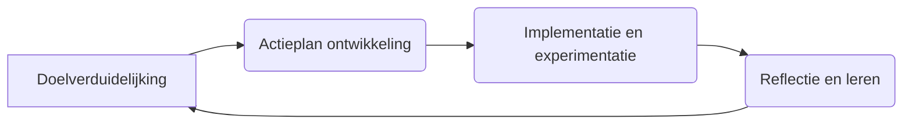

## Hoofdstuk 8: Coaching en Ondersteuning - De Katalysatoren van Zelfsturing

De transitie naar zelfsturende teams vereist een fundamentele herdefiniëring van hoe ondersteuning en ontwikkeling worden georganiseerd. In traditionele organisaties komen ondersteuning en sturing typisch van bovenaf, via managers die richting geven, problemen oplossen en prestaties monitoren. In zelfsturende omgevingen daarentegen ontstaat een rijker, meer gedistribueerd netwerk van ondersteuning en ontwikkeling, waarin coaching een centrale rol speelt.

In dit hoofdstuk verkennen we hoe effectieve coaching en ondersteuningsstructuren kunnen worden ontwikkeld die de autonomie van teams respecteren en versterken, terwijl ze tegelijkertijd hun groei en effectiviteit bevorderen. We bieden praktische inzichten, tools en voorbeelden die organisaties kunnen helpen om deze cruciale aspecten van zelfsturing te implementeren.

[Plaats hier een visualisatie van een coachingsmodel]

### De transformatie van ondersteuning in zelfsturende omgevingen

In zelfsturende omgevingen ondergaat de aard van ondersteuning een fundamentele transformatie. In plaats van een primair hiërarchische, directieve benadering, ontstaat een meer collaboratieve, faciliterende vorm van ondersteuning die de autonomie en het leervermogen van teams versterkt. Deze transformatie heeft verstrekkende implicaties voor hoe leiderschap wordt gedefinieerd en uitgeoefend, en voor de structuren en processen die teams ondersteunen in hun ontwikkeling.

**Van directief naar dienend leiderschap**

In traditionele organisaties is leiderschap vaak gebaseerd op hiërarchische autoriteit, waarbij leiders richting geven, beslissingen nemen en controle uitoefenen. In zelfsturende omgevingen verschuift leiderschap naar een dienend model, waarbij leiders teams ondersteunen in hun autonomie en ontwikkeling, in plaats van hen te sturen of te controleren.

Dienend leiderschap, een concept geïntroduceerd door Robert Greenleaf, is gebaseerd op het principe dat de primaire rol van een leider is om anderen te dienen en te ondersteunen in hun groei en effectiviteit. In de context van zelfsturende teams betekent dit dat leiders hun expertise, ervaring en perspectief ten dienste stellen van teams, zonder hun autonomie te ondermijnen.

Een directeur bij een technologieorganisatie beschreef deze transformatie als volgt: "Vroeger zag ik mijn rol als het geven van richting, het nemen van beslissingen en het controleren van resultaten. Nu zie ik mijn rol als het creëren van de condities waarin teams kunnen floreren, het verwijderen van obstakels, en het bieden van coaching en ondersteuning wanneer teams daarom vragen. Mijn succes wordt niet meer gemeten aan mijn persoonlijke prestaties of controle, maar aan de groei en effectiviteit van de teams die ik ondersteun."

Deze verschuiving vereist een fundamenteel andere mindset en set van vaardigheden van leiders. In plaats van te focussen op het geven van antwoorden en oplossingen, moeten leiders leren om effectieve vragen te stellen die teams helpen om hun eigen antwoorden en oplossingen te vinden. In plaats van te focussen op controle en compliance, moeten ze leren om vertrouwen te geven en teams de ruimte te bieden om te experimenteren en te leren.

Een zorgorganisatie investeerde aanzienlijk in de ontwikkeling van dienend leiderschap als onderdeel van hun transitie naar zelfsturende teams. Ze boden leiders training en coaching in vaardigheden zoals actief luisteren, coachend vragen stellen, en het faciliteren van teamleren. Ze creëerden ook een "leiderschap community of practice" waar leiders regelmatig samenkwamen om ervaringen te delen, van elkaar te leren, en elkaar te ondersteunen in hun transformatie. Deze investering in leiderschapsontwikkeling was cruciaal voor het succes van hun zelfsturende teams.

**Van hiërarchische naar gedistribueerde ondersteuningsstructuren**

In traditionele organisaties is ondersteuning typisch georganiseerd in hiërarchische structuren, met managers die verantwoordelijk zijn voor het ondersteunen en ontwikkelen van hun directe medewerkers. In zelfsturende omgevingen ontstaan meer gedistribueerde ondersteuningsstructuren, waarin ondersteuning komt van diverse bronnen binnen en buiten het team.

Deze gedistribueerde ondersteuningsstructuren kunnen verschillende vormen aannemen, afhankelijk van de specifieke context en behoeften van de organisatie. Ze kunnen omvatten:

- **Peer coaching en mentoring**: Teamleden ondersteunen elkaar in hun ontwikkeling, delen kennis en expertise, en bieden feedback en coaching.
- **Externe coaches**: Professionele coaches die niet direct betrokken zijn bij het dagelijkse werk van het team, maar die teams en individuen ondersteunen in hun ontwikkeling.
- **Communities of practice**: Groepen van mensen met gedeelde interesses of expertise die samenkomen om kennis te delen, van elkaar te leren, en elkaar te ondersteunen.
- **Expertisenetwerken**: Netwerken van experts binnen en buiten de organisatie die teams kunnen raadplegen voor specifieke kennis of advies.
- **Digitale leerplatforms**: Online platforms die toegang bieden tot leermaterialen, tools en resources die teams kunnen gebruiken voor hun ontwikkeling.

Een financiële dienstverlener implementeerde een gedistribueerd ondersteuningsmodel voor hun zelfsturende teams dat verschillende elementen combineerde. Ze creëerden een netwerk van interne coaches die teams konden raadplegen voor ondersteuning, ze stimuleerden peer coaching binnen en tussen teams, en ze ontwikkelden een digitaal leerplatform met resources en tools voor zelfontwikkeling. Ze organiseerden ook regelmatige "learning festivals" waar teams hun ervaringen en learnings konden delen, en waar externe experts workshops en presentaties gaven over relevante onderwerpen. Dit gedistribueerde model bood teams toegang tot diverse bronnen van ondersteuning, afhankelijk van hun specifieke behoeften en voorkeuren.

**Van standaardisatie naar personalisatie**

In traditionele organisaties is ondersteuning en ontwikkeling vaak gestandaardiseerd, met uniforme programma's en processen die voor alle medewerkers gelden. In zelfsturende omgevingen verschuift de focus naar meer gepersonaliseerde ondersteuning die is afgestemd op de specifieke behoeften, voorkeuren en ontwikkelingsdoelen van teams en individuen.

Deze personalisatie erkent dat verschillende teams en individuen verschillende ondersteuningsbehoeften hebben, afhankelijk van hun specifieke context, uitdagingen, en ontwikkelingsfase. Sommige teams hebben mogelijk meer behoefte aan coaching rond besluitvorming, terwijl andere teams meer ondersteuning nodig hebben bij conflicthantering of stakeholdermanagement.

Een consultancybedrijf implementeerde een gepersonaliseerde ondersteuningsaanpak voor hun zelfsturende teams. In plaats van standaard ontwikkelingsprogramma's, creëerden ze een "ondersteuningsmarktplaats" waar teams toegang hadden tot diverse coaches, mentoren, trainingen en resources. Teams konden zelf bepalen welke ondersteuning ze nodig hadden, gebaseerd op hun specifieke uitdagingen en ontwikkelingsdoelen, en konden deze ondersteuning "inkopen" met een ontwikkelingsbudget dat aan elk team was toegewezen. Deze marktplaatsbenadering stelde teams in staat om de ondersteuning te krijgen die het beste paste bij hun behoeften, en creëerde ook een feedbackloop die hielp om de kwaliteit en relevantie van de beschikbare ondersteuning te verbeteren.

### De evoluerende rol van coaching in zelfsturende teams

Coaching speelt een centrale rol in het ondersteunen van zelfsturende teams. In tegenstelling tot traditionele managementbenaderingen die focussen op het geven van antwoorden en oplossingen, focust coaching op het stellen van vragen en het faciliteren van reflectie en leren. Deze benadering respecteert en versterkt de autonomie van teams, terwijl ze hen tegelijkertijd helpt om hun capaciteiten te ontwikkelen en hun effectiviteit te verbeteren.

**De essentie van coaching voor zelfsturing**

Coaching in de context van zelfsturende teams is gebaseerd op een aantal kernprincipes:

- **Respect voor autonomie**: Coaching respecteert de autonomie en beslissingsbevoegdheid van teams. Coaches geven geen directe instructies of oplossingen, maar helpen teams om hun eigen antwoorden en oplossingen te vinden.
- **Focus op leren en ontwikkeling**: Coaching focust op het bevorderen van leren en ontwikkeling, niet op het controleren van prestaties. Het doel is om teams te helpen om hun capaciteiten te versterken en hun effectiviteit te verbeteren.
- **Systemisch perspectief**: Coaching neemt een systemisch perspectief, waarbij aandacht wordt besteed aan de interacties en dynamieken binnen het team, en tussen het team en zijn omgeving.
- **Toekomstgerichtheid**: Coaching is primair gericht op de toekomst, op wat teams willen bereiken en hoe ze daar kunnen komen, in plaats van op het analyseren van het verleden.
- **Vraaggerichtheid**: Coaching is gebaseerd op het stellen van krachtige vragen die reflectie, inzicht en actie stimuleren, in plaats van op het geven van antwoorden of advies.

Een coach bij een technologieorganisatie beschreef haar benadering als volgt: "Mijn rol is niet om teams te vertellen wat ze moeten doen, maar om hen te helpen om hun eigen weg te vinden. Ik doe dit door vragen te stellen die hen helpen om dieper te denken, door verschillende perspectieven te bieden, en door hen te ondersteunen in het experimenteren en leren. Ik zie mezelf als een spiegel die teams helpt om hun eigen dynamieken en patronen te zien, en als een katalysator die hen helpt om hun potentieel te ontsluiten."

**Verschillende coachingsrollen en -benaderingen**

In zelfsturende omgevingen kunnen verschillende coachingsrollen en -benaderingen relevant zijn, afhankelijk van de specifieke behoeften en context van teams. Deze rollen en benaderingen zijn niet wederzijds exclusief; ze kunnen naast elkaar bestaan en elkaar aanvullen in een rijk ondersteuningsecosysteem.

**Teamcoaching**: Teamcoaching focust op het team als geheel, en helpt teams om hun collectieve capaciteiten en effectiviteit te verbeteren. Teamcoaches werken met teams om hun purpose en doelen te verduidelijken, hun werkprocessen te verbeteren, hun besluitvorming te versterken, en hun onderlinge relaties en dynamieken te optimaliseren.

Een teamcoach bij een verzekeringsmaatschappij beschreef haar rol als volgt: "Als teamcoach werk ik met het hele team om hun collectieve effectiviteit te verbeteren. Ik help hen om hun purpose en doelen te verduidelijken, om effectieve werkprocessen te ontwikkelen, en om constructief om te gaan met conflicten en uitdagingen. Ik focus niet alleen op de taakdimensie van teamwerk, maar ook op de relationele en procesmatige dimensies, omdat deze allemaal cruciaal zijn voor het succes van zelfsturende teams."

**Individuele coaching**: Individuele coaching focust op de ontwikkeling van individuele teamleden, en helpt hen om hun persoonlijke capaciteiten, effectiviteit en welzijn te verbeteren. Individuele coaches werken met teamleden om hun sterktes en ontwikkelingsgebieden te identificeren, hun doelen te verduidelijken, en actieplannen te ontwikkelen voor hun groei.

Een individuele coach bij een consultancybedrijf beschreef zijn rol als volgt: "Als individuele coach werk ik één-op-één met teamleden om hen te ondersteunen in hun persoonlijke en professionele ontwikkeling. Ik help hen om hun unieke sterktes en bijdragen te identificeren, om uitdagingen en obstakels te navigeren, en om hun effectiviteit en welzijn te verbeteren. Deze individuele ontwikkeling is cruciaal voor het succes van zelfsturende teams, omdat teams alleen zo sterk zijn als de individuen die er deel van uitmaken."

**Procescoaching**: Procescoaching focust op de processen en dynamieken binnen teams, en helpt teams om deze processen te optimaliseren en te verbeteren. Procescoaches werken met teams om hun vergaderingen, besluitvorming, conflicthantering en andere sleutelprocessen effectiever te maken.

Een procescoach bij een mediaorganisatie beschreef haar rol als volgt: "Als procescoach focus ik op hoe teams samenwerken, beslissingen nemen, en met uitdagingen omgaan. Ik observeer hun processen en dynamieken, bied feedback en suggesties, en help hen om hun eigen processen te evalueren en te verbeteren. Mijn doel is om teams te helpen om meer bewust en intentioneel te worden over hoe ze samenwerken, zodat ze hun collectieve intelligentie en creativiteit optimaal kunnen benutten."

**Expertcoaching**: Expertcoaching focust op het delen van specifieke expertise en kennis die teams nodig hebben om hun werk effectief te doen. Expertcoaches bieden niet alleen informatie en advies, maar helpen teams ook om deze kennis te integreren en toe te passen in hun specifieke context.

Een expertcoach bij een technologieorganisatie beschreef zijn rol als volgt: "Als expertcoach deel ik mijn specifieke kennis en ervaring op het gebied van softwareontwikkeling, maar ik doe dit op een manier die de autonomie en het leervermogen van teams respecteert. In plaats van simpelweg antwoorden te geven, help ik teams om de juiste vragen te stellen, om verschillende opties te verkennen, en om weloverwogen beslissingen te nemen gebaseerd op een diep begrip van de materie."

**Peer coaching**: Peer coaching focust op het faciliteren van leren en ondersteuning tussen teamleden onderling. Peer coaches zijn niet externe experts of formele coaches, maar teamleden die specifieke vaardigheden en tools hebben ontwikkeld om hun collega's te ondersteunen in hun groei en ontwikkeling.

Een peer coach bij een zorgorganisatie beschreef haar rol als volgt: "Als peer coach ben ik nog steeds een volledig teamlid, maar ik heb ook specifieke vaardigheden ontwikkeld om mijn collega's te ondersteunen in hun groei. Ik faciliteer reflectiesessies, bied feedback en coaching, en help teamleden om van elkaar te leren. Deze peer-to-peer ondersteuning is bijzonder waardevol omdat het direct aansluit bij de dagelijkse realiteit en uitdagingen van ons team."

**Het coachingsproces: een cyclisch model**

Effectieve coaching voor zelfsturende teams volgt typisch een cyclisch proces dat teams helpt om hun doelen te verduidelijken, actieplannen te ontwikkelen, deze plannen te implementeren, en te leren van hun ervaringen. Dit proces respecteert de autonomie van teams, terwijl het hen tegelijkertijd ondersteunt in hun ontwikkeling en effectiviteit.

**Doelverduidelijking**: In deze fase werkt de coach met het team om hun doelen en intenties te verduidelijken. Wat wil het team bereiken? Waarom is dit belangrijk? Hoe sluit dit aan bij de bredere purpose en strategie van de organisatie? Deze fase helpt om focus en richting te creëren voor het team.

Een coach bij een financiële dienstverlener gebruikte een "purpose canvas" om teams te helpen om hun doelen te verduidelijken. Dit canvas omvatte vragen zoals: Wat is onze unieke bijdrage? Wie zijn onze belangrijkste stakeholders en wat hebben zij nodig? Wat zijn onze belangrijkste uitdagingen en kansen? Wat willen we over een jaar bereikt hebben? Door deze vragen gezamenlijk te beantwoorden, creëerden teams een gedeeld begrip van hun purpose en doelen, wat hen hielp om focus en richting te houden in hun werk.

**Actieplan ontwikkeling**: In deze fase ondersteunt de coach het team in het ontwikkelen van concrete actieplannen om hun doelen te bereiken. Welke acties zijn nodig? Wie is verantwoordelijk voor wat? Welke resources en ondersteuning zijn nodig? Deze fase helpt om intenties om te zetten in concrete stappen.

Een coach bij een consultancybedrijf gebruikte een "actieplanningsworkshop" om teams te helpen om concrete plannen te ontwikkelen. In deze workshop identificeerden teams de specifieke acties die nodig waren om hun doelen te bereiken, wezen ze verantwoordelijkheden toe, definieerden ze mijlpalen en deadlines, en identificeerden ze potentiële obstakels en hoe deze te adresseren. Deze gestructureerde aanpak hielp teams om van intentie naar actie te gaan, terwijl ze nog steeds eigenaar bleven van hun eigen plannen.

**Implementatie en experimentatie**: In deze fase implementeert het team hun actieplannen en experimenteert met nieuwe benaderingen en oplossingen. De coach ondersteunt het team tijdens deze fase door vragen te stellen, feedback te geven, en obstakels te helpen navigeren, maar zonder de autonomie van het team te ondermijnen.

Een coach bij een technologieorganisatie beschreef haar rol tijdens de implementatiefase als volgt: "Tijdens de implementatie ben ik beschikbaar als klankbord en ondersteuning, maar ik neem het werk niet over van het team. Ik help hen om obstakels te identificeren en te navigeren, ik stel vragen die hen helpen om hun aanpak te verfijnen, en ik moedig hen aan om te experimenteren en risico's te nemen. Mijn doel is om hen te ondersteunen in hun leerproces, niet om hen te vertellen wat ze moeten doen."

**Reflectie en leren**: In deze fase faciliteert de coach reflectie en leren binnen het team. Wat werkte goed? Wat waren de uitdagingen? Wat hebben we geleerd? Hoe kunnen we deze learnings toepassen in de toekomst? Deze fase helpt teams om te leren van hun ervaringen en continue verbetering te bevorderen.

Een coach bij een zorgorganisatie gebruikte "after-action reviews" om teams te helpen om te leren van hun ervaringen. Na belangrijke projecten of mijlpalen faciliteerde ze een gestructureerde reflectiesessie waarin het team besprak wat ze hadden gepland, wat er daadwerkelijk gebeurde, waarom er verschillen waren, en wat ze hiervan konden leren voor de toekomst. Deze reflecties hielpen teams om continue te leren en verbeteren, en om hun collectieve kennis en wijsheid te vergroten.

Dit cyclische coachingsproces is niet lineair of rigide; het is een flexibel kader dat kan worden aangepast aan de specifieke behoeften en context van elk team. Sommige teams hebben mogelijk meer ondersteuning nodig in bepaalde fasen dan in andere, en de coach past zijn of haar benadering aan op basis van deze behoeften.

### Praktijkvoorbeeld: ondersteuningsstructuren bij een thuiszorgorganisatie

Een Nederlandse thuiszorgorganisatie biedt een inspirerend voorbeeld van hoe effectieve ondersteuningsstructuren kunnen worden geïmplementeerd in zelfsturende teams. Hun model heeft niet alleen geleid tot uitzonderlijke resultaten in termen van zorgkwaliteit en medewerkerstevredenheid, maar ook tot aanzienlijke kostenbesparingen en organisatorische effectiviteit.

**Het ondersteuningsmodel**

Het ondersteuningsmodel van deze organisatie is gebaseerd op een aantal kernprincipes:

**Minimale maar effectieve ondersteuningsstructuur**: De organisatie heeft een opmerkelijk slanke ondersteuningsstructuur, met slechts ongeveer 50 mensen op het hoofdkantoor die meer dan 10.000 verpleegkundigen in 900+ teams ondersteunen. Deze structuur is ontworpen om teams te faciliteren in hun zelfsturing, niet om hen te controleren of te sturen.

De oprichter beschrijft deze filosofie als volgt: "We hebben bewust gekozen voor een minimale ondersteuningsstructuur, omdat we geloven dat teams het beste weten wat ze nodig hebben om effectief te zijn. Onze rol is om hen te ondersteunen en te faciliteren, niet om hen te vertellen wat ze moeten doen. Dit betekent dat we alleen die functies en processen creëren die daadwerkelijk waarde toevoegen voor de teams en hun patiënten."

**Regionale coaches als primaire ondersteuners**: De organisatie heeft een netwerk van regionale coaches die teams ondersteunen in hun ontwikkeling en effectiviteit. Deze coaches hebben geen hiërarchische autoriteit over de teams; ze zijn er om te faciliteren, te adviseren en te ondersteunen wanneer teams daarom vragen.

Een regionale coach beschreef haar rol als volgt: "Mijn rol is om teams te helpen om zelf oplossingen te vinden voor hun uitdagingen, niet om hen te vertellen wat ze moeten doen. Ik doe dit door vragen te stellen die hen helpen om dieper te denken, door verschillende perspectieven te bieden, en door hen te verbinden met andere teams die vergelijkbare uitdagingen hebben overwonnen. Ik zie mezelf als een resource die teams kunnen benutten wanneer ze dat nodig hebben, niet als een manager die controle uitoefent."

Elke coach ondersteunt typisch 10-15 teams, en is beschikbaar op verzoek van de teams. Coaches bezoeken teams regelmatig, maar de frequentie en focus van deze bezoeken worden bepaald door de behoeften en voorkeuren van de teams, niet door een voorgeschreven schema of protocol.

**Digitaal platform voor kennisdeling en ondersteuning**: De organisatie heeft een innovatief intranet ontwikkeld dat teams in staat stelt om kennis, ervaringen en best practices te delen, en om ondersteuning te krijgen van experts en andere teams. Dit platform faciliteert niet alleen efficiënte administratie en planning, maar ook peer-to-peer leren en ondersteuning.

Een verpleegkundige beschreef de waarde van dit platform als volgt: "Het intranet is een ongelooflijk waardevol hulpmiddel voor ons team. Als we een vraag hebben of een uitdaging tegenkomen, kunnen we het platform gebruiken om te zien of andere teams vergelijkbare situaties hebben meegemaakt en hoe ze deze hebben opgelost. We kunnen ook experts raadplegen, resources vinden, en onze eigen ervaringen en learnings delen. Het geeft ons toegang tot de collectieve wijsheid en expertise van de hele organisatie, wat ons helpt om betere zorg te leveren aan onze patiënten."

**Expertisenetwerken voor specialistische ondersteuning**: De organisatie heeft verschillende expertisenetwerken ontwikkeld rond specifieke zorgdomeinen, zoals dementie, palliatieve zorg, en wondverzorging. Deze netwerken bestaan uit verpleegkundigen met specifieke expertise en ervaring, die beschikbaar zijn om teams te adviseren en te ondersteunen bij complexe zorgvragen.

Een verpleegkundige die deel uitmaakt van het dementie-expertisenetwerk beschreef haar rol als volgt: "Als lid van het dementie-expertisenetwerk deel ik mijn specifieke kennis en ervaring met teams die vragen hebben over de zorg voor patiënten met dementie. Ik bied geen voorgeschreven protocollen of richtlijnen, maar help teams om hun eigen aanpak te ontwikkelen die past bij de specifieke behoeften van hun patiënten en de context waarin ze werken. Deze peer-to-peer ondersteuning is bijzonder waardevol omdat het direct aansluit bij de dagelijkse realiteit en uitdagingen van de teams."

**Ondersteuning voor teamontwikkeling**: De organisatie biedt verschillende vormen van ondersteuning voor teamontwikkeling, waaronder teamcoaching, workshops en trainingen. Deze ondersteuning is niet verplicht of gestandaardiseerd; teams kunnen zelf bepalen welke ondersteuning ze nodig hebben en wanneer.

Een teamcoach beschreef deze benadering als volgt: "We bieden verschillende vormen van ondersteuning voor teamontwikkeling, maar we schrijven niet voor welke ondersteuning teams moeten gebruiken of wanneer. Teams kunnen zelf bepalen wat ze nodig hebben, gebaseerd op hun specifieke uitdagingen en ontwikkelingsfase. Sommige teams hebben bijvoorbeeld behoefte aan ondersteuning bij conflicthantering, terwijl andere teams meer focus willen leggen op het verbeteren van hun besluitvormingsprocessen. Onze rol is om responsief te zijn op deze behoeften, niet om een one-size-fits-all programma op te leggen."

**Resultaten en impact**

Het ondersteuningsmodel van deze thuiszorgorganisatie heeft bijgedragen aan indrukwekkende resultaten:

- Hogere kwaliteit van zorg, gemeten door patiënttevredenheid en klinische uitkomsten
- Hogere medewerkerstevredenheid en lager ziekteverzuim en verloop
- Aanzienlijke kostenbesparingen (ongeveer 40% lager dan traditionele thuiszorgorganisaties)
- Verhoogde innovatie en continue verbetering, gedreven door de collectieve intelligentie van teams

Deze resultaten tonen de kracht van effectieve ondersteuningsstructuren in zelfsturende teams, en bieden waardevolle lessen voor andere organisaties die deze benadering overwegen.

**Lessen voor andere organisaties**

Het model van deze thuiszorgorganisatie biedt verschillende waardevolle lessen voor organisaties die effectieve ondersteuningsstructuren willen ontwikkelen voor zelfsturende teams:

1. **Focus op faciliteren, niet controleren**: Ontwerp ondersteuningsstructuren die teams faciliteren in hun zelfsturing, niet structuren die hen controleren of sturen.
2. **Minimaliseer bureaucratie**: Houd de ondersteuningsstructuur zo slank en eenvoudig mogelijk, met focus op wat daadwerkelijk waarde toevoegt voor teams en klanten.
3. **Investeer in coaching**: Ontwikkel een netwerk van coaches die teams kunnen ondersteunen in hun ontwikkeling, zonder hun autonomie te ondermijnen.
4. **Faciliteer kennisdeling**: Creëer platforms en processen die kennisdeling en peer-to-peer leren tussen teams faciliteren.
5. **Personaliseer ondersteuning**: Bied gepersonaliseerde ondersteuning die is afgestemd op de specifieke behoeften en context van elk team, in plaats van gestandaardiseerde programma's.
6. **Bevorder eigenaarschap**: Stimuleer teams om eigenaarschap te nemen voor hun eigen ontwikkeling en ondersteuningsbehoeften.

Deze lessen kunnen worden aangepast en toegepast in verschillende contexten en sectoren, rekening houdend met de specifieke uitdagingen en mogelijkheden van elke organisatie.

### Interventies bij disfunctionele teams en conflicten

De ontwikkeling van effectieve coaching en ondersteuningsstructuren in zelfsturende teams gaat gepaard met specifieke uitdagingen. Zelfsturende teams kunnen, net als alle teams, disfunctioneel worden of te maken krijgen met conflicten. Het herkennen van deze situaties en het effectief interveniëren is een cruciale vaardigheid voor coaches en ondersteuners. Hieronder verkennen we de meest voorkomende vormen van teamdisfunctie en conflicten, en bieden we praktische interventiestrategieën.

**Herkennen van disfunctionele patronen in zelfsturende teams**

Disfunctionele patronen in zelfsturende teams kunnen verschillende vormen aannemen. Het is belangrijk voor coaches en ondersteuners om deze patronen vroegtijdig te herkennen, zodat ze effectief kunnen interveniëren voordat de problemen escaleren. Enkele veelvoorkomende disfunctionele patronen zijn:

- **Gebrek aan vertrouwen**: Teamleden zijn terughoudend om zich kwetsbaar op te stellen, verbergen fouten en zwakheden, en vermijden open communicatie.
- **Angst voor conflict**: Teams vermijden constructieve discussies en meningsverschillen, wat leidt tot oppervlakkige consensus en onderdrukte spanningen.
- **Gebrek aan commitment**: Door het ontbreken van echte buy-in en duidelijkheid, ontstaat er ambiguïteit over beslissingen en richtingen.
- **Vermijden van verantwoordelijkheid**: Teamleden spreken elkaar niet aan op gedrag of prestaties die het team schaden.
- **Onverschilligheid voor resultaten**: Individuele doelen of ego's prevaleren boven collectieve teamdoelen.
- **Besluitvormingsparalyse**: Teams raken verstrikt in eindeloze discussies zonder tot besluiten te komen.
- **Subgroepvorming**: Het team fragmenteert in subgroepen die tegen elkaar werken in plaats van samen.

Een coach bij een financiële dienstverlener beschrijft hoe ze disfunctionele patronen herkent: "Ik let op signalen zoals verminderde communicatie, toenemende spanningen in vergaderingen, beslissingen die steeds worden uitgesteld, of teamleden die zich terugtrekken. Ook let ik op de energie in het team - is er enthousiasme en betrokkenheid, of juist vermoeidheid en cynisme? Deze signalen zijn vaak de eerste indicaties dat er iets niet goed gaat in de teamdynamiek."

**Interventiestrategieën voor disfunctionele teams**

Wanneer een zelfsturend team disfunctioneel wordt, zijn er verschillende interventiestrategieën die coaches en ondersteuners kunnen toepassen. De keuze voor een specifieke strategie hangt af van de aard en ernst van de disfunctie, de ontwikkelingsfase van het team, en de organisatiecontext. Hieronder volgen enkele effectieve interventiestrategieën:

1. **Faciliteer een teamdiagnose**: Help het team om hun eigen disfunctionele patronen te identificeren en te begrijpen. Dit kan via gestructureerde assessments, reflectiesessies, of teamdialogen. Het creëren van bewustzijn is vaak de eerste stap naar verbetering.

   Een coach bij een technologiebedrijf gebruikte een "teamgezondheidscheck" om een team te helpen hun disfunctionele patronen te identificeren. Het team beoordeelde zichzelf op verschillende dimensies van teameffectiviteit, zoals vertrouwen, conflicthantering, en resultaatgerichtheid. Deze diagnose hielp het team om te erkennen dat hun vermijding van conflict leidde tot oppervlakkige consensus en gebrek aan innovatie. Met dit inzicht konden ze gericht werken aan het ontwikkelen van constructievere manieren om met meningsverschillen om te gaan.

2. **Creëer psychologische veiligheid**: Ontwikkel een omgeving waarin teamleden zich veilig voelen om risico's te nemen, fouten te maken, en kwetsbaar te zijn. Dit kan via oefeningen die vertrouwen opbouwen, het modelleren van kwetsbaarheid, en het bekrachtigen van open communicatie.

   Een coach bij een onderwijsinstelling werkte met een team dat worstelde met gebrek aan vertrouwen. Ze faciliteerde een sessie waarin teamleden hun professionele en persoonlijke "reis" de
